原文 by zyq8709  

ART是Android平台上的新一代运行时,用来代替dalvik。它主要采用了AOT的方法，在apk安装的时候将dalvikbytecode一次性编译成arm本地指令（但是这种AOT与c语言等还是有本质不同的，还是需要虚拟机的环境支持），这样在运行的时候就无需进行任何解释或编译便可直接执行，节省了运行时间，提高了效率，但是在一定程度上使得安装的时间变长，空间占用变大。 

从Android的源码上看，ART相关的内容主要有compiler和与之相关的程序dex2oat、runtime、Java调试支持和对oat文件进行解析的工具oatdump。   

下面这张图是ART的源码目录结构：   

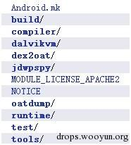  

中间有几个目录比较关键，  

首先是dex2oat，负责将dex文件给转换为oat文件，具体的翻译工作需要由compiler来完成，最后编译为dex2oat；  

其次是runtime目录，内容比较多，主要就是运行时，编译为libart.so用来替换libdvm.so，dalvik是一个外壳，其中还是在调用ART runtime；  

oatdump也是一个比较重要的工具，编译为oatdump程序，主要用来对oat文件进行分析并格式化显示出文件的组成结构；  

jdwpspy是java的调试支持部分，即JDWP服务端的实现。  

## 0x01 oat文件

oat文件的格式，可以从dex2oat和oatdump两个目录入手。简单的说，oat文件是嵌套在一个elf文件的格式中的。在elf文件的动态符号表中有三个重要的符号：oatdata、oatexec、oatlastword，分别表示oat的数据区，oat文件中的native code和结束位置。这些关系结构在图中说明的很清楚，简单理解就是在oatdata中，保存有原来的dex文件内容，在头部还保留了寻址到dex文件内容的偏移地址和指向对应的oat class偏移，oat class中还保存了对应的native code的偏移地址，这样也就间接的完成了dexbytecode和native code的对应关系。  

具体的一些代码可以参考/art/dex2oat/dex2oat.cc中的`static int dex2oat(intargc, char** argv)` 函数和/art/oatdump/oatdump.cc的`static intoatdump(intargc, char** argv)` 的函数，可以很快速的理解oat文件的格式和解析。在/art/compiler/elf_writer_quick.cc 中的Write函数很值得参考。    

## 0x02 运行时的启动

ART运行时的启动过程很早，是由zygote所启动的，与dalvik的启动过程完全一样，保证了由dalvik到ART的无缝衔接。

整个启动过程是从app_processs（/frameworks/base/cmds/app_process/app_main.cpp）开始的，创建了一个对象AppRuntime runtime，这个是一个单例，整个系统运行时只有一个。随着zygote的fork过程，只是在不断地复制指向这个对象的指针个每个子进程。然后就开始执行runtime.start方法。这个方法里先调用startVm启动虚拟机。是由JNI_CreateJavaVM方法具体执行的的，即/art/runtime/jni_internal.cc的 `extern "C" jintJNI_CreateJavaVM(JavaVM** p_vm, JNIEnv** p_env, void* vm_args)`。然后调用startReg注册一些native的method。在最后比较重要的是查找到要执行的java代码的main方法，然后执行进入托管代码的世界，这也是我们感兴趣的地方。   

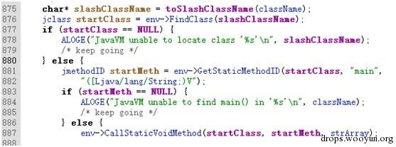  

如图，最后调用的是CallStaticVoidMethod，去看看它的实现：  

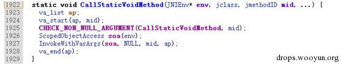   

再去寻找InvokeWithVarArgs：  

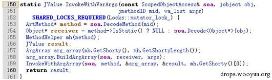   

跳到InvokeWithArgArray：  

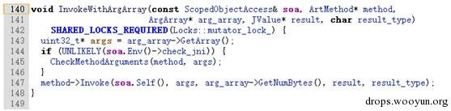  

可以看到一个很关键的class： 

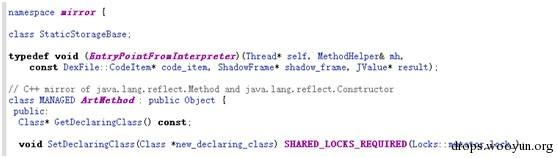   

即ArtMethod，它的一个成员方法就是负责调用oat文件中的native code的：  

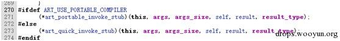   

最后这就是最终的入口：  

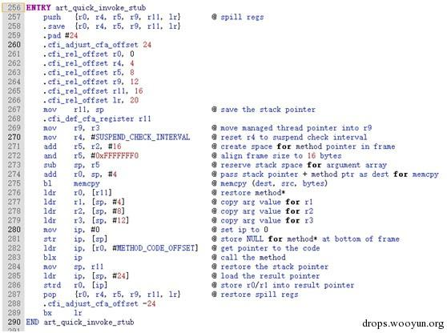   

283行的blxip指令就是最终进入native code的位置。可以大致得到结论，通过查找相关的oat文件，得到所需要的类和方法，并将其对应的native code的位置放入ArtMethod结构，最后通过Invoke成员完成调用。下一步的工作需要着重关注的便是native code代码调用其他的java方法时如何去通过运行时定位和跳转的。  

注意注释中描述了ART下的ABI，与标准的ARM调用约定相似，但是R0存放的是调用者的方法的ArtMethod对象地址，R0-R3包含的才是参数，包括this。多余的存放在栈中，从SP+16的位置开始。返回值同样通过R0/R1传递。R9指向运行时分配的当前的线程对象指针。  

## 0x03 类加载

类加载的任务主要由ClassLinker类来负责，先看一下这个过程的顺序图：  

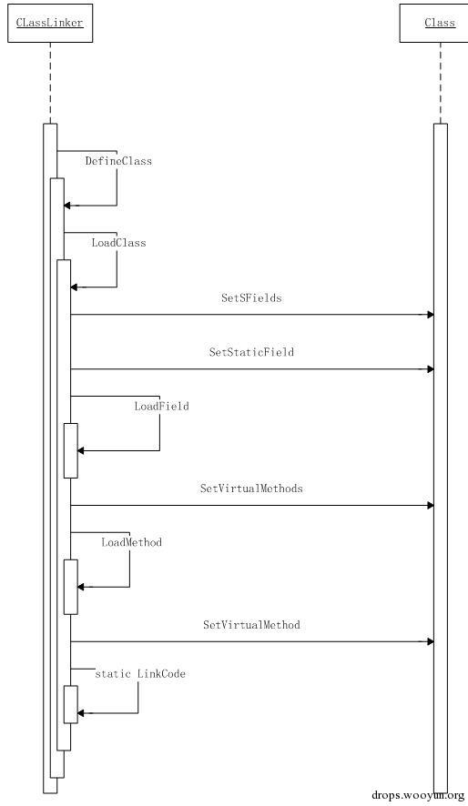   

顺序图中以静态成员的初始化和虚函数的初始化为例，描述了调用的逻辑。下面进行详细的叙述。  

从FindClass开始：
``` c++
mirror::Class* ClassLinker::FindClass(constchar* descriptor, mirror::ClassLoader* class_loader) {
……
mirror::Class* klass = LookupClass(descriptor, class_loader);
if (klass != NULL) {
returnEnsureResolved(self, klass);
  }
if (descriptor[0] == '[') {
returnCreateArrayClass(descriptor, class_loader);   

  } elseif (class_loader == NULL) {
DexFile::ClassPathEntry pair = DexFile::FindInClassPath(descriptor, boot_class_path_);
if (pair.second != NULL) {
returnDefineClass(descriptor, NULL, *pair.first, *pair.second);
    }
……
}
```
省略次要的代码，首先利用LookupClass查找所需要的类是否被加载，对于此场景所以不符合此条件。然后判断是否是数组类型的类，也跳过此分支，进入到我们最感兴趣的DefineClass中。  
``` c+++
mirror::Class* ClassLinker::DefineClass(constchar* descriptor,
                                        mirror::ClassLoader* class_loader,
constDexFile&dex_file,
constDexFile::ClassDef&dex_class_def) {
……
SirtRef<mirror::Class>klass(self, NULL);
if (UNLIKELY(!init_done_)) {
// finish up init of hand crafted class_roots_
if (strcmp(descriptor, "Ljava/lang/Object;") == 0) {
klass.reset(GetClassRoot(kJavaLangObject));
    } elseif (strcmp(descriptor, "Ljava/lang/Class;") == 0) {
klass.reset(GetClassRoot(kJavaLangClass));
    } elseif (strcmp(descriptor, "Ljava/lang/String;") == 0) {
klass.reset(GetClassRoot(kJavaLangString));
    } elseif (strcmp(descriptor, "Ljava/lang/DexCache;") == 0) {
klass.reset(GetClassRoot(kJavaLangDexCache));
    } elseif (strcmp(descriptor, "Ljava/lang/reflect/ArtField;") == 0) {
klass.reset(GetClassRoot(kJavaLangReflectArtField));
    } elseif (strcmp(descriptor, "Ljava/lang/reflect/ArtMethod;") == 0) {
klass.reset(GetClassRoot(kJavaLangReflectArtMethod));
    } else {
klass.reset(AllocClass(self, SizeOfClass(dex_file, dex_class_def)));
    }
  } else {
klass.reset(AllocClass(self, SizeOfClass(dex_file, dex_class_def)));
  }
klass->SetDexCache(FindDexCache(dex_file));
LoadClass(dex_file, dex_class_def, klass, class_loader);
……
returnklass.get();
}
```
拣重要的部分看，这个方法基本上完成了两个个功能，即从dex文件加载类和加载过的类插入一个表中，供LookupClass查询。  

我们关注第一个功能，首先是进行一些内置类的判断，对于自定义的类则是手动分配空间、，然后查找相关的dex文件，最后进行加载。  

接着看LoadClass方法：  
``` c++
voidClassLinker::LoadClass(constDexFile&dex_file,
constDexFile::ClassDef&dex_class_def,
SirtRef<mirror::Class>&klass,
                            mirror::ClassLoader* class_loader) {
……
// Load fields fields.
const byte* class_data = dex_file.GetClassData(dex_class_def);
if (class_data == NULL) {
return;  // no fields or methods - for example a marker interface
  }
ClassDataItemIteratorit(dex_file, class_data);
  Thread* self = Thread::Current();
if (it.NumStaticFields() != 0) {
    mirror::ObjectArray<mirror::ArtField>* statics = AllocArtFieldArray(self, it.NumStaticFields());
if (UNLIKELY(statics == NULL)) {
CHECK(self->IsExceptionPending());  // OOME.
return;
    }
klass->SetSFields(statics);
  }
if (it.NumInstanceFields() != 0) {
    mirror::ObjectArray<mirror::ArtField>* fields =
AllocArtFieldArray(self, it.NumInstanceFields());
if (UNLIKELY(fields == NULL)) {
CHECK(self->IsExceptionPending());  // OOME.
return;
    }
klass->SetIFields(fields);
  }
for (size_ti = 0; it.HasNextStaticField(); i++, it.Next()) {
SirtRef<mirror::ArtField>sfield(self, AllocArtField(self));
if (UNLIKELY(sfield.get() == NULL)) {
CHECK(self->IsExceptionPending());  // OOME.
return;
    }
klass->SetStaticField(i, sfield.get());
LoadField(dex_file, it, klass, sfield);
  }
for (size_ti = 0; it.HasNextInstanceField(); i++, it.Next()) {
SirtRef<mirror::ArtField>ifield(self, AllocArtField(self));
if (UNLIKELY(ifield.get() == NULL)) {
CHECK(self->IsExceptionPending());  // OOME.
return;
    }
klass->SetInstanceField(i, ifield.get());
LoadField(dex_file, it, klass, ifield);
  } 

UniquePtr<constOatFile::OatClass>oat_class;
if (Runtime::Current()->IsStarted() && !Runtime::Current()->UseCompileTimeClassPath()) {
oat_class.reset(GetOatClass(dex_file, klass->GetDexClassDefIndex()));
  } 

// Load methods.
if (it.NumDirectMethods() != 0) {
// TODO: append direct methods to class object
    mirror::ObjectArray<mirror::ArtMethod>* directs =
AllocArtMethodArray(self, it.NumDirectMethods());
if (UNLIKELY(directs == NULL)) {
CHECK(self->IsExceptionPending());  // OOME.
return;
    }
klass->SetDirectMethods(directs);
  }
if (it.NumVirtualMethods() != 0) {
// TODO: append direct methods to class object
    mirror::ObjectArray<mirror::ArtMethod>* virtuals =
AllocArtMethodArray(self, it.NumVirtualMethods());
if (UNLIKELY(virtuals == NULL)) {
CHECK(self->IsExceptionPending());  // OOME.
return;
    }
klass->SetVirtualMethods(virtuals);
  }
size_tclass_def_method_index = 0;
for (size_ti = 0; it.HasNextDirectMethod(); i++, it.Next()) {
SirtRef<mirror::ArtMethod>method(self, LoadMethod(self, dex_file, it, klass));
if (UNLIKELY(method.get() == NULL)) {
CHECK(self->IsExceptionPending());  // OOME.
return;
    }
klass->SetDirectMethod(i, method.get());
if (oat_class.get() != NULL) {
LinkCode(method, oat_class.get(), class_def_method_index);
    }
method->SetMethodIndex(class_def_method_index);
class_def_method_index++;
  }
for (size_ti = 0; it.HasNextVirtualMethod(); i++, it.Next()) {
SirtRef<mirror::ArtMethod>method(self, LoadMethod(self, dex_file, it, klass));
if (UNLIKELY(method.get() == NULL)) {
CHECK(self->IsExceptionPending());  // OOME.
return;
    }
klass->SetVirtualMethod(i, method.get());
    DCHECK_EQ(class_def_method_index, it.NumDirectMethods() + i);
if (oat_class.get() != NULL) {
LinkCode(method, oat_class.get(), class_def_method_index);
    }
class_def_method_index++;
  }
……
}
```
为了弄清这个方法，我们先得看看Class类利用了什么重要的成员：  
``` c++
ObjectArray<ArtMethod>* direct_methods_;
// instance fields
// specifies the number of reference fields.
ObjectArray<ArtField>* ifields_;
// For every interface a concrete class implements, we create an array of the concrete vtable_
// methods for the methods in the interface.
IfTable* iftable_;
// Static fields
ObjectArray<ArtField>* sfields_;
// The superclass, or NULL if this is java.lang.Object, an interface or primitive type.
// Virtual methods defined in this class; invoked through vtable.
ObjectArray<ArtMethod>* virtual_methods_;
// Virtual method table (vtable), for use by "invoke-virtual".  The vtable from the superclass is
// copied in, and virtual methods from our class either replace those from the super or are
// appended. For abstract classes, methods may be created in the vtable that aren't in
// virtual_ methods_ for miranda methods.
ObjectArray<ArtMethod>* vtable_;
// Total size of the Class instance; used when allocating storage on gc heap.
// See also object_size_.
size_tclass_size_;
```
这样就比较清晰了。LoadClass首先读取dex文件中的classdata，然后初始化一个迭代器来对classdata中的数据进行遍历。接下来分部分进行：  

分配一个对象ObjectArray来表示静态成员，并利用静态成员的数量初始化，并将这个对象的地址赋值给Class的sfields_成员。  

同样的完成Class的ifields_成员的初始化，用来表示私有数据成员  

接下来，遍历静态成员，对于每个成员分配一个Object对象，然后将地址放入之前分配的ObjectArray数组中，并将dex文件中的相关信息加载到Object对象中，从而完成了静态成员信息的读取。  

同理，完成了私有成员信息的读取。  

像对于数据成员一样，分配一个ObjectArray用于表示directmethod，并用于初始化direct_methods_成员。  
同理，初始化了virtual_methods_成员。  

遍历directmethod成员，对于每一个directmethod生成一个ArtMethod对象，并在构造函数中通过LoadMethod完成dex文件中相应信息的读取。再将ArtMethod对象放入之前的ObjectArray中，还需要利用LinkCode将实际的方法代码起始地址用来初始化ArtMethod的entry_point_from_compiled_code_成员，最后更新每个ArtMethod的method_index_成员用于方法索引查找。  

同样的过程完成了对于VirtualMethod的处理  

最终就完成了类的加载。  

下面需要再关注一下一个类实例化的过程。 

类的实例化是通过TLS（线程局部存储）中的一个函数表中的pAllocObject来进行的。pAllocObject这个函数指针被指向了  art_quick_alloc_object函数。这个函数是与硬件相关的，实际上它又调用了artAllocObjectFromCode函数，又调用了AllocObjectFromCode函数，在完成了一系列检查判断后调用了Class::AllocObject，这个方法很简单，就是一句话：  

`returnRuntime::Current()->GetHeap()->AllocObject(self, this, this->object_size_)`  
其实是在堆上根据之前LoadClass时指定的类对象的大小分配了一块内存，按照一个Object对象指针返回。  

可以以图形来展示一下：  

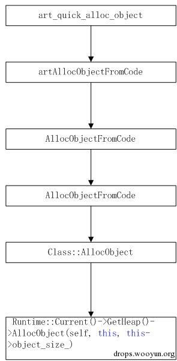   

看一下最后调用的这个函数：  
``` c++
mirror::Object* Heap::AllocObject(Thread* self, mirror::Class* c, size_tbyte_count) {
……
obj = Allocate(self, alloc_space_, byte_count, &bytes_allocated);
 ……
if (LIKELY(obj != NULL)) {
obj->SetClass(c);
   ……
returnobj;
  } else {
   ……
}
```
在这个函数中分配了内存空间之后，还调用了SetClass这个关键的函数，把Object对象中的klass_成员利用LoadClass的结果初始化了。  

这样的话一个完整的类的实例化的内存结构就如图所示了：  
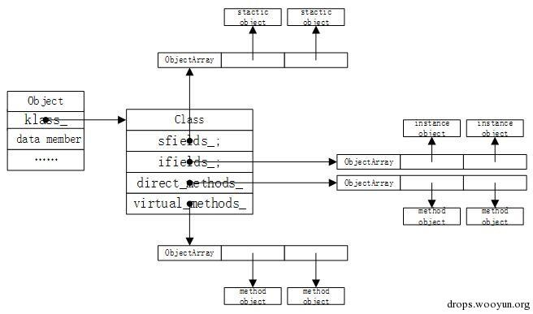   

## 0x04 编译过程

关于ART的编译过程，主要是由dex2oat程序启动的，所以可以从dex2oat入手，先画出整个过程的顺序图。  

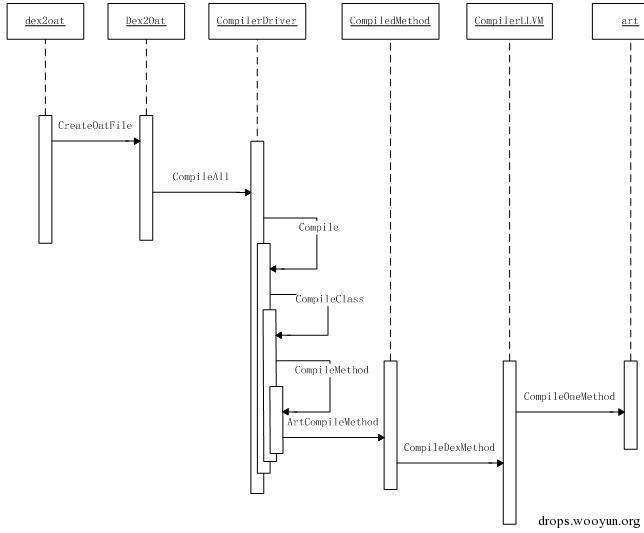   

上图是第一阶段的流程，主要是由dex2oat调用编译器的过程。  

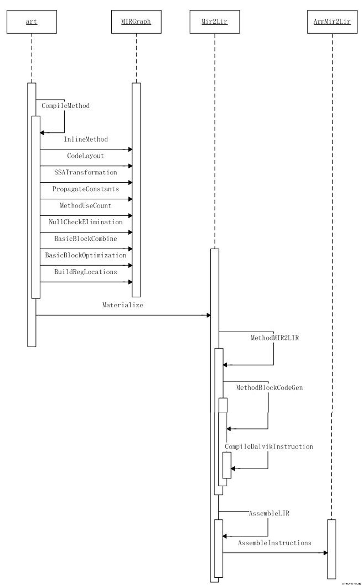   

第二阶段主要是进入编译器的处理流程，通过对dalvik指令进行一次编译为MIR，然后二次编译为LIR，最后编译成ARM指令。  

下面择要对关键代码进行整理：  
``` c++
staticintdex2oat(intargc, char** argv){
……
UniquePtr<constCompilerDriver>compiler(dex2oat->CreateOatFile(boot_image_option,
host_prefix.get(),
android_root,
is_host,
dex_files,
oat_file.get(),
bitcode_filename,
image,
image_classes,
dump_stats,
timings));
……
}
```
在这个函数的调用中，主要进行的多线程进行编译
``` c++
voidCompilerDriver::CompileAll(jobjectclass_loader,
conststd::vector<constDexFile*>&dex_files,
base::TimingLogger&timings)
{
……
Compile(class_loader, dex_files, *thread_pool.get(), timings);
……
}   

voidCompilerDriver::Compile(jobjectclass_loader,
conststd::vector<constDexFile*>&dex_files,
ThreadPool&thread_pool, base::TimingLogger&timings) {
……
CompileDexFile(class_loader, *dex_file, thread_pool, timings);
……
}
```
一直到  
``` c++
voidCompilerDriver::CompileDexFile(jobjectclass_loader,
constDexFile&dex_file,ThreadPool&thread_pool,
base::TimingLogger&timings) {
……
context.ForAll(0, dex_file.NumClassDefs(),
CompilerDriver::CompileClass, thread_count_);
……
}
```
启动了多线程,执行CompilerDriver::CompileClass函数进行真正的编译过程。  
``` c++
voidCompilerDriver::CompileClass(constParallelCompilationManager* manager, size_tclass_def_index) {
……
ClassDataItemIteratorit(dex_file, class_data);
CompilerDriver* driver = manager->GetCompiler();
int64_tprevious_direct_method_idx = -1;
while (it.HasNextDirectMethod()) {
uint32_tmethod_idx = it.GetMemberIndex();
if (method_idx == previous_direct_method_idx) {
it.Next();
continue;
    }
previous_direct_method_idx = method_idx;
driver->CompileMethod(it.GetMethodCodeItem(),
    it.GetMemberAccessFlags(),
    it.GetMethodInvokeType(class_def),class_def_index,
    method_idx, jclass_loader, dex_file,
    dex_to_dex_compilation_level);
it.Next();
  }
int64_tprevious_virtual_method_idx = -1;
while (it.HasNextVirtualMethod()) {
uint32_tmethod_idx = it.GetMemberIndex();
if (method_idx == previous_virtual_method_idx) {
it.Next();
continue;
    }
previous_virtual_method_idx = method_idx;
driver->CompileMethod(it.GetMethodCodeItem(),
    it.GetMemberAccessFlags(),
    it.GetMethodInvokeType(class_def), class_def_index,
    method_idx, jclass_loader, dex_file,
    dex_to_dex_compilation_level);
it.Next();
  }
```
主要过程就是通过读取class中的数据，利用迭代器遍历每个DirectMethod和VirtualMethod，然后分别对每个Method作为单元利用CompilerDriver::CompileMethod进行编译。  

CompilerDriver::CompileMethod函数主要是调用了`CompilerDriver::CompilerDriver* constcompiler_` 这个成员变量（函数指针）。

这个变量是在CompilerDriver的构造函数中初始化的，根据不同的编译器后端选择不同的实现，不过基本上的流程都是一样的，通过对Portable后端的分析，可以看到最后调用的是static CompiledMethod* CompileMethod函数。  
``` c++
staticCompiledMethod* CompileMethod(CompilerDriver&compiler,
constCompilerBackendcompiler_backend,
constDexFile::CodeItem* code_item,
uint32_taccess_flags, InvokeTypeinvoke_type,
uint16_tclass_def_idx, uint32_tmethod_idx,
jobjectclass_loader, constDexFile&dex_file
#ifdefined(ART_USE_PORTABLE_COMPILER)
 , llvm::LlvmCompilationUnit* llvm_compilation_unit
#endif
) {
……
    cu.mir_graph.reset(newMIRGraph(&cu, &cu.arena));
    cu.mir_graph->InlineMethod(code_item, access_flags, invoke_type, class_def_idx, method_idx,class_loader, dex_file);
    cu.mir_graph->CodeLayout();
    cu.mir_graph->SSATransformation();
    cu.mir_graph->PropagateConstants();
    cu.mir_graph->MethodUseCount();
    cu.mir_graph->NullCheckElimination();
    cu.mir_graph->BasicBlockCombine();
    cu.mir_graph->BasicBlockOptimization();
    ……
    cu.cg.reset(ArmCodeGenerator(&cu, cu.mir_graph.get(), &cu.arena));
    ……
    cu.cg->Materialize();
    result = cu.cg->GetCompiledMethod();
    returnresult;
}
```
在这个过程中牵涉了几种重要的数据结构：  
``` c++
classMIRGraph {
……
BasicBlock* entry_block_;
BasicBlock* exit_block_;
BasicBlock* cur_block_;
intnum_blocks_;
 ……
}
structBasicBlock {
  ……
MIR* first_mir_insn;
MIR* last_mir_insn;
BasicBlock* fall_through;
BasicBlock* taken;
BasicBlock* i_dom;                // Immediate dominator.
 ……
};
structMIR {
DecodedInstructiondalvikInsn;
……
MIR* prev;
MIR* next;
 ……
};
structDecodedInstruction {
uint32_tvA;
uint32_tvB;
uint64_tvB_wide;        /* for k51l */
uint32_tvC;
uint32_targ[5];         /* vC/D/E/F/G in invoke or filled-new-array */
Instruction::Codeopcode;    

explicitDecodedInstruction(constInstruction* inst) {
inst->Decode(vA, vB, vB_wide, vC, arg);
opcode = inst->Opcode();
  }
};
```
这几个数据结构的关系如图所示：  

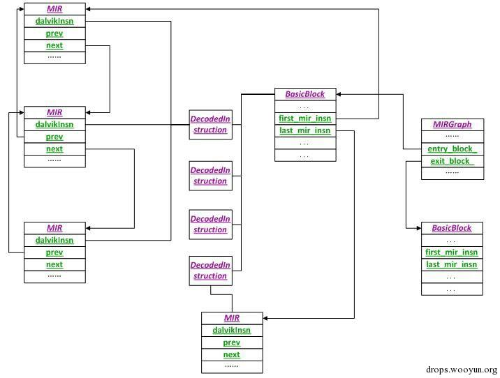   

简单地说，一个MIRGraph对应着一个编译单元即一个方法，对一个方法进行控制流分析，划分出BasicBlock，并在BasicBlock中的fall_through和taken域中指向下一个BasicBlock（适用于分支出口）。每一个BasicBlock包含若干dalvik指令，每一天dalvik指令被翻译为若干MIR语句，这些MIR结构体之间形成双向链表。每一个BasicBlock也指示了第一条和最后一条MIR语句。  

InlineMethod函数主要是解析一个方法，并划分BasicBlock边界，但是只是简单地把BasicBlock连接成一个链表，利用fall_through指示。  

在CodeLayout函数中具体地再次遍历BasicBlock链表，并根据每个BasicBlock出口的指令，再次调整taken域和fall_through域，形成完整的控制流图结构。  

SSATransformation函数是对每条指令进行静态单赋值变换。先对控制流图进行深度优先遍历，并计算出BasicBlock之间的支配关系，插入Phi函数，并对变量进行命名更新。  

其余的方法主要是一些代码优化过程，例如常量传播、消除空指针检查；并在BasicBlock组合之后再进行BasicBlock的优化，消除冗余指令。  

这样基本上就完成了MIR的生成过程，在某种程度上，可以认为MIR即为对dalvik指令进行SSA变换之后的指令形态。  

接着就调用cu.cg->Materialize()用来产生最终代码。cu.cg在之前的代码被指向了Mir2Lir对象，所以调用的是：  
``` c++
voidMir2Lir::Materialize() {
CompilerInitializeRegAlloc();  // Needs to happen after SSA naming  

/* Allocate Registers using simple local allocation scheme */
SimpleRegAlloc();   

 ……
/* Convert MIR to LIR, etc. */
if (first_lir_insn_ == NULL) {
MethodMIR2LIR();
  } 

/* Method is not empty */
if (first_lir_insn_) {
// mark the targets of switch statement case labels
ProcessSwitchTables();  

/* Convert LIR into machine code. */
AssembleLIR();  

  ……
  }
}
```
其中重要的两个调用就是MethodMIR2LIR()和AssembleLIR()。  

MethodMIR2LIR将MIR转化为LIR，遍历每个BasicBlock，对每个基本块执行MethodBlockCodeGen，本质上最后是执行了  `CompileDalvikInstruction`。    
``` c++
voidMir2Lir::CompileDalvikInstruction(MIR* mir, BasicBlock* bb, LIR* label_list) {
  ……
Instruction::Codeopcode = mir->dalvikInsn.opcode;
intopt_flags = mir->optimization_flags;
uint32_tvB = mir->dalvikInsn.vB;
uint32_tvC = mir->dalvikInsn.vC;    

……
switch (opcode) {
case XXX:
GenXXXXXX(……)
default:
LOG(FATAL) <<"Unexpected opcode: "<<opcode;
  }
}  
``` 
也就是通过解析指令，然后根据opcode进行分支判断，调用最终不同的指令生成函数。最后将LIR之间也形成一个双向链表。  

AssembleLIR最终调用的是AssembleInstructions函数。程序中维护了一个编码指令表ArmMir2Lir::EncodingMap，AssembleInstructions即是通过查找这个表来进行翻译，将LIR转化为了ARM指令，并将所翻译的指令存储到CodeBufferMir2Lir::code_buffer_之中。  

这样就完成了一次编译的完整流程。  

## 0x05 JNI分析

ART环境中的JNI接口与Dalvik同样符合JVM标准，但是其中的实现却有所不同。以下通过三个过程来进行简述。  

1、类加载初始化  

首先观察一个native的java成员方法通过dex2oat编译后的结果：  
``` 
java.lang.Stringcom.example.hellojni.HelloJni.stringFromJNI() (dex_method_idx=9)
    DEX CODE:
    CODE: 0xb6bfd1ac (offset=0x000011ac size=148)...
      0xb6bfd1ac: e92d4de0  stmdbsp!, {r5, r6, r7, r8, r10, r11, lr}
      0xb6bfd1b0: e24dd024  sub     sp, sp, #36
      0xb6bfd1b4: e58d0000  str     r0, [sp, #0]
      0xb6bfd1b8: e58d1044  str     r1, [sp, #68]
      0xb6bfd1bc: e3a0c001  mov    r12, r0, #1
      0xb6bfd1c0: e58dc004  str     r12, [sp, #4]
      0xb6bfd1c4: e599c074  ldr     r12, [r9, #116]  ;top_sirt_
      0xb6bfd1c8: e58dc008  str     r12, [sp, #8]
      0xb6bfd1cc: e28dc004  add    r12, sp, #4
      0xb6bfd1d0: e589c074  str     r12, [r9, #116]  ;top_sirt_
      0xb6bfd1d4: e59dc044  ldr     r12, [sp, #68]
      0xb6bfd1d8: e58dc00c  str     r12, [sp, #12]
      0xb6bfd1dc: e589d01c  strsp, [r9, #28]  ; 28
      0xb6bfd1e0: e3a0c000  mov    r12, r0, #0
      0xb6bfd1e4: e589c020  str     r12, [r9, #32]  ; 32
      0xb6bfd1e8: e1a00009  mov    r0, r9
      0xb6bfd1ec: e590c1b8  ldr  r12, [r0, #440] //qpoints->pJniMethodStart = JniMethodStart
      0xb6bfd1f0: e12fff3c  blx     r12
      0xb6bfd1f4: e58d0010  str     r0, [sp, #16]
      0xb6bfd1f8: e28d100c  add     r1, sp, #12
      0xb6bfd1fc: e5990024  ldr     r0, [r9, #36]  ;jni_env_
      0xb6bfd200: e59dc000  ldr     r12, [sp, #0]
      0xb6bfd204: e59cc048  ldr     r12, [r12, #72]
      0xb6bfd208: e12fff3c  blx     r12    // const void* ArtMethod::native_method_
      0xb6bfd20c: e59d1010  ldr     r1, [sp, #16]
      0xb6bfd210: e1a02009  mov    r2, r9
      0xb6bfd214: e592c1c8  ldr     r12, [r2, #456]
      0xb6bfd218: e12fff3c  blx r12//qpoints->pJniMethodEndWithReference= JniMethodEndWithReference
      0xb6bfd21c: e599c00c  ldr     r12, [r9, #12]  ; exception_
      0xb6bfd220: e35c0000  cmp     r12, #0
      0xb6bfd224: 1a000001  bne     +4 (0xb6bfd230)
      0xb6bfd228: e28dd03c  add     sp, sp, #60
      0xb6bfd22c: e8bd8000  ldmiasp!, {pc}
      0xb6bfd230: e1a0000c  mov     r0, r12
      0xb6bfd234: e599c260  ldr     r12, [r9, #608]  ;pDeliverException
      0xb6bfd238: e12fff3c  blx     r12
      0xb6bfd23c: e1200070  bkpt    #0
```
可以看到，它没有对应的dex code。  

用伪码表示这个过程：  
```
JniMethodStart(Thread*);
ArtMethod ::native_method_(…..);
JniMethodEndWithReference(……);
return;
```
基本上就是这三个函数的调用。  

但是从ART的LoadClass的函数来分析，ArtMethod对象与真实执行的代码链接的过程主要是通过LinkCode函数执行的。  
``` c++
staticvoidLinkCode(SirtRef<mirror::ArtMethod>&method, constOatFile::OatClass* oat_class,
uint32_tmethod_index)
SHARED_LOCKS_REQUIRED(Locks::mutator_lock_) {
DCHECK(method->GetEntryPointFromCompiledCode() == NULL);
constOatFile::OatMethodoat_method = oat_class->GetOatMethod(method_index);
oat_method.LinkMethod(method.get());    

Runtime* runtime = Runtime::Current();
boolenter_interpreter = NeedsInterpreter(method.get(), method->GetEntryPointFromCompiledCode());
if (enter_interpreter) {  method->SetEntryPointFromInterpreter(interpreter::artInterpreterToInterpreterBridge);
} else{ method->SetEntryPointFromInterpreter(artInterpreterToCompiledCodeBridge);
 }  

if (method->IsAbstract()) { method->SetEntryPointFromCompiledCode(GetCompiledCodeToInterpreterBridge());
return;
  } 

if (method->IsStatic() && !method->IsConstructor()) {
method->SetEntryPointFromCompiledCode(GetResolutionTrampoline(runtime->GetClassLinker()));
  } elseif (enter_interpreter) {
method->SetEntryPointFromCompiledCode(GetCompiledCodeToInterpreterBridge());
  } 

if (method->IsNative()) {
method->UnregisterNative(Thread::Current());
  } 

runtime->GetInstrumentation()->UpdateMethodsCode(method.get(),
method->GetEntryPointFromCompiledCode());
}
```
可以看到，在LinkCode的开始就将通过oat_method.LinkMethod(method.get())将对象与代码进行了链接，但是在后边又针对几种特殊情况做了一些处理，包括解释执行入口和静态方法等等。我们主要关注的是JNI方法，即  
``` c++
if (method->IsNative()) {
method->UnregisterNative(Thread::Current());
  }
```
展开函数：  
``` c++
voidArtMethod::UnregisterNative(Thread* self) {
CHECK(IsNative()) <<PrettyMethod(this);
RegisterNative(self, GetJniDlsymLookupStub());
}   

extern"C"void* art_jni_dlsym_lookup_stub(JNIEnv*, jobject);
staticinlinevoid* GetJniDlsymLookupStub() {
returnreinterpret_cast<void*>(art_jni_dlsym_lookup_stub);
}   

voidArtMethod::RegisterNative(Thread* self, constvoid* native_method) {
DCHECK(Thread::Current() == self);
CHECK(IsNative()) <<PrettyMethod(this);
CHECK(native_method != NULL) <<PrettyMethod(this);
if (!self->GetJniEnv()->vm->work_around_app_jni_bugs) {
SetNativeMethod(native_method);
  } else {
SetNativeMethod(reinterpret_cast<void*>(art_work_around_app_jni_bugs));
SetFieldPtr<constuint8_t*>(OFFSET_OF_OBJECT_MEMBER(ArtMethod, gc_map_),
reinterpret_cast<constuint8_t*>(native_method), false);
  }
}   

voidArtMethod::SetNativeMethod(constvoid* native_method) {
SetFieldPtr<constvoid*>(OFFSET_OF_OBJECT_MEMBER(ArtMethod, native_method_),
native_method, false);
}
```
很清晰可以看到，在类加载的时候是把ArtMethod的native_method_成员设置为了art_jni_dlsym_lookup_stub函数，那么在执行JNI方法的时候就会执行art_jni_dlsym_lookup_stub函数。  

2、通过java调用JNI方法 

从art_jni_dlsym_lookup_stub函数入手，这个函数使用汇编写的，与具体的平台相关。  
```
ENTRYart_jni_dlsym_lookup_stub
push   {r0, r1, r2, r3, lr}           @ spillregs
    .save  {r0, r1, r2, r3, lr}
    .pad #20
    .cfi_adjust_cfa_offset20
subsp, #12                        @ padstackpointertoalignframe
    .pad #12
    .cfi_adjust_cfa_offset12
blxartFindNativeMethod
movr12, r0                        @ saveresultinr12
addsp, #12                        @ restorestackpointer
    .cfi_adjust_cfa_offset -12
cbzr0, 1f                         @ ismethodcodenull?
pop    {r0, r1, r2, r3, lr}           @ restoreregs
    .cfi_adjust_cfa_offset -20
bxr12                            @ ifnon-null, tailcalltomethod's code
1:
    .cfi_adjust_cfa_offset 20
pop    {r0, r1, r2, r3, pc}           @ restore regs and return to caller to handle exception
    .cfi_adjust_cfa_offset -20
END art_jni_dlsym_lookup_stub
```
主要的过程就是先调用artFindNativeMethod得到真正的native code的地址，然后在跳转到相应地址去执行，即对应了  
```
blxartFindNativeMethod
bxr12                            @ ifnon-null, tailcalltomethod's code
```
两条指令。  
``` c++
extern"C"void* artFindNativeMethod() {
Thread* self = Thread::Current();
Locks::mutator_lock_->AssertNotHeld(self);  
ScopedObjectAccesssoa(self);    

mirror::ArtMethod* method = self->GetCurrentMethod(NULL);
DCHECK(method != NULL); 

void* native_code = soa.Vm()->FindCodeForNativeMethod(method);
if (native_code == NULL) {
DCHECK(self->IsExceptionPending());
returnNULL;
  } else {
method->RegisterNative(self, native_code);
returnnative_code;
  }
}   
```
主要的过程也就是查找到相应方法的native code，然后再次设置ArtMethod的native_method_成员，这样以后再执行的时候就直接跳到了native code执行了。  

3、Native方法中调用java方法  

这个主要是通过JNIEnv来间接调用的。JNIEnv中维持了许多JNI API可以被native code来使用。C和C++的实现形式略有不同，C++是对C的事先进行了一个简单的包装，具体可以参见jni.h。这里为了便于叙述以C为例。  
``` c
typedefconststructJNINativeInterface* JNIEnv;
structJNINativeInterface {
void*       reserved0;
void*       reserved1;
void*       reserved2;
void*       reserved3;
jint        (*GetVersion)(JNIEnv *);
jclass      (*DefineClass)(JNIEnv*, constchar*, jobject, constjbyte*,  jsize);
jclass      (*FindClass)(JNIEnv*, constchar*);
…………
…………
jobject     (*NewDirectByteBuffer)(JNIEnv*, void*, jlong);
void*       (*GetDirectBufferAddress)(JNIEnv*, jobject);
jlong       (*GetDirectBufferCapacity)(JNIEnv*, jobject);
jobjectRefType (*GetObjectRefType)(JNIEnv*, jobject);
};
```
这些API以函数指针的形式存在，并在libart.so中实现，在整个art的初始化的过程中进行了对应。  

在libart.so中的对应：  
``` c++
constJNINativeInterfacegJniNativeInterface = {
NULL,  // reserved0.
NULL,  // reserved1.
NULL,  // reserved2.
NULL,  // reserved3.
JNI::GetVersion,
JNI::DefineClass,
JNI::FindClass,
…………
…………
JNI::NewDirectByteBuffer,
JNI::GetDirectBufferAddress,
JNI::GetDirectBufferCapacity,
JNI::GetObjectRefType,
};
```
下面以一个常见的native code调用java的过程进行下分析：  
``` c++
(*pEnv)->FindClass(……);
getMethodID(……);
(*pEnv)->CallVoidMethod(……);
```
即查找类，得到相应的方法的ID，然后通过此ID去调用。  
``` c++
staticjclassFindClass(JNIEnv* env, constchar* name) {
CHECK_NON_NULL_ARGUMENT(FindClass, name);
Runtime* runtime = Runtime::Current();
ClassLinker* class_linker = runtime->GetClassLinker();
std::stringdescriptor(NormalizeJniClassDescriptor(name));
ScopedObjectAccesssoa(env);
Class* c = NULL;
if (runtime->IsStarted()) {
ClassLoader* cl = GetClassLoader(soa);
      c = class_linker->FindClass(descriptor.c_str(), cl);
    } else {
      c = class_linker->FindSystemClass(descriptor.c_str());
    }
returnsoa.AddLocalReference<jclass>(c);
  } 
```
可以看到JNI中的FindClass实际调用的是ClassLinker::FindClass，这与ART的类加载过程一致。  
``` c++
staticvoidCallVoidMethod(JNIEnv* env, jobjectobj, jmethodIDmid, ...) {
va_listap;
va_start(ap, mid);
CHECK_NON_NULL_ARGUMENT(CallVoidMethod, obj);
CHECK_NON_NULL_ARGUMENT(CallVoidMethod, mid);
ScopedObjectAccesssoa(env);
InvokeVirtualOrInterfaceWithVarArgs(soa, obj, mid, ap);
va_end(ap);
  }
```
最后调用的是ArtMethod::Invoke()。  

可以说如出一辙，即JNI的这些API其实还是做了一遍ART的类加载和初始化及调用的过程。  

## 0x06 总结与补充

* oat文件作为一个静态库的形式被加载到zygote进程的空间中，并由libart.so负责虚拟机的功能，完成对oat文件的解析，方法的查找和调用，并负责垃圾回收。  
* runtime可以实现在部分未被编译的方法和已被编译的方法之前的交互调用，为此runtime提供了诸如artInterpreterToInterpreterBridge、artInterpreterToCompiledCodeBridge之类的函数进行衔接。  
* 所有的Java方法在编译为arm指令后都符合一定的标准。由于是在runtime中运行的，所有的R0寄存器代表着一个隐含的参数，指令当前的ArtMethod对象，R1-R3传递前几个参数（包括this），多余的参数依靠堆栈传递。  
* 系统的启动类（在环境变量BOOTCLASSPATH中指定）被翻译为boot.oat，boot.art包含了其加载后的类对象，启动时以直接被载入进程空间中。
* 同一个dex文件中的方法，载入的时候会被直接解析到ArtMethod对象的dex_cache_resolved_methods_成员中，直接通过R0寄存器寻址。而系统的API主要是通过找到代表包含API的对象Object实例中的Class域，然后在其中的函数表中查找解决的；Class实例的初始化，是在载入每个oat文件解析类信息时建立的。  
* 一些关键的系统调用，如分配对象等，是有libart.so来提供的，并且与平台有相关性，存放在每个Thread对象的quick_entrypoints_域中。
* dex2oat在两个时间被执行，一是apk安装的时候，二是在调用DexClassLoader动态载入dex文件的时候。  
* 具体的说编译的目标指令为Thumb-2指令集，支持16位指令和32位指令的混合执行。  
* 在编译boot.art和boot.oat文件时，不需要其他的支持，但是在编译其他的dex文件时需要在虚拟机环境中载入上述文件。编译执行的过程也需要虚拟机环境的支持，只不过是用于编译而非执行，这样可以保证编译的目标文件是在虚拟机环境中的一个完整的映像而不会出现寻址错误等。  
* 整个编译过程基本上是依靠dex2oat来加载CompilerDriver，然后逐个方法来进行编译。将每个方法划分BasicBlock，绘制MIRGraph（控制流图），逐个翻译为以dalvikbtecode的SSA形式为基础的MIR，然后将MIR解析为LIR，最后翻译为Thumb-2指令，最后统一写入一个ELF文件即oat文件。  