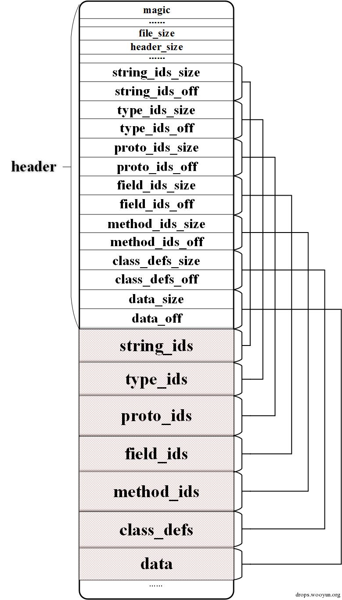
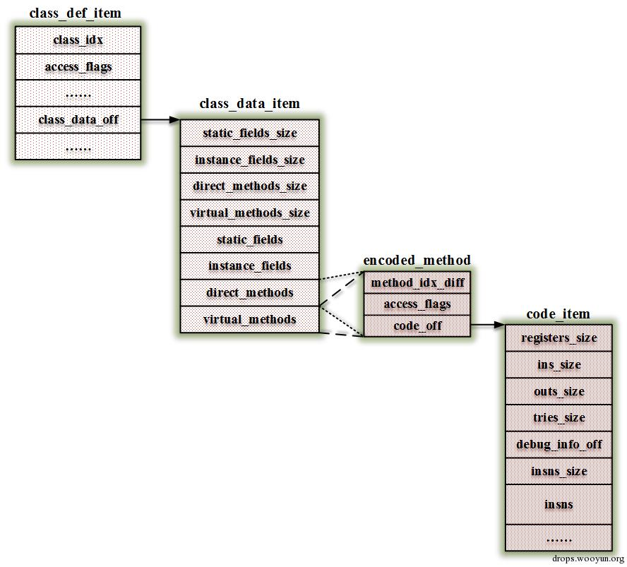
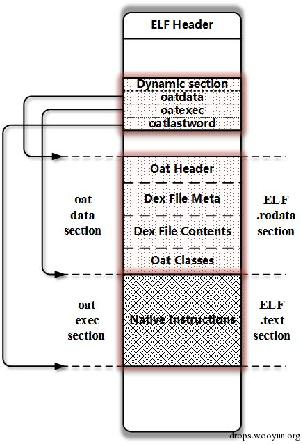
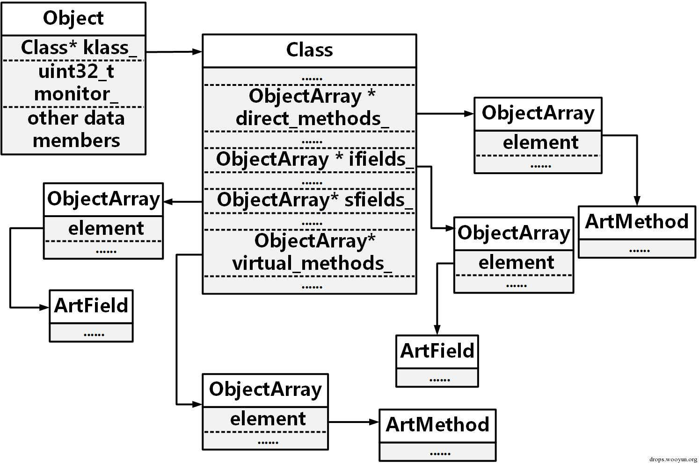
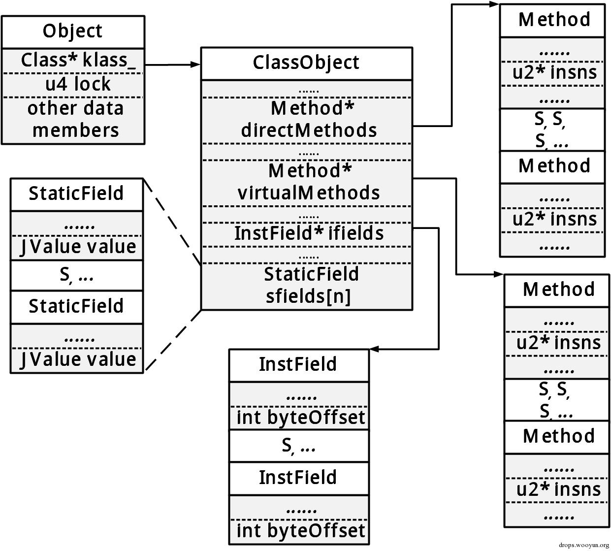
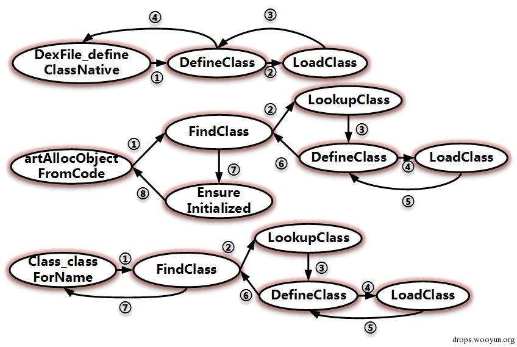
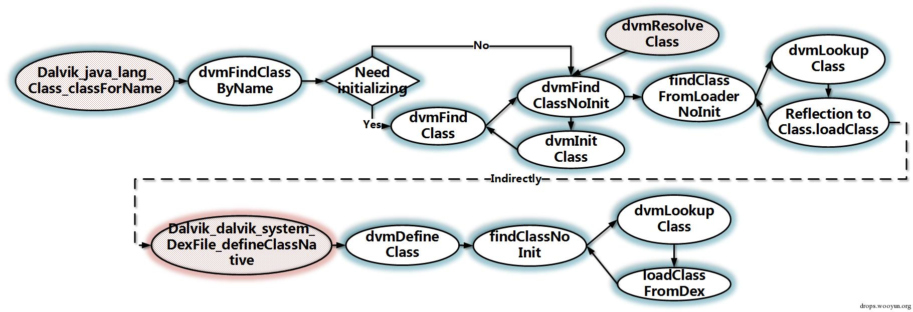
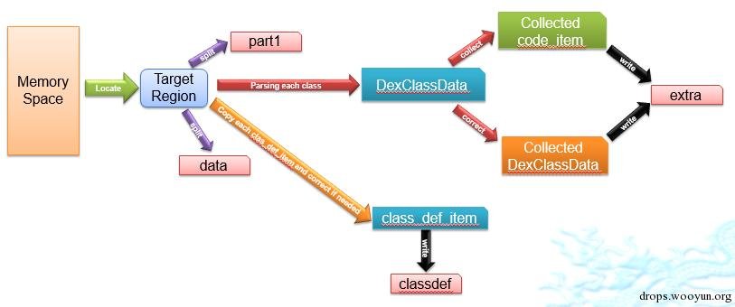

原文by zyq0879  

## 0x01 前言

之前对Android的两个运行时的源码做了一些研究，又加上如火如荼的Android加固服务的兴起，便产生了打造一个用于脱壳的运行时，于是便有了DexHunter的诞生（源码：https://github.com/zyq8709/DexHunter/）。今天，我就通过这篇小文聊聊我的一些简单的思路，供大家参考和讨论。  

## 0x02 相关机制

首先，先来看一看Android运行时的一些相关机制，看看我们来怎么搞。  

首当其冲，要脱壳少不了研究一下Dex文件的格式，这一点Android的官方文档写的已经很清晰了，我这里就简单再提一下。整个结构便如图1所示：    

  
图1 Dex文件结构  

其实就是分区段存储不同的内容，在头部里有指向各个区段起始的偏移值。当然我们最关心的就是class_defs和data这两个段了。  

class_defs包含了所有的类，用class_def_item来描述。图2是对class_def_item展开的一个示意图：  

    
图2 class_def_item结构  

每个class_def_item指向一个class_data_item，每个class_data_item 包含了一个class的数据，每个方法用encoded_method结构来描述，它又指向了一个code_item，这个里面就保存着一个方法的所有指令。  

对于ART下，安装后的dex文件会被编译为oat文件，这个oat文件其实是一个ELF文件，图3是它的一个结构： 

    
图3 OAT文件结构  

其中可以看到oatdata指向的部分包含了原有的Dex文件，这个是我们的目标。当然oatexec指向了编译后的ARM指令，但是对于我们暂时来说没有什么卵用。 

## 0x03 四个时机

为了脱壳，我们要建立一个概念，就是“时机”。对于非虚拟机壳，从内存中转储是一个最为有效和统用的技巧，那么就必须要找到一个时机，保证内存中的数据是完全正确的。  

在Android中呢，便有这么四个时机：  

打开Dex文件  

就是把APK中的dex文件提取并做cache，那么最终打开的其实是odex或oat文件；  

加载Class  

运行时读取存储在Dex中的每个class，并用来填充一个生成的Class对象，其中包含了class的所有成员，这样一个class才能被使用；图4表示了ART和DVM下的Class对象的结构  

    
    

图4 Class的结构  

初始化Class  

如果一个class有static块，那么这个部分就会编译为类的初始化器，具体看说就是方法，在class真正需要被使用的时候就会执行它，当然，壳就可以利用它来做许多事情； 

调用具体的方法 

不用多说，就是根据生成的Class对象查找到具体的代码指令并执行了。  

## 0x04 两种加载

好，那我们怎么做呢？很简单，我们就从类的加载开始。  

总的来说，有两种可以加载类的方法，一个是显示加载，主要用于反射，就是通过调用Class.forName()或ClassLoader.loadClass()方法来主动加载一个类；另一个是隐式加载，主要是通过创建第一个class的实例或在类产生前访问静态成员时发生。这些操作的背后在运行时中是有相应的函数来真正完成的。  

在ART中：  

显式加载：  

ClassLoader.loadClass 对应DexFile_defineClassNative 

Class.forName 对应Class_classForName  

隐式加载：  

对应artAllocObjectFromCode  

图5表述了这个关系：  
  

图5 ART中的实现  

在DVM中： 

显式加载： 

ClassLoader.loadClass对应Dalvik_dalvik_system_DexFile_defineClassNative  

Class.forName对应Dalvik_java_lang_Class_classForName  

隐式加载：  

对应dvmResolveClass  

图6是DVM中的实现表示：  
  

图6 DVM中的实现  

## 0x05 开始修改

很清晰看到，我们找到了关键点，在ART中是DefineClass，DVM中是Dalvik_dalvik_system_DexFile_defineClassNative，我们就从这里动手，主要的修改就发生在这里。简单地说就是主动地一次性加载并初始化所有的类。 

这样做是隐含了几条原则的：  

当类被加载时，dex中对应的部分必须有效；  
类初始化的时候，dex中的内容包括生成的Class对象是可以被修改的；  
只有在执行一个方法时，才要求code_item是有效的。  
图7就是DexHunter的一个工作流程：  

    
图7 DexHunter原理 

下面就分这几个步骤来说： 

（1） 定位内存  

对于之前提到的入口函数，都有一个参数表示在操作的文件。  

ART中，这个参数是DexFile对象，其中有一个location_成员，是一个字符串，可以简单的理解为此文件的路径。那么DVM中是DexOrJar，相对的字符串成员是fileName。这下我们就好整了，只要我们指定了目标字符串，我们就可以从可能使用的众多dex文件中找出我们想要的那个，而且方便的是，通过这两个对象，我们还能很容易找到操作的文件在内存中的起始地址和长度。  

（2） 主动加载并初始化    

这个就是遍历dex文件中class_defs区段里每一个class_def_item，并逐一加载和初始化，在ART里我们使用FindClass函数来加载类，EnsureInitialized进行初始化；在DVM中用dvmDefineClass加载，dvmIsClassInitialized 和dvmInitClass来初始化。    

（3） 转储并自动修复  

最后就是真正抓取dex了。把dex分为三部分： 

Part 1: class_defs之前的内容  
Part 2: class_defs段  
Part 3: class_defs后边的部分  
我们把Part 1存在part1文件里，Part 3存在data文件中，Part 2先不要急。  

现在我们要解析class_defs的东东了。不整代码了，用文字简单来说，就是模仿Android的过程，我们把每个class_data_item解码为内存中的对象（有LEB128编码），便于我们的修复。  
 
下边就要进行一些判断看需不需要修复：  

看class_def_item中的 class_data_off是不是在之前拿到的dex文件的内存范围内，如果跑出去了，就需要把这个类的class_data_item给放到dex尾部去，修改class_def_item并保存。  

比较解析出来的accessflag、codeoff和运行时生成的方法对象的accessflag、codeoff，如果不一致，以运行时中的为准，并修改保存。  

同样，检查code_item_off是否出界了，一旦出界，把code_item收回来，继续向尾部添加，并修改class_def_item的相关内容重新保存。  

当然了，所谓放到尾部，只是先保证偏移值从尾部开始的，真正的内容先存在extra文件了。被修改过的class_defs段，就保存在classdef文件中了。  

然后我们把四个文件重新拼起来，就得到原始的dex或odex了。  

## 0x06 有趣的现象

最后聊一下我们看到的一些有趣的现象。  

360基本上是把原始的dex加密存在了一个so中，加载之前解密。 

阿里把一些class_data_item和code_item拆出去了，打开dex时会修复之间的关系。同时一些annotation_off是无效的的来防止静态解析。  

百度是把一些class_data_item拆走了，与阿里很像，同时它还会抹去dex文件的头部；它也会选择个别方法重新包装，达到调用前还原，调用后抹去的效果。我们可以通过对DoInvoke (ART)和dvmMterp_invokeMethod (DVM)监控来获取到相关代码。  

梆梆和爱加密与360的做法很像，梆梆把一堆read,write, mmap等libc函数hook了，防止读取相关dex的区域，爱加密的字符串会变，但是只是文件名变目录不变。  

腾讯针对于被保护的类或方法造了一个假的class_data_item，不包含被保护的内容。真正的class_data_item会在运行的时候释放并连接上去，但是code_item却始终存在于dex文件里，它用无效数据填充annotation_off和debug_info_off来实现干扰反编译。  

## 0x07 参考  
 
https://source.android.com/devices/tech/dalvik/dex-format.html  
/libcore/libart/src/main/java/java/lang/ClassLoader.java 
/libcore/libdvm/src/main/java/java/lang/ClassLoader.java 
/libcore/dalvik/src/main/java/dalvik/system/DexClassLoader.java  
/libcore/dalvik/src/main/java/dalvik/system/PathClassLoader.java   
https://github.com/anestisb/oatdump_plus#dalvik-opcode-changes-in-art  