原文 by [美团技术博客](https://tech.meituan.com/android_anti_hooking.html)   

## 背景
当下，数据就像水、电、空气一样无处不在，说它是“21世纪的生产资料”一点都不夸张，由此带来的是，各行业对于数据的争夺热火朝天。随着互联网和数据的思维深入人心，一些灰色产业悄然兴起，数据贩子、爬虫、外挂软件等等也接踵而来，互联网行业中各公司竞争对手之间不仅业务竞争十分激烈，黑科技的比拼也越发重要。随着移动互联网的兴起，爬虫和外挂也从单一的网页转向了App，其中利用Android平台下Dalvik模式中的Xposed Installer和Cydia Substrate框架对App的函数进行Hook这一招，堪称老牌经典。  

接下来，本文将分别介绍针对这两种框架的防护技术。  

## Xposed Installer
### 原理
### Zygote
在Android系统中App进程都是由Zygote进程“孵化”出来的。Zygote进程在启动时会创建一个虚拟机实例，每当它“孵化”一个新的应用程序进程时，都会将这个Dalvik虚拟机实例复制到新的App进程里面去，从而使每个App进程都有一个独立的Dalvik虚拟机实例。  

Zygote进程在启动的过程中，除了会创建一个虚拟机实例之外还会将Java Rumtime加载到进程中并注册一些Android核心类的JNI（Java Native Interface，Java本地接口）方法。一个App进程被Zygote进程孵化出来的时候，不仅会获得Zygote进程中的虚拟机实例拷贝，还会与Zygote进程一起共享Java Rumtime，也就是可以将XposedBridge.jar这个Jar包加载到每一个Android App进程中去。安装Xposed Installer之后，系统app_process将被替换，然后利用Java的Reflection机制覆写内置方法，实现功能劫持。下面我们来看一下细节。  

### Hook和Replace
Xposed Installer框架中真正起作用的是对方法的Hook和Replace。在Android系统启动的时候，Zygote进程加载XposedBridge.jar，将所有需要替换的Method通过JNI方法hookMethodNative指向Native方法xposedCallHandler，这个方法再通过调用handleHookedMethod这个Java方法来调用被劫持的方法转入Hook逻辑。    

上面提到的hookMethodNative是XposedBridge.jar中的私有的本地方法，它将一个方法对象作为传入参数并修改Dalvik虚拟机中对于该方法的定义，把该方法的类型改变为Native并将其实现指向另外一个B方法。  

换言之，当调用那个被Hook的A方法时，其实调用的是B方法，调用者是不知道的。在hookMethodNative的实现中，会调用XposedBridge.jar中的handleHookedMethod这个方法来传递参数。handleHookedMethod这个方法类似于一个统一调度的Dispatch例程，其对应的底层的C++函数是xposedCallHandler。而handleHookedMethod实现里面会根据一个全局结构hookedMethodCallbacks来选择相应的Hook函数并调用他们的before和after函数，当多模块同时Hook一个方法的时候Xposed会自动根据Module的优先级来排序。  

调用顺序如下：A.before -> B.before -> original method -> B.after -> A.after  
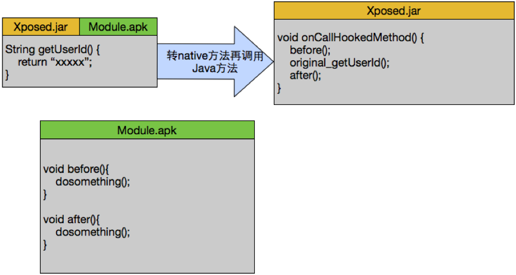  


## 检测
在做Android App的安全防御中检测点众多，Xposed Installer检测是必不可少的一环。对于Xposed框架的防御总体上分为两层：Java层和Native层。  

### Java层检测
需要说明的是，Java层的检测基本只能检测出基础的Xposed Installer框架，而不能防护其对App内方法的Hook，如果框架中带有反检测则Java层检测大多不起作用。  

下面列出Java层的检测点，仅供参考。   

#### ① 通过PackageManager查看安装列表    

最简单的检测，我们调用Android提供的PackageManager的API来遍历系统中App的安装情况来辨别是否有安装Xposed Installer相关的软件包。  
```
PackageManager packageManager = context.getPackageManager();
List applicationInfoList = packageManager.getInstalledApplications(PackageManager.GET_META_DATA);
for (ApplicationInfo applicationInfo: applicationInfoList) {
    if (applicationInfo.packageName.equals("de.robv.android.xposed.installer")) {
        // is Xposed TODO... }
    }
```
通常情况下使用Xposed Installer框架都会屏蔽对其的检测，即Hook掉PackageManager的getInstalledApplications方法的返回值，以便过滤掉de.robv.android.xposed.installer来躲避这种检测。  

#### ② 自造异常读取栈  

Xposed Installer框架对每个由Zygote孵化的App进程都会介入，因此在程序方法异常栈中就会出现Xposed相关的“身影”，我们可以通过自造异常Catch来读取异常堆栈的形式，用以检查其中是否存在Xposed的调用方法。  
```
try {
    throw new Exception("blah");
} catch(Exception e) {
    for (StackTraceElement stackTraceElement: e.getStackTrace()) {
        // stackTraceElement.getClassName() stackTraceElement.getMethodName() 是否存 在Xposed
    }
}
E/GEnvironment: no such table: preference (code 1): while compiling: SELECT keyguard_show_livewallpaper FROM preference
...
at com.meituan.test.extpackage.ExtPackageManager.checkUpdate(ExtPackageManager.java:127)
at com.meituan.test.MiFGService$1.run(MiFGService.java:41)
at android.os.Looper.loop(Looper.java:136)
at android.app.ActivityThread.main(ActivityThread.java:5072)
at java.lang.reflect.Method.invokeNative(Native Method)
at java.lang.reflect.Method.invoke(Method.java:515)
...
at com.android.internal.os.ZygoteInit$MethodAndArgsCaller.run(ZygoteInit.java:793)
at com.android.internal.os.ZygoteInit.main(ZygoteInit.java:609)
at de.robv.android.xposed.XposedBridge.main(XposedBridge.java:132) //发现Xposed模块
at dalvik.system.NativeStart.main(Native Method)
```
#### ③ 检查关键Java方法被变为Native JNI方法  

当一个Android App中的Java方法被莫名其妙地变成了Native JNI方法，则非常有可能被Xposed Hook了。由此可得，检查关键方法是不是变成Native JNI方法，也可以检测是否被Hook。  

通过反射调用Modifier.isNative(method.getModifiers())方法可以校验方法是不是Native JNI方法，Xposed同样可以篡改isNative这个方法的返回值。  

#### ④ 反射读取XposedHelper类字段  

通过反射遍历XposedHelper类中的fieldCache、methodCache、constructorCache变量，读取HashMap缓存字段，如字段项的key中包含App中唯一或敏感方法等，即可认为有Xposed注入。  
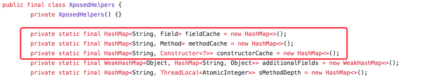  

```
boolean methodCache = CheckHook(clsXposedHelper, "methodCache", keyWord);

private static boolean CheckHook(Object cls, String filedName, String str) {
    boolean result = false;
    String interName;
    Set keySet;
    try {
        Field filed = cls.getClass().getDeclaredField(filedName);
        filed.setAccessible(true);
        keySet = filed.get(cls)).keySet();
        if (!keySet.isEmpty()) {
            for (Object aKeySet: keySet) {
                interName = aKeySet.toString().toLowerCase();
                if (interName.contains("meituan") || interName.contains("dianping") ) {
                    result = true;
                    break;
                    } 
                }
            }
        ...
    return result;
}
```
### Native层检测
由上文可知，无论在Java层做何种检测，Xposed都可以通过Hook相关的API并返回指定的结果来绕过检测，只要有方法就可以被Hook。如果仅在Java层检测就显得很徒劳，为了有效提搞检测准确率，就须做到Java和Native层同时检测。每个App在系统中都有对应的加载库列表，这些加载库列表在/proc/下对应的pid/maps文件中描述，在Native层读取/proc/self/maps文件不失为检测Xposed Installer的有效办法之一。由于Xposed Installer通常只能Hook Java层，因此在Native层使用C来解析/proc/self/maps文件，搜检App自身加载的库中是否存在XposedBridge.jar、相关的Dex、Jar和So库等文件。  
```
bool is_xposed()
{
   bool rel = false;
   FILE *fp = NULL;
   char* filepath = "/proc/self/maps";
   ...
   string xp_name = "XposedBridge.jar";
   fp = fopen(filepath,"r")) 
   while (!feof(fp))                                 
   {
       fgets(strLine,BUFFER_SIZE,fp);                    
       origin_str = strLine;
       str = trim(origin_str);
       if (contain(str,xp_name))
       {
           rel = true; //检测到Xposed模块
           break;
       }
   }
    ...
}
```

## Cydia Substrate
### 原理
Cydia Substrate注入Hook的一个典型流程如下图所示，在Java层配置注入的关键So库libsubstrate.so和libsubstratedvm.so。考虑到Java层检测强度太低，Substrate的检测主要在Native层来实现。  
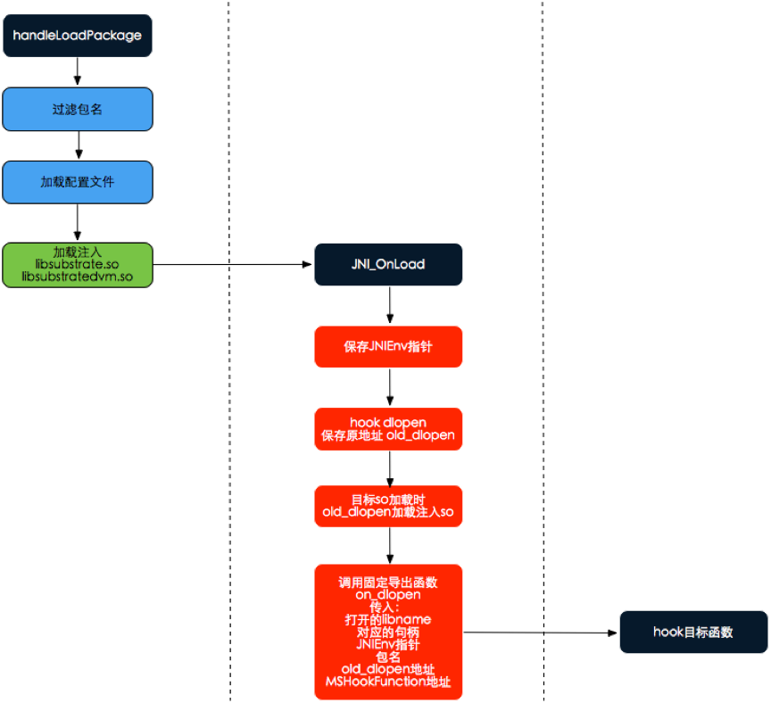  


### 检测
#### 动态加载式检测
读取/proc/self/maps，列出了App中所有加载的文件。  
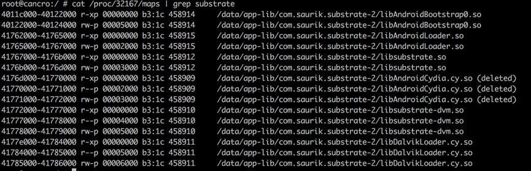  


上图为Cydia Substrate在Android 4.4上注入后的进程maps表，其中libsubstrate.so和libsubstrate-dvm.so两个文件为Substrate必载入文件。通过IDA Pro分析对其分析。  

先来看libsubstrate-dvm.so的导出表，共有9个函数导出。  
  


当进程maps表中出现libsubstrate-dvm.so，可以尝试去load该so文件并调用MSJavaHookMethod方法，它会返回该方法的地址即判定为恶意模块（第三方程序）。  
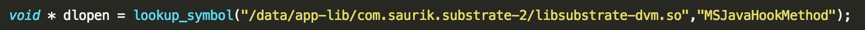  

```
void* lookup_symbol(char* libraryname,char* symbolname)  
{
    void *imagehandle = dlopen(libraryname, RTLD_GLOBAL | RTLD_NOW);
    if (imagehandle != NULL){
        void * sym = dlsym(imagehandle, symbolname);
        if (sym != NULL){
            return sym; //发现Cydia Substrate相关模块
            }
      ...
}
```
该方式基于载入库文件的文件名或文件路径和导出函数来判断是否为恶意模块，如果完全依赖此方式来判断可能会误判，但也不失为检测方式的一个点。  

#### 基于方法特征码检测
特征码即用来判断某段数据属于哪个计算机字段。在非Root环境下一般一个正常App在启动时候，系统会调度相关大小的内存、空间给App使用，此时App的运行环境内产生的数据、内存、存储等是独立于其它App的（即独立运行在沙箱中）。因为处于运行沙箱环境中的进程对沙箱的内存有最高读写权限，当我们的App进程被恶意模块附加或注入时，就可以通过对当前进程的PID所对应的maps中加载的模块进行合法校验。这里的模块校验我们可以采取对单个模块内容取样来判断是否为恶意模块，这种方式被定义为“基于方法的特征码检测”。  

下面对一段程序段中OpcodeSample方法来提取特征码。  

方法原型：  
```
#define  LOGD(fmt, args...)  __android_log_print(ANDROID_LOG_DEBUG,LOG_TAG, fmt, ##args)    
void OpcodeSample(int a ,int b){  
    int c,d,e;
    c = a + b;
    d = a * b;
    e = a / b;
    LOGD("Hello It's c !%s\n", c);  
    LOGD("Hello It's d !%s\n", d);  
    LOGD("Hello It's e !%s\n", e);  
    return;
}
```
通过IDA Pro对其分析。  
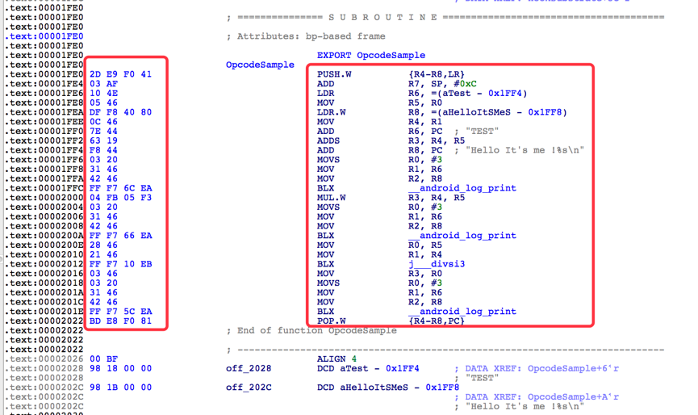  


左侧红色方框代表为OpcodeSample方法的操作码，右边为操作码对应ARM平台的指令集。我们要在左侧的操作码中取出一段作为OpcodeSample的定位特征码，选用__android_log_print方法调用指令集上下文，来确定特征码。  

第一次取样："03 20 31 46 42 46 FF F7 ?? EA"  
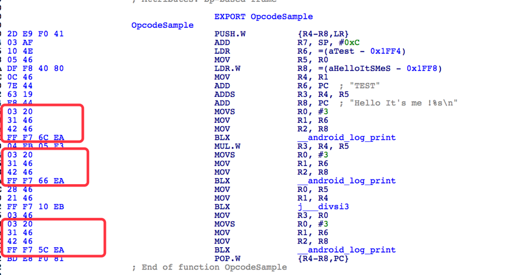  
  


通过第一次取样，查找结果有三处相似，再进一步分析。这次我们加入一个常量取样：  

第二次取样："7E 44 ?? ?? F8 44 03 20 31 46 42 46 FF F7 ?? EA"  
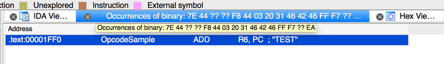   

继而得出唯一特征码，到此，我们对特征码方法取样有了初步的了解。下面来把它转为实用的技能——动态加载式检测+特征码结合。  

我们对libsubstrate-dvm.so中导出函数MSJavaHookMethod来精准定位。  

IDA PRO导出函数表如图：  
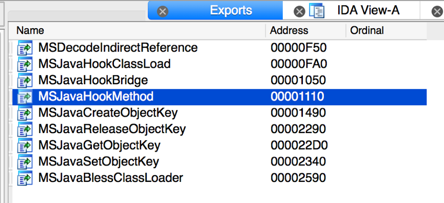  
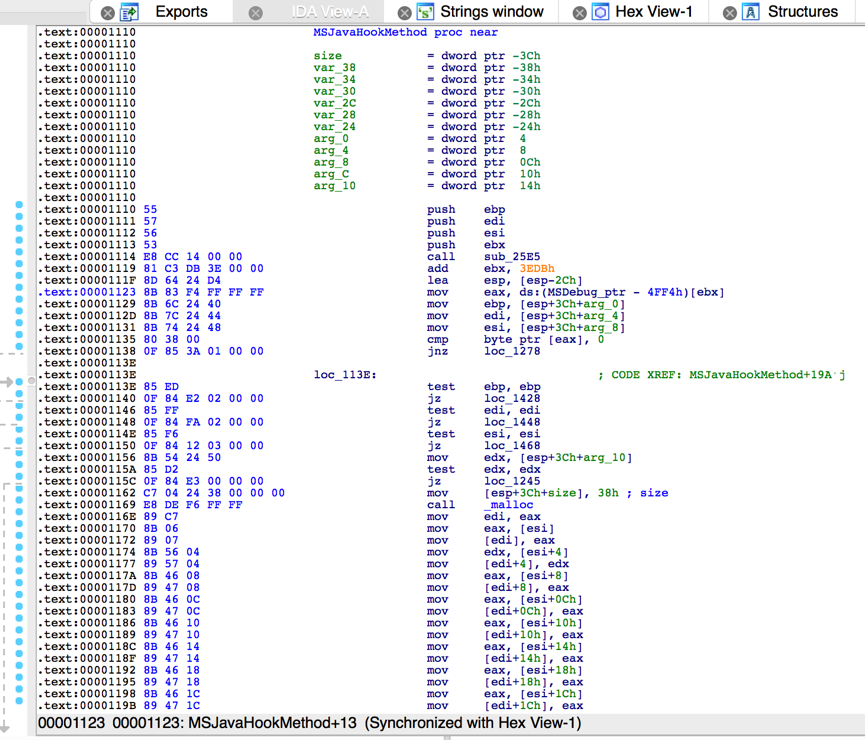  
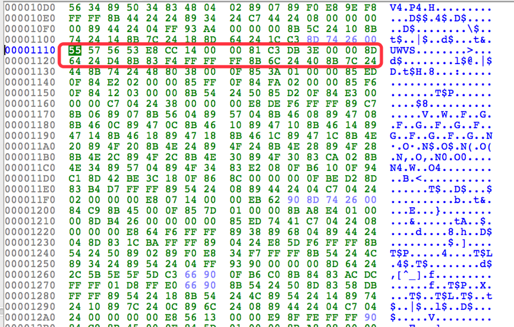      


第三次取样："55 57 56 53 E8 CC 14 ?? ?? 81 C3 DB ?? ?? ?? 8D 64 ?? ?? 8B 83 F4 ?? ?? ??"  
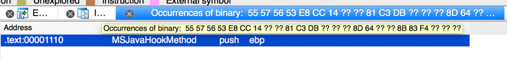    

以上即为对Cydia Substrate的注入检测识别，通过检测/proc/self/maps下的加载so库列表得到各个库文件绝度路径，通过fopen函数将so库的内容以16进制读进来放在内存里面进行规则比对，采用字符串模糊查找来检测是否命中黑名单中的方法特征码。  

## 总结
在安全对抗领域，相比攻击方，防守方历来处于弱势的一方。上文所提到的Xposed Installer和Cydia Substrate的检测也仅仅是保障App安全的手段之一。App安全的防御不应仅仅依赖于此，应该构建起整体的安全防御闭环，尽可能在所有已知的可能攻击点都追加检测，再配合代码加固，将防御代码隐藏。遗憾的是App防御代码隐藏再深也终究会被破解，仅仅依赖于客户端的防御显然是不足的。移动互联网领域的整体安全防御应该是走端云结合协作之道，共同防御，方能在攻防对抗中占据优势地位。  