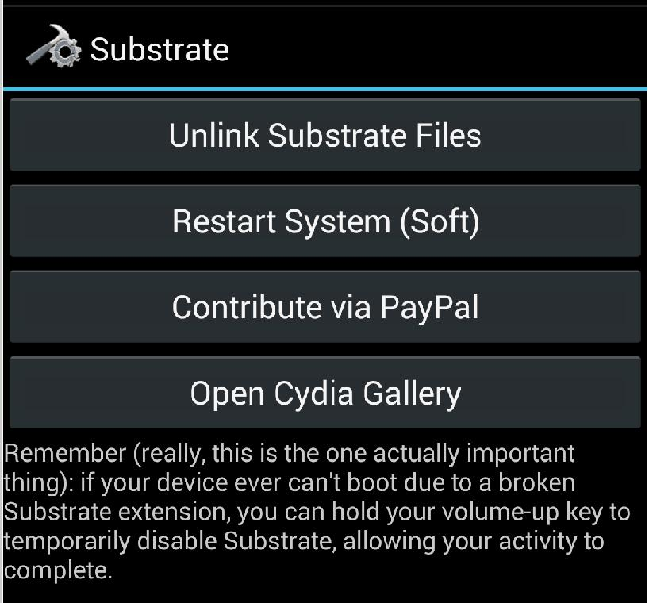
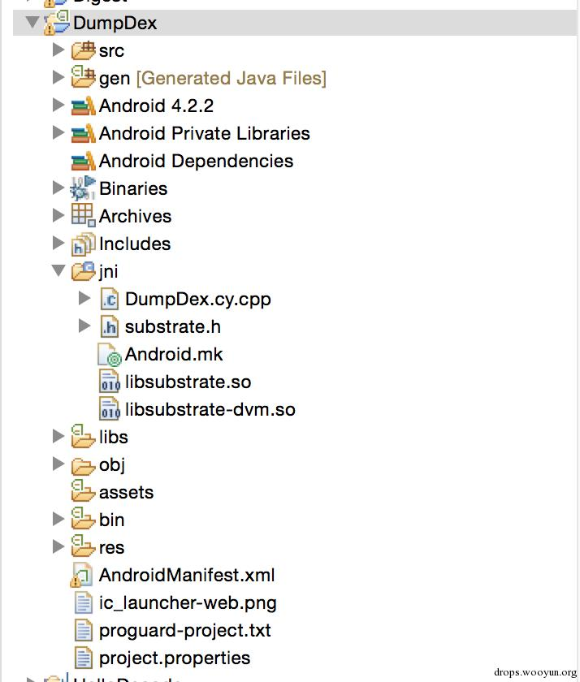
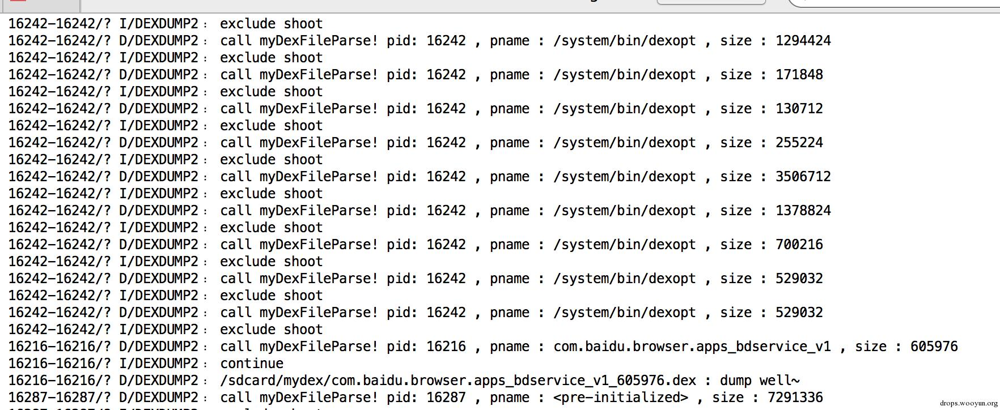
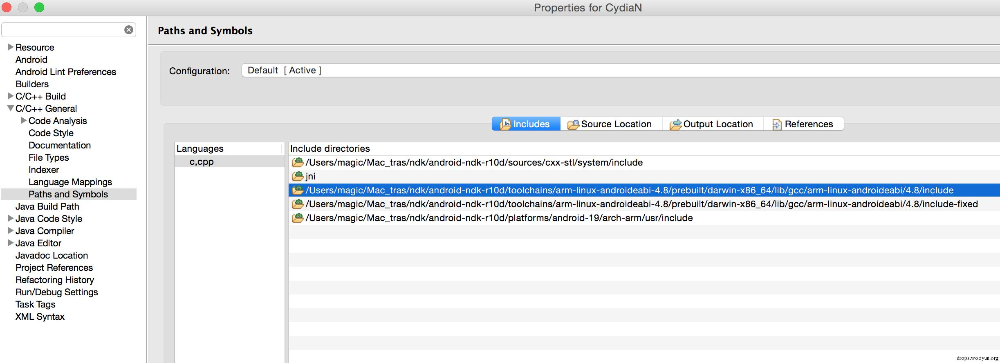

原文 by 瘦蛟舞   
注:框架有风险，使用要谨慎.  

Cydia Substrate是一个代码修改平台.它可以修改任何主进程的代码，不管是用Java还是C/C++（native代码）编写的.而Xposed只支持HOOK app_process中的java函数，因此Cydia Substrate是一款强大而实用的HOOK工具.  

官网地址：http://www.cydiasubstrate.com/  

官方教程：http://www.cydiasubstrate.com/id/38be592b-bda7-4dd2-b049-cec44ef7a73b  

SDK下载地址：http://asdk.cydiasubstrate.com/zips/cydia_substrate-r2.zip  

## 0x00 Hook Java 层

之前讲解过 xposed 的用法为啥还要整这个了，下面简单对比两款框架。  

劣势:  

没啥错误提醒，排错比较麻烦.  
需要对 NDK 开发有一定了解，相对 xposed 模块的开发学习成本高一些.  
因为不开源网上(github)上可以参考的模块代码很少.  
优势:  

可以对 native 函数进行 hook   .
与 xposed hook 原理不一样，因为不是开源具体原理我也不清楚. 结果就是一些Anti hook 可能对 xposed 有效而对 Cydia 无效.  
使用方法  

1. 安装框架app：http://www.cydiasubstrate.com/download/com.saurik.substrate.apk  

2. 创建一个空的Android工程.由于创建的工程将以插件的形式被加载，所以不需要activity.将SDK中的substrate-api.jar复制到project/libs文件夹中.  

3. 配置Manifest文件  
``` xml
<manifest xmlns:android="http://schemas.android.com/apk/res/android">
    <application>
        <meta-data android:name="com.saurik.substrate.main"
            android:value=".Main"/>
    </application>
    <uses-permission android:name="cydia.permission.SUBSTRATE"/>
</manifest>
```
4. 创建一个类，类名为Main.类中包含一个static方法initialize，当插件被加载的时候，该方法中的代码就会运行，完成一些必要的初始化工作.  
``` java
import com.saurik.substrate.MS;
public class Main {
    static void initialize() { 
        // ... code to run when extension is loaded
    }
}
``` 
5. hook imei example  
``` java
import com.saurik.substrate.MS;
public class Main {
    static void initialize() {
        MS.hookClassLoad("android.telephony.TelephonyManager"，
                new MS.ClassLoadHook() {
                    @SuppressWarnings("unchecked")
                    public void classLoaded(Class<?> arg0) {
                        Method hookimei;
                        try {
                            hookimei = arg0.getMethod("getDeviceId"， null);
                        } catch (NoSuchMethodException e) {
                            // TODO Auto-generated catch block
                            e.printStackTrace();
                            hookimei = null;
                        }
                        if (hookimei != null) {
                            final MS.MethodPointer old1 = new MS.MethodPointer();
                            MS.hookMethod(arg0， hookimei， new MS.MethodHook() {
                                @Override
                                public Object invoked(Object arg0，
                                        Object... arg1) throws Throwable {
                                    // TODO Auto-generated method stub
                                    System.out.println("hook imei----------->");
                                    String imei = (String) old1.invoke(arg0，
                                            arg1);
                                    System.out.println("imei-------->" + imei);
                                    imei = "999996015409998";
                                    return imei;
                                }
                            }， old1);
                        }
                    }
                });
    }
}
```
6. 在 cydia app 界面中点击 Link Substrate Files 之后重启手机   
  


7. 使用getimei的小程序验证imei是否被改变  
``` java
public class MainActivity extends ActionBarActivity {
    private static final String tag = "MainActivity";
    TextView mText ;
    @Override
    protected void onCreate(Bundle savedInstanceState) {
        super.onCreate(savedInstanceState);
        setContentView(R.layout.activity_main);
        mText = (TextView) findViewById(R.id.text);
        TelephonyManager mtelehonyMgr = (TelephonyManager) getSystemService(this.TELEPHONY_SERVICE);
        Build bd = new Build(); 
        String imei = mtelehonyMgr.getDeviceId(); 
        String imsi = mtelehonyMgr.getSubscriberId();
        //getSimSerialNumber()   获取 SIM 序列号  getLine1Number 获取手机号
        String androidId = Secure.getString(getApplicationContext().getContentResolver()， Secure.ANDROID_ID); 
        String id = UUID.randomUUID().toString();
        String model = bd.MODEL;
        StringBuilder sb = new StringBuilder();
        sb.append("imei = "+ imei);
        sb.append("\nimsi = " + imsi);
        sb.append("\nandroid_id = " + androidId);
        sb.append("\nuuid = " + id);
        sb.append("\nmodel = " + model);
        if(imei!=null)
            mText.setText(sb.toString());
        else
            mText.setText("fail");
    }
```
8. 关键api介绍  

MS.hookClassLoad:该方法实现在指定的类被加载的时候发出通知(改变其实现方式?).因为一个类可以在任何时候被加载，所以Substrate提供了一个方法用来检测用户感兴趣的类何时被加载.  

这个api需要实现一个简单的接口MS.ClassLoadHook，该接口只有一个方法classLoaded，当类被加载的时候该方法会被执行.加载的类以参数形式传入此方法.  
``` java
void hookClassLoad(String name， MS.ClassLoadHook hook);
参数	描述
name	包名+类名，使用java的.符号(被hook的完整类名)
hook	MS.ClassLoadHook的一个实例，当这个类被加载的时候，它的classLoaded方法会被执行.
MS.hookClassLoad("java.net.HttpURLConnection"，
    new MS.ClassLoadHook() {
        public void classLoaded(Class<?> _class) {
            /* do something with _class argument */
        }
    }
);
```
MS.hookMethod:该API允许开发者提供一个回调函数替换原来的方法，这个回调函数是一个实现了MS.MethodHook接口的对象，是一个典型的匿名内部类.它包含一个invoked函数.    
``` java
void hookMethod(Class _class， Member member， MS.MethodHook hook， MS.MethodPointer old);
参数	描述
_class	加载的目标类，为classLoaded传下来的类参数
member	通过反射得到的需要hook的方法(或构造函数). 注意：不能HOOK字段 (在编译的时候会进行检测).
hook	MS.MethodHook的一个实例，其包含的invoked方法会被调用，用以代替member中的代码
```
## 0x01 Hook Native 层

这块的功能 xposed 就不能实现啦.  

整个流程大致如下:  

创建工程，添加 NDK 支持  
将 cydia 的库和头文件加入工程  
修改 AndroidManifest配置文件  
修改Android.md  
开发模块  
指定要hook 的 lib 库  
保留原来的地址  
替换的函数  
Substrate entry point  
MSGetImageByName or dlopen  
MSFindSymbol or dlsym or nlist 指定方法，得到开始地址  
MSHookFunction 替换函数  
使用方法   

第零步:添加 ndk 支持，将 cydia 的库和头文件加入工程  

有关 ndk 开发的基础可以参考此文: [NDK入门篇](../Android开发基础/Android%20NDK%20开发基础.md)    
    
 
注意要是 xxx.cy.cpp，不要忘记.cy  
 
其实应该是动态链接库名称中的 cy 必须有，所有在 Android.md 中module 处的 .cy 必须带上咯  

LOCAL_MODULE    := DumpDex2.cy  
第一步:修改配置文件  
``` xml
<manifest xmlns:android="http://schemas.android.com/apk/res/android"
    android:installLocation="internalOnly" >
    <application android:hasCode="false">
    </application>

    <uses-permission android:name="cydia.permission.SUBSTRATE"/>
</manifest>
```
设置 android:hasCode 属性 false，设置android:installLocation属性internalOnly"  

第二步:指定要 hook 的 lib 库  
``` c
#include <substrate.h>

MSConfig(MSFilterExecutable， "/system/bin/app_process")  //MSConfig(MSFilterLibrary， "liblog.so")

// this is a macro that uses __attribute__((__constructor__))
MSInitialize {
    // ... code to run when extension is loaded
}
```
设置要 hook 的可执行文件或者动态库  

第三步: 等待 class  
``` c
static void OnResources(JNIEnv *jni， jclass resources， void *data) {
    // ... code to modify the class when loaded
}

MSInitialize {
    MSJavaHookClassLoad(NULL， "android/content/res/Resources"， &OnResources);
}
```
第四步:修改实现  
``` c
static jint (*_Resources$getColor)(JNIEnv *jni， jobject _this， ...);

static jint $Resources$getColor(JNIEnv *jni， jobject _this， jint rid) {
    jint color = _Resources$getColor(jni， _this， rid);
    return color & ~0x0000ff00 | 0x00ff0000;
}

static void OnResources(JNIEnv *jni， jclass resources， void *data) {
    jmethodID method = jni->GetMethodID(resources， "getColor"， "(I)I");
    if (method != NULL)
        MSJavaHookMethod(jni， resources， method，
            &$Resources$getColor， &_Resources$getColor);
}
```
下面是步骤是在官网教程基础上对小白同学的一些补充吧.  
```
» file libprocess.so                                                                  
libprocess.so: ELF 32-bit LSB shared object， ARM， version 1 (SYSV)， dynamically linked (uses shared libs)， not stripped
```
第五步  

复制libsubstrate-dvm.so(注意 arm 和 x86平台的选择)和substrate.h到 jni 目录下.创建SuperMathHook.cy.cpp文件  

第六步  

配置Android.mk文件  
```
LOCAL_PATH := $(call my-dir)

include $(CLEAR_VARS)
LOCAL_MODULE:= substrate-dvm
LOCAL_SRC_FILES := libsubstrate-dvm.so
include $(PREBUILT_SHARED_LIBRARY)

include $(CLEAR_VARS)
LOCAL_MODULE    := SuperMathHook.cy
LOCAL_SRC_FILES := SuperMathHook.cy.cpp
LOCAL_LDLIBS := -llog
LOCAL_LDLIBS += -L$(LOCAL_PATH) -lsubstrate-dvm //-L指定库文件的目录，-l指定库文件名，-I指定头文件的目录.
include $(BUILD_SHARED_LIBRARY)
加入 c 的 lib

LOCAL_PATH := $(call my-dir)

include $(CLEAR_VARS)
LOCAL_MODULE:= substrate-dvm
LOCAL_SRC_FILES := libsubstrate-dvm.so
include $(PREBUILT_SHARED_LIBRARY)


include $(CLEAR_VARS)
LOCAL_MODULE:= substrate
LOCAL_SRC_FILES := libsubstrate.so
include $(PREBUILT_SHARED_LIBRARY)

include $(CLEAR_VARS)

LOCAL_MODULE    := CydiaN.cy
LOCAL_SRC_FILES := CydiaN.cy.cpp
LOCAL_LDLIBS := -llog
LOCAL_LDLIBS += -L$(LOCAL_PATH) -lsubstrate-dvm -lsubstrate

include $(BUILD_SHARED_LIBRARY)
```
strings 查看下里面的函数.  
``` bash
/data/data/com.jerome.jni/lib # strings libprocess.so                                                               <
/system/bin/linker
__cxa_finalize
__cxa_atexit
Jstring2CStr
malloc
memcpy
__aeabi_unwind_cpp_pr0
Java_com_jerome_jni_JNIProcess_getInfoMD5
....
```
### 脱壳机模块开发    

网上流传的 IDA dump 脱壳流程大致如下:  

对`/system/lib/libdvm.so` 方法`JNI_OnLoad/dvmLoadNativeCode/dvmDexFileOpenPartial`下断点分析  
IDA 附加 app (IDA6.5以及之后版本)  
Ctrl+s 查看基地址+偏移  
IDA 分析寻找 dump 点  
F8/F9执行到dex完全被解密到内存中时候进行 dump  
现在目标就是通过 Cydia 的模块来自动化完成这个功能.这里咱选择对dvmDexFileOpenPartial函数进行 hook.至于为什么要选择这里了?这就需要分析下 android dex优化过程  

Android会对每一个安装的应用的dex文件进行优化，生成一个odex文件.相比于dex文件，odex文件多了一个optheader，依赖库信息（dex文件所需要的本地函数库）和辅助信息（类索引信息等）.  

dex的优化过程是一个独立的功能模块来实现的，位于 http://androidxref.com/4.4.3_r1.1/xref/dalvik/dexopt/OptMain.cpp#57 其中`extractAndProcessZip()` 函数完成优化操作.    

http://androidxref.com/4.1.1/xref/dalvik/dexopt/OptMain.cpp  

OptMain中的main函数就是加载dex的最原始入口 
``` c
int main(int argc， char* const argv[])
{
    set_process_name("dexopt");

    setvbuf(stdout， NULL， _IONBF， 0);

    if (argc > 1) {
        if (strcmp(argv[1]， "--zip") == 0)
            return fromZip(argc， argv);
        else if (strcmp(argv[1]， "--dex") == 0)
            return fromDex(argc， argv);
        else if (strcmp(argv[1]， "--preopt") == 0)
            return preopt(argc， argv);
    }
    ...
    return 1;
}
```
可以看到，这里会分别对3中类型的文件做不同处理，我们关心的是dex文件，所以接下来看看fromDex函数：  
``` c
static int fromDex(int argc， char* const argv[])
{
...
if (dvmPrepForDexOpt(bootClassPath， dexOptMode， verifyMode， flags) != 0) {
    ALOGE("VM init failed");
    goto bail;
}

vmStarted = true;

/* do the optimization */
if (!dvmContinueOptimization(fd， offset， length， debugFileName，
        modWhen， crc， (flags & DEXOPT_IS_BOOTSTRAP) != 0))
{
    ALOGE("Optimization failed");
    goto bail;
}
...
}
```
这个函数先初始化了一个虚拟机，然后调用`dvmContinueOptimization` 函数 `/dalvik/vm/analysis/DexPrepare.cpp`，进入这个函数：   
``` c
bool dvmContinueOptimization(int fd， off_t dexOffset， long dexLength，
    const char* fileName， u4 modWhen， u4 crc， bool isBootstrap)
{
    ...
    /*
         * Rewrite the file.  Byte reordering， structure realigning，
         * class verification， and bytecode optimization are all performed
         * here.
         *
         * In theory the file could change size and bits could shift around.
         * In practice this would be annoying to deal with， so the file
         * layout is designed so that it can always be rewritten in place.
         *
         * This creates the class lookup table as part of doing the processing.
         */
        success = rewriteDex(((u1*) mapAddr) + dexOffset， dexLength，
                    doVerify， doOpt， &pClassLookup， NULL);

        if (success) {
            DvmDex* pDvmDex = NULL;
            u1* dexAddr = ((u1*) mapAddr) + dexOffset;

            if (dvmDexFileOpenPartial(dexAddr， dexLength， &pDvmDex) != 0) {
                ALOGE("Unable to create DexFile");
                success = false;
            } else {
    ...
}
```
这个函数中对Dex文件做了一些优化（如字节重排序，结构对齐等），然后重新写入Dex文件.如果优化成功的话接下来调用dvmDexFileOpenPartial，而这个函数中调用了真正的Dex文件.在具体看看这个函数/dalvik/vm/DvmDex.cpp  
``` c
/*
 * Create a DexFile structure for a "partial" DEX.  This is one that is in
 * the process of being optimized.  The optimization header isn't finished
 * and we won't have any of the auxillary data tables， so we have to do
 * the initialization slightly differently.
 *
 * Returns nonzero on error.
 */
int dvmDexFileOpenPartial(const void* addr， int len， DvmDex** ppDvmDex)
{
    DvmDex* pDvmDex;
    DexFile* pDexFile;
    int parseFlags = kDexParseDefault;
    int result = -1;

    /* -- file is incomplete， new checksum has not yet been calculated
    if (gDvm.verifyDexChecksum)
        parseFlags |= kDexParseVerifyChecksum;
    */

    pDexFile = dexFileParse((u1*)addr， len， parseFlags);
    if (pDexFile == NULL) {
        ALOGE("DEX parse failed");
        goto bail;
    }
    pDvmDex = allocateAuxStructures(pDexFile);
    if (pDvmDex == NULL) {
        dexFileFree(pDexFile);
        goto bail;
    }

    pDvmDex->isMappedReadOnly = false;
    *ppDvmDex = pDvmDex;
    result = 0;

bail:
    return result;
}
```
这个函数的前两个参数非常关键，第一个参数是dex文件的起始地址，第二个参数是dex文件的长度，有了这两个参数，就可以从内存中将这个dex文件dump下来了，这也是在此函数下断点的原因.该函数会调用dexFileParse()对dex文件进行解析  

所以在dexFileParse函数处来进行 dump 也是可行的.但是因为这个函数的原型是  

`DexFile* dexFileParse(const u1* data， size_t length， int flags) `
其返回值为一个结构体指针struct DexFile { ... }，要 hook 这个函数得把结构体从 android 源码中扣出来或者直接改镜像.  

找到dvmDexFileOpenPartial函数在 libdvm.so 对应的名称  
``` bash
» strings libdvm_arm.so|grep dvmDexFileOpenPartial
_Z21dvmDexFileOpenPartialPKviPP6DvmDex

» strings libdvm_arm.so|grep dexFileParse
_Z12dexFileParsePKhji
```
有了上述理论基础，现在可以正式开发模块了.大致流程如下  

指定要hook 的 lib 库  
Original method template 原函数模板  
Modified method 替换的函数  
Substrate entry point  
MSGetImageByName or dlopen 载入lib得到 image  
MSFindSymbol or dlsym or nlist 指定方法，得到开始地址  
MSHookFunction 替换函数  
完整代码  
``` c
#include "substrate.h"
#include <android/log.h>
#include <unistd.h>
#include <stdio.h>
#include <fcntl.h>
#include <sys/types.h>
#include <string.h>

#define BUFLEN 1024
#define TAG "DEXDUMP"
#define LOGD(...) __android_log_print(ANDROID_LOG_DEBUG， TAG， __VA_ARGS__)
#define LOGI(...) __android_log_print(ANDROID_LOG_INFO， TAG， __VA_ARGS__)

//get packagename from pid
int getProcessName(char * buffer){
    char path_t[256]={0};
    pid_t pid=getpid();
    char str[15];
    sprintf(str， "%d"， pid);
    memset(path_t， 0 ， sizeof(path_t));
    strcat(path_t， "/proc/");
    strcat(path_t， str);
    strcat(path_t， "/cmdline");
    //LOG_ERROR("zhw"， "path:%s"， path_t);
    int fd_t = open(path_t， O_RDONLY);
    if(fd_t>0){
        int read_count = read(fd_t， buffer， BUFLEN);

        if(read_count>0){
              int  processIndex=0;
              for(processIndex=0;processIndex<strlen(buffer);processIndex++){
                  if(buffer[processIndex]==':'){
                      buffer[processIndex]='_';
                  }

              }
            return 1;
        }
    }
    return 0;
}

//指定要hook 的 lib 库  
MSConfig(MSFilterLibrary，"/system/lib/libdvm.so")

//保留原来的地址  DexFile* dexFileParse(const u1* data， size_t length， int flags)
int (* oldDexFileParse)(const void * addr，int len，int flags);

//替换的函数
int myDexFileParse(const void * addr，int len，void ** dvmdex)
{
    LOGD("call my dvm dex!!:%d"，getpid());

    {
        //write to file
        //char buf[200];
        // 导出dex文件
        char dexbuffer[64]={0};
        char dexbufferNamed[128]={0};
        char * bufferProcess=(char*)calloc(256，sizeof(char));
        int  processStatus= getProcessName(bufferProcess);
        sprintf(dexbuffer， "_dump_%d"， len);
        strcat(dexbufferNamed，"/sdcard/");
        if (processStatus==1) {
          strcat(dexbufferNamed，bufferProcess);
            strcat(dexbufferNamed，dexbuffer);

        }else{
            LOGD("FAULT pid not  found\n");
        }

        if(bufferProcess!=NULL)
        {

          free(bufferProcess);
        }

        strcat(dexbufferNamed，".dex");

        //sprintf(buf，"/sdcard/dex.%d"，len);
        FILE * f=fopen(dexbufferNamed，"wb");
        if(!f)
        {
            LOGD(dexbuffer + " : error open sdcard file to write");
        }
        else{
            fwrite(addr，1，len，f);
            fclose(f);
        }


    }
    //进行原来的调用，不影响程序运行
    return oldDexFileParse(addr，len，dvmdex);
}

//Substrate entry point
MSInitialize
{
    LOGD("Substrate initialized.");
    MSImageRef image;
    //载入lib
    image = MSGetImageByName("/system/lib/libdvm.so");
    if (image != NULL)
    {

        void * dexload=MSFindSymbol(image，"_Z21dvmDexFileOpenPartialPKviPP6DvmDex");
        if(dexload==NULL)
        {
            LOGD("error find _Z21dvmDexFileOpenPartialPKviPP6DvmDex ");

        }
        else{
            //替换函数
            //3.MSHookFunction
            MSHookFunction(dexload，(void*)&myDexFileParse，(void **)&oldDexFileParse);
        }
    }
    else{
        LOGD("ERROR FIND LIBDVM");
    }
}
```
效果如下:  
``` bash
shell@hammerhead:/sdcard $ l |grep dex
app_process_classes_3220.dex
com.ali.tg.testapp_classes_606716.dex
com.chaozh.iReaderFree_classes_4673256.dex
com.secken.app_xg_service_v2_classes_6327832.dex
``` 
### 脱壳机模块改进一  

更改 hook 点为 dexFileParse，上文已经讲解了为啥也可以选择这里.也分析了 dex 优化的过程，这里在分析下 dex 加载的过程.  

DexClassLoader广泛被开发者用于插件的动态加载.而PathClassLoader几乎没怎么见过.  

因为PathClassLoader 没有提供优化 dex 的目录而是固定将 odex 存放到 /data/dalvik-cache 中 ，故它只能加载已经安装到 Android 系统中的 apk 文件，也就是 /data/app 目录下的 apk 文件.  

PathClassLoader 和 DexClassLoader 父类为 BaseDexClassLoader  

http://androidxref.com/4.4.2_r1/xref/libcore/dalvik/src/main/java/dalvik/system/BaseDexClassLoader.java    
``` java
45    public BaseDexClassLoader(String dexPath， File optimizedDirectory，
       String libraryPath， ClassLoader parent) {
```

http://androidxref.com/4.4.2_r1/xref/libcore/dalvik/src/main/java/dalvik/system/DexPathList.java  
``` java
DexPathList(this， dexPath， libraryPath， optimizedDirectory);

260    private static DexFile loadDexFile(File file， File optimizedDirectory)
```
http://androidxref.com/4.4.2_r1/xref/libcore/dalvik/src/main/java/dalvik/system/DexFile.java  
``` java
141 static public DexFile loadDex(String sourcePathName， String outputPathName， int flags)
调用 native 函数 native private static int openDexFileNative(String sourceName， String outputName， int flags)

294    private static int openDexFile(String sourceName， String outputName，
295        int flags) throws IOException {
296        return openDexFileNative(new File(sourceName).getCanonicalPath()，
297                                 (outputName == null) ? null : new File(outputName).getCanonicalPath()，
298                                 flags);
299    }
```
http://androidxref.com/4.4.2_r1/xref/dalvik/vm/native/dalvik_system_DexFile.cpp
``` c
151 static void Dalvik_dalvik_system_DexFile_openDexFileNative(const u4* args， JValue* pResult)
//249 static void Dalvik_dalvik_system_DexFile_openDexFile_bytearray(const u4* args， JValue* pResult)
```
http://androidxref.com/4.4.2_r1/xref/dalvik/vm/RawDexFile.cpp  
``` c
109 int dvmRawDexFileOpen(const char* fileName， const char* odexOutputName， RawDexFile** ppRawDexFile， bool isBootstrap)  //工具类方法打开DEX文件/Jar文件
```
http://androidxref.com/4.4.4_r1/xref/dalvik/vm/DvmDex.cpp  
``` c
93 int dvmDexFileOpenFromFd(int fd， DvmDex** ppDvmDex)  //从一个打开的DEX文件，映射到只读共享内存并且解析内容
//146 int dvmDexFileOpenPartial(const void* addr， int len， DvmDex** ppDvmDex)  //通过地址和长度打开部分DEX文件
``` 

http://androidxref.com/4.4.4_r1/xref/dalvik/libdex/DexFile.cpp    
```
289 dexFileParse(const u1* data， size_t length， int flags)  //解析dex文件
```
> 方法openDexFile里通过dvmDexFileOpenFromFd函数调用dexFileParse函数，分析Dex文件里每个类名称和类的代码所在索引，然后dexFileParse调用函数dexParseOptData来把类名称写对象pDexFile->pClassLookup里面，当然也更新了索引

``` c
//Substrate entry point
MSInitialize
{
    LOGD("Cydia Init");
    MSImageRef image;
    //载入lib
    image = MSGetImageByName("/system/lib/libdvm.so");
    if (image != NULL)
    {
        void * dexload=MSFindSymbol(image，"_Z12dexFileParsePKhji");
        if(dexload==NULL)
        {
            LOGD("error find _Z12dexFileParsePKhji");

        }
        else{
            //替换函数
            //3.MSHookFunction
            MSHookFunction(dexload，(void*)&myDexFileParse，(void **)&oldDexFileParse);
        }
    }
    else{
        LOGD("ERROR FIND LIBDVM");
    }
}
```
### 脱壳机模块改进二 

加入encode  
优化输出  
...  
github 地址如下，里面已经有一个编译好但是没有签名的 apk 了...  

https://github.com/WooyunDota/DumpDex  
  


如果提取的是 encode 版的，需要 decode 一下:  

`base64 -D -i com.ali.tg.testapp_606716.dex.encode.dex -o my.dex`  
一些错误排除   

NDK Symbol 'NULL' could not be resolved    
NDK环境没有配好，没有找到stddef.h    
   


jni.h头文件找不到
也是NDK环境未配置好，或者编译器 BUG.先强行编译一次若问题未解决就检查下 NDK 环境.

如果遇到一些成员 ref 到两种头文件中，需要配置下 include.我在使用 mkdir 的时候 mode_t 就 ref 到 ndk 和 osx 的头文件中导致编译失败.解决办法下加入了include:

android-ndk-r10d/platforms/android-17/arch-arm/usr/include/sys

Android Studio 1.3已经开始支持 NDK，完全抛弃 eclipse 的时日即将到来.