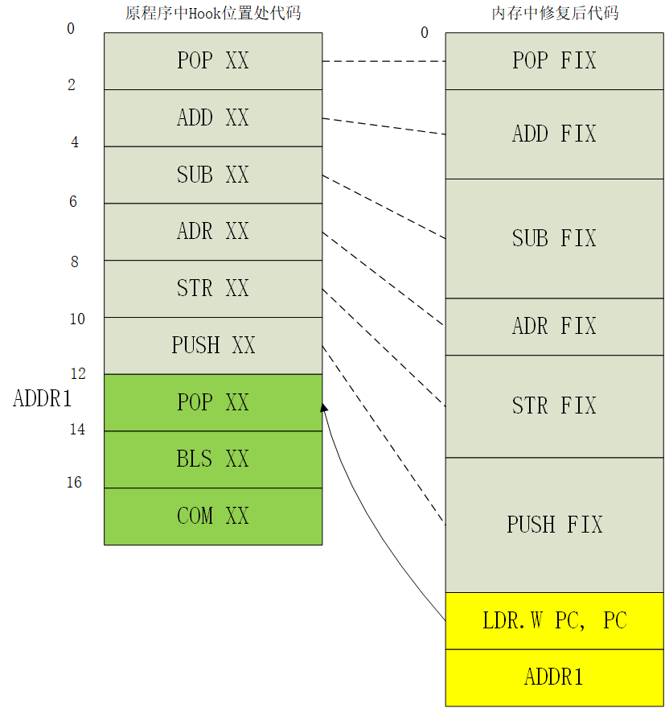
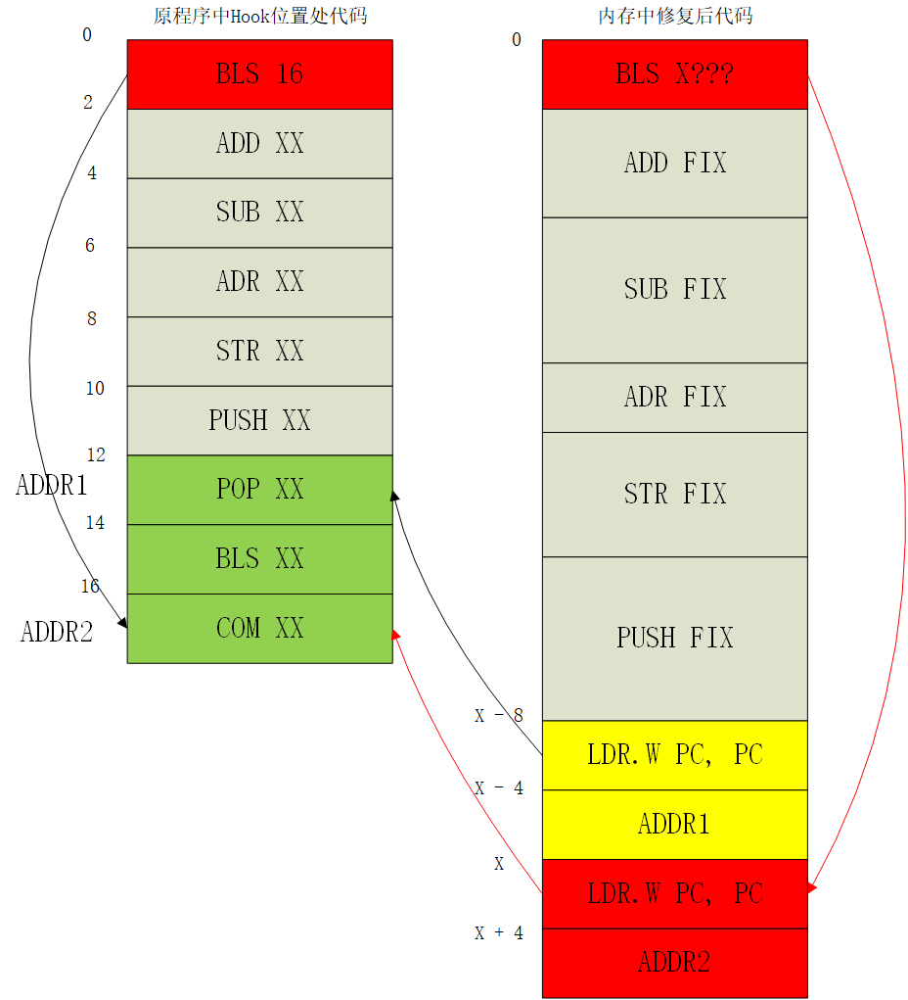
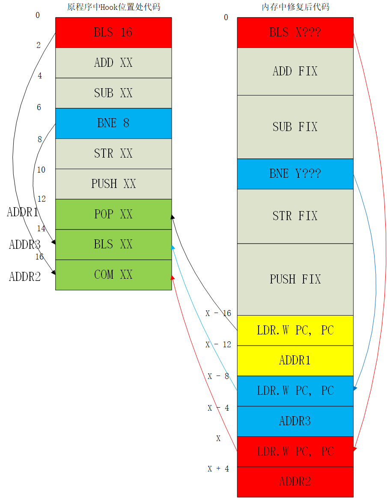
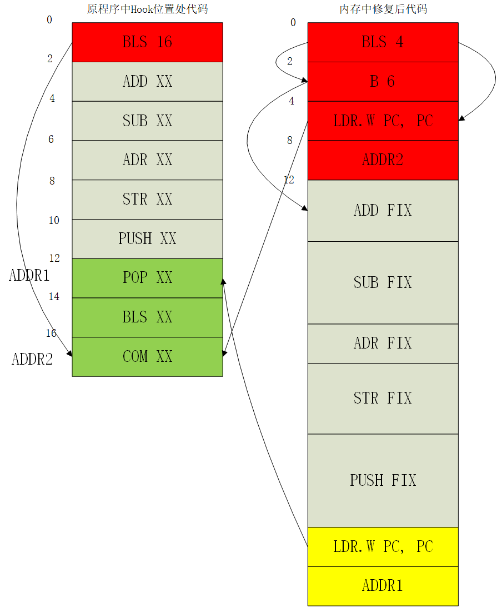
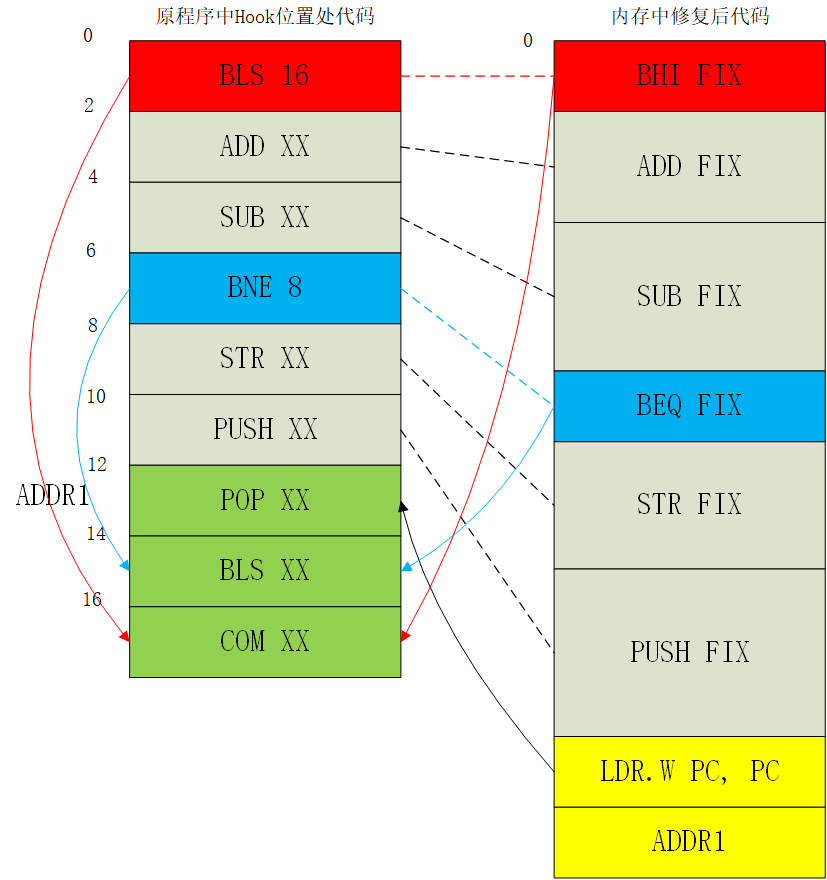

原文 by [gtoad blog](https://gtoad.github.io/2018/07/05/Android-Native-Hook/)    

## 前言
目前需要进行指令修复的ARM32指令主要可以分为如下几类：  

1. BLX_ARM, BL_ARM, B_ARM（不包含条件跳转）, BX_ARM
2. 条件跳转BEQ_ARM BNE_ARM BCS_ARM BCC_ARM BMI_ARM BPL_ARM BVS_ARM BVC_ARM BHI_ARM BLS_ARM BGE_ARM BLT_ARM BGT_ARM BLE_ARM
3. ADD_ARM
4. ADR_ARM, LDR_ARM, MOV_ARM
5. 其它指令 OTHER_ARM

Thumb16指令主要可以分为如下几类：  

1. B1_THUMB16（不包含条件跳转）, B2_THUMB16, BX_THUMB16
2. 条件跳转B1_BEQ_THUMB16, B1_BNE_THUMB16, B1_BCS_THUMB16, B1_BCC_THUMB16, B1_BMI_THUMB16, B1_BPL_THUMB16, B1_BVS_THUMB16, B1_BVC_THUMB16, B1_BHI_THUMB16, B1_BLS_THUMB16, B1_BGE_THUMB16, B1_BLT_THUMB16, B1_BGT_THUMB16, B1_BLE_THUMB16
3. ADD_THUMB16
M4. OV_THUMB16, ADR_THUMB16, LDR_THUMB16
5. 其它指令 OTHER_THUMB16

Thumb32指令主要可以分为如下几类：

1. B1_THUMB32（不包含条件跳转）, B2_THUMB32, BX_THUMB32, BLX_THUMB32, BL_THUMB32
2. 条件跳转B1_BEQ_THUMB32, B1_BNE_THUMB32, B1_BCS_THUMB32, B1_BCC_THUMB32, B1_BMI_THUMB32, B1_BPL_THUMB32, B1_BVS_THUMB32, B1_BVC_THUMB32, B1_BHI_THUMB32, B1_BLS_THUMB32, B1_BGE_THUMB32, B1_BLT_THUMB32, B1_BGT_THUMB32, B1_BLE_THUMB32
3. TBB_THUMB32, TBH_THUMB32
4. ADR1_THUMB32, ADR2_THUMB32, LDR_THUMB32
5. 其它指令 OTHER_THUMB32

下面我来一一分析它们具体的修复方案。其中条件跳转指令先单独拿出来作为一个部分进行讲解。  

## 条件跳转（以Thumb16为例）
在ARM32、Thumb16、Thumb32中都是有条件跳转的指令的，本项目三套都修复了。下面来讲一下Thumb16下条件跳转的修复，因为三套指令的修复思路都是一样的。  

条件跳转指令的修复相比于其它种类的指令有一个明显恶心的地方，看下面两张图可以很明显看出来，先看第一张：  
  


12 Bytes的备份代码与各自对应的修复代码自上而下一一对应，尾部再添加个跳转回原程序的LDR。这就是上文中设想的最标准的修复方式。然而当其中混入了一条条件跳转指令后：  
  


我们发现按照原程序的顺序和逻辑去修复条件跳转指令的话，会导致条件跳转指令对应的修复指令（图中红色部分）不是完整的一部分，而且第二部分需要出现在返回原程序跳转的后面才能保持原来的程序逻辑。这时有两个问题：  

1. 图中X的值如何确定？我们是从上到下一条条修复备份指令然后拼接的，也就是说这条BLS指令下方的指令在修复它的时候还没被修复。这样这个X的值就无法确定？  
2. Thumb-2模式在备份时，12 Bytes最大是可能备份6条Thumb16指令的。也就是说，可能在备份指令中出现多条条件跳转指令，这时候会出现跳转嵌套，如下图：  
  

为了解决第一个问题，本人先在Hook一开始的init函数中建立一个记录所有备份指令修复后长度的数组pstInlineHook->backUpFixLengthList，然后当修复条件跳转指令时，通过计算其后面修复指令的长度来得到X的值。这个方法一开始只是用来解决问题1的，当时还没想到问题2的情况。因为这个数组中看不出后面的指令是否存在其它条件跳转指令，所以最后的跳转嵌套时会出错。那第二个问题如何解决呢？本人开始意识到如果条件跳转指令要用这种”两段“式的修复方式的话，会使得之后的修复逻辑变得很复杂。但是按照原程序的执行逻辑顺序似乎又只能这么做…吗？不，第一次优化方案如下所示：  
    


这个方案通过连续的三个跳转命令来缩小这个BXX结构，使其按照原来的逻辑跳转到符合条件的跳转指令去，然后再跳转一次。至此其实已经解决了当前遇到的“两段”式麻烦。但是最后本人又想到了一个新的优化方案：逆向思维方案，可以简化跳转逻辑并在Arm32和Thumb32下减少一条跳转指令的空间（Thumb16下由于需要补NOP所以没有减小空间占用），如下图：  
   


图中可以看到，原来的BLS指令被转化为了BHI指令，也就是小于等于的跳转逻辑变成了大于。这样一来，原本跳转的目标逻辑现在就可以紧贴到BHI指令下面。从而使得条件跳转指令的修复代码也和其它指令一样，成为一个连续的代码段。并且BHI后面的参数在Thumb16中将固定为12。那么对于多条条件跳转指令来说呢？如下图：  
     


从图中可以看出来，又回到了最初从上到下一一对应，末尾跳转的形式。而之前新增的pstInlineHook->backUpFixLengthList数组依然保留了，因为当跳转的目标地址依然在备份代码范围内时需要用到它，下一部分中将会介绍。  

## 跳转目标在备份代码中
上文提到，如果我们备份代码中的跳转指令依然是跳到备份代码中呢？虽然我们的备份代码很短，但现实测试中的确遇到了这样的场景。出现了B 2的情况，可能是由于部分编译器把这个作为NOP指令吧。因此我们需要解决一下。  

1. 判断跳转的目标地址是否在备份代码范围内。
2. 如果不在的话，一切照旧；在的话那就计算跳转目标在备份代码中的偏移OFFSET1。
3. 利用Hook初始化时候统计的pstInlineHook->backUpFixLengthList数组和偏移OFFSET1来推算出在修复指令中的新偏移OFFSET2。
4. 导入修复指令在内存中的地址ADDR1，然后用ADDR1+OFFSET2即可得到新的跳转地址Value。
5. 根据Arm/Thumb模式来选择是否对Value+1。
6. 用新的Value代替原本计算得到的绝对跳转地址。

这个处理过程的一个关键点在于虽然我们还没有修复条件跳转指令之后的备份指令，但是它们修复后的长度是可以预测的，每种指令各自的修复指令长度是固定的。因此可以在在修复下方指令前预测出跳转偏移长度。  

### ARM32
#### BLX, BL, B, BX  

修复代码如下：  
``` c

	if (type == BLX_ARM || type == BL_ARM || type == B_ARM || type == BX_ARM) {
		uint32_t x;
		int top_bit;
		uint32_t imm32;
		uint32_t value;

		if (type == BLX_ARM || type == BL_ARM) {
			// ADD LR, PC, #4 
			trampoline_instructions[trampoline_pos++] = 0xE28FE004;	
		}
		// LDR PC, [PC, #-4] 
		trampoline_instructions[trampoline_pos++] = 0xE51FF004;  	
		if (type == BLX_ARM) {
			//BLX_ARM 
			x = ((instruction & 0xFFFFFF) << 2) | ((instruction & 0x1000000) >> 23); 
		}
		else if (type == BL_ARM || type == B_ARM) {
			//BL_ARM B_ARM 
			x = (instruction & 0xFFFFFF) << 2;                                       
		}
		else {
			//BX_ARM 			
			x = 0;                                                                   
		}
		
		top_bit = x >> 25;
		imm32 = top_bit ? (x | (0xFFFFFFFF << 26)) : x;
		if (type == BLX_ARM) {
			value = pc + imm32 + 1;
		}
		else {
			value = pc + imm32;
		}
		trampoline_instructions[trampoline_pos++] = value;
		
	}
```
1. 假设原程序实际要跳转到的地址为addr1。  
2. 由于BLX,BL指令会在跳转前将下一条指令地址保存到LR寄存器中，因此先用ADD LR, PC, #4把LR寄存器的值保存下来，这个值是本条指令地址+12 bytes处，即存储addr1数据的下一个地址。 
3. 用LDR PC, [PC, #-4]将PC指向原本要跳转过去的地址addr1。
4. 将addr1的具体值保存在接下来的4 bytes中。

这个addr1的具体值是计算出来的，由于B系列指令使用的是相对地址，因此，需要加上PC的值。     

代码中的x的值就是偏移值，它处于指令的后3 bytes，用instruction & 0xFFFFFF即可得到。当它为0时，代表当前PC所指向的地址（ARM32下为本条命令+8 bytes）。每当它增加或减少1，就代表地址增加或减少4 bytes，因此代码中使用<<2对x的值进行*4。  

所以这个x也可能是个负数，因此通过取top_bit来判断当前这个偏移的正负，用imm32代表综合考虑了x、正负、thumb标志的偏移值。  

BLX指令需要额外关心跳转后thumb-2模式下的地址，由于thumb模式下地址的最小单位是2 bytes，而不是ARM32下的4 bytes，因此需要通过instruction & 0x1000000获得指令第25 bit的标志位，如果标志位为1，地址就需要+2 bytes。  

最后，将pc加上imm32就是所需跳转的地址的绝对地址addr1。由于BLX需要切换thumb模式，因此我们用LDR PC, [PC, #-4]来跳转的时候需要addr1额外再+1来切换CPU模式。  

#### ADD
修复代码如下：  
``` c

    else if (type == ADD_ARM) {
		int rd;
		int rm;
		int r;
		
		rd = (instruction & 0xF000) >> 12;
		rm = instruction & 0xF;
		
		for (r = 12; ; --r) { //找一个既不是rm,也不是rd的寄存器 
			if (r != rd && r != rm) {
				break;
			}
		}
		
		trampoline_instructions[trampoline_pos++] = 0xE52D0004 | (r << 12);	// PUSH {Rr} 
		trampoline_instructions[trampoline_pos++] = 0xE59F0008 | (r << 12);	// LDR Rr, [PC, #8] 
		trampoline_instructions[trampoline_pos++] = (instruction & 0xFFF0FFFF) | (r << 16);
		trampoline_instructions[trampoline_pos++] = 0xE49D0004 | (r << 12);	// POP {Rr} 
		trampoline_instructions[trampoline_pos++] = 0xE28FF000;	// ADD PC, PC, #0 
		trampoline_instructions[trampoline_pos++] = pc;
	}
```
ADD指令可能会涉及到PC，PC就是R15寄存器，用到它的时候它会位于该指令的[16:19]bit上，所以要找个别的寄存器存着原来程序PC的值代替这里的R15即可。  

本指令会用到位于指令[12:15]和[0:3]bit上的两个寄存器rd和rm，这两个在修复过程中要避免改变。  

1. 从前12个寄存器中找一个既不是rd也不是rm的寄存器Rr就行，把它pop到栈上保存当前的值。  
2. 用LDR Rr, [PC, #8]把修复代码尾部保存的PC的值赋给Rr。
3. 用(instruction & 0xFFF0FFFF) | (r << 16);把Rr代替掉原来[16:19]bit上的PC，这样这条ADD执行后就是原本程序中的结果。
4. Rr的作用已经用完了，那就把它保存在栈上原来的值pop出来恢复它。
5. 用ADD PC, PC, #0来跳过下面尾部的pc数据，去继续执行pc值下方的代码。
6. 用4 bytes保存了原本程序中的pc值。

#### ADR, LDR, MOV
修复代码如下：  
``` c
    else if (type == ADR1_ARM || type == ADR2_ARM || type == LDR_ARM || type == MOV_ARM) {
		int r;
		uint32_t value;
		
		r = (instruction & 0xF000) >> 12;
		
		if (type == ADR1_ARM || type == ADR2_ARM || type == LDR_ARM) {
			uint32_t imm32;
			
			imm32 = instruction & 0xFFF;
			if (type == ADR1_ARM) {
				value = pc + imm32;
			}
			else if (type == ADR2_ARM) {
				value = pc - imm32;
			}
			else if (type == LDR_ARM) {
				int is_add;
				
				is_add = (instruction & 0x800000) >> 23;
				if (is_add) {
					value = ((uint32_t *) (pc + imm32))[0];
				}
				else {
					value = ((uint32_t *) (pc - imm32))[0];
				}
			}
		}
		else {
			value = pc;
		}
			
		trampoline_instructions[trampoline_pos++] = 0xE51F0000 | (r << 12);	// LDR Rr, [PC] 
		trampoline_instructions[trampoline_pos++] = 0xE28FF000;	// ADD PC, PC 
		trampoline_instructions[trampoline_pos++] = value;
	}
```
1. 用(instruction & 0xF000) >> 12来获取命令中需要用到的寄存器Rr。
2. 由于这三个指令用的也是相对地址，所以用imm32获取指令[11:0]bit的值后，直接和pc进行加减。由于ADD和LDR涉及偏移的正负性，所以额外寻找各自的标志位来确认是用原pc值加还是减。
3. 用LDR Rr, [PC]将上一步计算得到的value的值赋给Rr。
4. 用ADD PC, PC, #0命令来跳过下方存储的value数据，从value后面的指令开始继续执行。

#### 其它指令
ARM32下的其它指令无需修复，直接在备份代码中使用即可。  

### Thumb16
#### B, BX
核心修复代码如下：  
``` c
	trampoline_instructions[idx++] = 0xF8DF;
	trampoline_instructions[idx++] = 0xF000;	// LDR.W PC, [PC] 
	trampoline_instructions[idx++] = value & 0xFFFF;
	trampoline_instructions[idx++] = value >> 16;
```
1. 计算出要跳转的绝对地址Value
2. 用LDR.W这个Thumb32指令加载后面的Value跳转过去

#### ADD
核心修复代码如下：  
``` c
	rdn = ((instruction & 0x80) >> 4) | (instruction & 0x7);
	
	for (r = 7; ; --r) {
		if (r != rdn) {
			break;
		}
	}
	
	trampoline_instructions[0] = 0xB400 | (1 << r);	// PUSH {Rr} 
	trampoline_instructions[1] = 0x4802 | (r << 8);	// LDR Rr, [PC, #8] 
	trampoline_instructions[2] = (instruction & 0xFF87) | (r << 3); //我猜是adr Rd, Rr 
	trampoline_instructions[3] = 0xBC00 | (1 << r);	// POP {Rr} 
	trampoline_instructions[4] = 0xE002;	// B PC 
	trampoline_instructions[5] = 0xBF00;
	trampoline_instructions[6] = pc & 0xFFFF;  //计算得到的Value实际值 
	trampoline_instructions[7] = pc >> 16;
``` 
1. ADD_THUMB16命令会用到R0-R7中的某个寄存器Rn作为保存结果的寄存器，于是这个寄存器我们修复时不去影响它，从R0-R7中选择另一个Rr。先用PUSH将Rr原本的值存入栈中。
2. 把计算出来的与原PC相关的Value值存入Rr寄存器。
3. 把Rr代替原来指令ADD Rd, X中的X，从而加给目标寄存器Rd。
4. POP出Rr原本的值
5. 用B命令进行跳转，从而跨越下方Value的值继续执行。

#### MOV, ADR, LDR
核心修复代码如下：  
``` c
	trampoline_instructions[0] = 0x4800 | (r << 8);	// LDR Rd, [PC] 
	trampoline_instructions[1] = 0xE001;	// B PC, #2 
	trampoline_instructions[2] = value & 0xFFFF;
	trampoline_instructions[3] = value >> 16;
```
这三条都是把PC相关的值存入一个寄存器中。因此步骤很明确：  

1. 用LDR命令把下方隔着2 Bytes的存着实际原本PC相关的值Value存入目标寄存器Rd中即可。
2. 用B命令跳6 Bytes到Value下方继续执行接下去的命令。

#### CBZ, CBNZ
核心修复代码如下：  
``` c
	trampoline_instructions[0] = instruction & 0xFD07;
	trampoline_instructions[1] = 0xE003;	// B PC, #6 
	trampoline_instructions[2] = 0xF8DF;
	trampoline_instructions[3] = 0xF000;	// LDR.W PC, [PC] 
	trampoline_instructions[4] = value & 0xFFFF;
	trampoline_instructions[5] = value >> 16;
```
1. 将原本CBZ/CBNZ的参数清空，清空后参数为4（即PC+4）。例如：CBNZ R0, 10变成CBNZ R0, 4,满足条件时会向下跳4 Bytes；不满足条件时会继续执行下一条指令。  
2. 如果不满足CB的条件，则继续执行B PC, #6命令，跨过下面8 Bytes，去执行第10 Byte的指令，即下一条备份指令的修复指令中去。
3. 如果满足条件，会去执行LDR.W PC, [PC]指令，从而根据计算出的Value跳转到原本CB需要跳转去的地方。

#### 其它指令
Thumb模式下，需要把其它备份的Thumb16指令下方补一个NOP！为什么？因为上文中我们修复的Thumb指令中都是用Thumb32指令LDR.W PC XXX进行跳转的。而Thumb32下涉及修改PC的指令一定要位于可以整除4的地址上。因此，我们需要保证每个Thumb指令都被修复成可以整除4的大小，这样以后修复时只要保证当前LDR.W要在当前正在修复的指令中的偏移可以整除4就行了。  

### Thumb32
#### B, BX, BLX, BL
修复代码如下：  
``` c
	else if (type == BLX_THUMB32 || type == BL_THUMB32 || type == B1_THUMB32 || type == B2_THUMB32) {

		j1 = (low_instruction & 0x2000) >> 13;
		j2 = (low_instruction & 0x800) >> 11;
		s = (high_instruction & 0x400) >> 10;
		i1 = !(j1 ^ s);
		i2 = !(j2 ^ s);

		if (type == BLX_THUMB32 || type == BL_THUMB32) {
            LOGI("BLX_THUMB32 BL_THUMB32");
			trampoline_instructions[idx++] = 0xF20F;
			trampoline_instructions[idx++] = 0x0E09;	// ADD.W LR, PC, #9 
		}
		else if (type == B1_THUMB32) {
            LOGI("B1_THUMB32");
			trampoline_instructions[idx++] = 0xD000 | ((high_instruction & 0x3C0) << 2);
			trampoline_instructions[idx++] = 0xE003;	// B PC, #6 
		}
		trampoline_instructions[idx++] = 0xF8DF;
		trampoline_instructions[idx++] = 0xF000;	// LDR.W PC, [PC] 
		if (type == BLX_THUMB32) {
            LOGI("BLX_THUMB32");
			x = (s << 24) | (i1 << 23) | (i2 << 22) | ((high_instruction & 0x3FF) << 12) | ((low_instruction & 0x7FE) << 1);
			imm32 = s ? (x | (0xFFFFFFFF << 25)) : x;
			value = pc + imm32;
            LOGI("blx_thumb32 : value : %x",value);
		}
		else if (type == BL_THUMB32) {
            LOGI("BL_THUMB32");
			x = (s << 24) | (i1 << 23) | (i2 << 22) | ((high_instruction & 0x3FF) << 12) | ((low_instruction & 0x7FF) << 1);
			imm32 = s ? (x | (0xFFFFFFFF << 25)) : x;
			value = pc + imm32 + 1;
		}
		else if (type == B1_THUMB32) {
            LOGI("B1_THUMB32");
			x = (s << 20) | (j2 << 19) | (j1 << 18) | ((high_instruction & 0x3F) << 12) | ((low_instruction & 0x7FF) << 1);
			imm32 = s ? (x | (0xFFFFFFFF << 21)) : x;
			value = pc + imm32 + 1;
		}
		else if (type == B2_THUMB32) {
            LOGI("B2_THUMB32");
			x = (s << 24) | (i1 << 23) | (i2 << 22) | ((high_instruction & 0x3FF) << 12) | ((low_instruction & 0x7FF) << 1);
			imm32 = s ? (x | (0xFFFFFFFF << 25)) : x;
			value = pc + imm32 + 1;
		}
		trampoline_instructions[idx++] = value & 0xFFFF;
		trampoline_instructions[idx++] = value >> 16;
		offset = idx;
	}
```
这段代码比较长哈，我整理了一下(每行代表2 Bytes)：  
```
ADD.W LR, PC, #9（仅BL,BLX）.1
ADD.W LR, PC, #9（仅BL,BLX）.2 或 B PC, #2（仅B1）
LDR.W PC, [PC].1
LDR.W PC, [PC].2
Value.1
Value.2
```
1. 由于这一类指令都是跳转指令，因此，当然会出现最后四行本项目中大家已经非常熟悉的套路：用LDR.W来加载绝对地址数据进行跳转。我们的插桩也都是这么做的。
2. 如果是BL,BLX指令的话，它俩是要保存返回地址的。于是就用ADD.W对LR寄存器进行操控。那么存进LR的返回地址是什么呢？是PC+9。也就是当前这条ADD.W指令所在地址+4（三级流水的PC领先当前thumb指令4 Bytes）然后+8（下方Value后的距离）的位置。而由于这里是Thumb模式，因此跳转目标执行完毕后需要对地址+1才能以Thumb模式跳转回来。因此是PC+9。
3. 如果是B1的话，那就直接用B加载6个偏移之后，也就是PC+2的Value即可。
4. 最后的Value是它们各自通过相对地址计算出的实际地址，部分为了Thumb模式还最后+1。感兴趣的朋友可以自己细看一下每条指令Value值的具体计算细节。

#### TBB, TBH
修复代码如下：  
``` c
	trampoline_instructions[0] = 0xB400 | (1 << rx);	// PUSH {Rx} 
	trampoline_instructions[1] = 0x4805 | (r << 8);	// LDR Rr, [PC, #20] 
	trampoline_instructions[2] = 0x4600 | (rm << 3) | rx;	// MOV Rx, Rm 
	if (type == TBB_THUMB32) {
        LOGI("TBB_THUMB32");
		trampoline_instructions[3] = 0xEB00 | r;
		trampoline_instructions[4] = 0x0000 | (rx << 8) | rx;	// ADD.W Rx, Rr, Rx 
		trampoline_instructions[5] = 0x7800 | (rx << 3) | rx; 	// LDRB Rx, [Rx] 
	}
	else if (type == TBH_THUMB32) {
         LOGI("TBH_THUMB32");
		trampoline_instructions[3] = 0xEB00 | r;
		trampoline_instructions[4] = 0x0040 | (rx << 8) | rx;	// ADD.W Rx, Rr, Rx, LSL #1 
		trampoline_instructions[5] = 0x8800 | (rx << 3) | rx; 	// LDRH Rx, [Rx] 
	}
	trampoline_instructions[6] = 0xEB00 | r;
	trampoline_instructions[7] = 0x0040 | (r << 8) | rx;	// ADD Rr, Rr, Rx, LSL #1 
	trampoline_instructions[8] = 0x3001 | (r << 8);	// ADD Rr, #1 
	trampoline_instructions[9] = 0xBC00 | (1 << rx);	// POP {Rx} 
	trampoline_instructions[10] = 0x4700 | (r << 3);	// BX Rr 
	trampoline_instructions[11] = 0xBF00;
	trampoline_instructions[12] = pc & 0xFFFF;
	trampoline_instructions[13] = pc >> 16;
```
这两条指令是查表跳转指令，类似于switch逻辑。  

1. R0-R7中取一个Rx寄存器，它不能是原本命令中已经用到的Rm,Rr寄存器，把它的值PUSH到栈上保存起来。
2. TBB下，表中偏移计算为：offset=Rm+[原本的PC+4];TBH下则为：offset=2*Rm+[原本的PC+4]。
3. 根据计算出的偏移和原本的PC去取值放入Rr中。
4. 把Rx的值从栈中POP出来。
5. 由于是Thumb模式，于是对Rr+1后再用BX进行跳转。

#### ADR, LDR
核心修复代码如下：  
``` c
	trampoline_instructions[0] = 0x4800 | (r << 8);	// LDR Rd, [PC] 
	trampoline_instructions[1] = 0xE001;	// B PC, #2 
	trampoline_instructions[2] = value & 0xFFFF;
	trampoline_instructions[3] = value >> 16;
```
这三条都是把PC相关的值存入一个寄存器中。因此步骤很明确：  

1. 用LDR命令把下方隔着2 Bytes的存着实际原本PC相关的值Value存入目标寄存器Rd中即可。
2. 用B命令跳6 Bytes到Value下方继续执行接下去的命令。

#### 其它指令
Thumb32下的其它指令无需修复，直接在备份代码中使用即可。  

## 局限性思考
本项目虽然尽可能多地考虑了各种指令与情况的修复方案，但是依然如下情况下可能对使用者造成问题。但是本人认为这些问题都是可以通过正确的使用方法来规避的。因此这部分可能更像是个使用指导。以下内容可能比较钻牛角尖，考虑的都是一些脑补的极端情况：  

1. 备份之外的程序其它指令需要跳转到备份指令范围内
2. Hook在函数最最最末尾

### 局限分析1
这个情况理论上存在但非常少见且可以避免。因为备份指令的范围其实非常小，Arm下只有2条指令8 Bytes的大小，Thumb-2下也只有10/12 Bytes，对于有成千上万条指令的原程序来说概率非常小！并且这些备份的空间不是都会出问题。  

**概率小**   

对于Arm来说：第一个4 Bytes上覆盖的是LDR跳转指令，第二个4 Bytes是地址，因此跳转到第一个LDR指令上是完全没有问题的，就按照Hook流程运行而已，只有正好跳转到第二个地址处才会出现将数据误以为是指令的错误。  

对于Thumb-2来说：跳转到Hook地址开头可能的Nop或LDR指令也是完全没有问题的，并且12/10Bytes下跳转到最后的4/2 Bytes中也是没有问题的，因为那里并没有被覆盖指令。依然仅仅是直接跳转到那个4 Bytes的地址才出问题。当然Thumb-2模式下可能出现最后的2 Bytes是被截断的Thumb32位的后16位的可能性（它的前16位被跳转地址的后16位覆盖了）。  

**可以避免**  

在使用Hook工具前肯定是会逆向分析的。要避免这种情况最简单的方法就是不要让自己的备份代码“跨代码块”。什么意思？看下图即可理解：  

（贴一张有loc小标签的图，别太密集，有一个就行，否则读者会觉得这样的情景很多）  

上图中是我们使用IDA等逆向分析工具时的界面，可以看到其中有一个个小标签，这些小标签就是可能被跳转的目标。因此当我们的备份范围没有跨越两个或多个小标签的时候就不会出现其它指令跳转到我们插桩代码中间的跳转地址处的情况了。  

**使用指导1**
不要“跨代码块”进行Hook。 

### 局限分析2
这个情况与其说是局限，倒更应当是个使用指导上的说明：有使用者可能会去用本工具Hook某函数的末尾从而希望获取返回值。于是将目标地址对准了那个函数最后的指令上。我个人不建议这么做，而是建议Hook在它的上层调用函数中，也就是调用这个函数后的语句上来获取寄存器R0中的返回值。  

如果真的遇到了不得不Hook在函数末尾附近的情况，那这个工具也是完全可以Hook到的：  

**对于Arm32来说**：Arm32的函数结尾一般是几条与逻辑无关的恢复寄存器状态的代码，它们在返回值R0计算出来之后执行，因此Hook它们后即可读取返回值R0的内容。如果很不幸，遇到了极为少见的情况：备份的两条里第一条和R0有关，第二条直接跳转返回了，没有恢复寄存器之类的指令，那也就一条和返回值有关的汇编指令而已，输出这条的寄存器状态，然后脑算这条汇编都知道之后的效果。  

**对于Thumb-2来说**：同理，可以Hook在函数末尾跳转前的几条指令上就能得到已经计算好的返回值了。极端情况下也只需根据几条指令前的寄存器状态推算一下之后的状态。  

**使用指导2**
想得到函数的返回值应该去调用它的函数里Hook，而不是在目标函数末尾。实在有特殊情况的话本工具的Hook信息依然可以很轻松推算出返回值。

## Reference
http://ele7enxxh.com/Android-Arm-Inline-Hook.html  
  