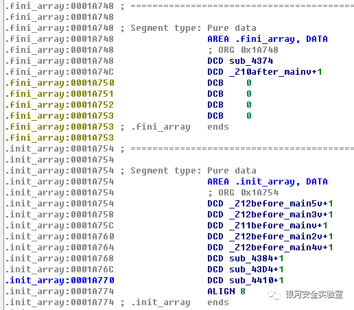
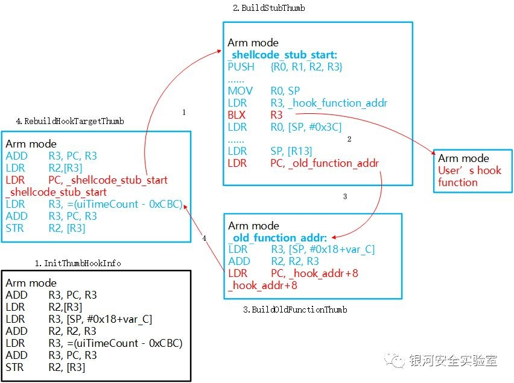
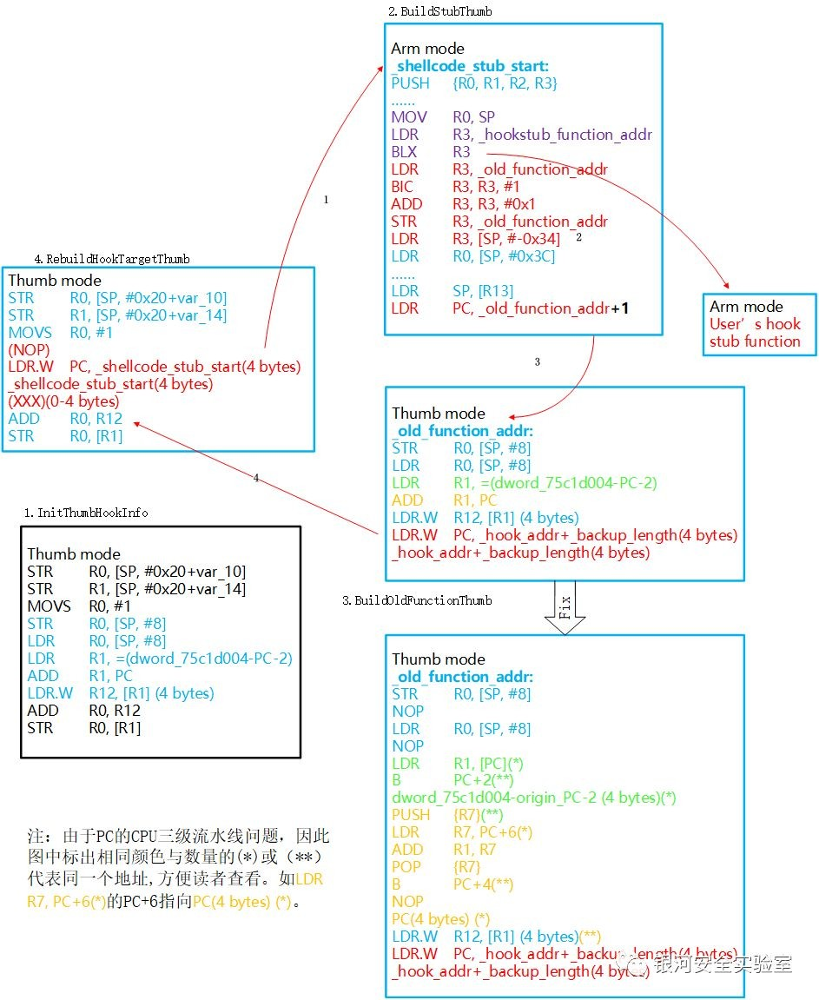
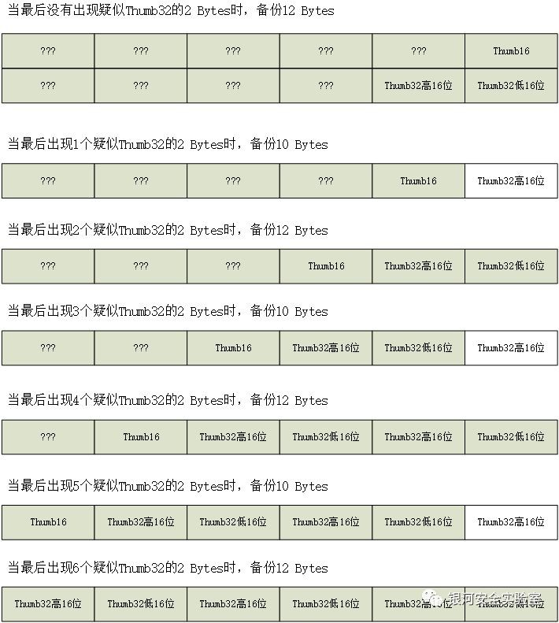
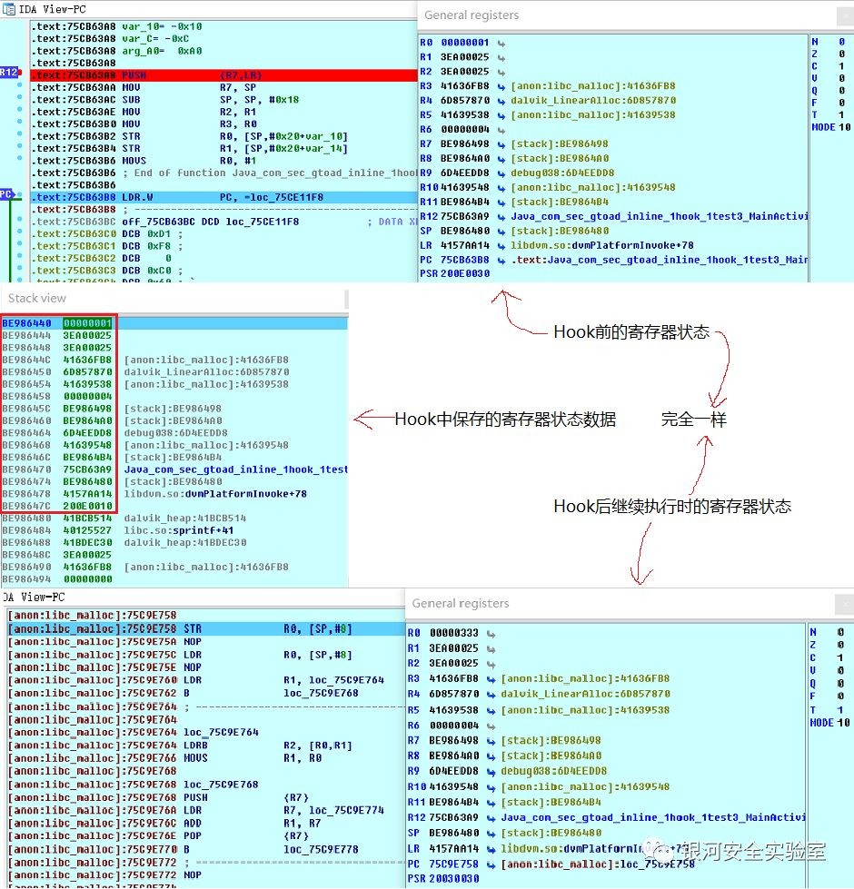
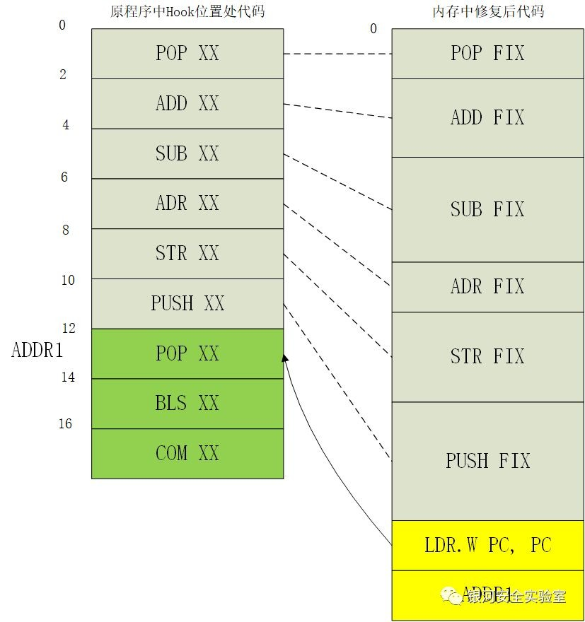
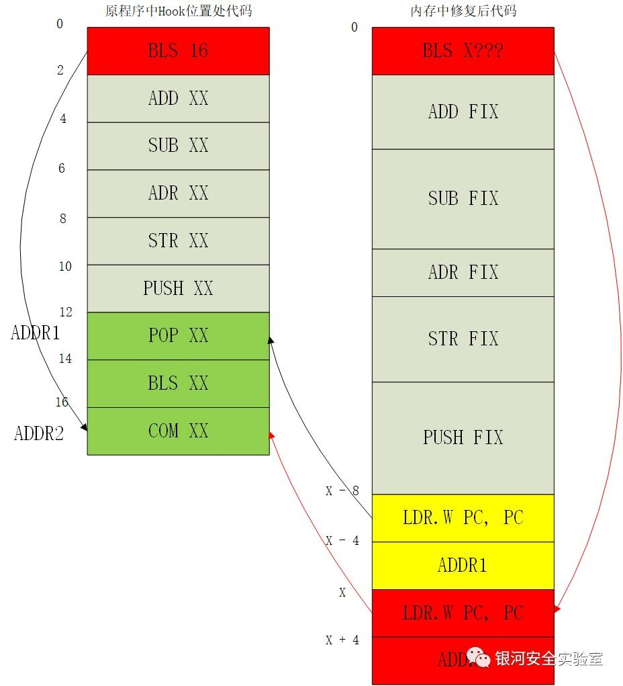
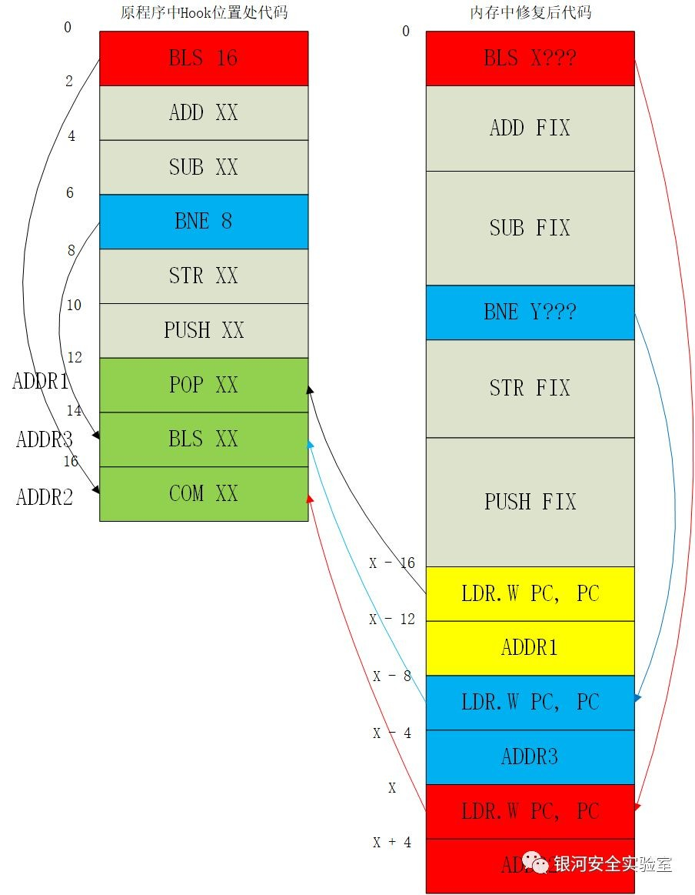
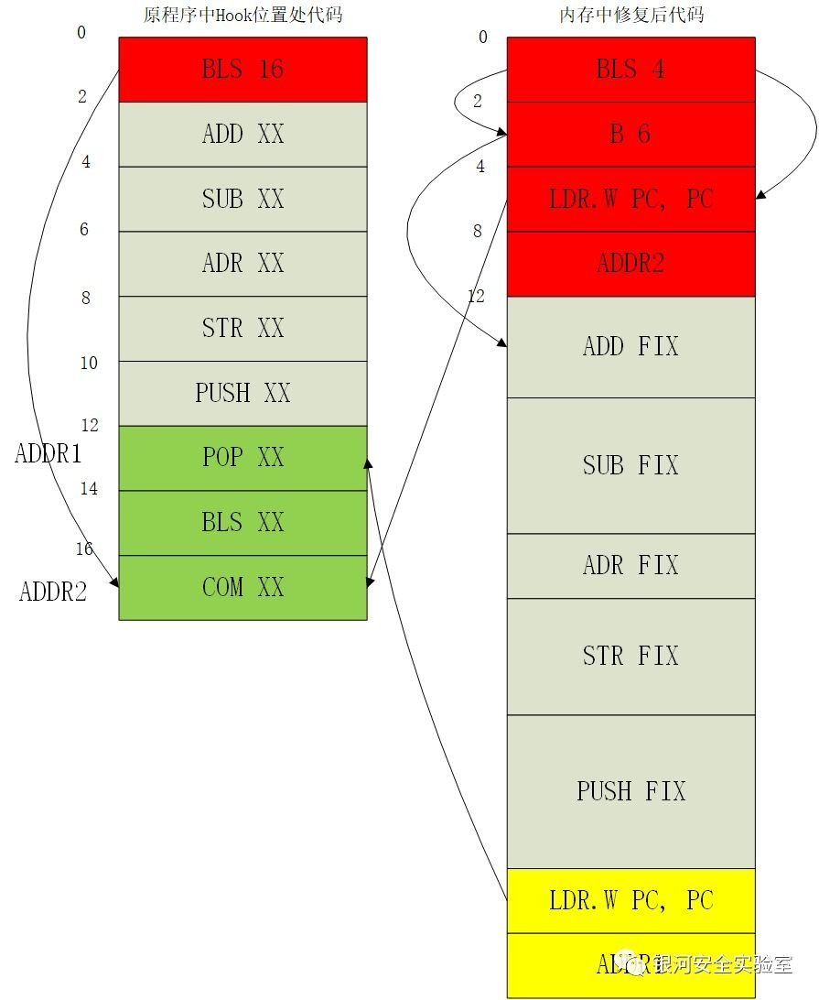
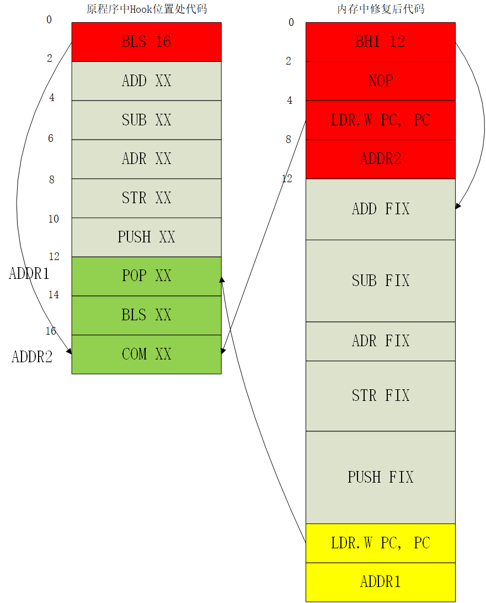

原文 by [GToad Blog](https://mp.weixin.qq.com/s/iAEN9dDvdWwxc7-aYgmMVQ)    

## 前言

在目前的安卓APP测试中对于Native Hook的需求越来越大，越来越多的APP开始逐渐使用NDK来开发核心或者敏感代码逻辑。个人认为原因如下：  

1. 安全的考虑。各大APP越来越注重安全性，NDK所编译出来的so库逆向难度明显高于java代码产生的dex文件。越是敏感的加密算法与数据就越是需要用NDK进行开发。  

2. 性能的追求。NDK对于一些高性能的功能需求是java层无法比拟的。  

3. 手游的兴起。虚幻4，Unity等引擎开发的手游中都有大量包含游戏逻辑的so库。  

因此，本人调查了一下Android Native Hook工具目前的现状。尽管Java层的Hook工具多种多样，但是Native Hook的工具却非常少并且在安卓5.0以上的适配工具更是寥寥无几。（文末说明1）而目前Native Hook主要有两大技术路线：  

1. PLT Hook

2. Inline Hook

这两种技术路线本人都实践了一下，关于它们的对比，我在《Android Native Hook技术路线概述》中有介绍，所以这里就不多说了。最终，我用了Inline Hook来做这个项目。  

本文篇幅已经较长，因此写了一些独立的学习笔记来对其中的细节问题进行解释：  

《Android Native Hook技术路线概述》  

《Android Inline Hook中的指令修复》  

[项目仓库）](https://github.com/GToad/Android_Inline_Hook)    

## 目标效果

根据本人自身的使用需求提出了如下几点目标：  

1. 工具运行原理中不能涉及调试目标APP，否则本工具在遇到反调试措施的APP时会失效。尽管可以先去逆向调试patch掉反调试功能，但是对于大多数情况下只是想看看参数和返回值的Hook需求而言，这样的前期处理实在过于麻烦。

2. 依靠现有的各大Java Hook工具就能运行本工具，换句话说就是最好能用类似这些工具的插件的形式加载起本工具从而获得Native Hook的能力。由于Java Hook工具如Xposed、YAHFA等对于各个版本的Android都做了不错的适配，因此利用这些已有的工具即可向目标APP的Native层中注入我们的Hook功能将会方便很多小伙伴的使用。

3. 既然要能够让各种Java Hook工具都能用本工具得到Native Hook的能力，那就这个工具就要有被加载起来以后自动执行自身功能逻辑的能力！而不是针对各个Java Hook工具找调用起来的方式。

4. 要适配Android NDK下的armv7和thumb-2指令集。由于现在默认编译为thumb-2模式，所以对于thumb16和thumb32的Native Hook支持是重中之重。

5. 修复Inline Hook后的原本指令。  

6. Hook目标的最小单位至少是函数，最好可以是某行汇编代码。  

## 最终方案

最后完成项目的方案是：本工具是一个so库。用Java Hook工具在APP的入口Activity运行一开始的onCreate方法处Hook，然后加载本so。 加载后，自动开始执行Hook逻辑。 为了方便叙述，接下来的Java Hook工具我就使用目前这类工具里最流行的Xposed，本项目的生成文件名为libautohook.so。  

### 自动执行

我们只是用Xposed加载了这个libautohook.so，那其中的函数该怎么自动执行呢？ 目前想到两个方法：  

1. 利用JniOnload来自动执行。该函数是NDK中用户可以选择性自定义实现的函数。如果用户不实现，则系统默认使用NDK的版本为1.1。但是如果用户有定义这个函数，那Android VM就会在System.loadLibrary()加载so库时自动先执行这个函数来获得其返回的版本号。尽管该函数最终要返回的是NDK的版本号，但是其函数可以加入任意其它逻辑的代码，从而实现加载so时的自动执行。这样就能优先于所有其它被APP NDK调用的功能函数被调用，从而进行Hook。目前许多APP加固工具和APP初始化工作都会用此方法。   

2. 本文采用的是第二种方法。该方法网络资料中使用较少。它是利用了 `__attribute__((constructor))` 属性。使用这个constructor属性编译的普通ELF文件被加载入内存后，最先执行的不是main函数，而是具有该属性的函数。同样，本项目中利用此属性编译出来的so文件被加载后，尽管so里没有main函数，但是依然能优先执行，且其执行甚至在JniOnload之前。于是逆向分析了一下编译出来的so库文件。发现具有constructor属性的函数会被登记在.init_array中。（相对应的destructor属性会在ELF卸载时被自动调用，这些函数会被登记入.fini_array）  
  

值得一提的是，constructor属性的函数是可以有多个的，对其执行顺序有要求的同学可以通过在代码中对这些函数声明进行排序从而改变其在.init_array中的顺序，二者是按顺序对应的。而执行时，会从.init_array中自上而下地执行这些函数。所以图中的自动优先执行顺序为：main5->main3->main1->main2->main4。并且后面会说到，从+1可以看出这些函数是thumb模式编译的。     

## 方案设计

先说一下使用的工具：    

1. 使用keystone查找指定架构下汇编指令的机器码

2. 使用MS VISIO制作了下面的设计图

3. 调试工具用的是IDA pro

### Arm32方案

现在我们的代码可以在一开始就执行了，那该如何设计这套Inline Hook方案呢？目标是thumb-2和arm指令集下是两套相似的方案。我参考了腾讯游戏安全实验室的一篇教程，其中给出了一个初步的armv7指令集下的Native Hook方案，整理后如下图  

  

Arm 第1步

根据/proc/self/map中目标so库的内存加载地址与目标Hook地址的偏移计算出实际需要Hook的内存地址。将目标地址处的2条ARM32汇编代码（8 Bytes）进行备份，然后用一条LDR PC指令和一个地址（共计8 Bytes）替换它们。这样就能（以arm模式）将PC指向图中第二部分stub代码所在的位置。由于使用的是LDR而不是BLX，所以lr寄存器不受影响。关键代码如下：//LDR PC, [PC, #-4]对应的机器码为：0xE51FF004 BYTE szLdrPCOpcodes[8] = {0x04, 0xF0, 0x1F, 0xE5};//将目的地址拷贝到跳转指令下方的4 Bytes中 memcpy(szLdrPCOpcodes + 4, &pJumpAddress, 4);  

Arm 第2步

构造stub代码。构造思路是先保存当前全部的寄存器状态到栈中。然后用BLX命令（以arm模式）跳转去执行用户自定义的Hook后的函数。执行完成后，从栈恢复所有的寄存器状态。最后（以arm模式）跳转至第三部分备份代码处。关键代码如下：  
``` asm
_shellcode_start_s:
    push    {r0, r1, r2, r3}
    mrs     r0, cpsr
    str     r0, [sp, #0xC]
    str     r14, [sp, #8]   
    add     r14, sp, #0x10
    str     r14, [sp, #4]    
    pop     {r0}               
    push    {r0-r12}           
    mov     r0, sp
    ldr     r3, _hookstub_function_addr_s
    blx     r3
    ldr     r0, [sp, #0x3C]
    msr     cpsr, r0
    ldmfd   sp!, {r0-r12}       
    ldr     r14, [sp, #4]
    ldr     sp, [r13]
    ldr     pc, _old_function_addr_s
```
Arm 第3步  

构造备份代码。构造思路是先执行之前备份的2条arm32代码（共计8 Btyes），然后用LDR指令跳转回Hook地址+8bytes的地址处继续执行。此处先不考虑PC修复，下文会说明。构造出来的汇编代码如下：  
```
备份代码1
备份代码2
LDR PC, [PC, #-4]
HOOK_ADDR+8
```

### Thumb-2方案

以上是本工具在arm指令集上的Native Hook基本方案。那么在thumb-2指令集上该怎么办呢？我决定使用多模式切换来实现(文末解释2)，  

整理后如下图：  

  

虽然这部分内容与arm32很相似，但由于细节坑较多，所以我认为下文重新梳理详细思路是必要的。  

Thumb-2 第1步  

第一步，根据/proc/self/map中目标so库的内存加载地址与目标Hook地址的偏移计算出实际需要Hook的内存地址。将目标地址处的X Bytes的thumb汇编代码进行备份。然后用一条LDR.W PC指令和一个地址（共计8 Bytes）替换它们。这样就能（以arm模式）将PC指向图中第二部分stub代码所在的位置。由于使用的是LDR.W而不是BLX，所以lr寄存器不受影响。  

细节1：为什么说是X Bytes？参考了网上不少的资料，发现大部分代码中都简单地将arm模式设置为8 bytes的备份，thumb模式12 bytes的备份。对arm32来说很合理，因为2条arm32指令足矣，上文处理arm32时也是这么做的。而thumb-2模式则不一样，thumb-2模式是thumb16（2 bytes）与thumb32（4 bytes）指令混合使用。本人在实际测试中出现过2+2+2+2+2+4>12的情形，这种情况下，最后一条thumb32指令会被截断，从而在备份代码中执行了一条只有前半段的thumb32，而在4->1的返回后还要执行一个只有后半段的thumb32。  
因此，本项目最初在第一步备份代码前会检查最后第11和12byte是不是前半条thumb32，如果不是，则备份12 byte。如果是的话，就备份10 byte。但是后来发现也不行，因为Thumb32指令的低16位可能会被误判为新Thumb32指令的开头。因此，最终通过统计末尾连续“疑似”Thumb32高16位的数量，当数量为单数则备份10 bytes，数量为偶数则备份12 bytes。这么做的原因如下：如果这个16位符合Thumb32指令的高16位格式，那它肯定不是Thumb16，只可能是Thumb32的高16位或低16位。因为Thumb16是不会和Thumb32有歧义的。那么，当它前面的16位也是类似的“疑似”Thumb32的话，可能是它俩共同组成了一个Thumb32，也可能是它们一个是结尾一个是开头。所以，如果结尾出现1条疑似Thumb32，则说明这是一条截断的，出现2条疑似Thumb32，说明它俩是一整条，出现3条，说明前2条是一条thumb32，最后一条是被截断的前部分，依此类推。用下面这张图可能更容易理解，总之：疑似Thumb32的2 Bytes可能是Thumb32高16位或Thumb32低16位，但不可能是Thumb16:  

    
细节2：为什么Plan B是10 byte？我们需要插入的跳转是8 byte，但是thumb32中如果指令涉及修改PC的话，那么这条指令所在的地址一定要能整除4，否则程序会崩溃。我们的指令地址肯定都是能被2整除的，但是能被4整除是真的说不准。因此，当出现地址不能被4整除时，我们需要先补一个thumb16的NOP指令（2 bytes）。这样一来就需要2+8=10 Bytes了。尽管这时候选择14 Bytes也差不多，我也没有内存空间节省强迫症，但是选择这10 Bytes主要还是为了提醒一下大家这边补NOP的细节问题。 关键代码如下：  
``` c
bool InitThumbHookInfo(INLINE_HOOK_INFO* pstInlineHook){
    ......

    uint16_t *p11;

    for (int k=5;k>=0;k--){
        p11 = pstInlineHook->pHookAddr-1+k*2;
        LOGI("P11 : %x",*p11);
        if(isThumb32(*p11)){
            is_thumb32_count += 1;
        }else{
            break;
        }
    }

    //如果是的话就需要备份14byte或者10byte才能使得汇编指令不被截断。由于跳转指令在补nop的情况下也只需要10byte， 
    //所以就取pstInlineHook->backUpLength为10 
    if(is_thumb32_count%2==1)
    {
        LOGI("The last ins is thumb32. Length will be 10.");
        pstInlineHook->backUpLength = 10;
    }
    else{
        LOGI("The last ins is not thumb32. Length will be 12.");
        pstInlineHook->backUpLength = 12;
    }

    //修正：否则szbyBackupOpcodes会向后偏差1 byte 
    memcpy(pstInlineHook->szbyBackupOpcodes, pstInlineHook->pHookAddr-1, pstInlineHook->backUpLength); 
    
    ......}bool BuildThumbJumpCode(void *pCurAddress , void *pJumpAddress){
    ......

        //LDR PC, [PC, #0]对应的thumb机器码为：0xf000f8df, NOP为BF00 
        if (CLEAR_BIT0((uint32_t)pCurAddress) % 4 != 0) {
            BYTE szLdrPCOpcodes[12] = {0x00, 0xBF, 0xdF, 0xF8, 0x00, 0xF0};
            memcpy(szLdrPCOpcodes + 6, &pJumpAddress, 4);
            memcpy(pCurAddress, szLdrPCOpcodes, 10);
            cacheflush(*((uint32_t*)pCurAddress), 10, 0);
        }
        else{
            BYTE szLdrPCOpcodes[8] = {0xdF, 0xF8, 0x00, 0xF0};
            //将目的地址拷贝到跳转指令缓存位置 
            memcpy(szLdrPCOpcodes + 4, &pJumpAddress, 4);
            memcpy(pCurAddress, szLdrPCOpcodes, 8);
            cacheflush(*((uint32_t*)pCurAddress), 8, 0);
        }

    ......}
```
Thumb-2 第2步  

构造stub代码。构造思路是先保存当前全部的寄存器状态到栈中。然后用BLX命令（以arm模式）跳转去执行用户自定义的Hook后的函数。执行完成后，从栈恢复所有的寄存器状态。最后（以thumb模式）跳转至第三部分备份代码处。  

细节1：为什么跳转到第三部分要用thumb模式？因为第三部分中是含有备份的thumb代码的，而同一个顺序执行且没有内部跳转的代码段是无法改变执行模式的。因此，整个第三部分的汇编指令都需要跟着备份代码用thumb指令来编写。  

细节2：第二部分是arm模式，但是第三部分却是thumb模式，如何切换？我在第一步的细节2中提到过，无论是arm还是thumb模式，每条汇编指令的地址肯定都能整除2，因为最小的thumb16指令也需要2 Bytes。那么这时候Arm架构就规定了，当跳转地址是单数时，就代表要切换到thumb模式来执行；当跳转地址是偶数时，就代表用Arm模式来执行。这个模式不是切换的概念，换句话说与跳转前的执行模式无关。无论跳转前是arm还是thumb，只要跳转的目标地址是单数就代表接下来要用thumb模式执行，反之arm模式亦然。这真的是个很不错的设定，因为我们只需要考虑接下来的执行模式就行了。这里，本人就是通过将第三部分的起始地址+1来使得跳转后程序以thumb模式执行。  

细节3：下方的关键代码中ldr r3, _old_function_addr_s_thumb到str r3, _old_function_addr_s_thumb就是用来给目标地址+1的。这部分代码不能按照逻辑紧贴着最后的ldr pc, _old_function_addr_s_thumb来写，而是一定要写在恢复全部寄存器状态的前面，否则这里用到的r3会错过恢复从而引起不稳定。  

细节4：那条bic指令是用来清除_old_function_addr_s_thumb变量的最低位的。因为如果该Hook目标会被多次调用，那每次这个_old_function_addr_s_thumb都会被+1。第一次没有问题，成功变成了thumb模式，而第二次会以arm模式下偏2 bytes跳转，之后偏差越来越大，模式交叉出现。因此，本人使用bic指令来清除每次Hook调用后的地址+1效果。  

细节5：用户自定义的Hook功能函数是有一个参数的pt_regs *regs，这个参数就是用mov r0, sp传递的，此时r0指向的这个结构就是Hook跳转前寄存器的状态。不会受到stub或者Hook功能函数的影响。使用时regs->uregs[0]就是R0寄存器，regs->uregs[6]就是R6寄存器，regs->uregs[12]就是R12寄存器，regs->uregs[13]就是SP寄存器，regs->uregs[14]就是LR寄存器，regs->uregs[15]就是PSR寄存器（而不是PC寄存器，PC寄存器不备份）。  

细节6：保存寄存器的细节是怎么样的？栈上从高地址到低地址依次为：CPSR,LR,SP,R12,…,R0。并且在Thumb-2方案下，CPSR中的T位会先保存为第二部分所需的0，而不是原来的thumb模式下的T:1，在跳转到第三部分时，会重新把T位变成1的。具体如下图所示，图中的CPSR的第6个bit就是T标志，因此原本是0x20030030，保存在栈上的是0x20030010，最后进入第三部分时，依然能够恢复成0x20030030。图中R0从0x1变成了0x333只是该次APP测试中自定义的User’s Hook Stub Function中的处理内容：regs->uregs[0]=0x333  

   

关键代码如下：  
``` asm
_shellcode_start_s_thumb:
    push    {r0, r1, r2, r3}
    mrs     r0, cpsr
    str     r0, [sp, #0xC]
    str     r14, [sp, #8]   
    add     r14, sp, #0x10
    str     r14, [sp, #4]    
    pop     {r0}               
    push    {r0-r12}           
    mov     r0, sp
    ldr     r3, _hookstub_function_addr_s_thumb
    blx     r3
    ldr     r3, _old_function_addr_s_thumb
    bic     r3, r3, #1
    add     r3, r3, #0x1
    str     r3, _old_function_addr_s_thumb
    ldr     r3, [sp, #-0x34]
    ldr     r0, [sp, #0x3C]
    msr     cpsr, r0
    ldmfd   sp!, {r0-r12}       
    ldr     r14, [sp, #4]
    ldr     sp, [r13]
    ldr     pc, _old_function_addr_s_thumb
```
Thumb-2 第3步  

第三步，构造备份代码。构造思路是先执行之前备份的X Bytes的thumb-2代码，然后用LDR.W指令来跳转回Hook地址+Xbytes的地址处继续执行。此处先不考虑PC修复，下文会说明。  

细节1：LDR是arm32的指令，LDR.W是thumb32的指令，作用是相同的。这里想说的是：为什么整个过程中都一直在用LDR和LDR.W，只有在第二步中有使用过BLX指令来进行跳转？原因很简单，为了保存状态。从第一步跳转到stub开始，如果跳转使用了BLX，那就会影响到lr等寄存器，而如果使用LDR/LDR.W则只会改变PC来实现跳转而已。stub中唯一的那次BLX是由于当时需要跳转到用户自己写的Hook功能函数中，这是个正规的函数，它最后需要凭借BLX设置的lr寄存器来跳转回BLX指令的下一条指令。并且这个唯一的BLX处于保存全部寄存器的下面，恢复全部寄存器的上面，这部分的代码就是所谓的“安全地带”。因此，这其中改变的lr寄存器将在之后被恢复成最初始的状态。第二步的细节3中提及的r3寄存器的操作要放在这个“安全区”里也是这个原因。而在stub之外，我们的跳转只能影响到PC，不可以去改变lr寄存器，所以必须使用LDR/LDR.W。  

细节2：下面的抽象图中可以发现与arm中的不同，arm中最后是LDR PC, [PC, #-4],这是由于CPU三级流水的关系，执行某条汇编指令时，PC的值在arm下是当前地址+8，在thumb-2下是当前地址+4。而我们要跳转的地址在本条指令后的4 Bytes处，因此，arm下需要PC-4，thumb下就是PC指向的地址。  

构造出来的汇编代码抽象形式如下：  
``` asm
备份代码1
备份代码2
备份代码3
......
LDR.W PC, [PC, #0]
HOOK_ADDR + X
```
## 指令修复（概述）

注：本部分内容较多且相关代码占了几乎本项目开发的一半时间，故此处仅给出概述，本人之后为这部分内容独立写一篇文章《Android Inline Hook中的指令修复》来详细介绍以方便读者更好地学习这方面内容。  

在上文的处理中，我们很好地保存并恢复了寄存器原本的状态。那么，原本目标程序的汇编指令真的是在它原有的状态下执行的吗？依然不是。虽然寄存器的确一模一样，但是那几条被备份的指令是被移动到了另一个地址上。这样当执行它们的时候PC寄存器的值就改变了。因此，如果这条指令的操作如果涉及到PC的值，那这条指令的执行效果就很可能和原来不一样。所以，我们需要对备份的指令进行修复。在实际修复过程中，本人发现还有些指令也受影响，有如下几种：  

1. 取PC的值进行计算的指令

2. 跳转到备份区域的指令

第一种我们已经解释过了，而第二种则是由于我们备份区域中的代码已经被替换了，如果有跳转到这个区域的指令，那接下来执行的就不试原来这个位置的指令了。我们可以再把第二类细分成两类：从备份区域跳转到备份区域的指令和从备份区域外跳转到备份区域的指令，前者本人通过计算目标代码在备份区域中的绝对地址来代替原来的目标地址从而修复，而后者由于不知道整个程序中到底有多少条指令会跳转过来，所以无法修复。不过个人认为这后者遇到的概率极小极小。因为我们使用Native Hook前肯定已经逆向分析过了，在IDA这类软件中看到自己即将备份的区域里被打上了类似”loc_XXXXXX”的标签时，一定会小心的。 

这部分的修复操作参考了ele7enxxh大神的博客和项目，里面修复了许多可能出现的PC相关指令的情况，从中的确启发了许多！但依然有点BUG,主要集中在BNE BEQ这些条件跳转的指令修复上，以及CPU模式切换上容易忽略一些地址+1的问题。本项目中对这些本人已经遇到的BUG进行了修复。具体PC相关指令的修复细节本人之后会独立写一篇《Android Inline Hook中的指令修复》，其中也会提到我之前说的那些BUG的修复与改进。本人在此中只说一下本项目中是如何处理这个环节的：  

遍历备份的指令，arm32自然是一个个4 bytes的指令取走去处理就好，thumb-2则需要判断指令是thumb16还是thumb32，把它们一条条取出来处理。  

对每条指令进行PC修复，根据Hook目标地址和该指令在备份代码里的偏移以及CPU的三级流水作用来计算出这条指令当时原本PC的值。从而用这个计算出来的值来代替这个指令中对当前PC的计算。  

将每条备份代码修复后的代码按顺序拼接（不需要修复的就用原来的指令去拼接），并在末尾拼接上原本的LDR/LDR.W跳转指令。  

于是上文第三步中构造出来的汇编代码抽象形式如下：  
```
备份代码1
备份代码2
涉及PC的备份代码3的修复代码1
涉及PC的备份代码3的修复代码2
涉及PC的备份代码3的修复代码3
涉及PC的备份代码3的修复代码4
涉及PC的备份代码3的修复代码5
备份代码4
涉及PC的备份代码5的修复代码1
涉及PC的备份代码5的修复代码2
LDR/LDR.W PC, [PC, #-4]
HOOK_ADDR + X
```
### 条件跳转的修复方式（以Thumb为例）

在ARM32、Thumb16、Thumb32中都是有条件跳转的指令的，本项目三套都修复了。下面来讲一下Thumb16下条件跳转的修复，作为整个指令修复的典型代表吧。  

条件跳转指令的修复相比于其它种类的指令有一个明显恶心的地方，看下面两张图可以很明显看出来，先看第一张：  

  

12 Bytes的备份代码与各自对应的修复代码自上而下一一对应，尾部再添加个跳转回原程序的LDR。这就是上文中设想的最标准的修复方式。然而当其中混入了一条条件跳转指令后：  

   
我们发现按照原程序的顺序和逻辑去修复条件跳转指令的话，会导致条件跳转指令对应的修复指令（图中红色部分）不是完整的一部分，而且第二部分需要出现在返回原程序跳转的后面才能保持原来的程序逻辑。这时有两个问题：  

1. 图中X的值如何确定？我们是从上到下一条条修复备份指令然后拼接的，也就是说这条BLS指令下方的指令在修复它的时候还没被修复。这样这个X的值就无法确定？  

2. Thumb-2模式在备份时，12 Bytes最大是可能备份6条Thumb16指令的。也就是说，可能在备份指令中出现多条条件跳转指令，这时候会出现跳转
嵌套，如下图：  
    

image为了解决第一个问题，本人先在Hook一开始的init函数中建立一个记录所有备份指令修复后长度的数组pstInlineHook->backUpFixLengthList，然后当修复条件跳转指令时，通过计算其后面修复指令的长度来得到X的值。这个方法一开始只是用来解决问题1的，当时还没想到问题2的情况。因为这个数组中看不出后面的指令是否存在其它条件跳转指令，所以最后的跳转嵌套时会出错。那第二个问题如何解决呢？本人开始意识到如果条件跳转指令要用这种”两段“式的修复方式的话，会使得之后的修复逻辑变得很复杂。但是按照原程序的执行逻辑顺序似乎又只能这么做…吗？不，第一次优化方案如下所示：    
    
这个方案通过连续的三个跳转命令来缩小这个BXX结构，使其按照原来的逻辑跳转到符合条件的跳转指令去，然后再跳转一次。至此其实已经解决了当前遇到的“两段”式麻烦。但是最后本人又想到了一个新的优化方案：逆向思维方案，可以简化跳转逻辑并在Arm32和Thumb32下减少一条跳转指令的空间（Thumb16下由于需要补NOP所以没有减小空间占用），如下图：  
   
从图中可以看出来，又回到了最初从上到下一一对应，末尾跳转的形式。而之前新增的pstInlineHook->backUpFixLengthList数组依然保留了，因为当跳转的目标地址依然在备份代码范围内时需要用到它，《Android Inline Hook中的指令修复》中会讲解，此处不再赘述。    

### 使用说明（以Xposed为例）

使用者先找到想要Hook的目标，然后在本项目中写自己需要的Hook功能，然后在项目根目录使用ndk-build进行编译，需要注意的是本项目中需要严格控制arm和thumb模式，所以/jni/InlineHook/和/jni/Interface/目录下的Android.mk中LOCAL_ARM_MODE := arm不要修改，因为现在默认是编译成thumb模式，这样一来第二步和自定义的Hook函数就不再是设计图中的ARM模式了。自己写的Hook功能写在InlineHook.cpp下，注意constructor属性，示例代码如下：  

//用户自定义的stub函数，嵌入在hook点中，可直接操作寄存器等改变游戏逻辑操作 //这里将R0寄存器锁定为0x333，一个远大于30的值 //@param regs 寄存器结构，保存寄存器当前hook点的寄存器信息 //Hook功能函数一定要有这个pt_regs *regs输入参数才能获取stub中r0指向的栈上保存的全部寄存器的值。   
``` c
void EvilHookStubFunctionForIBored(pt_regs *regs){
    LOGI("In Evil Hook Stub.");
    //将r0修改为0x333 
    regs->uregs[0]=0x333;}void ModifyIBored() __attribute__((constructor));/** * 针对IBored应用，通过inline hook改变游戏逻辑的测试函数 */void ModifyIBored(){
    LOGI("In IHook's ModifyIBored.");
    int target_offset = 0x43b8; //想Hook的目标在目标so中的偏移 
    bool is_target_thumb = true; //目标是否是thumb模式？ 
    void* pModuleBaseAddr = GetModuleBaseAddr(-1, "libnative-lib.so"); //目标so的名称 
    if(pModuleBaseAddr == 0)
    {
        LOGI("get module base error.");
        return;
    }
    
    uint32_t uiHookAddr = (uint32_t)pModuleBaseAddr + target_offset; //真实Hook的内存地址 
    //之所以人来判断那是因为Native Hook之前肯定是要逆向分析一下的，那时候就能知道是哪种模式。而且自动识别arm和thumb比较麻烦。 
    if(is_target_thumb){ 
        uiHookAddr++;
        LOGI("uiHookAddr is %X in thumb mode", uiHookAddr);
    }
    else{
        LOGI("uiHookAddr is %X in arm mode", uiHookAddr);
    }
    
    InlineHook((void*)(uiHookAddr), EvilHookStubFunctionForIBored);}
```
本项目在有Xposed框架的测试机上运行时，可以使用一个插件在APP的起始环节就加载本项目的so。本人使用这个插件加载so就很方便啦，不用重启手机，它会自动去系统路径下寻找文件名符合的so然后加载到目标APP中。这个插件的关键代码如下：  
``` java
public class HookToast implements IXposedHookLoadPackage{
    @Override
    public void handleLoadPackage(XC_LoadPackage.LoadPackageParam lpp) throws Throwable {
        String packageName="";
        String activityName="";
        String soName="";
        try{
            packageName = "com.sec.gtoad.inline_hook_test3"; //目标app
            activityName = "com.sec.gtoad.inline_hook_test3.MainActivity"; //目标app的启动activity
            soName = "InlineHook";                          //我们so的名称（libInlineHook.so）
        } catch (Exception e){
            XposedBridge.log("parse result " + e.getMessage());
            Log.w("GToad", "parse result " + e.getMessage());
        }

        if(!lpp.packageName.equals(packageName)) return;
        XposedBridge.log("load package: " + lpp.packageName);
        Log.w("GToad","load package: " + lpp.packageName);

        hookActivityOnCreate(lpp,activityName,soName,packageName); //当启动Activity开始创建时，就加载我们的so库

    }

    public static boolean loadArbitrarySo(XC_LoadPackage.LoadPackageParam lpp, String soname, String pkg) {
        if (lpp.packageName.equals(pkg)) {
            XposedBridge.log("trying to load so file: " + soname + " for " + pkg);
            Log.w("GToad","trying to load so file: " + soname + " for " + pkg);
            try {
                Log.w("GToad","loading1");

                // /vendor/lib:/system/lib 只要把我们的so放到这些目录之一插件就能找到
                Log.w("GToad",System.getProperty("java.library.path")); 
                System.loadLibrary(soname);
                Log.w("GToad","loading2");
            } catch (Exception e) {
                XposedBridge.log("failed to load so");
                Log.w("GToad","failed to load so");
                return false;
            }
            XposedBridge.log("" + soname + " loaded");
            Log.w("GToad","" + soname + " loaded");
            return true;
        }
        XposedBridge.log("" + pkg + " not found");
        Log.w("GToad","" + pkg + " not found");
        return false;
    }

        private void hookActivityOnCreate(final XC_LoadPackage.LoadPackageParam lpp, final String activityName, final String soName, final String packageName){
        try {
            XposedHelpers.findAndHookMethod(activityName, lpp.classLoader, "onCreate", Bundle.class, new XC_MethodHook() {
                @Override
                protected void beforeHookedMethod(MethodHookParam mhp) throws Throwable {
                    XposedBridge.log("before " + activityName + ".onCreate");
                    Log.w("GToad","before " + activityName + ".onCreate");
                    super.beforeHookedMethod(mhp);
                }

                @Override
                protected void afterHookedMethod(MethodHookParam mhp) throws Throwable {
                    XposedBridge.log("after " + activityName + ".onCreate");
                    Log.w("GToad","after " + activityName + ".onCreate");
                    loadArbitrarySo(lpp,soName,packageName);
                    super.afterHookedMethod(mhp);
                }
            });
        }  catch (Throwable e) {
            XposedBridge.log("" + activityName + ".onCreate " + e.getMessage());
        }
    }}
```

## 总结

本项目最终形式为一个so库，它可以与任何一个能加载它的工具进行配合，达到Native Hook的效果。并且Hook的最小粒度单位是任意一条汇编指令，这在日常测试中作用很大。  

真的非常感谢腾讯游戏安全实验室和ele7enxxh大牛的开源项目为本项目提供的参考。  

## 文末说明  

由于本项目的初衷是为了满足作者自身测试需求才做的，所以关于文中的一些解释与需求可能与别的同学的理解有偏差，这很正常。此处补充解释一下：

关于目前公开的Android Native Hook工具寥寥无几这一点我补充解释一下：唯一一个公开且接近于Java Hook的Xposed那样好用的工具可能就只是Cydia Substrate了。但是该项目已经好几年没更新，并且只支持到安卓5.0以前。还有一个不错的Native Hook工具是Frida，但是它的运行原理涉及调试，因此遇到反调试会相当棘手。由于本人反调试遇到的情况较多，所以Frida不怎么用。  

为什么不在thumb-2模式设计时都使用thumb？因为第二部分写汇编的时候用arm写起来容易，而且文中解释过无论跳转前是arm还是thumb模式，跳转后想要用thumb模式都需要给地址+1，所以当然能用arm的地方就用arm，这样方便。并且如果有多个不同模式的Hook目标，这时用户自定义的Hook函数只能统一编译成同一个模式，所以选择ARM模式。   

