Author: @爱博才会赢  

本文为乌云峰会上《Android应用程序通用自动脱壳方法研究》的扩展延伸版。  

## 0x00 背景及意义

Android应用程序相比传统PC应用程序更容易被逆向，因为被逆向后能够完整的还原出Java代码或者smali中间语言，两者都具有很丰富的高层语义信息，理解起来更为容易，让程序逻辑轻易暴露给技术能力甚至并不需要很高门槛的攻击者面前。因此Android应用程序加固保护服务随之应运而生。从一开始只有甲方公司提供服务到现在大型互联网公司都有自己的加固保护服务，同时与金钱相关的Android应用程序例如银行等也越来越多开始使用加固保护自己，这个市场在不断的扩大。  

一个典型的加固保护服务通常能够提供如下保护：防逆向，防篡改，反调试，反窃取等功能。加固服务虽然不能够避免和防止应用程序自身的安全问题和漏洞，但能够有效的保护程序真实逻辑，保护应用程序完整性。但是这些特点同时也容易被恶意程序利用，有数据表明随着加固保护的流行，加壳恶意程序的比例也在不断上升。一方面恶意程序分析需要先脱壳，另一方面正常的应用程序如果被轻易脱壳后分析，其面临的风险也会上升。  

## 0x01 研究对象

通常加固服务提供DEX的整体加固方案和定制化的加固。定制化的加固通常需要与开发更为紧密的结合，可能涉及更深层次加固（如native代码加固等），而DEX整体加固只需要用户提供编译好的Android应用程序APK即可。前者目前缺乏样本并需要与加固厂商深度合作，而后者被大多数加固服务厂商作为最基本的免费服务提供，因而后者被使用的更为广泛。本文主要研究对象是针对后者的Android应用程序可执行文件DEX的保护，即DEX文件加密，旨在研究通用的DEX文件恢复方法。而定制化的加固服务或针对native代码的混淆保护等不在本文研究范围内。  

## 0x02 加固服务特点

我们通过一个静态逆向加固方法的例子来详细描述加固服务通常具有的特点。该例子是几个月前某加固厂商使用的方案，由于加固服务经常变换解密算法和方案，因此实现细节并不适用于现在的产品，或其他加固服务，但整体的加固思想和方法和使用的保护手段基本上大同小异。 

通常当我们用静态工具分析一个加固后的APP时，AndroidManifest.xml文件里会在保留原始的所有信息，包括定义的组件、权限等等的基础上，新增一个入口点类，通常是application。  

而DEX的代码是这样的。  

DEX代码只包含很少的类和代码，其主要是做些检测工作或者准备工作，然后通过载入一个native库去动态加载原始的DEX文件。由于使用了动态加载机制，因此加固过的DEX文件中不会涉及原始DEX的真正代码（也有一些加固并没有采取完整DEX的动态加载）。  

接着使用IDA去逆向入口点加载运行的native代码，通常so库也是被混淆加壳的。手段包括破坏ELF头部信息让IDA解析失败，如下图：  

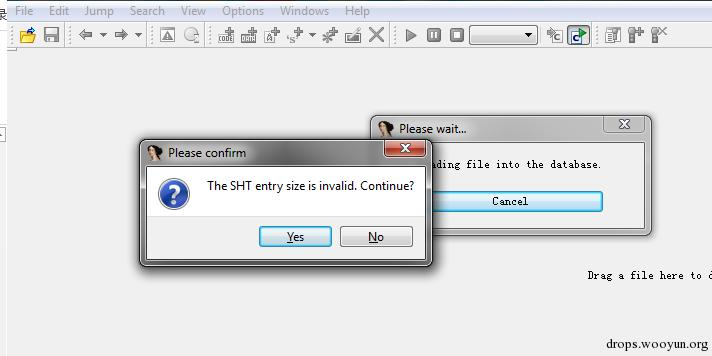  

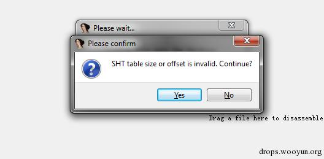   
通过readelf可以明显看到ELF头部的几个字段是有问题的。    

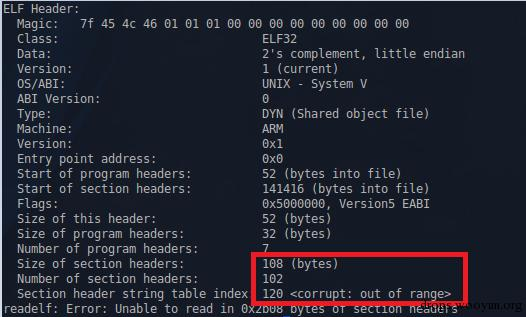   

修复之后，IDA可以正常反汇编so文件了。接着我们从入口点开始分析，会发现F5反编译成C代码会有问题，多个函数内容都不能反编译成正常的C代码。直接看汇编代码看到如下的花指令： 

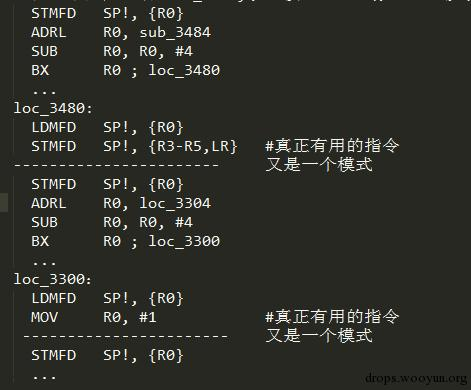  

这是我们总结的该产品的花指令模式。它会通过压栈跳转出栈的方式让反编译的函数辨识出现问题，因为反编译通常会认为一个压栈操作为函数调用，而其实他通过压栈，计算寄存器值，跳转再出栈让反编译失效后并平衡栈后，再执行一条真正有用的指令。因此上述例子中只有两条真正有用的指令。

通过写脚本甚至是人工的方式可以把真正的汇编指令提取出来。提取后再逆向代码，其功能是去解密JNI_OnLoad函数。JNI_OnLoad会从一段数据中再解密出另一个ELF文件，而此时这个新的ELF文件还不能正确反汇编，后面的代码会接着对该ELF进行数据的修正。先解压新ELF文件中的text端，从text端中提取一个key再去解密rotext，最后才解密出一个真正的对DEX的壳程序，形如：    

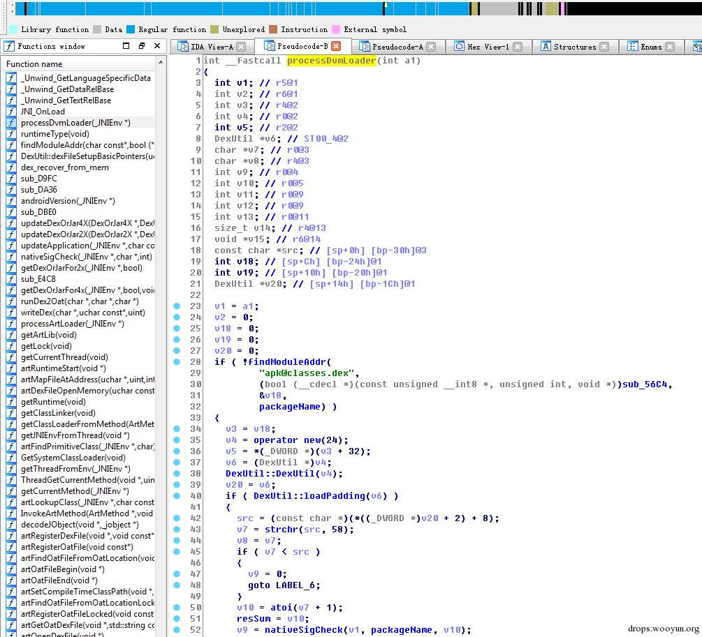  

以上步骤其实是一个ELF文件的壳。新的被解密修正后的ELF文件才是真正对DEX壳的解密程序。这个程序并没有混淆或者加壳，通过逆向后发现，他会取原始DEX后的一段padding数据，获取一些解密和解压需要的参数，对整段padding数据解密解压，就能得到真正原始的DEX文件了。当然ELF中还包括一些反调试反分析的代码，由于我们这是静态分析，不需要顾及这部分代码，如果是使用调试器去附加进程使用dump等动态分析时就需要考虑怎么优雅的bypass这些反调试技巧了。 

以上例子是一个动态加载DEX的例子，虽然不同的加固服务在很多技术细节包括解密算法、花指令模式、ELF壳等等上天差地别，但基本上能够代表绝大多数使用动态加载DEX方式的加固服务的整体解密释放运行和静态逆向和破解它的思想方法。我们也是以这个例子来管中窥豹。因为频繁的变换解密算法和加固方式也是加固服务的第一大特点。  

同时事实上还存在一些加固并没有使用完整DEX文件的动态加载机制，而是使用运行时动态自修改，这种机制下加固后的DEX文件中将存在原始DEX中的部分准确信息，但受保护的部分代码还是会选择其他方式隐藏。另外还有两者相结合的方式。后面的案例分析中我们将有所涉及。  

总结一下，一个加固过的Android应用程序实际上主要是隐藏真正的DEX文件，其自身也会加入诸多保护措施来防止被轻易逆向。可以看到如果纯静态逆向分析其脱壳算法会非常耗时耗力，另外不同的加固服务采取不一样的算法，而每个本身又会频繁变换算法和加固技术让纯静态的逆向脱壳方法短时间内就失效。同时加固服务还会采取除DEX动态加载以外的诸多安卓应用程序保护措施，我们这里稍作总结，并不展开，因为这部分内容甚至可以单独写文章详细说。  

第一大类是完整性检验。包含了在运行时对自身的完整性校验，如检查内存中DEX文件的检验值和检查应用程序证书来检测是否被重打包及插入代码。以及对自身环境的检测，如通过检查特定设备文件等方式检测模拟器，通过ptrace或者进程状态等方式检测是否被调试，hook特定的函数防止代码内存被读取或dump等。  

第二大类是代码混淆。通常混淆需要基于源码或字节码上修改，其目的是为了让分析者更难以理解程序的语义。最常见的包括修改变量名，方法名，类名等，加密常量字符串，使用Java反射机制调用方法，插入垃圾指令或无效代码打乱程序控制流，使用更为复杂的操作替换原始的基本指令，使用JNI方法打断控制流等。  

第三大类我们定义为防分析或代码隐藏技术，其目的是为了用各种方法防止程序代码被直接暴露，轻易分析。最常见的就是上述的DEX整体加密保护，以及运行时动态自修改。运行时动态自修改主要是在程序运行时当执行到特定的类或方法时才将代码解密并执行，同时还可能动态之后才修正或修改部分dalvik数据结构让分析变得困难。另外一些防分析技术需要利用一些小的技巧。例如利用静态分析工具的bug，或解析时的特性来做对抗，包括曾经出现的manifest cheating，APK伪加密，dex文件中的方法隐藏，插入非法指令或不存在的类让静态分析工具崩溃等等。  

## 0x03 脱壳方法思想

面对加固程序，当前比较流行和常用的脱壳方法主要是两种方法。一种是静态的逆向分析，其缺点也很明显，难度大而且无法对抗变换算法。另一种主要是基于内存dump技术的脱壳。缺点在于需要考虑先bypass各种反调试的方法，同时还需要面对日益发展和新的层出不穷的反内存dump的各种技巧。例如篡改dex文件头防穷搜，动态篡改dalvik数据结构破坏内存中的DEX文件等等，这些对抗技术让即使dump出DEX文件后，还需要做大量的通过观察加固特性后的人工修复工作。  

所以我们提出一种通用的自动化脱壳方法，我们的方法基于动态分析，无需关心各个不同的加固保护具体实现，也可以统一绕过各种反调试的手段，同时也不需要做后期大量的修复工作。  

首先我们脱壳的对象是Android应用程序中的DEX文件，因此我们选择直接修改Android系统中Dalvik虚拟机的源代码进行插桩。因为DEX文件中的代码都需要在Dalvik虚拟机上解释执行，所有的真实行为都能在Dalvik虚拟机上暴露。Dalvik有多个解释模式，其中有portable模式是基于C++实现的，而其他模式由于优化的缘故使用平台相关的汇编语言开发，为了方便实现我们的插桩的代码，一旦发现开始解释执行需要被脱壳的APP时，我们先（源码目录dalvik/vm/interp/Interp.cpp）将解释模式改为portable。这么做的一个好处在于直接修改执行环境可以让加壳程序更加难以检测脱壳行为的存在，相比于调试器附加等方法，该方法更为透明。在解释器上做的另一个好处在于不需要去关心加固程序在哪个阶段进行类的加载和初始化以及解密代码等，直接在运行时就能得到最真实的数据和行为。插桩代码实现在Dalvik解释执行的每条指令切换处（dalvik/vm/mterp/out/InterpC-portable.cpp），这样可以在执行过程中的任意指令处进行脱壳的操作，一边应对边运行边解密的加固程序。最后基于源码的修改能够实施真机部署，Android原生源码可以完美支持所有的Nexus系列手机，也不需要去应对加固程序的检测模拟器手段。  

脱壳的本质是去获取程序真实的行为，因此插桩代码其实就是去得到内存中的Dalvik数据结构，来反映被执行的真实代码。在指令执行时可以直接得到该条指令属于的方法，Method这个结构。而每个被执行的方法中都有该方法属于的类对象clazz，而clazz（源码目录dalvik/vm/oo/Object.h）中又有pDvmDex（dalvik/vm/DvmDex.h）对象，其中有pDexFile（dalvik/libdex/DexFile.h）结构体代表了DEX文件，也就是说，执行过程中获取当前方法后，用curMethod->clazz->pDvmDex->pDexFile就能够得到这个方法属于的DEX文件结构。该结构体中包含了所有DEX文件在解释其中被执行时的内存信息，通过解析这个DexFile结构体就能恢复出最真实的DEX。  

## 0x04 简单脱壳实现

至此，我们的第一个反应是有没有现成的程序，可以去翻译Dalvik字节码的，但是以读入内存中的DexFile结构体为输入，同时可以直接基于源码实现，也就是用C/C++实现的，而不是像更多的静态逆向工具直接以读入一个静态DEX文件为输入。找了下发现Android系统源码里本身就提供了DexDump（dalvik/dexdump/DexDump.cpp）这个工具，直接能满足这个要求。我们对DexDump代码稍作修改，插入到解释器中，如下图：  

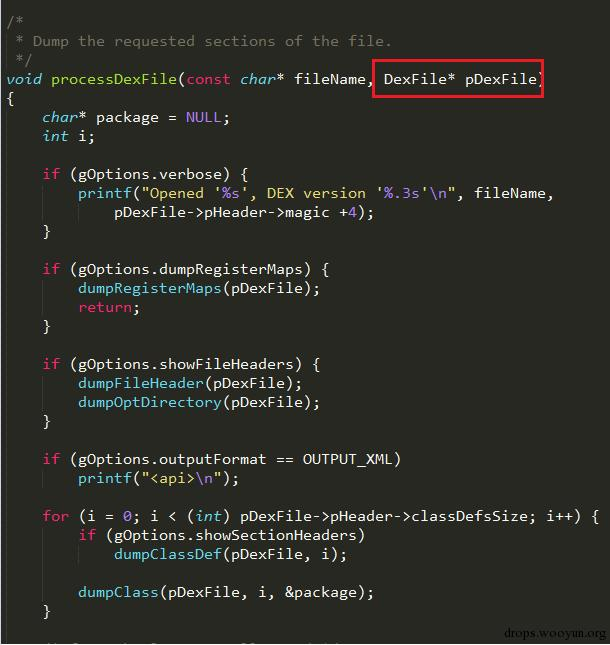  

让他去读取DexFile，默认就直接在一个APP的主Activity处执行这个代码，主Activity可以通过AndroidManifest.xml文件获取，因为该文件中的入口点类都不会被隐藏。 我们发现这样几乎就能够应对大多数加固程序了，能够得到加固程序被隐藏的DEX文件中的真实代码，输出如下图：  

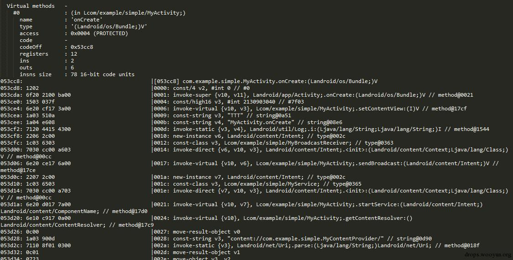   

但这个方法的缺点也很明显，就是输出是dalvik字节码的文本形式，一方面无法反汇编成Java，另一方面文本形式非常不适合后续的复杂程序的分析，我们的最佳目的是得到一个完整的DEX文件。  

## 0x05 完善脱壳实现

通常到上一步，许多其他的脱壳工具为了恢复出完整的DEX文件，会选择直接读取pDexFile->baseAddr或者pDvmDex->memMap为起始地址，直接将整个文件大小的内存dump出来。然而我们发现对某些加固软件，这样dump出来的代码里依然不包含真实的代码，这是由于DEX文件中部分真实信息在运行时被修改和映射到了文件连续内存以外的部分，如下图，一个DEX文件被载入内存后，理应是在一个连续的内存空间中，然后被解析赋值为各个动态执行时Dalvik所需的结构体，而部分索性性质的结构体应该指向连续的data数据块。但加固程序可能会做些修改，例如将header的部分数据篡改，以及重新分配不连续的内存来存放data数据，并让那些索引数据块指向的新分配的data块。这样如果直接用dump的方法，则无法得到完整的DEX文件。  

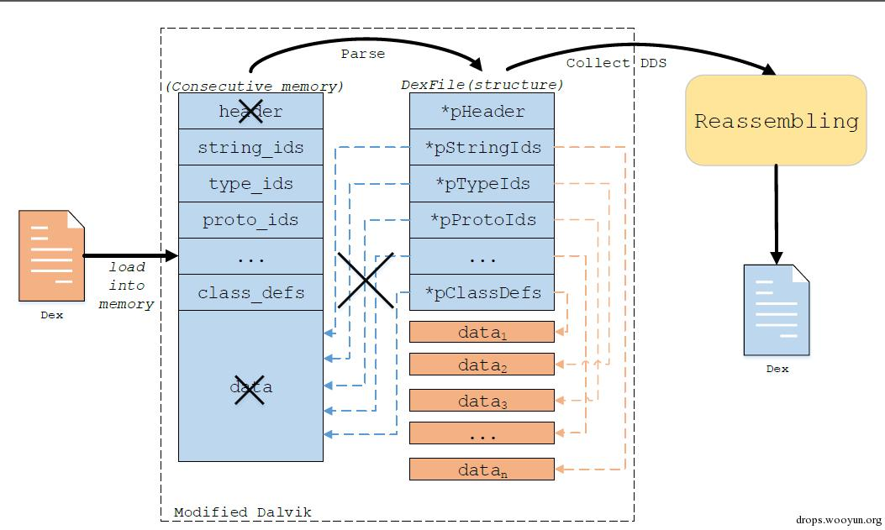   

我们旨在以统一的方法恢复出原始的DEX文件，不希望还需要针对的不同的壳来做后续的修复，因为这样又将进入到和静态逆向加固算法一样的困境。因此我们基于上述简单实现，有了个更加完善的实现方案，称之为DEX文件重组。过程非常简单，就是在程序执行过程中先获取所有解释器所需的Dalvik数据结构，这里都是内存中真实的被解释执行的数据结构，然后再将这些数据结构组合重新写回成一个新的DEX文件。如上图所示，即使内存不连续，我们也无需关心他对原始映射内存的操作，可以直接获取每块不连续的数据，按照一定的规范去把这些数据重组成一个新的DEX文件。 第一步是去准确获取每个Dalvik数据机构，为了保证获取的准确性，我们采取的方式是和运行中解释器中去执行程序时的获取方式一致（参考DexFile.h 文件中的dexGetXXXX方法），因为一个DEX文件，同一块数据可能有很多种方式去获取的，打个比方，常量字符串可以去读文件头里的偏移去获取，也可以通过stringId列表去获取，等等。正常情况下这些方式都应该是正确的，但是加固程序会去做一些破坏。但它不能去破坏运行时这些数据被获取时用的数据，因为这个一旦破坏，程序就无法正常运行了。具体的获取方式如下图所示：  

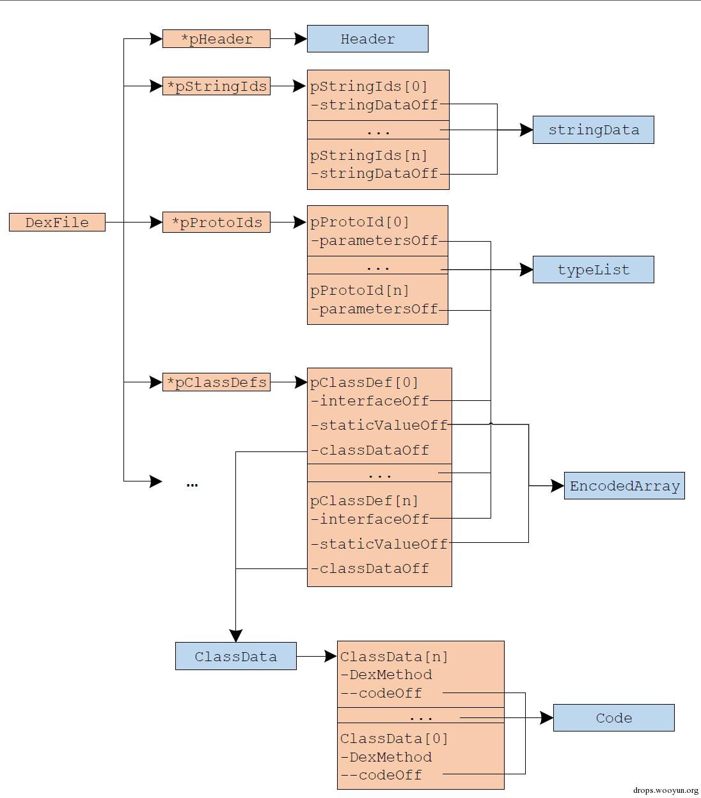   

我们需要遍历每个数组（如pStringIds，pProtoIds，…，pClassDefs）里的某些指针和偏移，每项中都逐一获取，将其内容再合并成一个大类（如stringData，typeList，…，ClassData，Code）。接着获取完重写的时候，需要注意几个问题。首先是对获取这些数据块的排列问题，我们参考了dalvik/libdex/DexFile.h里的map item type codes枚举的顺序进行排列。排列好需要调整每个数据项里的偏移值为新的偏移，如stringDataOff, parametersOff, interfacesOff, classDataOff, codeOff等，接着对于DexHeader, MapList这两个结构体中的值，我们需要重新计算后填写，而不是直接取原来的值，对于一些固定的值例如Header里面的文件头等，我们根据已有知识直接填写。最后需要考虑到内存中的数据表达和DEX文件中的某些数据格式的差异，例如有些数据项在文件中是ULEB128编码的，而在内存中就直接是int类型，另外还需要注意4字节的对齐，以及encoded_method_format里是field_idx_diff，method_idx_diff而不是简单的index等。具体细节可参考官方的DEX文件格式文档  

https://source.android.com/devices/tech/dalvik/dex-format.html  

我们在重组的时候忽略了一些数据块，例如所有和annotation相关的数据结构，因为这部分真实程序使用不多，而结构又特别复杂，忽略以后对分析程序真实行为影响不大。  

## 0x06 实验与发现

改完代码后，我们重新编译了libdvm模块并将新生成libdvm.so写入系统目录/system/lib/下覆盖掉原始的库文件，我们实验的对象是Galaxy Nexus手机对应Android 4.3版本和Nexus 4手机对应的Android 4.4.2版本。然后我们提交了一个简单的应用程序，送到各个在线加固服务上获取加固后的应用程序版本再实施脱壳。实验发现几乎能够针对所有的加固程序恢复出原始的DEX文件。以下是一些针对加固程序的发现。主要集中在不同的加固所使用的自我保护的手段，这里有些结果是DexDump的文本，因为有些保护措施用这个方式更好的展示出细节，当然全部都能直接恢复成DEX文件。

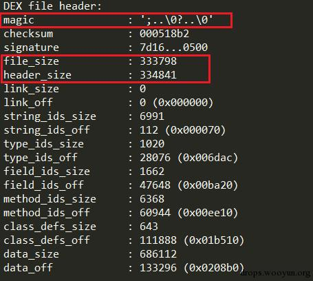   

   

以上两个例子表明，有些加固程序会将magic number抹去，来隐藏内存中的DEX文件，让穷搜DEX文件的方式失效，另外还会篡改header的大小，以及将header中的各种字段偏移值抹去，由于我们用的方法是对header重新计算，因此重组后的DEX不受其影响。  

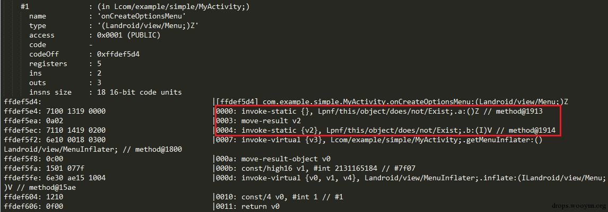   

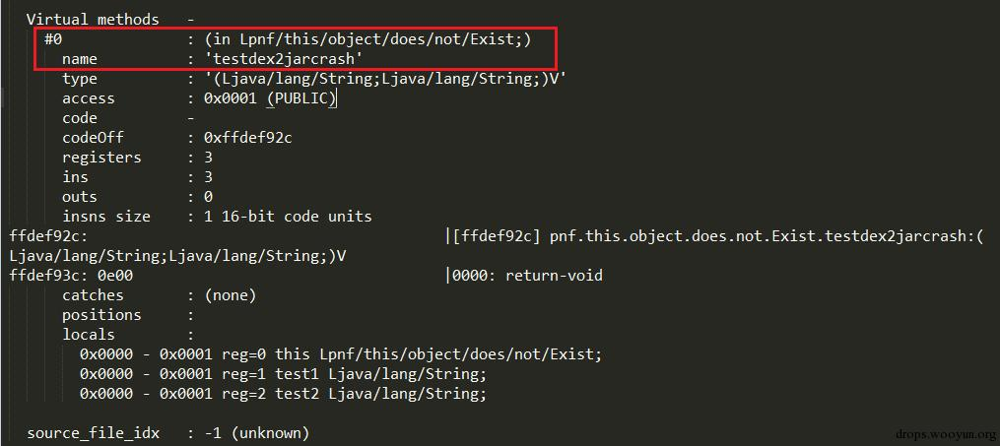   

另外有些加固程序会额外插入一些类来破坏正常的反编译效果，例如这个类就有个方法是能够让dex2jar失效。  

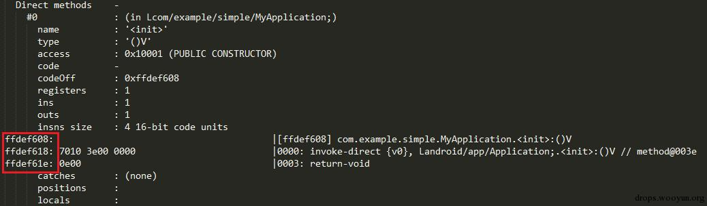   

还有壳将codeOff改成了负的值，这样代码就会被映射到文件内存范围之外。我们的方法可以直接将代码获取后重新写回到正常的位置。  

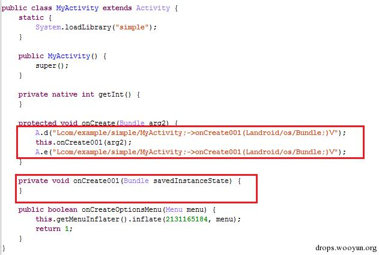   

另外还有壳是重写了某些方法，将代码放入一个新的方法中，并在执行前去解密，执行后再重新抹去。对于这种情况，由于我们脱壳代码插桩于每个方法调用处，因此我们只需要调整脱壳点到该方法执行处去实施脱壳就能恢复出代码了。  

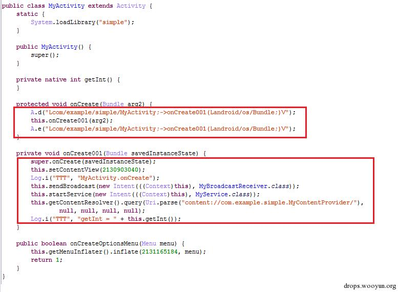   

除以上例子外，我们还发现某些加固程序会hook进程空间中的write函数，检测写的内容如果是特定的数据（如dex文件头），则让write操作失败，或者获取内存地址空间在映射的DEX文件区域内，也会让write失败等。还有加固程序会将原始的DEX文件分离出多个DEX，以及修改特定的数据项如debug_info_off为错误值，运行时再动态改回正确值。还有壳会在字节码基础上对原始的程序做代码混淆。  

（注：以上例子都并非最新版本，不保证特定的加固程序现有产品与上述例子依然一致）  

## 0x07 讨论与思考

首先我们的方法依然有局限性，一来在研究对象里说明了我们只针对DEX文件加密保护，并不做反混淆的工作。其次我们的方法依然是基于动态分析，将面临动态分析的局限性，如一段加密代码是运行到才解密，但该方法无法被触发执行，我们的方法也无法解密这个方法的代码。最后用该方法虽然难以被加固程序检测，但用该方法制作的工具在实现上势必会有某些特征，这些特征可能会被加固程序加以利用和对抗。  

最后是我想和大家一起探讨的关于更好的Android平台应用程序加固的想法。事实上Android平台的加固破解还是相对容易的，然而并不是没有更难更安全的加固方案，而是在手机平台上商用的加固方案需要考虑到性能损耗和兼容性的问题，这是无法避免的。同时综合这几个方面，我觉得加固保护的趋势和做法发展主要集中在以下的几个点。  

一个是我觉得Android混淆和加壳其实可以结合使用。从攻击者的角度来看，我认为强力的混淆可能要比加壳在保护代码逻辑方面更加有效。但是好的混淆方案事实上非常难以设计。目前来看国内的加固几乎不会对原始的代码做大的变换和混淆，可能是怕修改的代码在兼容性上会有问题。我认为这是一个发展点。我发现国外比较优秀的工具会在深度混淆这个点上做文章，比如dexprotector，他既有加壳，也有混淆，即使脱壳成功，还是需要去面对难以理解的混淆后代码。  

另外我觉得部分加固的效果在安全性上可能要强过整体加固。就像之前的一个例子，一个方法只有在运行时才解密自己，一旦脱离运行则重新加密或抹掉。这个等于是利用了动态执行覆盖率低的缺陷来进一步保护自己。 

第三个就是为了更好的加固效果，加固过程应该尽可能从现在的开发后加固变成开发中的加固。现在有一些加固SDK就是这方面比较好的尝试。直接在开发的过程中敏感的操作使用一个安全库的接口。这个无论是在性能上还是效果都可以对现在的整体一刀切式的加固做个质的提高。熟悉业务的开发人员会很清楚他们需要保护的代码是哪一部分，因为一个程序事实上真正需要被保护的逻辑可能只是很小一部分，加固范围的缩小可以大大提高性能，同时单独的安全库文件可以有针对性的保护措施，效果会非常好，另外比起整个APP加固也更容易做的兼容性测试。  

加固另一个思路是尽可能用Native的代码，特别是关键的程序逻辑，Native代码逆向本身就比Java困难，加了混淆或者壳后就更难了，同时Native代码事实上还能在性能上有所提高，是一举两得的方案。由此又可以延伸出如何对Android应用程序中native代码做深度保护的问题，如果敏感操作用深度混淆保护的native代码做保护，则攻击成本势必将极大提升。  

最后我觉得加固保护的一个趋势是尽量少的去利用小trick来做防护，比如那些利用静态分析工具的BUG或者系统解析APK的BUG来做加固其实意义不是很大，加固保护更应该从整个计算机系统的体系结构上来考虑和强化，而不应该集中于一些小的技巧。  