原文 by 蒸米  
## 0x00 序

随着移动安全越来越火，各种调试工具也都层出不穷，但因为环境和需求的不同，并没有工具是万能的。另外工具是死的，人是活的，如果能搞懂工具的原理再结合上自身的经验，你也可以创造出属于自己的调试武器。因此，笔者将会在这一系列文章中分享一些自己经常用或原创的调试工具以及手段，希望能对国内移动安全的研究起到一些催化剂的作用。  

## 0x01 孔雀翎

天下的暗器共有三百六十余种，但其中最成功、最可怕的就是孔雀翎。它使用简单，却威力无边。据说，孔雀翎发动之时，暗器四射，有如孔雀开屏，辉煌灿烂，而就在敌人目眩神迷之际，便已魂飞魄散。这武器的描述与Ida是何其的相似啊！所以说安卓动态调试七种武器中的孔雀翎非Ida莫属。因为Ida太有名了，相应的教程也是漫天飞，但很多并不是安卓相关的内容，所以笔者决定将一些经典的安卓调试技巧总结归纳一下。因为篇幅原因，笔者并不能保证本文能够覆盖到ida调试的方方面面，看官如有兴趣可以再继续深入研究学习。  

## 0x02 还原JNI函数方法名

在android调试中，你会经常见到这种类型的函数：  

  

首先是一个指针加上一个数字，比如v3+676。然后将这个地址作为一个方法指针进行方法调用，并且第一个参数就是指针自己，比如(v3+676)(v3…)。这实际上就是我们在JNI里经常用到的JNIEnv方法。因为Ida并不会自动的对这些方法进行识别，所以当我们对so文件进行调试的时候经常会见到却搞不清楚这个函数究竟在干什么，因为这个函数实在是太抽象了。解决方法非常简单，只需要对JNIEnv指针做一个类型转换即可。比如说上面提到v3指针，我们选中后按一下”y”键，然后将类型声明为”JNIEnv*”。  

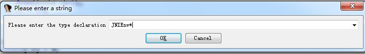     

随后IDA就会自动查找对应的方法并且显示出来了：    
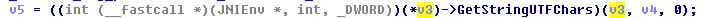  

是不是瞬间清晰了很多？另外有人（ 貌似是看雪论坛上的）还总结了所有JNIEnv方法对应的数字，地址以及方法声明：  
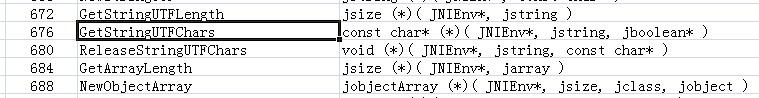    

有兴趣的同学可以去我的github下载。

## 0x03 调试.init_array和JNI_OnLoad

我们知道so文件在被加载的时候会首先执行.init_array中的函数，然后再执行JNI_OnLoad()函数。JNI_Onload()函数因为有符号表所以非常容易找到，但是.init_array里的函数需要自己去找一下。首先打开view ->Open subviews->Segments。然后点击.init.array就可以看到.init_array中的函数了。  

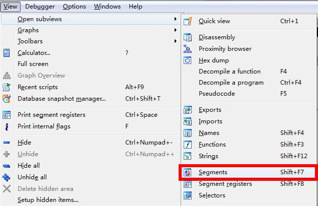  

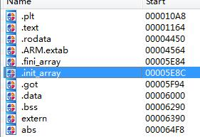  

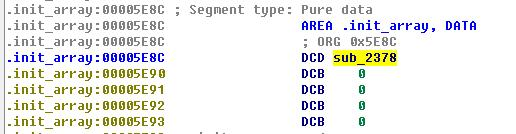  

但一般当我们使用ida进行attach的时候，.init_array和JNI_Onload()早已经执行完毕了，根本来不急调试。这时候我们可以使用jdb这个工具来解决，这个工具是安装完jdk以后自带的，可以在jdk的bin目录下找到。在这里我们使用阿里移动安全挑战赛2014的第二题作为例子讲解一下如何调试JNI_OnLoad()。 

打开程序后，界面是这样的：  
  

我们的目标就是获取到密码。使用ida反编译一下so文件会看到我们输入后的密码会和off_628c这个指针指向的字符串进行比较。  

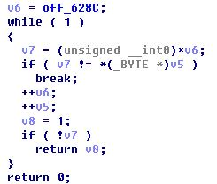  

于是我们查看off_628c这个地址对应的指针，发现对应的字符串是”wojiushidaan”。  

    
  

于是我们把这个密码输入一下，发现密码错误。看样子so文件在加载的时候对密码字符串进行了动态修改。既然动态修改了那我们用ida动态调试一下好了，我们打开程序，然后再用ida attach一下，发现程序直接闪退了，ida那边也没有任何有用信息。原来这就是自毁程序的意思啊。既然如此我们动态调试一下JNI_OnLoad()来看一下程序究竟做了什么吧。步骤如下：  

1 ddms  

一定要打开ddms，否则调试端口是关闭的，就无法在程序刚开始的暂停了。我之前不知道要打开ddms才能用jdb，还以为android系统或者sdk出问题了，重装好几次。汗。  

2 adb push androidserver /data/local/tmp/  
```
adb shell
su
chmod 777 /data/local/tmp/androidserver
/data/local/tmp/androidserver
``` 
这里我们把ida的androidserver push到手机上，并以root身份执行。  

3 `adb forward tcp:23946 tcp:23946`

将ida的调试端口进行转发，这样pc端的ida才能连接手机。 

4 `adb shell am start -D -n com.yaotong.crackme/.MainActivity`

这里我们以debug模式启动程序。程序会出现waiting for debugger的调试界面。  
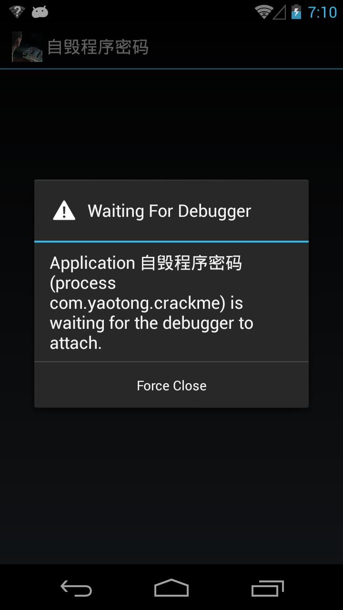   

5 ida attach target app  

这时候我们启动ida并attach这个app的进程。  

6 suspend on libary loading  

我们在debugger setup里勾选 suspend on library load。然后点击继续。  
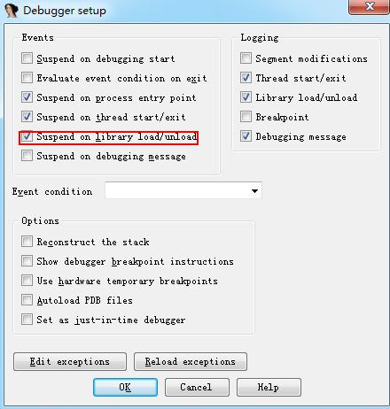   

7 `jdb -connect com.sun.jdi.SocketAttach:hostname=127.0.0.1,port=8700`

用jdb将app恢复执行。  

8 add breakpoint at JNI_OnLoad  

随后程序会在加载libcrackme.so这个so文件的时候停住。这时候ida会出现找不到文件的提示，不用管他，点取消即可。随后就能在modules中看到libcrackme.so这个so文件了，我们点进去，然后在JNI_OnLoad处下个断点，然后点击执行，程序就进入了JNI_OnLoad()这个函数。  

PS：有时候你明明在一个函数中却无法F5，这时候你需要先按一下”p”键，程序会将这段代码作为函数分析，然后再按一下”F5”，你就能够看到反汇编的函数了。  

因为过程有点繁琐，我录制了一个调试JNI_OnLoad()的视频在我的github，有兴趣的同学可以去下载观看。因为涉及到其他的技巧，我们将会在随后的”ida双开定位”章节中继续讲解如何调试.init_array中的函数。  

## 0x04 Ida双开定位

Ida双开定位的意思是先用ida静态分析so文件，然后再开一个ida动态调试so文件。因为在动态调试中ida并不会对整个动态加载的so文件进行详细的分析，所以很多函数并无法识别出来。比如静态分析中有很多的sub_XXXX函数：  

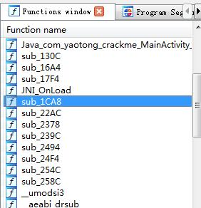  

但动态调试中的ida是没有这些信息的。  

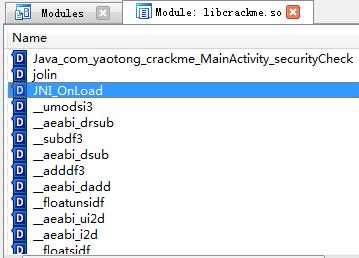  

所以我们需要双开ida，然后通过ida静态分析的内容来定位ida动态调试的函数。当然很多时候我们也需要动态调试的信息来帮助理解静态分析的函数。  

在上一节中，我们提到.init.array中有个sub_2378()，但当ida动态加载so后我们并无法在module中找到这个函数。那该咋办呢？这时候我们就要通过静态分析的地址和so文件在内存中的基址来定位目标函数。首先我们看到sub_2378()这个函数在静态分析中的地址为.text:00002378。而在动态加载中这个so在内存中的基址为：4004F000。  

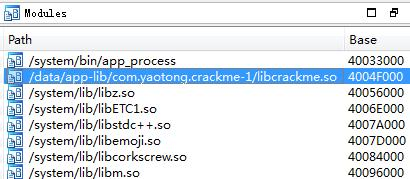    
 
因此sub_2378()这个函数在内存中真正的地址应该为4004F000 + 00002378 =40051378。下面我们在动态调试窗口输入”g”，跳转到40051378这个地址。然后发现全是乱码的节奏：  

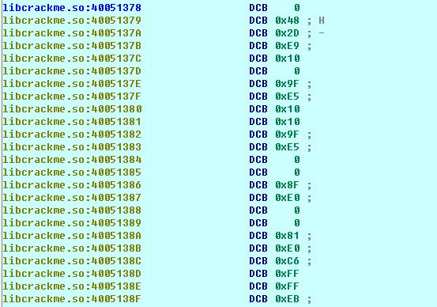    

不要担心，这是因为ida认为这里是数据段。这时候我们只要按”P”或者选中部分数据按”c”，ida就会把这段数据当成汇编代码进行分析了：  

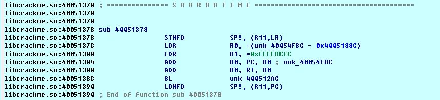    

我们随后还可以按”F5”,将汇编代码反编译为c语言。  

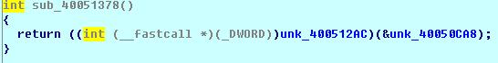    

是不是和静态分析中的sub_2378()长的差不多？  

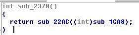   

我们随后可以在这个位置加入断点，再结合上一节提到的调试技巧就可以对init.array中的函数进行动态调试了。  

我们接下来继续分析自毁程序这道题，当我们在对init.array和JNI_OnLoad()进行调试的时候，发现程序在执行完dowrd_400552B4()后就挂掉了。  

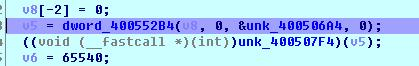  

于是我们在这里按”F7”进入函数看一下：  

  

原来是libc.so的phread_create()函数，估计是app本身开了一个新的线程进行反调试检测了。  

有意思的是在静态分析中我们并不清楚dword_62B4这个函数是做什么的，因为这个函数的地址在.bss段还没有被初始化：  

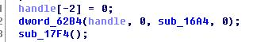  

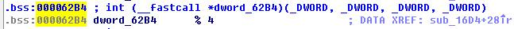  

但是当我们动态调试的时候，这个地址的值已经修改为了phread_create()这个函数的地址了。：  

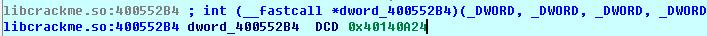  

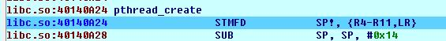  

所以说自毁程序密码这个app会用pthread_create()开一个新的线程对app进行反调试检测。线程会运行sub_16A4()这个函数。于是我们对这个函数进行分析，发现里面的内容有大量的混淆，看起来十分吃力。这里我介绍个小trick：常见的反调试方法都会用fopen打开一些文件来检测自己的进程是否被attach，比如说status这个文件中的tracerpid的值是否为0，如果为0说明没有别的进程在调试这个进程，如果不为0说明有程序在调试。所以我们可以守株待兔，在libc.so中的fopen()处下一个断点，然后我们在hex view窗口中设置数据与R0的值同步：  

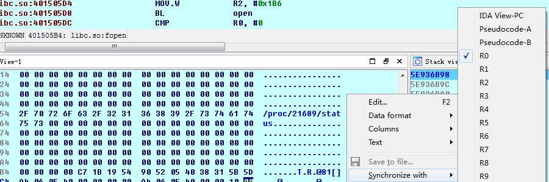  

这样的话，当函数在fopen处停住的时候我们就能看到程序打开了哪些文件。果不其然，程序打开了/proc/[pid]/status这个文件。我们”F8”继续执行fopen函数，看看返回后的地址在哪。然后发现我们程序卡在了某个函数中间，PC上面都是数据，PC下面才是汇编。这该咋办呢？  

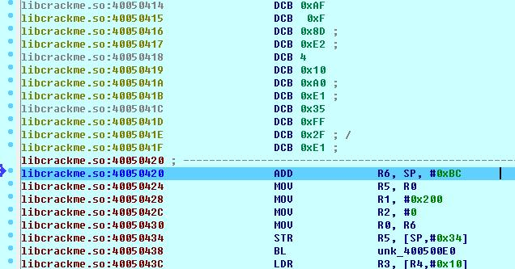  

解决办法还是ida双开，我们知道现在PC的地址为40050420，libcrackme.so文件的基址为4004F000。因此这段代码在so中的位置应该是：40050420 - 4004F000 = 1420。因此我们回到ida静态分析界面，就可以定位到我们其实是在sub_130C()这个函数中。于是我们猜测这个函数就是用来做反调试检测的。  

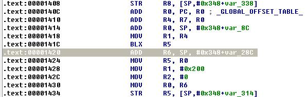  

因此我们可以通过基址来定位sub_130C()这个函数在内存中的地址：40050420 + 130C = 4005030C。然后我们在4005030C这个地址处按”P”， ida就可以正确的识别整个函数了。  

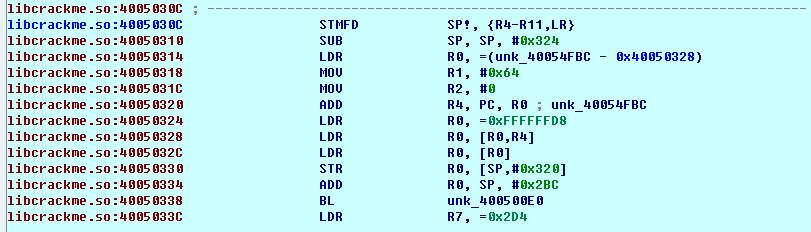  

所以说动态调试的时候可以帮我们了解到很多静态分析很难获取到的信息。这也就是ida双开的意义所在：静态帮助动态定位函数地址，动态帮助静态获取运行时信息。

## 0x05 Ida动态修改内存数据和寄存器数值

我们继续分析自毁程序密码这个app，我们发现该程序会用fopen ()打开/proc/[pid]/status这个文件，随后会用fgets()和strstr()来获取，于是我们在strstr()处下个断点，然后让hex view的数据与R0同步。每次点击继续，我们都会看到strstr传入的参数。当传入的参数变为TracerPid:XXXX的时候我们停一下。因为在正常情况下，TracerPid的值应该是0。但是当被调试的时候就会变成调试器的pid。  
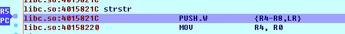     

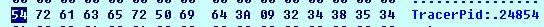   

为了防止程序发现我们在调试，在这里我们需要把值改回0。我们在hex view的2那里点击右键，然后选择edit。随后我们输入30和00，再点击”apply changes”。就可以把TracerPid改为0了。然后就可以bypass这一次的反调试的检测。  
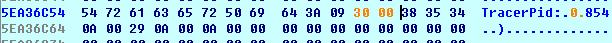   

但这个程序检测TracerPid的次数非常频繁，我们要不断的修改TracerPid的值才行，这种方法实在有点治标不治本，所以我们会在下一节介绍patch so文件的方法来解决这个问题。  

另外在ida动态调试过程中，除了内存中的数据可以修改，寄存器的数据也是可以动态修改的。比如说程序执行到CMP R6, #0。本来R6的值是0，经过比较后，程序会跳转到4082A3FC这个地址。  

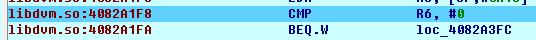   
但是如果我们在PC执行到4082A1F8这条语句的时候，将R6的值动态修改为0。程序就不会进行跳转了。   

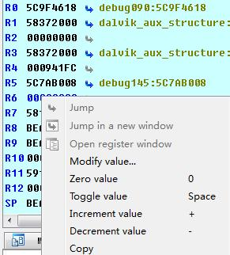   

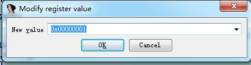   

你甚至可以修改PC寄存器的值来控制程序跳转到任何想要跳转到的位置，简直和ROP的原理一样。但记得要注意栈平衡等问题。  

   

## 0x06 Patch so文件

在上文中，我们通过分析定位到sub_130C()这个函数有很大可能性是用来做反调试检测的，并且作者开了一个新的线程，并且用了一个while来不断执行sub_130C()这个函数，所以说我们每次手动的修改TracerPid实在是不现实。  


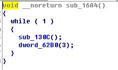    

既然如此我们何不把sub_130C()这个函数给nop掉呢？为了防止nop出错，我们先在”F5”界面选择所有代码，然后用”Copy to assembly”功能，就可以把c语言代码注释到汇编代码里。  


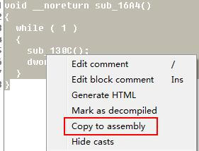     


     

在这里我们看到如果想要注释掉sub_130C()函数，只需要注释掉000016B8这个位置上的代码即可，如果我们想要注释掉dword_62B0(3)这个函数，我们则需要注释掉000016BC-000016C4这三个位置上的代码。接下来我们选中000016B8这一行，然后再点击HexView。HexView会帮我们自动定位到000016B8这个位置。  

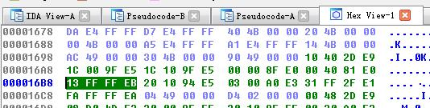     

因为ARM是没有单独的NOP指令的。于是我们采用movs r0,r0作为NOP。对应的机器码为”00 00 A0 E1”。所以我们把”13 FF FF EB”这段内容修改为”00 00 A0 E1”。  

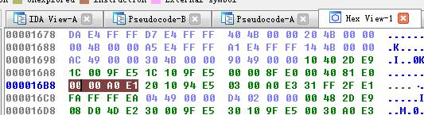   

我们再回”F5”界面，就会发现sub_130C()函数已经没有了。  
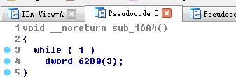   
  
最后我们点击”Edit->Plugins->modifyfile”，然后就可以保存新的so文件了。我们将这个so文件覆盖原apk中的so文件，然后再重新签名。

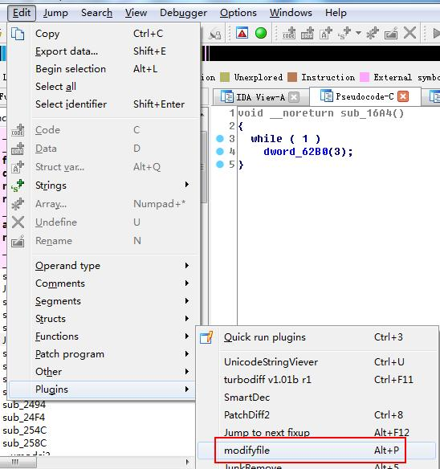   

这次我们先运行程序，再用ida加载，app并没有闪退，说明我们patch成功了。于是我们先在”Java_com_yaotong_crackme_MainActivity_securityCheck”处下断点。然后在app随便输入一个密码，点击app上的”输入密码”按钮。

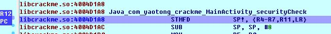   

程序就会暂停在”Java_com_yaotong_crackme_MainActivity_securityCheck”处。我们先按”P”再按”F5”，就可以看到反汇编的c语言了。而这里的unk_4005228C就是保存了密码字符串指针的指针。  
   

因为是指针的指针，所以我们先双击进入这个地址。

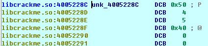   

然后在这个地址上按三下”D”，将这里的数据格式从字符转化为指针形式。

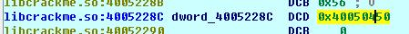   

然后我们再双击进入这个地址，就可以看到最后的flag了。答案是”aiyou,bucuoo”。
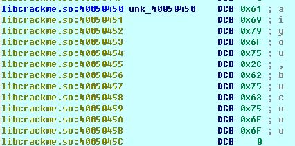     

这道题里我们只是用到了很简单的patch so技巧，在实战中我们不光可以NOP，我们还可以改变条件判断语句，比如将”BNE”变为” BEQ”。我们甚至可以修改跳转地址，比如直接让程序B到某个地址去执行，这样的话就不需要挨个的NOP很多语句了。要注意的是，ARM中的跳转指令是根据相对地址计算的，所以你要根据当前指令地址和目标地址来计算出相对跳转的值。  

比如说00001BCC: BEQ loc_1C28对应的汇编代码为”15 00 00 0A”。  

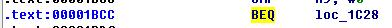   
  
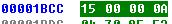  

0x0A代表BEQ，”15 00 00”代表跳转的相对地址，因为在arm中pc的值是当前指令的下两条（下一条的下一条）指令的地址，所以我们需要将0x15再加上2。随后就可以计算出最后跳转到的地址： (0x15 + 0x2)*4 + 0x1BCC = 0x1C28。Ida反汇编后的结果也验证了结果是BEQ loc_1C28。

接下来我们想修改汇编代码为00001BCC: BNE loc_1C2C。只需要将”0A”变成”1A”，将”15”变成”16”即可。  
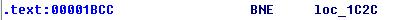   
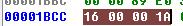  

0x0A代表BEQ，”15 00 00”代表跳转的相对地址，因为在arm中pc的值是当前指令的下两条（下一条的下一条）指令的地址，所以我们需要将0x15再加上2。随后就可以计算出最后跳转到的地址： (0x15 + 0x2)*4 + 0x1BCC = 0x1C28。Ida反汇编后的结果也验证了结果是BEQ loc_1C28。  

接下来我们想修改汇编代码为00001BCC: BNE loc_1C2C。只需要将”0A”变成”1A”，将”15”变成”16”即可。  

## 0x07 Kill调试技巧

该技巧是QEver 在《MSC的伪解题报告》中提到的。利用kill我们可以让程序挂起，然后用ida挂载上去，获取有用的信息，然后可以再用kill将程序恢复运行。我们还是拿自毁程序密码这个应用举例，具体实行方法如下：  

1 首先用ps获取运行的app的pid。   
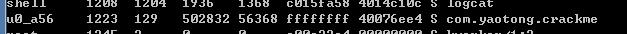  

2 然后用kill -19 [pid] 就可以将这个app挂起了。  

  

3 随后我们用ida attach上这个app。因为整个进程都挂起了，所以这次ida挂载后app并没有闪退。然后就可以在内存中找到答案了。  

    

4 如果想要恢复app的运行，需要将ida退出，然后再使用kill -18 [pid]即可。  
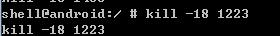    

## 0x08 在内存中dump Dex文件

在现在的移动安全环境中，程序加壳已经成为家常便饭了，如果不会脱壳简直没法在破解界混的节奏。ZJDroid作为一种万能脱壳器是非常好用的，但是当作者公开发布这个项目后就遭到了各种加壳器的针对，比如说抢占ZJDroid的广播接收器让ZJDroid无法接收命令等。我们也会在”安卓动态调试七种武器之多情环 - Customized DVM”这篇文章中介绍另一种架构的万能脱壳器。但工具就是工具，当我们发布的时候可能也会遭到类似ZJDroid那样的针对。所以说手动脱壳这项技能还是需要学习的。在这一节中我们会介绍一下最基本的内存dump流程。在随后的文章中我们会介绍更多的技巧。  

这里我们拿alictf2014中的apk300作为例子来介绍一下ida脱简单壳的基本流程。 首先我们用调试JNI_OnLoad的技巧将程序在运行前挂起：  

`adb shell am start -D -n com.ali.tg.testapp/.MainActivity`  
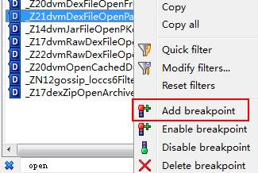    

然后在libdvm.so中的dvmDexFileOpenPartial函数上下一个断点：  
   

然后我们点击继续运行，程序就会在dvmDexFileOpenPartial()这个函数处暂停，R0寄存器指向的地址就是dex文件在内存中的地址，R1寄存器就是dex文件的大小：  
    

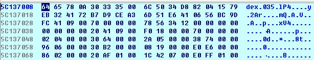    

然后我们就可以使用ida的script command去dump内存中的dex文件了。  

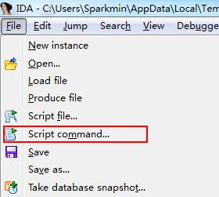    
    
``` c
static main(void)
{
  auto fp, begin, end, dexbyte;
  fp = fopen("C:\\dump.dex", "wb");
  begin = r0;
  end = r0 + r1;
  for ( dexbyte = begin; dexbyte < end; dexbyte ++ )
      fputc(Byte(dexbyte), fp);
}
```
Dump完dex文件后，我们就可以用baksmali来反编译这个dex文件了。   

     

因为过程有点繁琐，我录制了一个dump dex文件的视频在我的github，有兴趣的同学可以去下载观看。  

当然这只是最简单脱壳方法，很多高级壳会动态修改dex的结构体，比如将codeoffset指向内存中的其他地址，这样的话你dump出来的dex文件其实是不完整的，因为代码段保存在了内存中的其他位置。但你不用担心，我们会在随后的文章中介绍一种非常简单的解决方案，敬请期待。  

## 0x09 Function Rewrite函数重写

有时我们想要将app中的某个函数的逻辑提取出来，用gcc重新编译一个可执行文件，比如我们想要写一个注册机，就需要把app生成key的逻辑提取出来。但是ida ”F5”过后的c语言直接编译经常会有很多错误，比如未定义的宏，未定义的声明等。这是因为这些宏都在ida的一个头文件里。里面定义了所有ida自定义的宏和声明，比如说经常见到的BYTEn()宏：    
``` c
#define BYTEn(x, n)   (*((_BYTE*)&(x)+n))
#define BYTE1(x)   BYTEn(x,  1)         // byte 1 (counting from 0)
#define BYTE2(x)   BYTEn(x,  2)
```
加上这个”defs.h”头文件后就可以正常的编译ida ”F5”后的c语言了。  

另外我们还可以自己创建一个NDK项目，然后自己编写一个so或者elf利用dlopen()和dlsym()调用目标so中的函数。比如我们想要调用libdvm.so中的dvmGetCurrentJNIMethod()函数，我们就可以在我们的NDK项目中这么写：   
``` c
typedef void* (*dvmGetCurrentJNIMethod_func)();
dvmGetCurrentJNIMethod_func dvmGetCurrentJNIMethod_fnPtr;
dvm_hand= dlopen("libdvm.so", RTLD_NOW);
dvmGetCurrentJNIMethod_fnPtr =dlsym(dvm_hand, "_Z22dvmGetCurrentJNIMethodv");
dvmGetCurrentJNIMethod_fnPtr();
```
## 0x10 小结

还是那句话，写了这么多依然不能保证本文能够覆盖到ida调试的方方面面，因为ida实在是太博大精深了。看官如有兴趣可以继续深入研究学习。另外文章中所有提到的代码和工具都可以在我的github下载到，地址是：    

https://github.com/zhengmin1989/TheSevenWeapons  

## 0x11 参考文章

MSC解题报告 http://bbs.pediy.com/showthread.php?t=197235  
伪·MSC解题报告http://bbs.pediy.com/showthread.php?p=1349632  