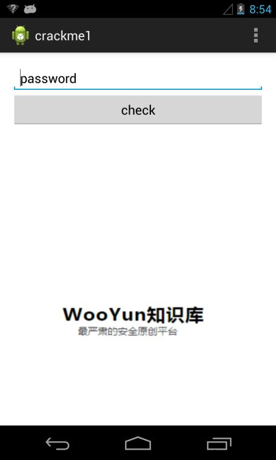
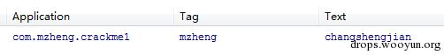
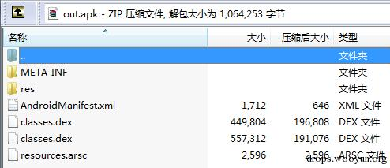

原文 by 蒸米  
## 0x00 序

随着移动安全越来越火，各种调试工具也都层出不穷，但因为环境和需求的不同，并没有工具是万能的。另外工具是死的，人是活的，如果能搞懂工具的原理再结合上自身的经验，你也可以创造出属于自己的调试武器。因此，笔者将会在这一系列文章中分享一些自己经常用或原创的调试工具以及手段，希望能对国内移动安全的研究起到一些催化剂的作用。  


##0x01 长生剑

长生剑是把神奇的剑，为白玉京所配，剑名取意来自于李白的诗：“仙人抚我顶，结发受长生。”长生剑是七种武器系列的第一种武器，而笔者接下来所要介绍的调试方法也是我最早学习的调试方法，并且这种方法就像长生剑一样，简单并一直都有很好的效果。这种方法就是Smali Instrumentation，又称Smali 插桩。使用这种方法最大的好处就是不需要对手机进行root，不需要指定android的版本，如果结合一些tricks的话还会有意想不到的效果。  

## 0x02 Smali/baksmali

做安卓逆向最先接触到的东西肯定就是smali语言了，smali最早是由Jasmin提出，随后jesusfreke开发了最有名的smali和baksmali工具将其发扬光大，几乎dex上所有的静态分析工具都是在这个项目的基础上建立的。什么？你没听说过smali和baksmali？你只用过Apktool？如果你仔细阅读了Apktool官网的说明你就会发现，Apktool其实只是一个将各种工具结合起来的懒人工具而已。并且笔者建议从现在起就抛弃Apktool吧。原因如下：首先，Apktool更新并没有smali/baksmali频繁，smali/baksmali更新后要过非长久的时间才会合并到Apktool中，在这之前你可能需要忍受很多诡异的bug。其次，Apktool在反编译或者重打包dex的时候，如果发生错误，仅仅只会提供错误的exception信息而已，但如果你使用smali/baksmali，工具会告诉你具体的出错原因，会对重打包后的调试有巨大的帮助。最后，很多apk为了对付反调试会在资源文件中加入很多junk code从而使得Apktool的解析崩溃掉，造成反编译失败或者无法重打包。但如果你仅对classes.dex操作就不会有这些问题了。  

学习smali最好的方法就是自己先用java写好程序，再用baksmali转换成smali语句，然后对照学习。比如下面就是java代码和用baksmali反编译过后的smali文件的对照分析。  

MZLog类主要是用Log.d()输出调试信息，Java代码如下：  
``` java
package com.mzheng;

public class MZLog {

    public static void Log(String tag, String msg)
    {
        Log.d(tag, msg);
    }

    public static void Log(Object someObj)
    {
        Log("mzheng", someObj.toString());
    }

    public static void Log(Object[] someObj)
    {
        Log("mzheng",Arrays.toString(someObj));
    }

}
```
对应的smali代码如下：  
```
.class public Lcom/mzheng/MZLog; # class的名字
.super Ljava/lang/Object;  #这个类继承的对象
.source "MZLog.java" # java的文件名

# direct methods #直接方法
.method public constructor <init>()V  #这是class的构造函数实现
    .registers 1 #这个方法所使用的寄存器数量

    .prologue  # prologue并没有什么用
    .line 7 #行号
invoke-direct {p0}, Ljava/lang/Object;-><init>()V #调用Object的构造方法，p0相当于"this" 指针
    return-void #返回空
.end method

.method public static Log(Ljava/lang/Object;)V # Log(Object)的方法实现
    .registers 3
    .param p0, "someObj"    # Ljava/lang/Object; 参数信息

    .prologue
    .line 16
    const-string v0, "mzheng"  #给v0赋值”mzheng”

    invoke-virtual {p0}, Ljava/lang/Object;->toString()Ljava/lang/String; #调用toString()函数

    move-result-object v1 #将toString()的结果保存在v1

    invoke-static {v0, v1}, Lcom/mzheng/MZLog;->Log(Ljava/lang/String;Ljava/lang/String;)V #调用MZLog的另一个Log函数，参数是v0和v1

    .line 17
    return-void
.end method

.method public static Log(Ljava/lang/String;Ljava/lang/String;)V #Log(String, String)的方法实现
    .registers 2
    .param p0, "tag"    # Ljava/lang/String;
    .param p1, "msg"    # Ljava/lang/String;

    .prologue
    .line 11
    invoke-static {p0, p1}, Landroid/util/Log;->d(Ljava/lang/String;Ljava/lang/String;)I #调用android API里的Log函数实现Log功能

    .line 12
    return-void
.end method

.method public static Log([Ljava/lang/Object;)V #Log(Object[])函数实现 ‘[’符号是数组的意思
    .registers 3
    .param p0, "someObj"    # [Ljava/lang/Object;

    .prologue
    .line 21
    const-string v0, "mzheng"

    invoke-static {p0}, Ljava/util/Arrays;->toString([Ljava/lang/Object;)Ljava/lang/String;  #将Object数组转换为String

    move-result-object v1 #转换后的结果存在v1中

    invoke-static {v0, v1}, Lcom/mzheng/MZLog;->Log(Ljava/lang/String;Ljava/lang/String;)V #调用Log(String, String)函数

    .line 22
    return-void
.end method
```
最后简单介绍一下smali常用的数据类型：  
```
V - void
Z - boolean
B - byte
S - short
C - char
I - int
J - long (64 bits)
F - float
D - double (64 bits)
```
## 0x03 Smali插桩  

如果仅仅用Smali来分析代码，效果其实不如用dex2jar和jd-gui更直观，毕竟看反编译的java代码要更容易一些。但Smali强大之处就是可以随心所欲的进行插桩操作。何为插桩，引用一下wiki的解释：程序插桩，最早是由J.C. Huang 教授提出的，它是在保证被测程序原有逻辑完整性的基础上在程序中插入一些探针（又称为“探测仪”），通过探针的执行并抛出程序运行的特征数据，通过对这些数据的分析，可以获得程序的控制流和数据流信息，进而得到逻辑覆盖等动态信息，从而实现测试目的的方法。下面我就来结合一个例子来讲解一下何如进行smali插桩。  

测试程序是一个简单的crackme (图1)。输入密码，然后点击check，如果密码正确会输出yes，否则输出no。  

  
图1 Crackme1的界面  

首先我们对crackme这个apk进行解压，然后反编译。我们会在MainActivity中看到一个getkey(String,int)函数。这个函数貌似非常复杂，我们暂时不管。我们首先分析一下点下button后的逻辑。我们发现程序会通过getkey("mrkxqcroxqtskx",42)来计算出真正的密码，然后与我们输人的密码进行比较，java代码如下：  
``` java
public void onClick(View arg0) {  
String str = editText0.getText().toString();
if (str.equals(getkey("mrkxqcroxqtskx",42)))
    {
        Toast.makeText(MainActivity.this,"Yes!", Toast.LENGTH_LONG).show();
    }
    else
    {
        Toast.makeText(MainActivity.this,"No!", Toast.LENGTH_LONG).show();                  }
}  
```
这时候就是smali插桩大显身手的时候了，我们可以通过插桩直接获取getkey("mrkxqcroxqtskx",42)这个函数的返回值，然后Log出来。这样我们就不需要研究getkey这个函数的实现了。具体过程如下：  

1 首先解压apk然后用baksmali进行反编译。  
``` bash
unzip crackme1.apk
java -jar baksmali-2.0.3.jar classes.dex
``` 
2 将上一节MZLog类的MZLog.smali文件拷贝到com/mzheng目录下，这个文件有3个LOG函数，分别可以输出String的值，Object的值和Object数组的值。注意，如果原程序中没有com/mzheng这个目录，你需要自己用mkdir创建一下。拷贝完后，目录结构如下：  
```
com
└─mzheng
    │  MZLog.smali
    │
    └─crackme1
            BuildConfig.smali
            MainActivity$1.smali
            MainActivity.smali
            R$attr.smali
            R$dimen.smali
            R$drawable.smali
            R$id.smali
            R$layout.smali
            R$menu.smali
            R$string.smali
            R$style.smali
            R.smali
```
3 用文本编辑器打开MainActivity$1.smali文件进行插桩。为什么是MainActivity$1.smali而不是MainActivity.smali呢？因为主要的判断逻辑是在OnClickListener这个类里，而这个类是MainActivity的一个内部类，同时我们在实现的时候也没有给这个类声明具体的名字，所以这个类用$1表示。加入MZLog.smali这个文件后，我们只需要在MainActivity$1.smali的第71行后面加上一行代码，invoke-static {v1}, Lcom/mzheng/MZLog;->Log(Ljava/lang/Object;)V，就可以输出getkey的值了。Invoke是方法调用的指令，因为我们要调用的类是静态方法，所以使用invoke-static。如果是非静态方法的话，第一个参数应该是该方法的实例，然后依次是各个参数。具体插入情况如下：  
```
const-string v1, "mrkxqcroxqtskx"

const/16 v2, 0x2a

# invokes: Lcom/mzheng/crackme1/MainActivity;->getkey(Ljava/lang/String;I)Ljava/lang/String;

invoke-static {v1, v2}, Lcom/mzheng/crackme1/MainActivity;->access$0(Ljava/lang/String;I)Ljava/lang/String;

move-result-object v1

############################## begin ##############################
invoke-static {v1}, Lcom/mzheng/MZLog;->Log(Ljava/lang/Object;)V
############################## end ###############################
invoke-virtual {v0, v1}, Ljava/lang/String;->equals(Ljava/lang/Object;)Z

move-result v1
```
4 用smali.jar重新编译修改后的smali文件，把新编译的classes.dex覆盖老的classes.dex，然后再用signapk.jar对apk进行签名。几条关键指令如下：  
``` bash
java -jar smali.jar out
java -jar signapk.jar testkey.x509.pem testkey.pk8 update.apk update_signed.apk
```
5 安装程序到android，随便输入点啥，然后点击check按钮，随后在logcat中就可以看到getkey("mrkxqcroxqtskx",42)这个函数的返回值了(图2)。  

   
图2 通过logcat获取getkey的返回值  

## 0x03 Smali修改

通过Smali/baksmali工具，我们不光可以插桩，还可以修改apk的逻辑。几个需要注意点如下：  

### 1. if条件判断以及跳转语句  

在smali中最常见的就是if这个条件判断跳转语句了，这个判断一共有12条指令：  
``` 
if-eq vA, VB, cond_** 如果vA等于vB则跳转到cond_**。相当于if (vA==vB)
if-ne vA, VB, cond_** 如果vA不等于vB则跳转到cond_**。相当于if (vA!=vB)
if-lt vA, VB, cond_** 如果vA小于vB则跳转到cond_**。相当于if (vA<vB)
if-le vA, VB, cond_** 如果vA小于等于vB则跳转到cond_**。相当于if (vA<=vB)
if-gt vA, VB, cond_** 如果vA大于vB则跳转到cond_**。相当于if (vA>vB)
if-ge vA, VB, cond_** 如果vA大于等于vB则跳转到cond_**。相当于if (vA>=vB)

if-eqz vA, :cond_** 如果vA等于0则跳转到:cond_** 相当于if (VA==0)
if-nez vA, :cond_** 如果vA不等于0则跳转到:cond_**相当于if (VA!=0)
if-ltz vA, :cond_** 如果vA小于0则跳转到:cond_**相当于if (VA<0)
if-lez vA, :cond_** 如果vA小于等于0则跳转到:cond_**相当于if (VA<=0)
if-gtz vA, :cond_** 如果vA大于0则跳转到:cond_**相当于if (VA>0)
if-gez vA, :cond_** 如果vA大于等于0则跳转到:cond_**相当于if (VA>=0)
```
比如我们在crackme1里判断密码是否正确的smali代码段：  
```
invoke-virtual {v0, v1}, Ljava/lang/String;->equals(Ljava/lang/Object;)Z

move-result v1

if-eqz v1, :cond_25  # if (v1==0)

iget-object v1, p0, Lcom/mzheng/crackme1/MainActivity$1;->this$0:Lcom/mzheng/crackme1/MainActivity;

const-string v2, "Yes!"

invoke-static {v1, v2, v3}, Landroid/widget/Toast;->makeText(Landroid/content/Context;Ljava/lang/CharSequence;I)Landroid/widget/Toast;

move-result-object v1

invoke-virtual {v1}, Landroid/widget/Toast;->show()V

:cond_25
iget-object v1, p0, Lcom/mzheng/crackme1/MainActivity$1;->this$0:Lcom/mzheng/crackme1/MainActivity;

const-string v2, "No!"

invoke-static {v1, v2, v3}, Landroid/widget/Toast;->makeText(Landroid/content/Context;Ljava/lang/CharSequence;I)Landroid/widget/Toast;

move-result-object v1

invoke-virtual {v1}, Landroid/widget/Toast;->show()V
```
如果我们不关心密码内容，只是希望程序输出”yes”的话。我们可以把if-eqz v1, :cond_25改成if-nez v1, :cond_25。这样逻辑就变为：当输错密码的时候，程序反而会输出”yes”。  

### 2. 寄存器问题

修改Smali时有一件很重要的事情就是要注意寄存器。如果乱用寄存器的话可能会导致程序崩溃。每个方法开头声明了registers的数量，这个数量是参数和本地变量总和。参数统一用P表示。如果是非静态方法p0代表this，p1-pN代表各个参数。如果是静态方法的话，p0-pN代表各个参数。本地变量统一用v表示。如果想要增加的新的本地变量，需要在方法开头的registers数量上增加相应的数值。  

比如下面这个方法：  
```
.method public constructor <init>()V
    .registers 1

    .prologue
    .line 7
    invoke-direct {p0}, Ljava/lang/Object;-><init>()V

    return-void
.end method
```
因为这不是静态方法，所以p0代表this。如果想要增加一个新的本地变量，比如v0。就需要把.registers 1改为.registers 2。  

### 3. 给原程序增加大量逻辑的办法

我非常不建议在程序原有的方法上增加大量逻辑，这样可能会出现很多寄存器方面的错误导致编译失败。比较好的方法是：把想要增加的逻辑先用java写成一个apk，然后把这个apk反编译成smali文件，随后把反编译后的这部分逻辑的smali文件插入到目标程序的smali文件夹中，然后再在原来的方法上采用invoke的方式调用新加入的逻辑。这样的话不管加入再多的逻辑，也只是修改了原程序的几行代码而已。这个思路也是很多重打包病毒惯用的伎俩，确实非常方便好用。  

## 0x04 APK签名Tricks

当我们在实战中，有时会碰到某些apk在内部实现了自己的签名检查。这次我们介绍的Smali Instrumentation方法因为需要重打包，所以会改变原有的签名。当然，你可以通过修改apk把签名检查的逻辑删掉，但这又费时又费力。笔者在这里简单介绍两种非常方便的方法来解决签名检查问题。  

### 1. Masterkey

Masterkey漏洞一共有三个，可以影响android 4.4以下版本。利用这个漏洞，我们可以插入新的classes.dex替换掉原有的classes.dex而不需要对apk本身进行重新签名。如果apk本身有签名校验逻辑的话，利用这个漏洞来进行Smali Instrumentation简直再好不过了。首先，你需要一个android 4.4以下版本的虚拟机或者真机，然后再使用一个masterkey利用工具对apk进行exploit即可。工具下载地址在文章最后，使用的命令如下：  

`java -jar AndroidMasterKeys.jar -a orig.apk -z moddedClassesDex.zip -o out.apk`
orig.apk是原本的apk文件，moddedClassesDex.zip是修改后的classes.dex并压缩成zip文件，out.apk就是利用Masterkey漏洞生成的新的apk文件。如果成功的话用rar打开文件会看到两个classes.dex。  

     

图3 Masterkey生成的apk文件有两个classes.dex文件  

通过masterkey打包后的apk文件签名并不会有任何变化，这样也就不用担心签名校验问题了。  

### 2. 自定义ROM

签名的判断其实是调用了android系统密码库的函数，如果我们可以自己定制ROM的话，只需要修改AOSP源码路径下的`libcore\luni\src\main\java\java\security\MessageDigest.java` 文件。将isEqual函数中的判断语句注释掉：  
``` java
public static boolean isEqual(byte[] digesta, byte[] digestb) {
        if (digesta.length != digestb.length) {
            return false;
        }
//        for (int i = 0; i < digesta.length; i++) {
//            if (digesta[i] != digestb[i]) {
//                return false;
//            }
//        }
        return true;
}
```
这样的话，如果在你自定义的ROM上运行apk，无论你怎么修改classes.dex文件，都不需要关心签名问题了，系统会永远返回签名正确的。  

## 0x05 小结

虽然现在越来越多的apk开始使用so文件进行逻辑处理和加固，android 4.4也加入art运行环境，但dalvik永远是android最经典的东西。如果想要学好android逆向，一定要把这部分知识学好。并且把smali研究透彻以后，会对我们以后要讲的自定义dalvik虚拟机有很大帮助。另外文章中所有提到的代码和工具都可以在我的github下载到，地址是： https://github.com/zhengmin1989/TheSevenWeapons

## 0x06 参考文章

Way of the AndroidCracker http://androidcracking.blogspot.hk/p/way-of-android-cracker-lessons.html

Android Master Key Exploit – Uncovering Android Master Key

https://bluebox.com/technical/uncovering-android-master-key-that-makes-99-of-devices-vulnerable/

https://github.com/Fuzion24/AndroidZipArbitrage

Min Zheng, Patrick P. C. Lee, John C. S. Lui. "ADAM: An Automatic and Extensible Platform to Stress Test Android Anti-Virus Systems", DIMVA 2012