原文 by hqdvista   
## 0x00 前言 & 背景

还在对着smali和jdgui抓耳挠腮grep来grep去吗？本系列教程将围绕Soot和JEB,讲述Android应用的进阶分析,感受鸟枪换炮的快感.  

JEB是Android应用静态分析的de facto standard,除去准确的反编译结果、高容错性之外,JEB提供的API也方便了我们编写插件对源文件进行处理,实施反混淆甚至一些更高级的应用分析来方便后续的人工分析.本系列文章的前几篇将对JEB的API使用进行介绍,并实战如何利用开发者留下的蛛丝马迹去反混淆.先来看看我们最终编写的这个自动化反混淆插件实例的效果：  

反混淆前：  
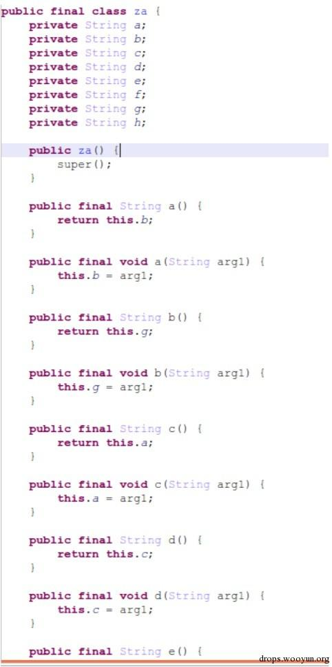      

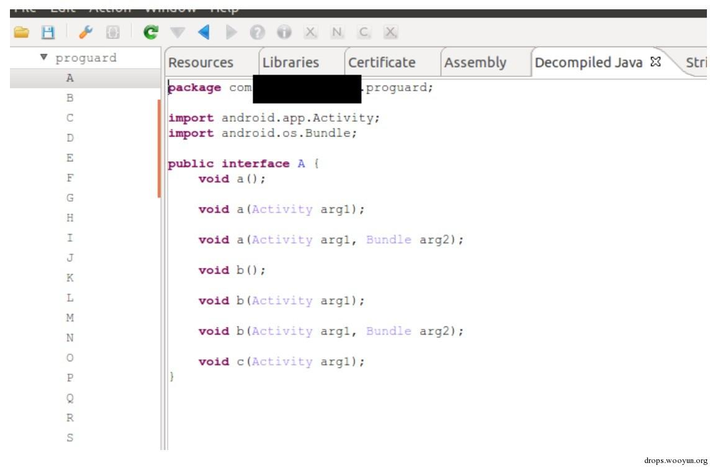    

反混淆后：   

    

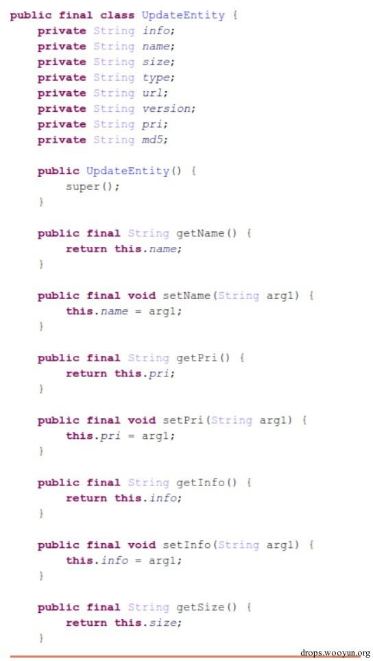    

可以看到很多类名和field名都被恢复出来了. 读者朋友肯定会好奇这是如何做到的, 那我们首先来看下JEB提供API的结构：  

## 0x01 JEB AST API结构

JEB的AST与Java的AST稍有不同,但大体还是很相似的,只是做了些简化.所有的AST Element实现jeb.api.ast.IElement,要么继承于jeb.api.ast.NonStatement,要么继承于jeb.api.ast.Statement.他们的关系如下图所示:  

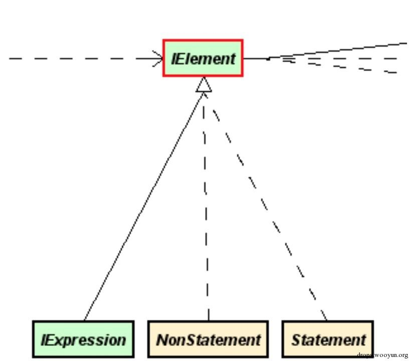  

IElement定义了getSubElements,但不同类型的实现和返回结果也不同,例如对Method进行getSubElements调用的返回会是函数的参数定义语句和函数体block,而IfStmt会返回判断使用的Predicate和每一个if/else/ifelse语句块.而一个Assignment语句则会返回左右IExpression操作数,以及Operator操作符.具体编写脚本中我们通常并不使用这个函数,而根据具体类型定义的更细致的函数,例如Assignment提供的getLeft和getRight.  

以下面的函数为例,我们来分析它具体由哪些AST元素组成.   
``` java
boolean isZtz162(Ztz ztz) {
    boolean bool = true;
    Redrain redrain = Redrain.getInstance("AnAn");
    if(redrain.canShoot()) {
        redrain.shoot(163);
        if(ztz.isDead()) {
            bool = false;
        }
    }
    else if(ztz.height + Integer.parseInt(ztz.shoe) > 162) {
        bool = false;
    }

    return bool;
}
```
首先来看下  

`NonStatement` 

在文档中, NonStatement的描述是Base class for AST elements that do not represent Statements. ,即所有不是Statement的AST结构继承于NonStatement,如下图所示：  

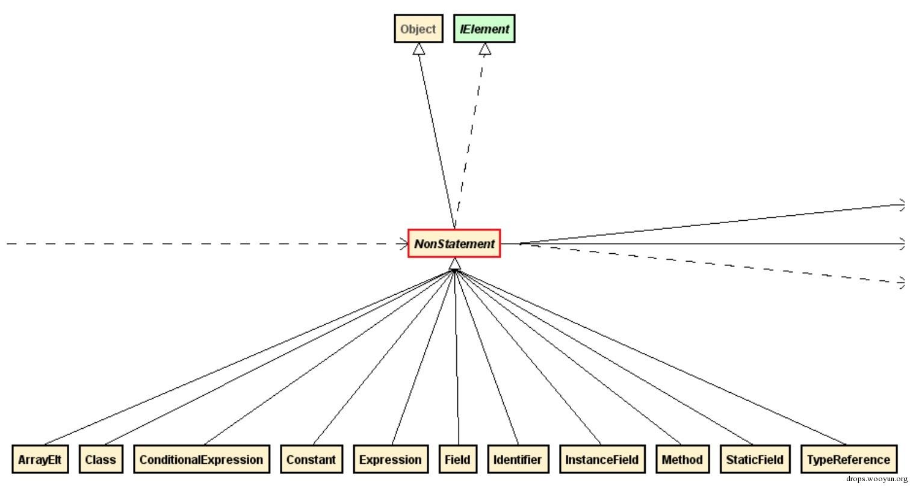  

NonStatement与Expression的区别在于,NonStatement包含了一些高阶结构,例如jeb.api.ast.Class, jeb.api.ast.Method这些并不会出现在语句中的AST结构体,他们分别代表一个Class结构和Method结构,注意不要与反射语句中使用的Class和Method混淆.  

`Statement`  

Statement顾名思义就代表了一个语句,但值得注意的是这里的语句并不代表单个语句,继承于Compound的Statement中也可能包含其他的 Statement.例如下面这段代码：  
``` java
if(ztz.isDead())//redundant statement to demonstrate if-else
{
    return false;
}
else{
    return true;
}
```
这事实上是一整个继承于Compound的IfStm,也就是Statement.  

Statement的继承关系图如下图所示  
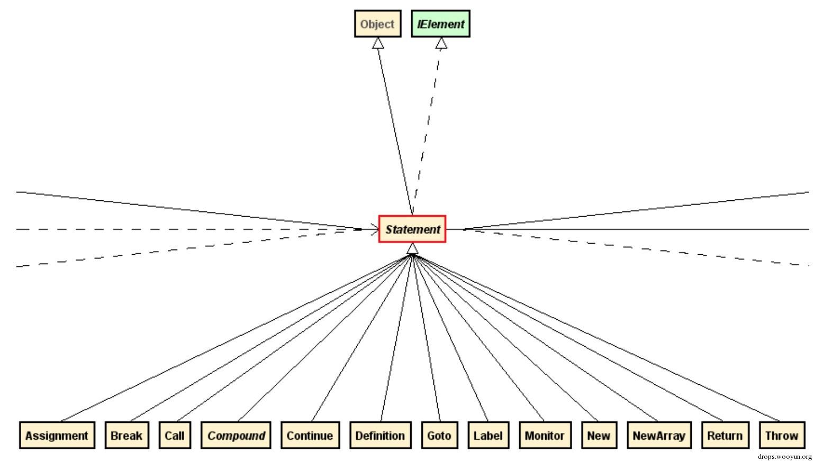  

非Compound的Statement是最基本的语句结构,它的子节点只会由Expression构成而不会包含block. 例如Assignment,可以通过getLeft和getRight调用获得左右两边的操作对象,分别为ILeftExpression和IExpression.ILeftExpression代表可以做左值的Expression,例如变量.而常量显然不实现ILeftExpression接口  

`Compound`

Compound代表多个语句集合的语法块集合,每一个语法块以Block（也是Compound的子类）呈现,通过getBlocks调用获得.所有分支语句均继承Compound,如下图所示：  

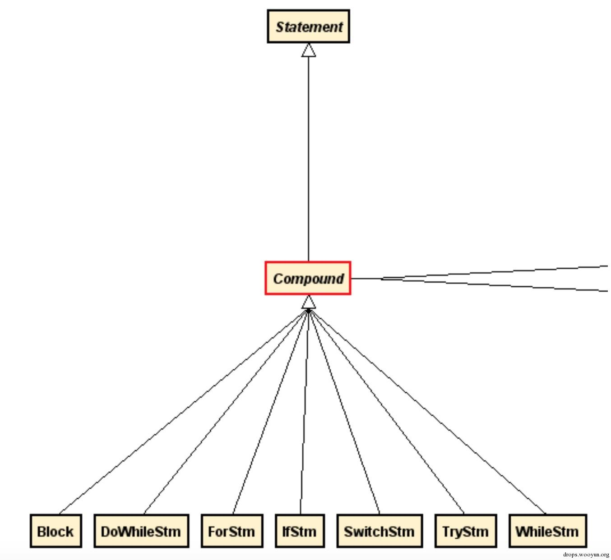  

在上面提到的例子中,IfStmt就是一个Compound,我们通过getBranchPredicate(idx)获取Predict,也就是ztz.isDead()这个Expression,而这个Expression真正的类型是子类Call.我们可以通过getBranchBody(idx)获取if和if-else中的Block,通过getDefaultBlock获取else的Block  

`IExpression`  

IExpression代表了最基本的AST节点,其实现关系如下图：  

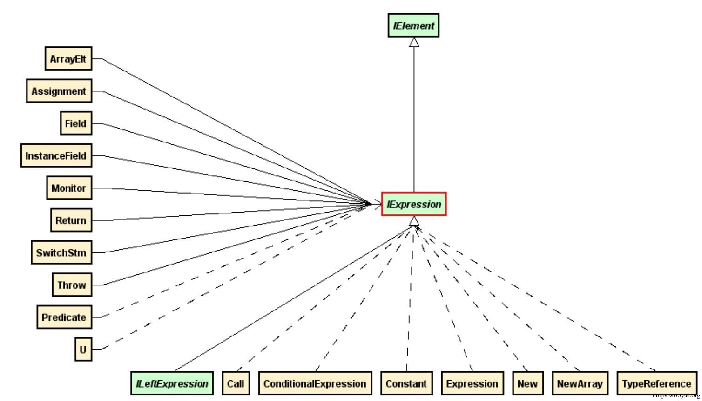  

IExpression接口的实现者Expression类代表了算术和逻辑运算的语句片段,例如a+b, "162" + ztz.toString(), !ztz, redrain*(ztz-162)等等,同时Predicate类是Expression类的直接子类,譬如在if(ztz162)中,该语句的Predicate左值为ztz162这个identifier,右值为null.  

以ztz.test(1) + ”height" + 162这个Expression为例,其结构组成和各节点类型如下：  

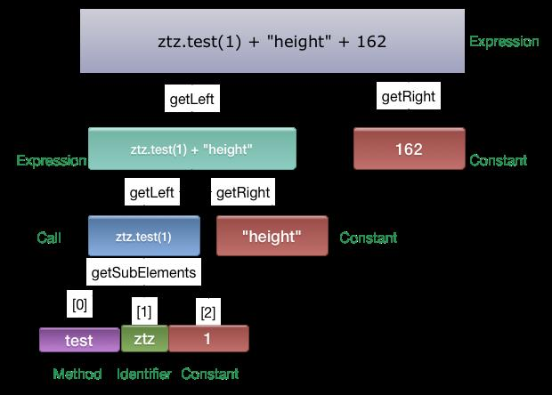  
 
值得注意的有如下几点：  

Expression是从右到左的结构  

Call没有提供获取caller的API,不过可以通过getSubElements()获取,返回顺序为  

callee method  
calling instance (if instance call)  
calling arguments, one by one  
InstanceField, StaticField和Field  

三者的关系如下图所示： 

  

InstanceField和StaticField包含Field. InstanceField通过getInstance调用获取一个IExpression,也就是Field的container. Field本身是Class的元素,而InstanceField与StaticField则是它的具体实例化.  

实例Method分析  

以我们上面提到的isZtz162函数为例,它的AST结构如下：  
```
- jeb.api.ast.Method  (getName() == "isZtz162") => getBody()
    - Block => block.get(i) //遍历block中的语句
        - Assignment "boolean bool = true"  => getSubElements
            - Definition "boolean bool"
                - Identifier "bool"
            - Constant "true"
        - Assignment "Redrain redrain = Redrain.getInstance("AnAn");"  => getSubElements
            - Definition => getSubElements (注意它是父assignment的getLeft返回结果(左值))
                - Identifier "redrain"
            - Call "Redrain.getInstance("AnAn)"" (注意它是父assignment的getRight返回结果(右值))
                - ...(omit)
        - IfStmt (Compound) => getBlocks()
            - Block (if block) => block.get(i) 遍历block中的语句
                - Call "redrain.shoot(163);"
                - IfStmt (Compound) 
                    - ...omit
            - Block (elseif block) => block.get(i) 遍历block中的语句
                - Assignment "bool = false'"
                - ..omit
```
可以通过如下代码来递归打印一个Method中的各个Element:  
``` python
class test(IScript):

def run(self, j):
    self.instance = j
    sig = self.instance.getUI().getView(View.Type.JAVA).getCodePosition().getSignature()
    currentMethod = self.instance.getDecompiledMethodTree(sig)
    self.instance.print("scanning method: " + currentMethod.getSignature())

    body = currentMethod.getBody()
    self.instance.print(repr(body))
    for i in range(body.size()):
        self.viewElement(body.get(i),1)

def viewElement(self, element, depth):
    self.instance.print("    "*depth+repr(element))
    for sub in element.getSubElements():
        self.viewElement(sub, depth+1)
```
输出结果如下：  
```
jeb.api.ast.Block@5909b311
    jeb.api.ast.Assignment@bcb4ec2
        jeb.api.ast.Definition@66afd874
            jeb.api.ast.Identifier@38ffa6bd
        jeb.api.ast.Constant@181bdf87
    jeb.api.ast.Assignment@4df0246e
        jeb.api.ast.Definition@50e7d9bb
            jeb.api.ast.Identifier@2587ad7c
        jeb.api.ast.Call@6e8ebb23
            jeb.api.ast.Method@5ca02f89
                jeb.api.ast.Definition@1890fae1
                    jeb.api.ast.Identifier@5646d660
                jeb.api.ast.Block@44a464e0
            jeb.api.ast.Constant@4dad155
    jeb.api.ast.IfStm@298ea172
        jeb.api.ast.Predicate@530958ae
            jeb.api.ast.Call@a9d3219
                jeb.api.ast.Method@56440cc0
                    jeb.api.ast.Definition@da13d7f
                        jeb.api.ast.Identifier@54cc63d6
                    jeb.api.ast.Block@36aea218
                jeb.api.ast.Identifier@2587ad7c
        jeb.api.ast.Predicate@313f1b4
            jeb.api.ast.Expression@12616200
                jeb.api.ast.InstanceField@3768f76d
                    jeb.api.ast.Identifier@4c4c3186
                    jeb.api.ast.Field@198ed96b
                jeb.api.ast.Call@71640ce8
                    jeb.api.ast.Method@5f8b8d80
                    jeb.api.ast.InstanceField@42f6ff81
                        jeb.api.ast.Identifier@4c4c3186
                        jeb.api.ast.Field@6600907f
            jeb.api.ast.Constant@2f0eb62a
        jeb.api.ast.Block@6ed99788
            jeb.api.ast.Call@f6b9a93
                jeb.api.ast.Method@617130cd
                    jeb.api.ast.Definition@4e3b14b5
                        jeb.api.ast.Identifier@8cc9f33
                    jeb.api.ast.Definition@31e7d1c8
                        jeb.api.ast.Identifier@6a7dbb10
                    jeb.api.ast.Block@64844e0e
                jeb.api.ast.Identifier@2587ad7c
                jeb.api.ast.Constant@2a20acb0
            jeb.api.ast.IfStm@47296c6b
                jeb.api.ast.Predicate@708d094c
                    jeb.api.ast.Call@3b5d964e
                        jeb.api.ast.Method@7d36f954
                            jeb.api.ast.Definition@242b3a05
                                jeb.api.ast.Identifier@11ee30d0
                            jeb.api.ast.Block@2cc6b0e2
                        jeb.api.ast.Identifier@4c4c3186
                jeb.api.ast.Block@2886dc65
                    jeb.api.ast.Assignment@2def7fac
                        jeb.api.ast.Identifier@38ffa6bd
                        jeb.api.ast.Constant@46a70cc3
        jeb.api.ast.Block@136fa72
            jeb.api.ast.Assignment@407452fd
                jeb.api.ast.Identifier@38ffa6bd
                jeb.api.ast.Constant@46a70cc3
    jeb.api.ast.Return@14f4811a
        jeb.api.ast.Identifier@38ffa6bd
```
对AST结构的分析就到这里，本文选取了几种最典型的做了讲解.此外JEB还提供了jeb.api.dex,提供了对dex文件的操作API.由于这方面资料比较多,这里就先不赘述了.  

## 0x02 实例分析之开发环境配置

JEB原生支持Java和Python两种语言进行开发,后者的支持是通过Jython实现的.这里简便起见我们的例子均以Python为例.个人建议想使用前者的话最好使用Scala,否则Java本身实在太罗嗦了.  

Java  

在eclipse中配置好classpath中的library指向bin/jeb.jar,同时将javadoc路径指向jeb/doc/apidoc.zip即可.  
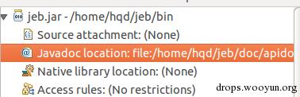  
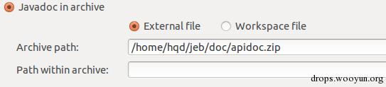  

Python  

Python环境配置相对麻烦点,因为JEB并没有提供相对应的skeleton,导致Python的IDE中默认没有代码补全,需要自行配置.笔者使用了PyCharm的JythonHelper插件,可以帮助生成skeleton从而有基本的代码补全.   

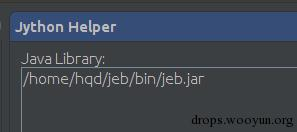  

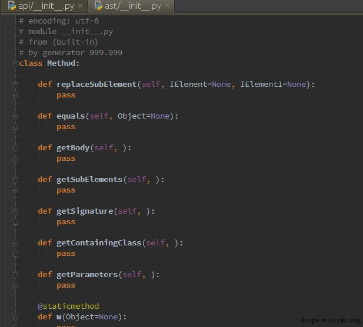  

配置好环境后,我们来编写一个最简单的插件：输出光标所在位置的method signature,代码如下所示：  
``` python
from jeb.api import IScript
from jeb.api.ui import View
class test(IScript):

    def run(self, j):
        self.instance = j
        sig = self.instance.getUI().getView(View.Type.JAVA).getCodePosition().getSignature()
        currentMethod = self.instance.getDecompiledMethodTree(sig)
        self.instance.print("scanning method: " + currentMethod.getSignature())
```
保存为test.py,点击File->Run Script->test.py, JEB就会在下面的console中输出当前光标所在函数的signature.  

## 0x03 总结

本文介绍了JEB Java AST API的基本知识和插件编写入门,同时也可以作为一个APIDoc的补充参考.在下一篇文章中我们将会根据实例讲解如何编写高级的更复杂的插件.  

源代码和测试样例在 https://github.com/flankerhqd/jebPlugins 可以找到。  

English version of this article can be found at http://blog.flanker017.me/advanced-android-application-analysis-jeb-api-manual-and-plugin-writing/ 