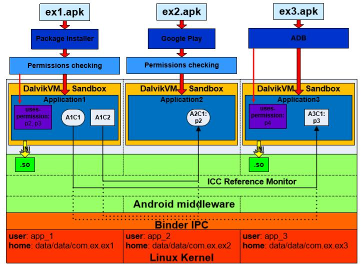

# 第二章 Android Linux 内核层安全

> 来源：[Yury Zhauniarovich | Publications](http://www.zhauniarovich.com/pubs.html)

> 译者：[飞龙](https://github.com/)

> 协议：[CC BY-NC-SA 4.0](http://creativecommons.org/licenses/by-nc-sa/4.0/)

作为最广为人知的开源项目之一，Linux 已经被证明是一个安全，可信和稳定的软件，全世界数千人对它进行研究，攻击和打补丁。 不出所料，Linux 内核是 Android 操作系统的基础[3]。 Android 不仅依赖于 Linux 的进程，内存和文件系统管理，它也是 Android 安全架构中最重要的组件之一。 在 Android 中，Linux 内核负责配置应用沙盒，以及规范一些权限。

## 2.1 应用沙盒

让我们考虑一个 Android 应用安装的过程。 Android 应用以 Android 软件包（`.apk`）文件的形式分发。 一个包由 Dalvik 可执行文件，资源，本地库和清单文件组成，并由开发者签名来签名。 有三个主要媒介可以在 Android 操作系统的设备上安装软件包：

+   Google Play
+   软件包安装程序
+   adb install 工具

Google Play 是一个特殊的应用，它为用户提供查找由第三方开发人员上传到市场的应用，以及安装该应用的功能。虽然它也是第三方应用，但 Google Play 应用（因为使用与操作系统相同的签名进行签名）可访问 Android 的受保护组件，而其他第三方应用则缺少这些组件。如果用户从其他来源安装应用，则通常隐式使用软件包安装程序。此系统应用提供了用于启动软件包安装过程的界面。由 Android 提供的`adb install`工具主要由第三方应用开发人员使用。虽然前两个媒介需要用户在安装过程中同意权限列表，但后者会安静地安装应用。这就是它主要用于开发工具的原因，旨在将应用安装在设备上进行测试。该过程如图 2.1 的上半部分所示。此图显示了 Android 安全体系结构的更详细的概述。我们将在本文中参考它来解释这个操作系统的特性。

在 Linux 内核层配置应用沙箱的过程如下。 在安装过程中，每个包都会被分配一个唯一的用户标识符（UID）和组标识符（GID），在设备的应用生命周期内不会更改。 因此，在 Android 中每个应用都有一个相应的 Linux 用户。 用户名遵循格式`app_x`，并且该用户的 UID 等于`Process.FIRST_APPLICATION_UID + x`，其中`Process.FIRST_APPLICATION_UID`常量对应于`10000`。例如，在图 2.1 中，`ex1.apk`包在安装期间获得了用户名`app 1`，UID 等于 `10001`。



图 2.1：Android 安全架构

在 Linux 中，内存中的所有文件都受 Linux 自定义访问控制（DAC）的约束。访问权限由文件的创建者或所有者为三种用户类型设置：文件的所有者，与所有者在同一组中的用户和所有其他用户。对于每种类型的用户，分配读，写和执行（`r-w-x`）权限的元组。因此，因为每个应用都有自己的 UID 和 GID，Linux 内核强制应用在自己的隔离地址空间内执行。除此之外，应用唯一的 UID 和 GID 由 Linux 内核使用，以实现不同应用之间的设备资源（内存，CPU 等）的公平分离。安装过程中的每个应用也会获得自己的主目录，例如`/data/data/package_name`，其中`package_name`是 Android 软件包的名称，例如`com.ex.ex1`，在 Android 中，这个文件夹是内部存储目录，其中应用将私有数据放在里面。分配给此目录的 Linu x 权限只允许“所有者"应用写入并读取此目录。有一些例外应该提到。使用相同证书签名的应用能够在彼此之间共享数据，可以拥有相同的 UID 或甚至可以在相同的进程中运行。

这些架构决策在 Linux 内核层上建立了高效的应用沙箱。 这种类型的沙箱很简单，并基于 Linux 可选访问控制模型（DAC）的验证。 幸运的是，因为沙盒在 Linux 内核层上执行，本地代码和操作系统应用也受到本章[3]中所描述的这些约束的约束。

## 2.2 Linux 内核层上的权限约束

通过将 Linux 用户和组所有者分配给实现此功能的组件，可以限制对某些系统功能的访问。 这种类型的限制可以应用于系统资源，如文件，驱动程序和套接字。 Android 使用文件系统权限和特定的内核补丁（称为 Paranoid Networking）[13]来限制低级系统功能的访问，如网络套接字，摄像机设备，外部存储器，日志读取能力等。

使用文件系统权限访问文件和设备驱动程序，可以限制进程对设备某些功能的访问。例如，这种技术被应用于限制应用对设备相机的访问。 `/dev/ cam`设备驱动程序的权限设置为`0660`，属于`root`所有者和摄像机所有者组。这意味着只有以`root`身份运行或包含在摄像机组中的进程才能读取和写入此设备驱动程序。因此，仅包括在相机组中的应用程序可以与相机交互。权限标签和相应组之间的映射在文件框架`/base/data/etc/platform.xml`中定义，摘录如清单 2.1 所示。因此，在安装过程中，如果应用程序已请求访问摄像机功能，并且用户已批准该应用程序，则还会为此应用程序分配一个摄像机 Linux 组 GID（请参阅清单 2.1 中的第 8 行和第 9 行）。因此，此应用程序可以从`/dev/cam`设备驱动程序读取信息。

```xml
 1 ...
 2 <permissions> 
 3 ...
 4 <permission name="android.permission.INTERNET" > 
 5 <group gid="inet" /> 
 6 </permission> 
 7 
 8 <permission name="android.permission.CAMERA" > 
 9 <group gid="camera" /> 
10 </permission> 
11 
12 <permission name="android.permission.READ_LOGS" > 
13 <group gid="log" />
14 </permission> 
15 ...
16 </permissions>
```

代码 2.1：权限标签和 Linux 组之间的映射

Android 中有一些地方可以用于设置文件、驱动和 Unix 套接字的文件系统权限：`init`程序，`init.rc`配置文件，`ueventd.rc`配置文件和系统 ROM 文件系统配置文件。 它们在第 3 章中会详细讨论。

在传统的 Linux 发行版中，允许所有进程启动网络连接。 同时，对于移动操作系统，必须控制对网络功能的访问。 为了在 Android 中实现此控制，需要添加特殊的内核补丁，将网络设施的访问限制于属于特定 Linux 组或具有特定 Linux 功能的进程。 这些针对 Android 的 Linux 内核补丁已经获得了 Paranoid 网络的名称。 例如，对于负责网络通信的`AF_INET`套接字地址族，此检查在`kernel/net/ipv4/af_inet.c`文件中执行（参见清单 2.2 中的代码片段）。 Linux 组和 Paranoid 网络的权限标签之间的映射也在`platform.xml`文件中设置（例如，参见清单 2.1 中的第 4 行）。

```c
 1 ...
 2 #ifdef CONFIG_ANDROID_PARANOID_NETWORK 
 3 #include <linux/android_aid.h> 
 4 
 5 static inline int current_has_network ( void ) 
 6 { 
 7   return in_egroup_p (AID_INET) || capable (CAP_NET_RAW) ; 
 8 } 
 9 #else 
10 static inline int current_has_network ( void ) 
11 { 
12   return 1; 
13 } 
14 #endif 
15 ... 
16 
17 /* 
18 * Create an inet socket . 
19 */ 
20 
21 static int inet create ( struct net *net , struct socket *sock , int protocol , 
22                          int kern ) 
23 { 
24   ...
25   if (!current_has_network() ) 
26     return −EACCES; 
27   ...
28 }
```

代码 2.2：Paranoid 网络补丁

类似的 Paranoid 网络补丁也适用于限制访问 IPv6 和蓝牙[19]。 

这些检查中使用的常量在内核中硬编码，并在`kernel/include/linux/android_aid.h`文件中规定（参见清单 2.3）。

```c
 1 ...
 2 #ifndef LINUX_ANDROID_AID_H 
 3 #define LINUX_ANDROID_AID_H 
 4 
 5 /* AIDs that the kernel treats differently */ 
 6 #define AID_OBSOLETE_000 3001 /* was NET_BT_ADMIN */ 
 7 #define AID_OBSOLETE_001 3002 /* was NET_BT */ 
 8 #define AID_INET 3003 
 9 #define AID_NET_RAW 3004 
10 #define AID_NET_ADMIN 3005 
11 #define AID_NET_BW_STATS 3006 /* read bandwidth statistics */ 
12 #define AID_NET_BW_ACCT 3007 /* change bandwidth statistics accounting */ 
13 
14 #endif
```

代码 2.3：硬编码在 Linux 内核中的 Android ID 常量

因此，在 Linux 内核层，通过检查应用程序是否包含在特殊预定义的组中来实现 Android 权限。 只有此组的成员才能访问受保护的功能。 在应用程序安装期间，如果用户已同意所请求的权限，则该应用程序包括在相应的 Linux 组中，因此获得对受保护功能的访问。