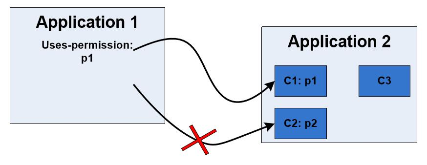

# 第五章 Android 应用层安全

> 来源：[Yury Zhauniarovich | Publications](http://www.zhauniarovich.com/pubs.html)

> 译者：[飞龙](https://github.com/)

> 协议：[CC BY-NC-SA 4.0](http://creativecommons.org/licenses/by-nc-sa/4.0/)


虽然在这一节中我们描述了应用层的安全性，但是实际的安全实施通常出现在到目前为止描述的底层。 但是，在介绍应用层之后，我们更容易解释 Android 的一些安全功能。

## 5.1 应用组件

Android 应用以 Android 软件包（`.apk`）文件的形式分发。 一个包由 Dalvik 可执行文件，资源文件，清单文件和本地库组成，并由应用的开发人员使用自签名证书签名。 每个 Android 应用由四个组件类型的几个组件组成：活动（Activity），服务（Service），广播接收器（Boardcast Reciver）和内容供应器（Content Provider）。 将应用分离为组件有助于应用的一部分在应用之间重用。

活动。 活动是用户界面的元素之一。 一般来说，一个活动通常代表一个界面。

服务。 服务是 Android 中的后台工作装置。 服务可以无限期运行。 最知名的服务示例是在后台播放音乐的媒体播放器，即使用户离开已启动此服务的活动。

广播接收器。 广播接收器是应用的组件，它接收广播消息并根据所获得的消息启动工作流。

内容供应器。 内容供应器是为应用提供存储和检索数据的能力的组件。 它还可以与另一应用共享一组数据。

因此，Android 应用由不同的组件组成，没有中央入口点，不像 Java 程序和`main`方法那样。 由于没有入口点，所有组件（广播接收器除外，它也可以动态定义）需要由应用的开发人员在`AndroidManifest.xml`文件中声明。 分离成组件使得我们可以在其它应用中使用组件。 例如，在清单 5.1 中，显示了一个应用的`AndroidManifest.xml`文件的示例。 此应用包含第 21 行中声明的一个`Activity`。其他应用可能会调用此活动，将此组件的功能集成到其应用中。

```xml
 1 <?xml version="1.0" encoding="utf−8"?> 
 2 <manifest xmlns:android="http://schemas.android.com/apk/res/android" 
 3   package="com.testpackage.testapp" 
 4   android:versionCode="1" 
 5   android:versionName="1.0" 
 6   android:sharedUserId="com.testpackage.shareduid" 
 7   android:sharedUserLabel="@string/sharedUserId" >
 8 
 9   <uses−sdk android:minSdkVersion="10" /> 
10 
11   <permission android:name="com.testpackage.permission.mypermission" 
12     android:label="@string/mypermission_string" 
13     android:description="@string/mypermission_descr_string" 
14     android:protectionLevel="dangerous" /> 
15 
16   <uses−permission android:name="android.permission.SEND_SMS"/> 
17 
18   <application 
19     android:icon="@drawable/ic_launcher" 
20     android:label="@string/app_name" > 
21     <activity android:name=".TestActivity" 
22       android:label="@string/app_name" 
23       android:permission="com.testpackage.permission.mypermission" > 
24       <intent−filter> 
25         <action android:name="android.intent.action.MAIN" /> 
26         <category android:name="android.intent.category.LAUNCHER" /> 
27       </intent−filter> 
28       <intent−filter> 
29         <action android:name="com.testpackage.testapp.MY_ACTION" /> 
30         <category android:name="android.intent.category.DEFAULT" /> 
31       </intent−filter> 
32     </activity> 
33   </application> 
34 </manifest>
```

代码 5.1：`AndroidManifest.xml`文件示例

Android 提供了各种方式来调用应用的组件。 我们可以通过使用方法`startActivity`和`startActivityForResult`启动新的活动。 服务通过`startService`方法启动。 在这种情况下，被调用的服务调用其方法`onStart`。 当开发人员要在组件和服务之间建立连接时，它调用`bindService`方法，并在被调用的服务中调用`onBind`方法。 当应用或系统组件使用`sendBroadcast`，`sendOrderedBroadcast`和`sendStickyBroadcast`方法发送特殊消息时，将启动广播接收器。

内容供应器由来自内容解析器的请求调用。所有其他组件类型通过`Intent`（意图）激活。 意图是 Android 中基于`Binder`框架的特殊通信手段。意图被传递给执行组件调用的方法。被调用的组件可以被两种不同类型的意图调用。为了显示这些类型的差异，让我们考虑一个例子。例如，用户想要在应用中选择图片。应用的开发人员可以使用显式意图或隐式意图来调用选择图片的组件。对于第一种意图类型，开发人员可以在他的应用的组件中实现挑选功能，并使用带有组件名称数据字段的显式意图调用此组件。当然，开发人员可以调用其他应用的组件，但是在这种情况下，他必须确保该应用安装在系统中。一般来说，从开发人员的角度来看，一个应用中的组件或不同应用的组件之间的交互不存在差异。对于第二种意图类型，开发人员将选择适当组件的权利转移给操作系统。 `intent`对象在其`Action`，`Data`和`Category`字段中包含一些信息。根据这个信息，使用意图过滤器，操作系统选择可以处理意图的适当组件。意图过滤器定义了组件可以处理的意图的“模板"。当然，相同的应用可以定义一个意图过滤器，它将处理来自其他组件的意图。

## 5.2 应用层的权限

权限不仅用于保护对系统资源的访问。 第三方应用的开发人员还可以使用自定义权限来保护对其应用的组件的访问。 自定义权限声明的示例如清单 5.1 中第 11 行所示。自定义权限的声明类似于系统权限之一。

为了说明自定义权限的用法，请参考图 5.1。由 3 个组件组成的应用 2 希望保护对其中两个的访问：C1 和 C2。为了实现这个目标，应用 2 的开发者必须声明两个权限标签`p1`，`p2`，并相应地将它们分配给受保护的组件。如果应用 1 的开发者想要访问应用 2 的组件 C1 ，则他必须定义他的应用需要权限`p1`。在这种情况下，应用 1 就可以使用应用 2 的组件 C1。如果应用没有指定所需的权限，则禁止访问受此权限保护的组件（参见图 5.1 中组件 C2 的情况）。回头看看我们在代码 5.1 中的`AndroidManifest.xml`文件的例子，活动`TestActivity`被权限`com.testpackage.permission.mypermission`保护，它在同一个应用清单文件中声明。如果另一个应用想要使用`TestActivity`提供的功能，它必须请求使用此权限，类似于第 16 行中的操作。



图 5.1：保护第三方应用组件的权限实施

`ActivityManagerService`负责调用应用的组件。 为了保证应用组件的安全性，在用于调用组件的框架方法（例如，5.1 节中描述的`startActivity`）中，放置特殊的钩子。 这些钩子检查应用是否有权调用组件。 这些检查以`PackageManagerServer`类的`CheckUidPermission`方法结束（参见清单 4.6）。 因此，发生在 Android 框架层的实际的权限实施，可以看做 Android 操作系统的受信任部分。 因此，应用不能绕过检查。 有关如何调用组件和权限检查的更多信息，请参见[8]。