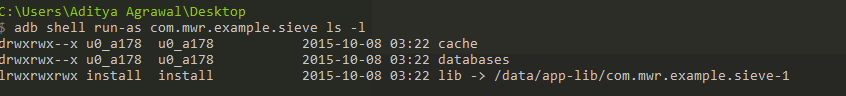

最近想扩展学习下 Android 应用安全，找到一份[入门指引](https://manifestsecurity.com/android-application-security/)  ，大概走了一遍，有一些注意的点且记下。

1. 建议下载的 Appie 版本为 [2.0](https://sourceforge.net/projects/appiefiles/files/Appie2.zip/download)，因为作者写这些文章时用的是2.0 版本，亲试使用3.1版本时 goat droid 等 app 的 db 都是损坏的。如果在 cmd 内 goatdroid 执行不了，可以找到 jar 文件并 java -jar xx.jar 启动它

2. 在 drozer 启动时出现找不到java 的 错误，可以在用户家目录如 C:\Users\simbazhang 下建立 .drozer_config 文件，内容如下：
```
[executables]
java = D:\Java\jdk1.8.0_91\bin\java.exe
[executables]
javac = D:\Java\jdk1.8.0_91\bin\javac.exe
```
cd drozer 所在目录(如D:\Appie\Appie\vendor\drozer）再执行 drozer console connect, 否则执行命令 list 可能提示没有module，对某个module 使用时  run app.package.info –help

3. 使用 virtualbox 启动 genymotion avd 时，设置 network 为 adaptor1为host-only（允许全部访问），在全局config 建立一个nat 网络，将network adaptor2 设置为nat；若宿主机还需要使用代理才能访问网络，则在 avd wifi 中也需要长按设置下代理（或者为 burpsuite）

4. 在使用 adb 安装一些 apk 到 avd 时提示 arm_abi  冲突，需要安装下 [genymotion-arm-translation_v1.1.zip](http://download.csdn.net/detail/wjr2012/9017005)，下载后将其拖动到 avd 界面安装即可

5. 在登录 goatdroid、herd financial 等 app 时需要设置下server ip port 即 宿主机的 ip，port 默认是 9888。如果不知道用户名密码则在 goatdroid service 界面找下 db 所在，查询下已有用户名和密码，一般有个默认用户 goatdroid : goatdroid

6. 第12章中说可以绕过登录页面直接启动 intent-filter 出来的主页，但貌似用户主页是在 activities.Home，此 activity 外部调用不了

7. 安装 Genymotion 时最好用打包 virtualbox 的版本，settings 设置下代理网络（如果需要），设置下sdk 地址（即 appie2 目录下
某位置，如D:\Appie2\Appie\bin\adt\sdk）

8. cmd 中 adb devices 启动时如果报错端口占用，可能是还有另外一份 sdk（比如 android studio）并开启了 adb。

9. 单独使用 SDK Manager 时需要设置下代理。使用 android studio 时设置 auto detect proxy 让其找到 pac 文件即可，但编译时需
要设置下 Gradle 的代理，在 gradle.properties 文件中配置 
```
systemProp.https.proxyHost=***REMOVED***
systemProp.http.proxyHost=***REMOVED***
systemProp.https.proxyPort=8080
systemProp.http.proxyPort=8080
```
10. 测试android 应用安全常用工具  
adb (adb devices | adb shell | adb install | adb uninstall | adb push | adb pull | adb forward）  
drozer （模拟一个app 的方式与其他app 交互，adb forward tcp:31415 tcp:31415 ）  
That means for these tasks we won’t be needing a rooted device, and neither drozer need rooted device to run. All the attacks we will do from drozer console will be originated from drozer app to testing application on your device. So it is like attacking your Banking application installed on your phone from a malicious application also installed on the same device.  
apktool（反编译apk 成 smali 文件等）  
dex2jar （将apk 文件反编译成 jar 文件，即class 文件集合）  
jdgui（把jar 文件反编译成 java 源文件）  

11. android:debuggable  
Look for **android:debuggable** value in the AndroidManifest.xml file.  
In order to figure out which PID belong to our application, type **adb jdwp** before running the application you wanted to test.  
Now with the help of **run-as** binary we can execute commands as com.mwr.example.sieve application  
  
**Note: Above is the shell access of my personal phone which is not rooted.**  
Now you can extract the data or run an arbitary code using application permission like shown below.  
  

12. 开发者后门  
There are sometimes when developer put a backdoor to a particular application. He/She puts that because he doesn’t want somebody else to access that sensitive piece of Information and sometimes that backdoor is for debugging purposes.  
通过反编译成 java 源代码，查看某些 activity 也许可以发现一些登录的后门。  
