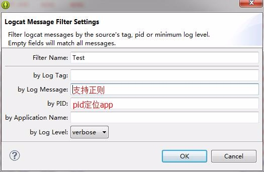
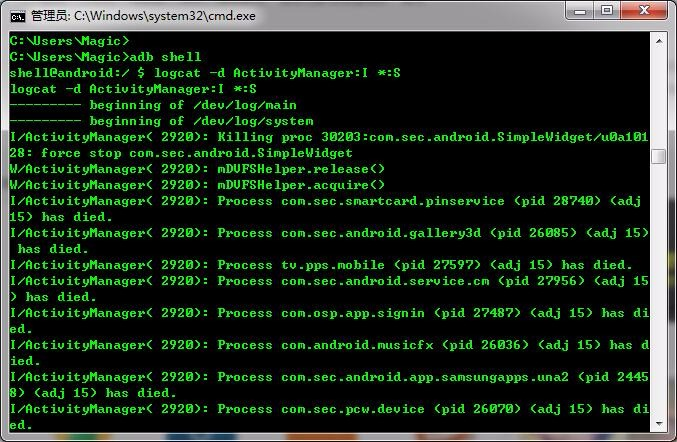
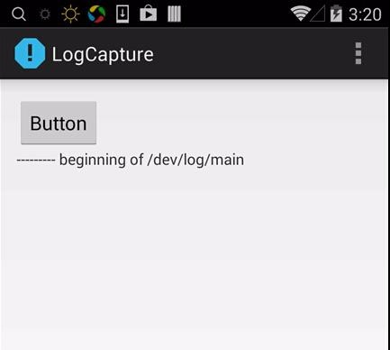
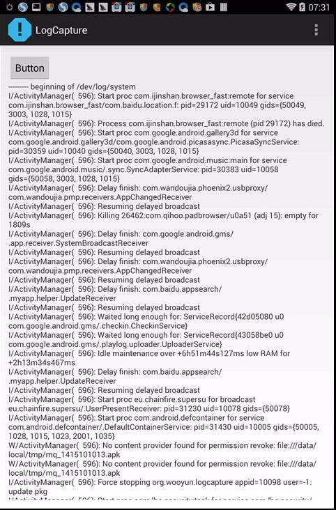
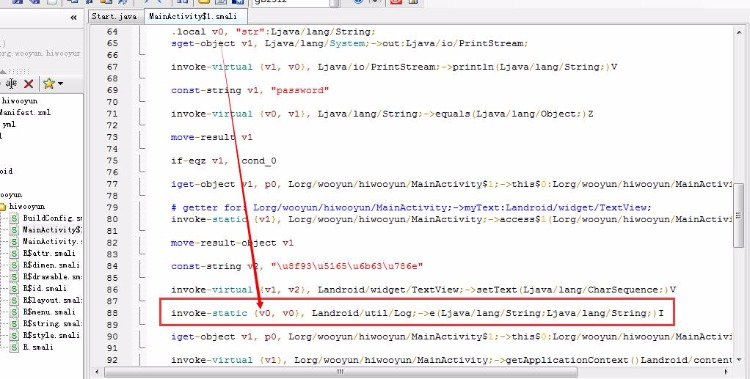
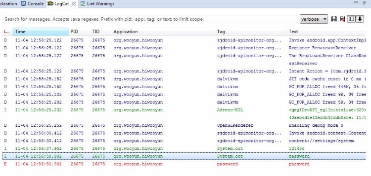
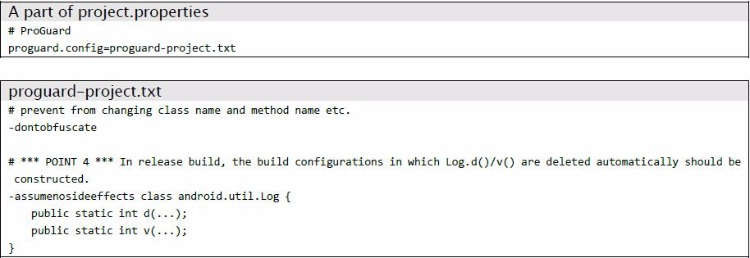
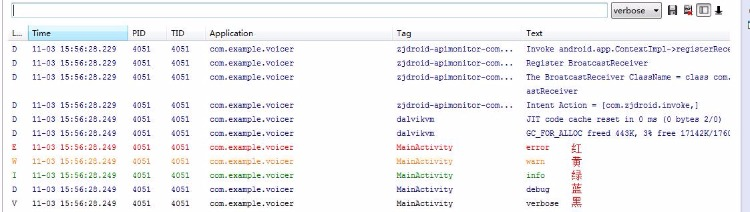
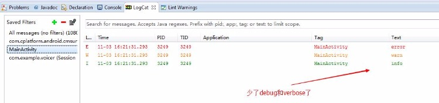
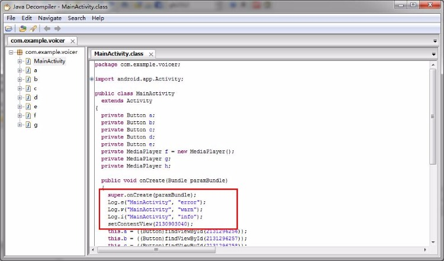

## 0x00 科普
development version ：开发版，正在开发内测的版本，会有许多调试日志。
release version ： 发行版，签名后开发给用户的正式版本，日志量较少。
android.util.Log：提供了五种输出日志的方法
Log.e(), Log.w(), Log.i(), Log.d(), Log.v()
ERROR, WARN, INFO, DEBUG, VERBOSE
android.permission.READ_LOGS:app 读取日志权限，android 4.1 之前版本通过申请 READ_LOGS 权限就可以读取其他应用的 log 了。但是谷歌发现这样存在安全风险，于是 android 4.1 以及之后版本，即使申请了 READ_LOGS 权限也无法读取其他应用的日志信息了。4.1版本中 Logcat 的签名变为 “signature|system|development” 了，这意味着只有系统签名的app或者root 权限的app 才能使用该权限。普通用户可以通过ADB 查看所有日志。

## 0x01 测试 

测试方法是非常简单的，可以使用sdk 中的小工具monitor 或者ADT 中集成的 logcat 来查看日志，将工具目录加入环境变量用起来比较方便。当然如果你想更有bigger 也可以使用 adb logcat。android 整体日志信息量是非常大的，想要高效一些就必须使用filter 来过滤一些无关信息，filter 是支持正则的，可以做一些关键字匹配比如 password、token、email 等。本来准备想做个小工具自动化收集，但是觉得这东西略鸡肋没太大必要，故本文的重点也是在如何安全地使用logcat 方面。  


当然也可以自己写个app 在直接在手机上抓取logcat，不过前面提到因为android系统原因如果手机是android4.1 或者之后版本，即使在manifest.xml 中加入了如下申请也是无法读取到其他应用的 log的。
`<uses-permission android:name="android.permission.READ_LOGS"/>`  


root 权限可以随便看logcat，所以“logcat 信息泄露”漏洞因谷歌在4.1上的动作变得很鸡肋了。  


## 0x02 smali注入logcat
将敏感数据在加密前打印出来就是利用静态 smali 注入插入了logcat 方法。 使用APK 反编译后用smali 注入非常方便，但要注意随意添加寄存器可能破坏本身逻辑，新手建议不添加寄存器直接使用已有的寄存器。
`invoke-static {v0, v0}, Landroid/util/Log;->e(Ljava/lang/String;Ljava/lang/String;)I`  



## 0x03 建议
有些人认为任何log 都不应该在发行版本打印。但是为了app 的错误采集，异常反馈，必要的日志还是要被输出的，只要遵循安全编码规范就可以将风险控制在最小范围。
Log.e()/w()/i()：建议打印操作日志
Log.d()/v()：建议打印开发日志
1、敏感信息不应用 Log.e()/w()/i(), System.out/err 打印。
2、如果需要打印一些敏感信息建议使用 Log.d()/v()。（前提：release版本将被自动去除）
```
@Override
public void onCreate(Bundle savedInstanceState) {
super.onCreate(savedInstanceState);
setContentView(R.layout.activity_proguard);
// *** POINT 1 *** Sensitive information must not be output by Log.e()/w()/i(), System.out/err.
Log.e(LOG_TAG, "Not sensitive information (ERROR)");
Log.w(LOG_TAG, "Not sensitive information (WARN)");
Log.i(LOG_TAG, "Not sensitive information (INFO)");
// *** POINT 2 *** Sensitive information should be output by Log.d()/v() in case of need.
// *** POINT 3 *** The return value of Log.d()/v()should not be used (with the purpose of substitution or comparison).
Log.d(LOG_TAG, "sensitive information (DEBUG)");
Log.v(LOG_TAG, "sensitive information (VERBOSE)");
}
```
3、Log.d()/v()的返回值不应被使用。（仅做开发调试观测）
```
Examination code which Log.v() that is specifeied to be deleted is not deketed
int i = android.util.Log.v("tag", "message");
System.out.println(String.format("Log.v() returned %d. ", i)); //Use the returned value of Log.v() for examination
```
4、release版apk 实现自动删除Log.d()/v()等代码。
eclipse中配置ProGuard  

开发版所有log 都打印出来了。  
  
发行版ProGuard 移除了d/v 的log
  
反编译后查看确实被remove了
  

5、公开的APK 文件应该是release 版而不是development 版。
## 0x04 native code
android.util.Log 的构造函数是私有的，并不会被实例化，只是提供了静态的属性和方法。 而android.util.Log 的各种Log 记录方法的实现都依赖于native 的实现 println_native()，Log.v()/Log.d()/Log.i()/Log.w()/Log.e() 最终都是调用了 println_native()。
```
Log.e(String tag, String msg)
public static int v(String tag, String msg) {
    return println_native(LOG_ID_MAIN, VERBOSE, tag, msg);
}

println_native(LOG_ID_MAIN, VERBOSE, tag, msg)
/*
 * In class android.util.Log:
 *  public static native int println_native(int buffer, int priority, String tag, String msg)
 */
static jint android_util_Log_println_native(JNIEnv* env, jobject clazz,
    jint bufID, jint priority, jstring tagObj, jstring msgObj)
{
const char* tag = NULL;
const char* msg = NULL;

if (msgObj == NULL) {
    jniThrowNullPointerException(env, "println needs a message");
    return -1;
}

if (bufID < 0 || bufID >= LOG_ID_MAX) {
    jniThrowNullPointerException(env, "bad bufID");
    return -1;
}

if (tagObj != NULL)
    tag = env->GetStringUTFChars(tagObj, NULL);
msg = env->GetStringUTFChars(msgObj, NULL);

int res = __android_log_buf_write(bufID, (android_LogPriority)priority, tag, msg);

if (tag != NULL)
    env->ReleaseStringUTFChars(tagObj, tag);
env->ReleaseStringUTFChars(msgObj, msg);

return res;
}
```
其中__android_log_buf_write() 又调用了write_to_log 函数指针。
```
static int __write_to_log_init(log_id_t log_id, struct iovec *vec, size_t nr)
{
#ifdef HAVE_PTHREADS
    pthread_mutex_lock(&log_init_lock);
#endif

    if (write_to_log == __write_to_log_init) {
        log_fds[LOG_ID_MAIN] = log_open("/dev/"LOGGER_LOG_MAIN, O_WRONLY);
        log_fds[LOG_ID_RADIO] = log_open("/dev/"LOGGER_LOG_RADIO, O_WRONLY);
        log_fds[LOG_ID_EVENTS] = log_open("/dev/"LOGGER_LOG_EVENTS, O_WRONLY);
        log_fds[LOG_ID_SYSTEM] = log_open("/dev/"LOGGER_LOG_SYSTEM, O_WRONLY);

        write_to_log = __write_to_log_kernel;

        if (log_fds[LOG_ID_MAIN] < 0 || log_fds[LOG_ID_RADIO] < 0 ||
            log_fds[LOG_ID_EVENTS] < 0) {
            log_close(log_fds[LOG_ID_MAIN]);
            log_close(log_fds[LOG_ID_RADIO]);
            log_close(log_fds[LOG_ID_EVENTS]);
            log_fds[LOG_ID_MAIN] = -1;
            log_fds[LOG_ID_RADIO] = -1;
            log_fds[LOG_ID_EVENTS] = -1;
            write_to_log = __write_to_log_null;
        }

        if (log_fds[LOG_ID_SYSTEM] < 0) {
            log_fds[LOG_ID_SYSTEM] = log_fds[LOG_ID_MAIN];
        }
    }

#ifdef HAVE_PTHREADS
    pthread_mutex_unlock(&log_init_lock);
#endif

    return write_to_log(log_id, vec, nr);
}
```
总的来说println_native() 的操作就是打开设备文件然后写入数据。

## 0x05 其他注意
1、使用Log.d()/v() 打印异常对象。（如SQLiteException 可能导致sql注入的问题）
2、使用android.util.Log 类的方法输出日志，不推荐使用 System.out/err
3、使用 BuildConfig.DEBUG ADT的版本不低于21
public final static boolean DEBUG = true;

在release 版本中会被自动设置为false
if (BuildConfig.DEBUG) android.util.Log.d(TAG, "Log output information");

4、启动Activity 的时候，ActivityManager会输出intent 的信息如下：

* 目标包名
* 目标类名
* intent.setData(URL)的URL


5、即使不用System.out/err 程序也有可能输出相关信息，如使用 Exception.printStackTrace()
6、ProGuard 不能移除如下log：("result:" + value).
Log.d(TAG, "result:" + value);

当遇到此类情况应该使用BulidConfig（注意ADT版本）
if (BuildConfig.DEBUG) Log.d(TAG, "result:" + value);

7、不应将日志输出到sdscard 中，这样会让日志变得全局可读

## 0x06 日志工具类
```
import android.util.Log;  

/** 
 * Log统一管理类 
 *  
 *  
 *  
 */ 
public class L  
{  

    private L()  
    {  
        /* cannot be instantiated */ 
        throw new UnsupportedOperationException("cannot be instantiated");  
    }  

    public static boolean isDebug = true;// 是否需要打印bug，可以在application的onCreate函数里面初始化  
    private static final String TAG = "way";  
  // 下面四个是默认tag的函数  
    public static void i(String msg)  
    {  
        if (isDebug)  
            Log.i(TAG, msg);  
    }  

    public static void d(String msg)  
    {  
        if (isDebug)  
            Log.d(TAG, msg);  
    }  

    public static void e(String msg)  
    {  
        if (isDebug)  
            Log.e(TAG, msg);  
    }  

    public static void v(String msg)  
    {  
        if (isDebug)  
            Log.v(TAG, msg);  
    }  
 // 下面是传入自定义tag的函数  
    public static void i(String tag, String msg)  
    {  
        if (isDebug)  
            Log.i(tag, msg);  
    }  

    public static void d(String tag, String msg)  
    {  
        if (isDebug)  
            Log.i(tag, msg);  
    }  

    public static void e(String tag, String msg)  
    {  
        if (isDebug)  
            Log.i(tag, msg);  
    }  

    public static void v(String tag, String msg)  
    {  
        if (isDebug)  
            Log.i(tag, msg);  
    }  
}
```
## 0x07 参考
http://www.jssec.org/dl/android_securecoding_en.pdf  
http://source.android.com/source/code-style.html#log-sparingly
http://developer.android.com/intl/zh-cn/reference/android/util/Log.html
http://developer.android.com/intl/zh-cn/tools/debugging/debugging-log.html
http://developer.android.com/intl/zh-cn/tools/help/proguard.html
https://www.securecoding.cert.org/confluence/display/java/DRD04-J.+Do+not+log+sensitive+information
https://android.googlesource.com/platform/frameworks/base.git/+/android-4.2.2_r1/core/jni/android_util_Log.cpp

