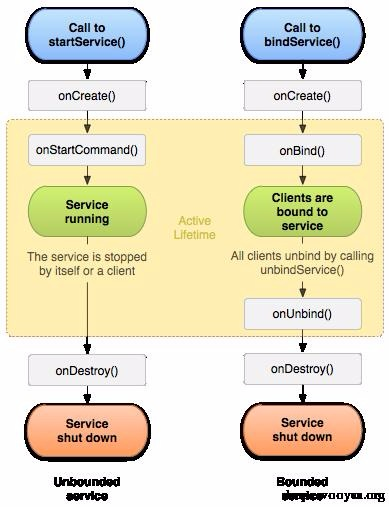
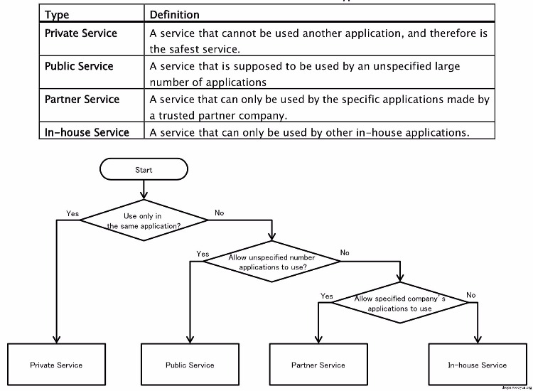
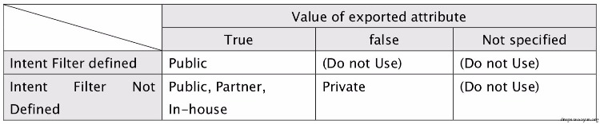
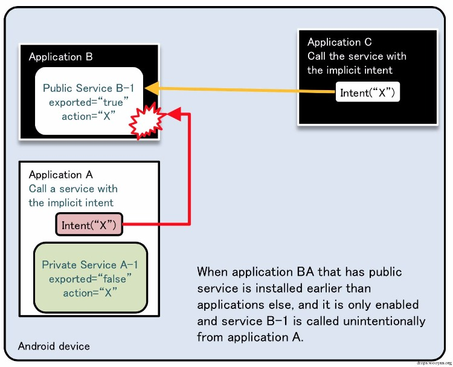

原文 by 瘦蛟舞 
## 0x00 科普
一个Service 是没有界面且能长时间运行于后台的应用组件．其它应用的组件可以启动一个服务运行于后台，即使用户切换到另一个应用也会继续运行．另外，一个组件可以绑定到一个service 来进行交互，即使这个交互是进程间通讯也没问题．例如，一个service可能处理网络通信，播放音乐，执行文件I/O，或与一个内容提供者交互，所有这些都在后台进行．

## 0x01 知识要点
### 生命周期


左图是startService() 创建service，右图是bindService() 创建service。 startService 与bindService 都可以启动Service，那么它们之间有什么区别呢？它们两者的区别就是使Service 的周期改变。

由startService 启动的Service必须要有stopService 来结束 Service，不调用stopService 则会造成Activity 结束了而Service 还运行着。bindService 启动的Service 可以由unbindService 来结束，也可以

在Activity 结束之后(onDestroy) 自动结束。

### 关键方法

* onStartCommand() 系统在其它组件比如activity 通过调用startService() 请求service启动时调用这个方法．一旦这个方法执行，service就启动并且在后台长期运行．如果你实现了它，你需要负责
在service 完成任务时停止它，通过调用stopSelf() 或 stopService()．(如果你只想提供绑定，你不需实现此方法)．

* OnBind() 当组件调用bindService()想要绑定到service 时(比如想要执行进程间通讯)系统调用此方法．在你的实现中，你必须提供一个返回一个IBinder 来以使客户端能够使用它与service 通讯，你必须总是实现这个方法，但是如果你不允许绑定，那么你应返回null．

* OnCreate() 系统在service第一次创建时执行此方法，来执行只运行一次的初始化工作(在调用它方法如onStartCommand()或onBind()之前)．如果service已经运行，这个方法不会被调用．

* OnDestroy() 系统在service不再被使用并要销毁时调用此方法．你的service应在此方法中释放资源，比如线程，已注册的侦听器，接收器等等．这是service收到的最后一个调用．

* public abstract boolean bindService (Intent service, ServiceConnection conn, int flags)
BindService中使用bindService()方法来绑定服务，调用者和绑定者绑在一起，调用者一旦(all)退出服务也就终止了.

* startService()
startService()方法会立即返回然后Android 系统调用service的onStartCommand() 方法．但是如果service 尚没有运行，系统会先调用onCreate()，然后调用onStartCommand().

* protected abstract void onHandleIntent (Intent intent)
调用工作线程处理请求

* public boolean onUnbind (Intent intent)
当所有client均从service发布的接口断开的时候被调用。默认实现不执行任何操作，并返回false。


### extends

1. Service
这是所有service的基类．当你派生这个类时，在service中创建一个新的线程来做所有的工作是十分重要的．因为这个service会默认使用你的应用的主线程(UI线程)，这将拉低你的应用中所有运行的activity 的性能

2. IntentService
这是一个Service的子类，使用一个工作线程来处理所有的启动请求，一次处理一个．这是你不需你的service 同时处理多个请求时的最好选择．你所有要做的就是实现onHandleIntent()，这个方法接收每次启动请求发来的intent，于是你可以做后台的工作．


### 表现形式

1. Started
一个service 在某个应用组件（比如一个activity)调用startService() 时就处于"started"状态（注意，可能已经启动了）．一旦运行后，service可以在后台无限期地运行，即使启动它的组件销毁了．通常地，一个startedservice执行一个单一的操作并且不会返回给调用者结果．例如，它可能通过网络下载或上传一个文件．当操作完成后，service自己就停止了

2. Bound
一个service在某个应用组件调用bindService()时就处于"bound"状态．一个boundservice提供一个client-server接口以使组件可以与service交互，发送请求，获取结果，甚至通过进程间通讯进行交叉进行这些交互．一个boundservice仅在有其它应用的组件绑定它时运行．多个应用组件可以同时绑定到一个service，但是当所有的自由竞争组件不再绑定时，service就销毁了．


### Bound Service
当创建一个提供绑定的service时，你必须提供一个客户端用来与service交互的IBinder．有三种方式你可以定义这个接口：

1. 从类Binder派生
如果你的service是你自己应用的私有物，并且与客户端运行于同一个进程中(一般都这样)，你应该通过从类Binder派生来创建你的接口并且从onBind()返回一它的实例．客户端接收这个Binder然后使用它来直接操作所实现的Binder甚至Service的公共接口．

2. 当你的service仅仅是一个后台工作并且仅服务于自己的应用时，这是最好的选择．唯一使你不能以这种方式创建你的接口的理由就是你的service被其它应用使用或者是跨进程的．


3. 使用一个Messenger
如果你需要你的接口跨进程工作，你可以为service 创建一个带有Messager 的接口．在此方式下，service 定义一个Handler 来负责不同类型的Message对象．这个Handler是Messenger可以与客户端共享一个IBinder 的基础，它允许客户端使用Message 对象发送命令给service．客户端可以定义一个自己的Messenger 以使service 可以回发消息．
这是执行IPC的最简单的方法，因为Messenger 把所有的请求都放在队列中依次送入一个线程中，所以你不必把你的service 设计为线程安全的

4. 使用AIDL
AIDL(Android 接口定义语言)执行把对象分解为操作系统能够理解并能跨进程封送的基本体以执行IPC的所有的工作．上面所讲的使用一个Messenger，实际上就是基于AIDL的．就像上面提到的，Messenger在一个线程中创建一个容纳所有客户端请求的队列，使用service一个时刻只接收一个请求．然而，如果你想要你的service同时处理多个请求，那么你可以直接使用AIDL．在此情况下，你的service必须是多线程安全的．
要直接使用AIDL，你必须创建一个.aidl文件，它定义了程序的接口．Android SDK 工具使用这个文件来生成一个实现接口和处理IPC的抽象类，之后你在你的service内派生它．

注：大多数应用不应使用AIDL来处理一个绑定的service，因为它可能要求有多线程能力并且导致实现变得更加复杂．同样的，AIDL也不适合于大多数应用，并且本文档不会讨论如何在你的service中使用它．如果你确定你需要直接使用AIDL，请看AIDL的文档．


### 注意
如果你打算只在本应用内使用自己的service，那么你不需指定任何intent 过滤器．不使用intent 过滤器，你必须使用一个明确指定service 的类名的intent 来启动你的service．
另外，你也可以通过包含android:exported属性，并指定其值为“false”来保证你的service是私有的．即使你的service使用了intent过滤器，也会起作用．
当一个service被启动后，它的生命期就不再依赖于启动它的组件并且可以独立运行于后台，即使启动它的组件死翘翘了．所以，service应该工作完成后调用stopSelf() 自己停止掉，或者其它组件也
可以调用stopService() 停止service． 如果service没有提供绑定功能，传给startService() 的intent是应用组件与service之间唯一的通讯方式．然而，如果你希望service回发一个结果，那么启动这个

service 的客户端可以创建一个用于广播(使用getBroadcast())的PendingIntent 然后放在intent 中传给service，service然后就可以使用广播来回送结果．

## 0x02 安全建议
### service分类
  

私有service:不能被其他应用调用,相对安全
公开service:可以被任意应用调用
合作service:只能被信任合作公司的应用调用
内部service:只能被内部应用调用

### intent-filter与exported组合建议
  

总结:
exported属性明确定义
私有service不定义intent-filter并且设置exported为false
公开的service设置exported为true,intent-filter可以定义或者不定义
内部/合作service设置exported为true,intent-filter不定义


### rule book

1. 只被应用本身使用的service应设置为私有

2. service接收到的数据需要谨慎处理

3. 内部service 需使用签名级别的protectionLevel 来判断是否是内部应用调用

4. 不应在service创建(onCreate方法被调用)的时候决定是否提供服务,应在 onStartCommand/onBind/onHandleIntent 等方法被调用的时候做判断.

5. 当service又返回数据的时候,应判断数据接收app是否有信息泄露的风险

6. 有明确的服务需调用时使用显式意图

7. 尽量不发送敏感信息

8. 合作service 需对合作公司的app 签名做效验


## 0x03 测试方法
1. service不像broadcast receicer，它只能静态注册,通过反编译查看配置文件Androidmanifest.xml即可确定service,若有导出的service则进行下一步

2. 方法查看service类,重点关注 onCreate/onStarCommand/onHandleIntent 方法

3. 检索所有类中 startService/bindService 方法及其传递的数据

4. 根据业务情况编写测试poc或者直接使用adb命令测试


## 0x04 案例
### 案例1：权限提升
乐phone手机出厂默认包含一个名为jp.aplix.midp.tools的应用包。本应用以system权限运行，并向其他应用提供ApkInstaller服务，用来进行对Apk文件的安装和删除。通过向ApkInstaller服务传递构造好的参数，没有声明任何权限的应用即可达到安装和删除任意Package的行为，对系统安全性产生极大影响。

``` java
Intent in = new Intent();

in.setComponent(new ComponentName("jp.aplix.midp.tools","jp.aplix.midp.tools.ApkInstaller"));

in.putExtra("action", "deleteApk");

in.putExtra("pkgName", "xxxxx");

startService(in);
```

### 案例2:services 劫持
攻击原理:隐式启动services,当存在同名services,先安装应用的services优先级高
攻击模型


### 案例3:拒绝服务
(java.lang.NullPointerException 空指针异常)
现在除了空指针异常crash外还多出了一类crash:intent 传入对象的时候,转化出现异常.
Serializable:
```
Intent i = getIntent();                            
if(i.getAction().equals("serializable_action"))
{ 
    i.getSerializableExtra("serializable_key");//未做异常判断
}
Parcelable:
this.b =(RouterConfig)  this.getIntent().getParcelableExtra("filed_router_config");//引发转型异常崩溃
```
POC内传入畸形数据即可引发crash,修复很简单捕获异常即可.

## 0x05 参考

http://developer.android.com/reference/android/app/Service.html  
http://developer.android.com/guide/components/services.html

