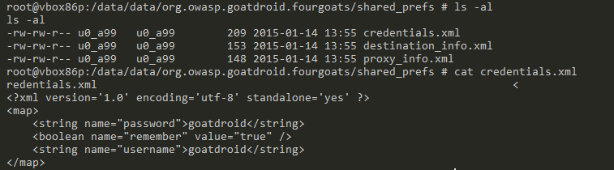
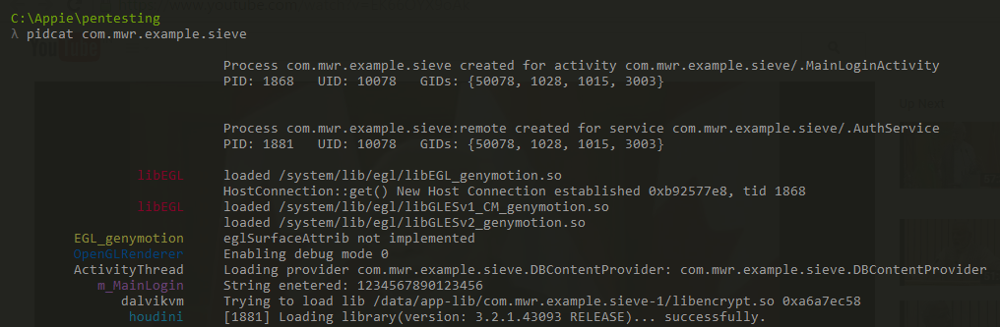

## 一、Weak Server Side Controls
客户端app 以 api 形式请求server 端服务，server 端的一些缺陷逻辑导致的漏洞，类似传统的 owasp web top 10。
how to fix
Secure coding and configuration practices must be used on server-side of the mobile application.

## 二、Insecure Data Storage
### Internal Storage
不要对 shared_prefs  目录下的文件使用 MODE_WORLD_READBALE & MODE_WORLD_WRITABLE 模式，如果要共享数据给其他app 读取，可以使用 content provider 并加以权限控制的方式。  
  
### External Storage
保存在 sd card 的文件都是全局可读写的，所以不要存储一些敏感数据。建议不要从外部存储中加载 class 等可执行文件，需要对读取的文件加以验证，比如签名鉴定等。
### content provider
见 [Android content provider](./Android%20Content%20Provider%20Security.md)
 

## 三、Insufficient Transport Layer Protection
Common Scenarios

* **Lack of Certificate Inspection**: Android Application fails to verify the identity of the certificate presented to it. Most of the application ignore the warnings and accept any self-signed certificate presented. Some Application instead pass the traffic through an HTTP connection.  
* **Weak Handshake Negotiation**: Application and server perform an SSL/TLS handshake but use an insecure cipher suite which is vulnerable to MITM attacks. So any attacker can easily decrypt that connection.  
* **Privacy Information Leakage**: Most of the times it happens that Applications do authentication through a secure channel but rest all connection through non-secure channel. That doesn’t add to security of application because rest sensitive data like session cookie or user data can be intercepted by an malicious user.  

What is certificate Pinning?

By default, when making an SSL connection, the client(android app) checks that the server’s certificate has a verifiable chain of trust back to a trusted (root) certificate and matches the requested hostname. This lead to problem of **Man in the Middle Attacks(MITM)**.  
In certificate Pinnning, an Android Application itself contains the certificate of server and only transmit data if the same certificate is presented.  

* There are some rare application which uses custom protocols instead of HTTP/HTTPS to transmit data. Either because of requirement or because to prevent interception through common techniques.  
* There are some ultra rare application’s which also encrpyts data before placing data in HTTP Request Body, which ultimately then passed through an SSL connection to the server.  

如果app 做了 certificate Pinning 验证，那么即使手机在安装了 burpsuite 的ca 证书的情况下，也不能拦截到https 请求。  

We will install [Android SSL-Trust-Killer](https://github.com/iSECPartners/Android-SSL-TrustKiller) application in the android device which will bypass SSL Certificate Pinning for nearly all application.

Make Sure [Cydia Substrate](http://www.cydiasubstrate.com/download/com.saurik.substrate.apk) is installed on the device/emulator.
* Download Android SSL-Trust-killer from [here](https://github.com/iSECPartners/Android-SSL-TrustKiller/releases/download/v1/Android-SSL-TrustKiller.apk).
* Install using **adb install Android-SSL-TrustKiller.apk**
* Restart the device/emulator using Cydia Substrate.
Now if you try to intercept then you can see most of traffic from nearly every app in BurpSuite .  

Most of the android security professionals uses Cydia Substrate and Android-SSL-TrustKiller for intercepting traffic but as Cydia Substrate is not supported after **Android 4.2.2** , it may be a problem to some users who want to pentest app which only works on Kitkat(Android 4.4.4) or Lollipop(Android 5.0.0) .

So i will be using a [Xposed Framework](http://repo.xposed.info/module/de.robv.android.xposed.installer) and [JustTrustMe](https://github.com/Fuzion24/JustTrustMe) which is an xposed framework module.

* First download Xposed Installer apk from [here](http://repo.xposed.info/module/de.robv.android.xposed.installer) and install on your device.
* Now download JustTrustMe apk from [here](https://github.com/Fuzion24/JustTrustMe/blob/master/bin/JustTrustMe.apk?raw=true) and install it on your device.
* Then open up your Xposed Installer App from your device and open modules in it. Then click on the checkbox to activate that module.

## 四、Unintended Data Leakage
### Logging
 [Pidcat](https://github.com/JakeWharton/pidcat) is a modified version of logcat with better viewing of logs.

### Copy/Paste Buffer Caching
Android provides clipboard-based framework to provide copy-paste function in android applications. But this creates serious issue when some other application can access the clipboard which contain some sensitive data.
How To Fix
Disable copy/paste function for sensitive part of the application. For example, disable copying credit card details.

### Crash Logs
If an application crashes during runtime and it saves logs somewhere then those logs can be of help to an attacker especially in cases when android application cannot be reverse engineered.
How To Fix
Avoid creating logs when applications crashes and if logs are sent over the network then ensure that they are sent over an SSL channel.

### Analytics Data Sent To 3rd Parties
Most of the application uses other services in their application like Google Adsense but sometimes they leak some sensitive data or the data which is not required to sent to that service. This may happen because of the developer not implementing feature properly.

You can look by intercepting the traffic of the application and see whether any sensitive data is sent to 3rd parties or not.

## 五、Poor Authentication And Authorization
1. 启动export 出来的activity，可以直接登录到用户首页，绕过了登录过程。
2. 输入不存在的用户名会提示不存在，输入存在的用户名会提示已注册，可以用于爆破（如果后端server逻辑没有做频率限制）。
3. 更换 userid 等可以任意登录其他人帐号。
4. 返回内容泄露设备 deviceid 等。

## 六、Broken Cryptography
So according to OWASP below are the scenarios which can occur in an application

* Poor Key Management Processes
The best encryption doesn’t matter when you do not handle keys properly.Below are some scenarios which are common in Application building:-
Including the keys in the same attacker-readable directory as the encrypted content
Making the keys otherwise available to the attacker
Avoid the use of hardcoded keys within your binary
* Creation and Use of Custom Encryption Protocols、
There is a Awesome library [Conceal](https://github.com/facebook/conceal) which was developed by Facebook suitable for Applications wanted to Encrypt large files in an efficient manner.
* Use of Insecure and/or Depcreated algorithms.
Some of the them are listed below:
RC4
MD4
MD5
SHA1

## 七、Client Side Injections
* **Javascript Injection**: The mobile browser is vulnerable
to javascript injection as well. Android default Browser has also access
to mobile applications cookies. If you have your Google account attached to device
then you can use your Google account in Android Browser without authentication.

* Several application interfaces or language functions can accept data and can be fuzzed to make applications crash. While most of these flaws do not lead to overflows because of the phone’s platforms being managed code, there have been several that have been used as a “userland” exploit in an exploit chain aimed at rooting or jailbreaking devices.
* Mobile malware or other malicious apps may perform a binary attack against the presentation layer (HTML, JavaScript, Cascading Style Sheets ) or the actual binary of the mobile app’s executable. These code injections are executed either by the mobile app’s framework or the binary itself at run-time.

How To Fix
* **SQL Injection**: When dealing with dynamic queries or Content-Providers ensure you are using parameterized queries.
* **JavaScript Injection(XSS)**: Verify that JavaScript and Plugin support is disabled for any WebViews (usually the default).
* **Local File Inclusion**: Verify that File System Access is disabled for any WebViews (`webview.getSettings().setAllowFileAccess(false);`).
* **Intent Injection/Fuzzing**: Verify actions and data are validated via an Intent Filter for all Activities.

## 八、Security Decisions via Untrusted Input
If any of the component is public then it can accessed from another application installed on the same device. In Android a activity/services/content provider/broadcast receiver is public when exported is set to true but a component is also public if the manifest specifies an Intent filter for it.   
However,developers can explicitly make components private (regardless of any intent filters) by setting the “exported” attribute to false for each component in the manifest file.  
Developers can also set the “permission” attribute to require a certain permission to access each component, thereby restricting access to the component.

[Android content provider](./Android%20Content%20Provider%20Security.md)
[Android activity](./Android%20Activity%20Security.md)
[Android broadcast](./Android%20Broadcast%20Security.md)
[Android services](./Android%20Service%20Security.md)

## 九、 Improper Session Handling
Session handling is very important part after authentication has been done. Session Management should also be done in secure way to prevent some vulnerable sceanarios. Most of the application have secure mechanism for authentication but very insecure mechanisms for session handling, below i will be describing some of the common scenarios.

### No session destruction at server side
I have seen this one most of the times, most of the applications just send a null cookie when user opt for logout but still that session cookie is valid on server side and is not destroyed after user opted for logout feature.

### Cookie not set as Secure
The secure flag is an option that can be set by the application server when sending a new cookie to the user within an HTTP Response. The purpose of the secure flag is to prevent cookies from being observed by unauthorized parties due to the transmission of a the cookie in clear text.

To accomplish this goal, browsers which support the secure flag will only send cookies with the secure flag when the request is going to a HTTPS page. Said in another way, the browser will not send a cookie with the secure flag set over an unencrypted HTTP request.

## 十、Binary Protections
可以使用 dex2jar、jdgui 反编译java 源代码。
Application Code can be obfuscated with the help of [Proguard](https://developer.android.com/tools/help/proguard.html) but it is only able to slow down the adversary from reverse engineering android application, obfuscation doesn’t prevent reverse engineering. You can learn more about proguard [here](https://developer.android.com/tools/help/proguard.html).  

For security conscious application’s application, [Dexguard](http://www.saikoa.com/dexguard) can be used. Dexguard is a commercial version of Proguard. Besides encrypting classes, strings, native libraries, it also adds tamper detection to let your application react accordingly if a hacker has tried to modify it or is accessing it illegitimately. 

