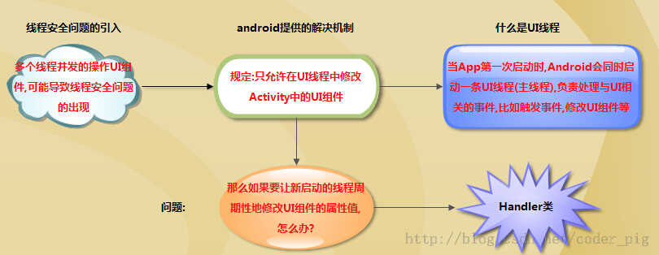
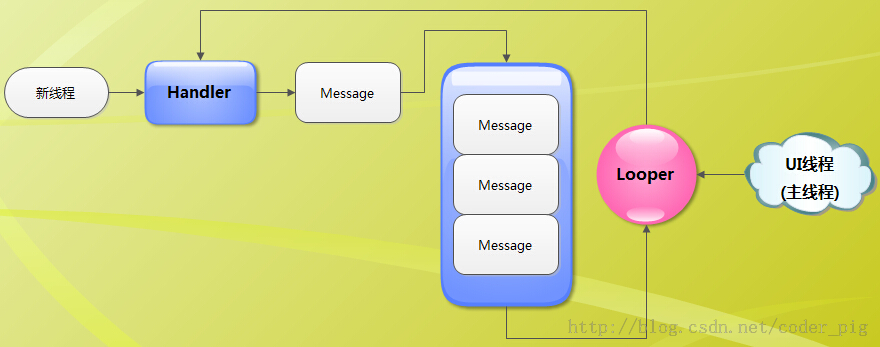

Android为了线程安全，并不允许我们在UI线程（主线程）外操作UI；很多时候我们做界面刷新都需要通过Handler来通知UI组件更新。除了用Handler完成界面更新外，还可以使用runOnUiThread()来更新，甚至使用AsyncTask、更高级的事务总线。当然，这里我们只讲解Handler，什么是Handler，执行流程，相关方法，子线程与主线程中使用Handler的区别等。

## 1.Handler类的引入:



## 2.Handler的执行流程图：
  
 

流程图解析: 相关名词    
> UI线程 :就是我们的主线程,系统在创建UI线程的时候会初始化一个Looper对象,同时也会创建一个与其关联的MessageQueue;  
> Handler :作用就是发送与处理信息,如果希望Handler正常工作,在当前线程中要有一个Looper对象  
> Message :Handler接收与处理的消息对象  
> MessageQueue :消息队列,先进先出管理Message,在初始化Looper对象时会创建一个与之关联的MessageQueue;  
> Looper :每个线程只能够有一个Looper,管理MessageQueue,不断地从中取出Message分发给对应的Handler处理。  

简单点说：  
> 当我们的子线程想修改Activity中的UI组件时,我们可以新建一个Handler对象,通过这个对象向主线程发送信息;而我们发送的信息会先到主线程的MessageQueue进行等待,由Looper按先入先出顺序取出,再根据message对象的what属性分发给对应的Handler进行处理。  

## 3.Handler的相关方法:
```
void handleMessage (Message msg):处理消息的方法,通常是用于被重写
sendEmptyMessage (int what):发送空消息
sendEmptyMessageDelayed (int what,long delayMillis):指定延时多少毫秒后发送空信息
sendMessage (Message msg):立即发送信息
sendMessageDelayed (Message msg):指定延时多少毫秒后发送信息
final boolean hasMessage (int what):检查消息队列中是否包含what属性为指定值的消息  
如果是参数为(int what,Object object):除了判断what属性,还需要判断Object属性是否为指定对象的消息
```

## 4.Handler的使用示例：

### 1）Handler写在主线程中

在主线程中,因为系统已经初始化了一个Looper对象,所以我们直接创建Handler对象,就可以进行信息的发送与处理了。  
代码示例：简单的一个定时切换图片的程序,通过Timer定时器,定时修改ImageView显示的内容,从而形成帧动画  
运行效果图：  
  

实现代码：
``` xml
<RelativeLayout xmlns:android="http://schemas.android.com/apk/res/android"  
    xmlns:tools="http://schemas.android.com/tools"  
    android:id="@+id/RelativeLayout1"  
    android:layout_width="match_parent"  
    android:layout_height="match_parent"  
    android:gravity="center"  
    tools:context="com.jay.example.handlerdemo1.MainActivity" >  

    <ImageView  
        android:id="@+id/imgchange"  
        android:layout_width="wrap_content"  
        android:layout_height="wrap_content"  
        android:layout_alignParentLeft="true"  
        android:layout_alignParentTop="true" />  

</RelativeLayout>
``` 
MainActivity.java：
``` java
public class MainActivity extends Activity {  

    //定义切换的图片的数组id  
    int imgids[] = new int[]{  
        R.drawable.s_1, R.drawable.s_2,R.drawable.s_3,  
        R.drawable.s_4,R.drawable.s_5,R.drawable.s_6,  
        R.drawable.s_7,R.drawable.s_8  
    };  
    int imgstart = 0;  

    final Handler myHandler = new Handler()  
    {  
      @Override  
      //重写handleMessage方法,根据msg中what的值判断是否执行后续操作  
      public void handleMessage(Message msg) {  
        if(msg.what == 0x123)  
           {  
            imgchange.setImageResource(imgids[imgstart++ % 8]);  
           }  
        }  
    };  

    @Override  
    protected void onCreate(Bundle savedInstanceState) {  
        super.onCreate(savedInstanceState);  
        setContentView(R.layout.activity_main);  
        final ImageView imgchange = (ImageView) findViewById(R.id.imgchange);  

        //使用定时器,每隔200毫秒让handler发送一个空信息  
        new Timer().schedule(new TimerTask() {            
            @Override  
            public void run() {  
                myHandler.sendEmptyMessage(0x123);  

            }  
        }, 0,200);  
    }  

}
```
### 2）Handler写在子线程中

如果是Handler写在子线程中的话,我们就需要自己创建一个Looper对象了。  
创建的流程如下:      
1] 直接调用Looper.prepare()方法即可为当前线程创建Looper对象,而它的构造器会创建配套的MessageQueue;     
2] 创建Handler对象,重写handleMessage( )方法就可以处理来自于其他线程的信息了;    
3] 调用Looper.loop()方法启动Looper  
使用示例： 输入一个数，计算后通过Toast输出在这个范围内的所有质数    
实现代码：main.xml：  
``` xml
<LinearLayout  
    xmlns:android="http://schemas.android.com/apk/res/android"  
    android:layout_width="match_parent"  
    android:layout_height="match_parent"  
    android:orientation="vertical">  
    <EditText  
        android:id="@+id/etNum"  
        android:inputType="number"  
        android:layout_width="match_parent"  
        android:layout_height="wrap_content"  
        android:hint="请输入上限"/>  
    <Button  
        android:layout_width="match_parent"  
        android:layout_height="wrap_content"  
        android:onClick="cal"  
        android:text="计算"/>    
</LinearLayout>
```
MainActivity.java:  
``` java
public class CalPrime extends Activity  
{  
    static final String UPPER_NUM = "upper";  
    EditText etNum;  
    CalThread calThread;  
    // 定义一个线程类  
    class CalThread extends Thread  
    {  
        public Handler mHandler;  

        public void run()  
        {  
            Looper.prepare();  
            mHandler = new Handler()  
            {  
                // 定义处理消息的方法  
                @Override  
                public void handleMessage(Message msg)  
                {  
                    if(msg.what == 0x123)  
                    {  
                        int upper = msg.getData().getInt(UPPER_NUM);  
                        List<Integer> nums = new ArrayList<Integer>();  
                        // 计算从2开始、到upper的所有质数  
                        outer:  
                        for (int i = 2 ; i <= upper ; i++)  
                        {  
                            // 用i处于从2开始、到i的平方根的所有数  
                            for (int j = 2 ; j <= Math.sqrt(i) ; j++)  
                            {  
                                // 如果可以整除，表明这个数不是质数  
                                if(i != 2 && i % j == 0)  
                                {  
                                    continue outer;  
                                }  
                            }  
                            nums.add(i);  
                        }  
                        // 使用Toast显示统计出来的所有质数  
                        Toast.makeText(CalPrime.this , nums.toString()  
                            , Toast.LENGTH_LONG).show();  
                    }  
                }  
            };  
            Looper.loop();  
        }  
    }  
    @Override  
    public void onCreate(Bundle savedInstanceState)  
    {  
        super.onCreate(savedInstanceState);  
        setContentView(R.layout.main);  
        etNum = (EditText)findViewById(R.id.etNum);  
        calThread = new CalThread();  
        // 启动新线程  
        calThread.start();  
    }  
    // 为按钮的点击事件提供事件处理函数  
    public void cal(View source)  
    {  
        // 创建消息  
        Message msg = new Message();  
        msg.what = 0x123;  
        Bundle bundle = new Bundle();  
        bundle.putInt(UPPER_NUM ,  
            Integer.parseInt(etNum.getText().toString()));  
        msg.setData(bundle);  
        // 向新线程中的Handler发送消息  
        calThread.mHandler.sendMessage(msg);  
    }  
}
```