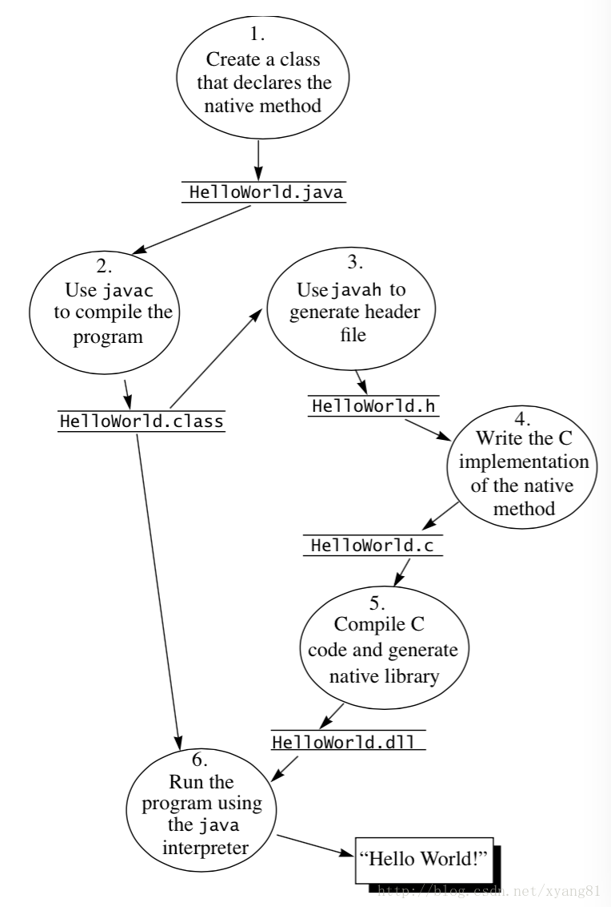

原文 by hibraincol

## JNI 简介
JNI 全称是 Java Native Interface（Java 本地接口）单词首字母的缩写，本地接口就是指用 C 和 C++ 开发的接口。由于 JNI 是 JVM 规范中的一部份，因此可以将我们写的 JNI 程序在任何实现了 JNI 规范的 Java 虚拟机中运行。同时，这个特性使我们可以复用以前用 C/C++ 写的大量代码。  
开发 JNI 程序会受到系统环境的限制，因为用 C/C++ 语言写出来的代码或模块，编译过程当中要依赖当前操作系统环境所提供的一些库函数，并和本地库链接在一起。而且编译后生成的二进制代码只能在本地操作系统环境下运行，因为不同的操作系统环境，有自己的本地库和 CPU 指令集，而且各个平台对标准 C/C++ 的规范和标准库函数实现方式也有所区别。这就造成使用了 JNI 接口的 JAVA 程序，不再像以前那样自由的跨平台。如果要实现跨平台，就必须将本地代码在不同的操作系统平台下编译出相应的动态库。  

JNI 开发流程主要分为以下 6 步：  

* 编写声明了 native 方法的 Java 类
* 将 Java 源代码编译成 class 字节码文件
* 用 javah -jni 命令生成.h头文件（javah 是 jdk 自带的一个命令，-jni 参数表示将 class 中用native 声明的函数生成 JNI 规则的函数）
* 用本地代码实现.h头文件中的函数
* 将本地代码编译成动态库（`Windows：\*.dll，linux/unix：\*.so，mac os x：\*.jnilib`）
* 拷贝动态库至 java.library.path 本地库搜索目录下，并运行 Java 程序
  

## NDK简介

（英语：native development kit，简称NDK）是一种基于原生程序接口的软件开发工具。通过此工具开发的程序直接以本地语言运行，而非虚拟机。因此只有java等基于虚拟机运行的语言的程序才会有原生开发工具包。[维基百科]  

NDK提供了一系列的工具，帮助开发者快速开发C（或C++）的动态库，并能自动将so和java应用一起打包成apk。这些工具对开发者的帮助是巨大的.NDK集成了交叉编译器，并提供了相应的mk文件隔离CPU、平台、ABI等差异，开发人员只需要简单修改mk文件（指出“哪些文件需要编译”、“编译特性要求”等），就可以创建出so。  

NDK可以自动地将so和Java应用一起打包，极大地减轻了开发人员的打包工作。 

## NDK两种开发模式

ndk-build 形式; Android Studio 2.2之前的模式  
CMake 形式: CLion C/C++编辑器; AS2.2之后整合了CLion代码, AS就支持了CMake形式的NDK开发 

## 为何要用到NDK

概括来说主要分为以下几种情况：

1. 代码的保护，由于apk的java层代码很容易被反编译，而C/C++库反汇难度较大。

2. 在NDK中调用第三方C/C++库，因为大部分的开源库都是用C/C++代码编写的。

3. 便于移植，用C/C++写得库可以方便在其他的嵌入式平台上再次使用。


下面就介绍下Android NDK的入门学习过程：

入门的最好办法就是学习Android自带的例子， 这里就通过学习Android的NDK自带的demo程序：hello-jni来达到这个目的。

## 一、 开发环境的搭建

安装android-ndk开发包，这个开发包可以在google android 官网下载： 通过这个开发包的工具才能将android jni 的C/C++的代码编译成库
android应用程序开发环境： 包括eclipse、java、 android sdk、 adt，安装完之后，需要将android-ndk的路劲加到环境变量PATH中：  

`sudo gedit /etc/environment`

在environment的PATH环境变量中添加你的android-ndk的安装路劲，然后再让这个更改的环境变量立即生效：

 `source  /etc/environment`

经过了上述步骤，在命令行下敲：

`ndk-bulid`

弹出如下的错误，而不是说ndk-build not found，就说明ndk环境已经安装成功了。
```
Android NDK: Could not find application project directory !    
Android NDK: Please define the NDK_PROJECT_PATH variable to point to it.    
/home/braincol/workspace/android/android-ndk-r5/build/core/build-local.mk:85: *** Android NDK: Aborting    .  Stop.
```
 

## 二、代码的编写

### 1.首先是写java代码

建立一个Android应用工程HelloJni，创建HelloJni.java文件：

HelloJni.java :
``` java
/*
 * Copyright (C) 2009 The Android Open Source Project
 *
 * Licensed under the Apache License, Version 2.0 (the "License");
 * you may not use this file except in compliance with the License.
 * You may obtain a copy of the License at
 *
 *      http://www.apache.org/licenses/LICENSE-2.0
 *
 * Unless required by applicable law or agreed to in writing, software
 * distributed under the License is distributed on an "AS IS" BASIS,
 * WITHOUT WARRANTIES OR CONDITIONS OF ANY KIND, either express or implied.
 * See the License for the specific language governing permissions and
 * limitations under the License.
 */
package com.example.hellojni;

import android.app.Activity;
import android.widget.TextView;
import android.os.Bundle;


public class HelloJni extends Activity
{
    /** Called when the activity is first created. */
    @Override
    public void onCreate(Bundle savedInstanceState)
    {
        super.onCreate(savedInstanceState);

        /* Create a TextView and set its content.
         * the text is retrieved by calling a native
         * function.
         */
        TextView  tv = new TextView(this);
        tv.setText( stringFromJNI() );
        setContentView(tv);
    }

    /* A native method that is implemented by the
     * 'hello-jni' native library, which is packaged
     * with this application.
     */
    public native String  stringFromJNI();

    /* This is another native method declaration that is *not*
     * implemented by 'hello-jni'. This is simply to show that
     * you can declare as many native methods in your Java code
     * as you want, their implementation is searched in the
     * currently loaded native libraries only the first time
     * you call them.
     *
     * Trying to call this function will result in a
     * java.lang.UnsatisfiedLinkError exception !
     */
    public native String  unimplementedStringFromJNI();

    /* this is used to load the 'hello-jni' library on application
     * startup. The library has already been unpacked into
     * /data/data/com.example.HelloJni/lib/libhello-jni.so at
     * installation time by the package manager.
     */
    static {
        System.loadLibrary("hello-jni");
    }
}
```
这段代码很简单，注释也很清晰，这里只提两点：:
```
static{ 
System.loadLibrary("hello-jni"); 
}
```
表明程序开始运行的时候会加载hello-jni, static区声明的代码会先于onCreate方法执行。如果你的程序中有多个类，而且如果HelloJni这个类不是你应用程序的入口，那么hello-jni（完整的名字是libhello-jni.so）这个库会在第一次使用HelloJni这个类的时候加载。
```
public native String stringFromJNI(); 
public native String unimplementedStringFromJNI();
```
可以看到这两个方法的声明中有 native 关键字， 这个关键字表示这两个方法是本地方法，也就是说这两个方法是通过本地代码（C/C++）实现的，在java代码中仅仅是声明。

用eclipse编译该工程，生成相应的.class文件，这步必须在下一步之前完成，因为生成.h文件需要用到相应的.class文件。

 

### 2. 编写相应的C/C++代码

刚开始学的时候，有个问题会让人很困惑，相应的C/C++代码如何编写，函数名如何定义？ 这里讲一个方法，利用javah这个工具生成相应的.h文件，然后根据这个.h文件编写相应的C/C++代码。

#### 2.1 生成相应.h文件：

就拿我这的环境来说，首先在终端下进入刚刚建立的HelloJni工程的目录：

`braincol@ubuntu:~$ cd workspace/android/NDK/hello-jni/`

ls查看工程文件
```
braincol@ubuntu:~/workspace/android/NDK/hello-jni$ ls 
AndroidManifest.xml  assets  bin  default.properties  gen  res  src 
```
可以看到目前仅仅有几个标准的android应用程序的文件（夹）。

首先我们在工程目录下建立一个jni文件夹：
```
braincol@ubuntu:~/workspace/android/NDK/hello-jni$ mkdir jni 
braincol@ubuntu:~/workspace/android/NDK/hello-jni$ ls 
AndroidManifest.xml  assets  bin  default.properties  gen  jni  res  src 
```
下面就可以生成相应的.h文件了：

`braincol@ubuntu:~/workspace/android/NDK/hello-jni$ javah -classpath bin -d jni com.example.hellojni.HelloJni `

-classpath bin：表示类的路径

-d jni: 表示生成的头文件存放的目录

`com.example.hellojni.HelloJni` 则是完整类名

这一步的成功要建立在已经在 bin/com/example/hellojni/  目录下生成了 HelloJni.class的基础之上。

现在可以看到jni目录下多了个.h文件：
```
braincol@ubuntu:~/workspace/android/NDK/hello-jni$ cd jni/ 
braincol@ubuntu:~/workspace/android/NDK/hello-jni/jni$ ls 
com_example_hellojni_HelloJni.h
```
我们来看看`com_example_hellojni_HelloJni.h`的内容：

com_example_hellojni_HelloJni.h :
``` c
 /* DO NOT EDIT THIS FILE - it is machine generated */
#include <jni.h>
/* Header for class com_example_hellojni_HelloJni */

#ifndef _Included_com_example_hellojni_HelloJni
#define _Included_com_example_hellojni_HelloJni
#ifdef __cplusplus
extern "C" {
#endif
/*
 * Class:     com_example_hellojni_HelloJni
 * Method:    stringFromJNI
 * Signature: ()Ljava/lang/String;
 */
JNIEXPORT jstring JNICALL Java_com_example_hellojni_HelloJni_stringFromJNI
  (JNIEnv *, jobject);

/*
 * Class:     com_example_hellojni_HelloJni
 * Method:    unimplementedStringFromJNI
 * Signature: ()Ljava/lang/String;
 */
JNIEXPORT jstring JNICALL Java_com_example_hellojni_HelloJni_unimplementedStringFromJNI
  (JNIEnv *, jobject);

#ifdef __cplusplus
}
#endif
#endif
```
上面代码中的JNIEXPORT 和 JNICALL 是jni的宏，在android的jni中不需要，当然写上去也不会有错。

从上面的源码中可以看出这个函数名那是相当的长，不过还是很有规律的， 完全按照：`java_pacakege_class_mathod` 形式来命名。

也就是说：
```
Hello.java中 stringFromJNI() 方法对应于 C/C++中的 Java_com_example_hellojni_HelloJni_stringFromJNI() 方法

HelloJni.java中的 unimplementedStringFromJNI() 方法对应于 C/C++中的 Java_com_example_hellojni_HelloJni_unimplementedStringFromJNI() 方法 
```
注意下其中的注释：
```
Signature: ()Ljava/lang/String; 

()Ljava/lang/String;
```
()表示函数的参数为空（这里为空是指除了`JNIEnv *, jobject` 这两个参数之外没有其他参数，`JNIEnv*, jobject`是所有jni函数必有的两个参数，分别表示jni 环境和对应的java类（或对象）本身），

`Ljava/lang/String;` 表示函数的返回值是java的String对象。

 

#### 2.2 编写相应的.c文件：

hello-jni.c :
``` c
 /*
 * Copyright (C) 2009 The Android Open Source Project
 *
 * Licensed under the Apache License, Version 2.0 (the "License");
 * you may not use this file except in compliance with the License.
 * You may obtain a copy of the License at
 *
 *      http://www.apache.org/licenses/LICENSE-2.0
 *
 * Unless required by applicable law or agreed to in writing, software
 * distributed under the License is distributed on an "AS IS" BASIS,
 * WITHOUT WARRANTIES OR CONDITIONS OF ANY KIND, either express or implied.
 * See the License for the specific language governing permissions and
 * limitations under the License.
 *
 */
#include <string.h>
#include <jni.h>

/* This is a trivial JNI example where we use a native method
 * to return a new VM String. See the corresponding Java source
 * file located at:
 *
 *   apps/samples/hello-jni/project/src/com/example/HelloJni/HelloJni.java
 */
jstring
Java_com_example_hellojni_HelloJni_stringFromJNI( JNIEnv* env,
                                                  jobject thiz )
{
    return (*env)->NewStringUTF(env, "Hello from JNI !");
}
```
这里只是实现了`Java_com_example_hellojni_HelloJni_stringFromJNI`方法，而 `Java_com_example_hellojni_HelloJni_unimplementedStringFromJNI` 方法并没有实现，因为在HelloJni.java中只调用了`stringFromJNI()`方法，所以`unimplementedStringFromJNI()`方法没有实现也没关系，不过建议最好还是把所有java中定义的本地方法都实现了，写个空函数也行，有总比没有好。

`Java_com_example_hellojni_HelloJni_stringFromJNI()` 函数只是简单的返回了一个内容为 `"Hello from JNI !"` 的jstring对象（对应于java中的String对象）。

hello-jni.c文件已经编写好了，现在可以把`com_example_hellojni_HelloJni.h`文件给删了，当然留着也行，只是我还是习惯把不需要的文件给清理干净了。

### 3. 编译hello-jni.c 生成相应的库

#### 3.1 编写Android.mk文件

在jni目录下（即hello-jni.c 同级目录下）新建一个Android.mk文件，Android.mk 文件是Android 的 makefile文件，内容如下：
``` makefile
# Copyright (C) 2009 The Android Open Source Project
#
# Licensed under the Apache License, Version 2.0 (the "License");
# you may not use this file except in compliance with the License.
# You may obtain a copy of the License at
#
#      http://www.apache.org/licenses/LICENSE-2.0
#
# Unless required by applicable law or agreed to in writing, software
# distributed under the License is distributed on an "AS IS" BASIS,
# WITHOUT WARRANTIES OR CONDITIONS OF ANY KIND, either express or implied.
# See the License for the specific language governing permissions and
# limitations under the License.
#
LOCAL_PATH := $(call my-dir)

include $(CLEAR_VARS)

LOCAL_MODULE    := hello-jni
LOCAL_SRC_FILES := hello-jni.c

include $(BUILD_SHARED_LIBRARY)
```
这个Androd.mk文件很短，下面我们来逐行解释下：
`LOCAL_PATH := $(call my-dir)`

一个Android.mk 文件首先必须定义好LOCAL_PATH变量。它用于在开发树中查找源文件。在这个例子中，宏函数’my-dir’, 由编译系统提供，用于返回当前路径（即包含Android.mk file文件的目录）。

`include $( CLEAR_VARS)`

CLEAR_VARS由编译系统提供，指定让GNU MAKEFILE为你清除许多LOCAL_XXX变量（例如 LOCAL_MODULE, LOCAL_SRC_FILES, LOCAL_STATIC_LIBRARIES, 等等...), 除了LOCAL_PATH 。这是必要的，因为所有的编译控制文件都在同一个GNU MAKE执行环境中，所有的变量都是全局的。

`LOCAL_MODULE := hello-jni`

编译的目标对象，LOCAL_MODULE变量必须定义，以标识你在Android.mk文件中描述的每个模块。名称必须是唯一的，而且不包含任何空格。

注意：编译系统会自动产生合适的前缀和后缀，换句话说，一个被命名为'hello-jni'的共享库模块，将会生成'libhello-jni.so'文件。

**重要注意事项**：

如果你把库命名为‘libhello-jni’，编译系统将不会添加任何的lib前缀，也会生成 'libhello-jni.so'，这是为了支持来源于Android平台的源代码的Android.mk文件，如果你确实需要这么做的话。

`LOCAL_SRC_FILES := hello-jni.c`

LOCAL_SRC_FILES变量必须包含将要编译打包进模块中的C或C++源代码文件。注意，你不用在这里列出头文件和包含文件，因为编译系统将会自动为你找出依赖型的文件；仅仅列出直接传递给编译器的源代码文件就好。

注意，默认的C++源码文件的扩展名是’.cpp’. 指定一个不同的扩展名也是可能的，只要定义LOCAL_DEFAULT_CPP_EXTENSION变量，不要忘记开始的小圆点（也就是’.cxx’,而不是’cxx’）

`include $(BUILD_SHARED_LIBRARY)`

BUILD_SHARED_LIBRARY表示编译生成共享库，是编译系统提供的变量，指向一个GNU Makefile脚本，负责收集自从上次调用'include $(CLEAR_VARS)'以来，定义在LOCAL_XXX变量中的所有信息，并且决定编译什么，如何正确地去做。还有 BUILD_STATIC_LIBRARY变量表示生成静态库：lib$(LOCAL_MODULE).a， BUILD_EXECUTABLE 表示生成可执行文件。

 
#### 3.2 生成.so共享库文件
Andro文件已经编写好了，现在可以用android NDK开发包中的 ndk-build脚本生成对应的.so共享库了，方法如下：
```
braincol@ubuntu:~/workspace/android/NDK/hello-jni/jni$ cd .. 
braincol@ubuntu:~/workspace/android/NDK/hello-jni$ ls 
AndroidManifest.xml  assets  bin  default.properties  gen  jni  libs  obj  res  src 
braincol@ubuntu:~/workspace/android/NDK/hello-jni$ ndk-build 
Gdbserver      : [arm-linux-androideabi-4.4.3] libs/armeabi/gdbserver 
Gdbsetup       : libs/armeabi/gdb.setup 
Install        : libhello-jni.so => libs/armeabi/libhello-jni.so 
```
可以看到已经正确的生成了libhello-jni.so共享库了， 我们去 libs/armeabi/ 目录下看看：
```
braincol@ubuntu:~/workspace/android/NDK/hello-jni$ cd libs/ 
braincol@ubuntu:~/workspace/android/NDK/hello-jni/libs$ ls 
armeabi 
braincol@ubuntu:~/workspace/android/NDK/hello-jni/libs$ cd armeabi/ 
braincol@ubuntu:~/workspace/android/NDK/hello-jni/libs/armeabi$ ls 
gdbserver  gdb.setup  libhello-jni.so
```
### 4. 在eclipse重新编译HelloJni工程，生成apk

eclipse中刷新下HelloJni工程，重新编译生成apk，libhello-jni.so共享库会一起打包在apk文件内。

在模拟器中看看运行结果：  

hello-jni  

