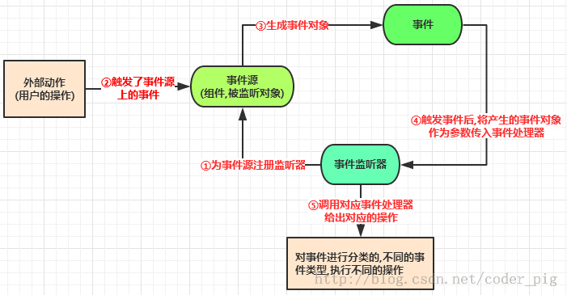
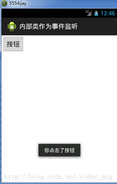
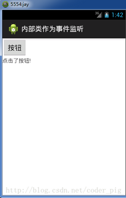

我们可以利用Android的UI控件构成一个精美的界面，但界面后面的逻辑与业务实现是基于Android的事件处理机制。何为事件处理机制？举个简单的例子，比如点击一个按钮，我们向服务器发送登陆请求； 比如屏幕发生选择，我们点击了屏幕上某个区域。简单点说，事件处理机制就是我们和UI发生交互时，我们在背后添加一些小动作而已。
# 基于监听的事件处理机制
流程模型图：  
  
文字表述：  
> 事件监听机制中由事件源，事件，事件监听器三类对象组成处理流程如下:   
> Step 1:为某个事件源(组件)设置一个监听器,用于监听用户操作  
> Step 2:用户的操作,触发了事件源的监听器  
> Step 3:生成了对应的事件对象  
> Step 4:将这个事件源对象作为参数传给事件监听器  
> Step 5:事件监听器对事件对象进行判断,执行对应的事件处理器(对应事件的处理方法)  

归纳：

> 事件监听机制是一种委派式的事件处理机制，事件源(组件)事件处理委托给事件监听器，当事件源发生指定事件时,就通知指定事件监听器,执行相应的操作

我们以下面这个：简单的按钮点击,提示Toast信息的程序；使用五种不同的形式来实现。  
效果图：
  


## 1）直接用匿名内部类

平时最常用的一种:直接setXxxListener后,重写里面的方法即可; 通常是临时使用一次,复用性不高。
实现代码如下：MainAcivity.java:
``` java
package com.jay.example.innerlisten;    

import android.os.Bundle;    
import android.view.View;    
import android.view.View.OnClickListener;    
import android.widget.Button;    
import android.widget.Toast;    
import android.app.Activity;    

public class MainActivity extends Activity {    
    private Button btnshow;    

    @Override    
    protected void onCreate(Bundle savedInstanceState) {    
        super.onCreate(savedInstanceState);    
        setContentView(R.layout.activity_main);    
        btnshow = (Button) findViewById(R.id.btnshow);    
        btnshow.setOnClickListener(new OnClickListener() {    
            //重写点击事件的处理方法onClick()    
            @Override    
            public void onClick(View v) {    
                //显示Toast信息    
                Toast.makeText(getApplicationContext(), "你点击了按钮", Toast.LENGTH_SHORT).show();    
            }    
        });    
    }        
}
```
## 2）使用内部类

和上面的匿名内部类不同。   
使用优点:可以在该类中进行复用,可直接访问外部类的所有界面组件。
实现代码如下：MainAcivity.java:
``` java
package com.jay.example.innerlisten;    

import android.os.Bundle;    
import android.view.View;    
import android.view.View.OnClickListener;    
import android.widget.Button;    
import android.widget.Toast;    
import android.app.Activity;    

public class MainActivity extends Activity {    
    private Button btnshow;    
    @Override    
    protected void onCreate(Bundle savedInstanceState) {    
        super.onCreate(savedInstanceState);    
        setContentView(R.layout.activity_main);    
        btnshow = (Button) findViewById(R.id.btnshow);    
        //直接new一个内部类对象作为参数    
        btnshow.setOnClickListener(new BtnClickListener());    
    }     
    //定义一个内部类,实现View.OnClickListener接口,并重写onClick()方法    
    class BtnClickListener implements View.OnClickListener    
    {    
        @Override    
        public void onClick(View v) {    
            Toast.makeText(getApplicationContext(), "按钮被点击了", Toast.LENGTH_SHORT).show();   
        }    
    }    
}
```
## 3）使用外部类

就是另外创建一个处理事件的Java文件,这种形式用的比较少，因为外部类不能直接访问用户界面类中的组件,要通过构造方法将组件传入使用，这样导致的结果就是代码不够简洁。  
ps:为了演示传参,这里用TextView代替Toast提示。  
  


实现代码如下：MyClick.java:
``` java
package com.jay.example.innerlisten;    

import android.view.View;    
import android.view.View.OnClickListener;    
import android.widget.TextView;    

public class MyClick implements OnClickListener {    
    private TextView textshow;    
    //把文本框作为参数传入    
    public MyClick(TextView txt)    
    {    
        textshow = txt;    
    }    
    @Override    
    public void onClick(View v) {    
        //点击后设置文本框显示的文字    
        textshow.setText("点击了按钮!");    
    }    
}
```
MainActivity.java
``` java
package com.jay.example.innerlisten;    
import android.os.Bundle;    
import android.widget.Button;    
import android.widget.TextView;    
import android.app.Activity;    

public class MainActivity extends Activity {    
    private Button btnshow;    
    private TextView txtshow;    
    @Override    
    protected void onCreate(Bundle savedInstanceState) {    
        super.onCreate(savedInstanceState);    
        setContentView(R.layout.activity_main);    
        btnshow = (Button) findViewById(R.id.btnshow);    
        txtshow = (TextView) findViewById(R.id.textshow);    
        //直接new一个外部类，并把TextView作为参数传入    
        btnshow.setOnClickListener(new MyClick(txtshow));    
    }         
}
``` 
## 4）直接使用Activity作为事件监听器

只需要让Activity类实现XxxListener事件监听接口,在Activity中定义重写对应的事件处理器方法  
eg:Actitity实现了OnClickListener接口,重写了onClick(view)方法，在为某些组建添加该事件监听对象时,直接setXxx.Listener(this)即可  
实现代码如下：MainAcivity.java:  
``` java
package com.jay.example.innerlisten;    
import android.os.Bundle;    
import android.view.View;    
import android.view.View.OnClickListener;    
import android.widget.Button;    
import android.widget.Toast;    
import android.app.Activity;    

//让Activity方法实现OnClickListener接口    
public class MainActivity extends Activity implements OnClickListener{    
    private Button btnshow;    
    @Override    
    protected void onCreate(Bundle savedInstanceState) {    
        super.onCreate(savedInstanceState);    
        setContentView(R.layout.activity_main);    

        btnshow = (Button) findViewById(R.id.btnshow);    
        //直接写个this    
        btnshow.setOnClickListener(this);    
    }    
    //重写接口中的抽象方法    
    @Override    
    public void onClick(View v) {    
        Toast.makeText(getApplicationContext(), "点击了按钮", Toast.LENGTH_SHORT).show();         
    }         
}
```
## 5）直接绑定到标签

就是直接在xml布局文件中对应得Activity中定义一个事件处理方法  
eg:public void myClick(View source) source对应事件源(组件) 接着布局文件中对应要触发事件的组建,设置一个属性:onclick = " myclick"即可  
实现代码如下：MainAcivity.java:  
``` java
package com.jay.example.caller;    

import android.app.Activity;    
import android.os.Bundle;    
import android.view.View;    
import android.widget.Toast;    

public class MainActivity extends Activity {    
    @Override    
    protected void onCreate(Bundle savedInstanceState) {    
        super.onCreate(savedInstanceState);    
        setContentView(R.layout.activity_main);     
    }    
    //自定义一个方法,传入一个view组件作为参数    
    public void myclick(View source)    
    {    
        Toast.makeText(getApplicationContext(), "按钮被点击了", Toast.LENGTH_SHORT).show();    
    }    
}
```
main.xml布局文件:  
``` xml
<LinearLayout xmlns:android="http://schemas.android.com/apk/res/android"    
    xmlns:tools="http://schemas.android.com/tools"    
    android:id="@+id/LinearLayout1"    
    android:layout_width="match_parent"    
    android:layout_height="match_parent"    
    android:orientation="vertical" >    
    <Button     
        android:layout_width="wrap_content"    
        android:layout_height="wrap_content"    
        android:text="按钮"    
        android:onClick="myclick"/>    
 </LinearLayout>
```
