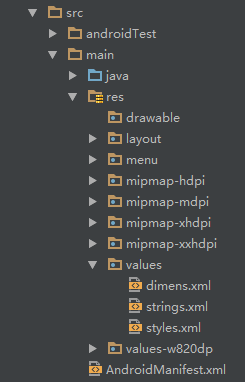
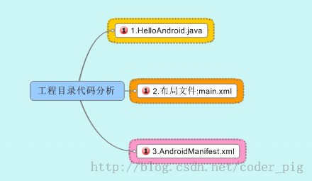
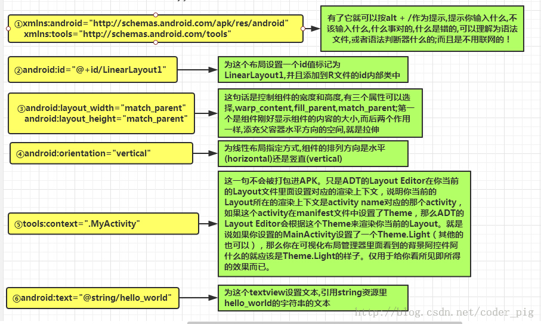
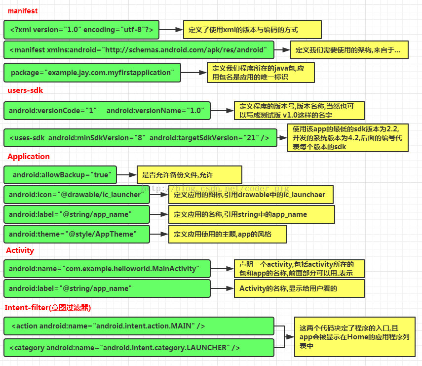

原文 by coder-pig 
# 工程项目结构解析：

以android studio（Eclipse + ADT) 举例，我们开发大部分时间都花在下面这个部分上：  


接下来我们对关键部分进行讲解：  
java：我们写Java代码的地方，业务功能都在这里实现  
res：存放我们各种资源文件的地方，有图片，字符串，动画，音频等，还有各种形式的XML文件   
## 一.res资源文件夹介绍：

说到这个res目录，另外还有提下这个assets目录，虽然这里没有，但是我们可以自己创建，两者的区别在于是否前者下所有的资源文件都会在R.java文件下生成对应的资源id，而后者并不会。前者我们可以直接通过资源id访问到对应的资源，而后者则需要我们通过AssetManager以二进制流的形式来读取。这个R文件可以理解为字典，res下每个资源都都会在这里生成一个唯一的id。   

接着说下res这个资源目录下的相关目录：  
下述mipmap的目录，在Eclipse并不存在这个，Eclipse中都是drawable开头的，其实区别不大，只是使用mipmap会在图片缩放在提供一定的性能优化，分辨率不同系统会根据屏幕分辨率来选择hdpi，mdpi，xmdpi，xxhdpi下的对应图片，所以你解压别人的apk可以看到上述目录同一名称的图片，在四个文件夹下都有，只是大小和像素不一样而已。当然,这也不是绝对的,比如我们把所有的图片都丢在了drawable-hdpi下的话,即使手机本该加载ldpi文件夹下的图片资源,但是ldpi下没有,那么加载的还会是hdpi下的图片。另外,还有一种情况:比如是hdpi,mdpi目录下有,ldpi下没有,那么会加载mdpi中的资源。原则是使用最接近的密度级别。如果你想禁止Android不跟随屏幕密度加载不同文件夹的资源,只需在AndroidManifest.xml文件中添加android:anyDensity="false"字段即可。   
### 1.图片资源
drawable：存放各种位图文件，(.png，.jpg，.9png，.gif等)除此之外可能是一些其他的drawable类型的XML文件  
mipmap-hdpi：高分辨率，一般我们把图片丢这里  
mipmap-mdpi：中等分辨率，很少，除非兼容的的手机很旧  
mipmap-xhdpi：超高分辨率，手机屏幕材质越来越好，以后估计会慢慢往这里过渡  
mipmap-xxhdpi：超超高分辨率，这个在高端机上有所体现    
### 2.布局资源
layout：该目录下存放的就是我们的布局文件，另外在一些特定的机型上，我们做屏幕适配，比如480*320这样的手机，我们会另外创建一套布局，就行：layout-480x320这样的文件夹。  
### 3.菜单资源  
menu：在以前有物理菜单按钮，即menu键的手机上，用的较多，现在用的并不多，菜单项相关的资源xml可在这里编写，不知道谷歌会不会出新的东西来替代菜单了。  
### 4.values目录
demens.xml：定义尺寸资源  
string.xml：定义字符串资源  
styles.xml：定义样式资源  
colors.xml：定义颜色资源  
arrays.xml：定义数组资源  
attrs.xml：自定义控件时用的较多，自定义控件的属性    
theme主题文件，和styles很相似，但是会对整个应用中的Actvitiy或指定Activity起作用，一般是改变窗口外观的.可在Java代码中通过setTheme使用，或者在Androidmanifest.xml中为`<application...>`添加theme的属性。
PS:你可能看到过这样的values目录：values-w820dp，values-v11等，前者w代表平板设备，820dp代表屏幕宽度；而v11这样代表在API(11)，即android 3.0后才会用到的。  
### 5.raw目录 
用于存放各种原生资源(音频，视频，一些XML文件等)，我们可以通过openRawResource(int id)来获得资源的二进制流。其实和Assets差不多，不过这里面的资源会在R文件那里生成一个资源id而已。  
### 6.动画
动画有两种：属性动画和补间动画：  
animator：存放属性动画的XML文件  
anim：存放补间动画的XML文件  

## 二.如何去使用这些资源

嗯，知道有什么资源，接下来就来了解该怎么用了。前面也说了，我们所有的资源文件都会在R.java文件下生成一个资源id，我们可以通过这个资源id来完成资源的访问，使用情况有两种：Java代码中使用和XML代码中使用  
### Java代码中使用
```
Java 文字：txtName.setText(getResources().getText(R.string.name)); 
图片：imgIcon.setBackgroundDrawableResource(R.drawable.icon); 
颜色：txtName.setTextColor(getResouces().getColor(R.color.red)); 
布局：setContentView(R.layout.main);
控件：txtName = (TextView)findViewById(R.id.txt_name);
```
### XML代码中使用
```
通过@xxx即可得到，比如这里获取文本和图片:
<TextView android:text="@string/hello_world" android:layout_width="wrap_content" android:layout_height="wrap_content" android:background = "@drawable/img_back"/>
```
## 三.深入了解三个文件：

好了，接下来我们就要剖析工程里三个比较重要的文件：
主体代码：MainActivity.java  
布局文件：activity_main  
Android配置文件：AndroidManifest.xml （图片内容可能有点差距）    


MainActivity.java 代码如下：  
```
package jay.com.example.firstapp;

import android.support.v7.app.AppCompatActivity;
import android.os.Bundle;

public class MainActivity extends AppCompatActivity {
    @Override
    protected void onCreate(Bundle savedInstanceState) {
        super.onCreate(savedInstanceState);
        setContentView(R.layout.activity_main);
    }
}
```
代码分析：  
  

布局文件：activity_main.xml，代码如下：  
```
<RelativeLayout xmlns:android="http://schemas.android.com/apk/res/android"
    xmlns:tools="http://schemas.android.com/tools"
    android:layout_width="match_parent"
    android:layout_height="match_parent"
    tools:context=".MainActivity">

    <TextView
        android:layout_width="wrap_content"
        android:layout_height="wrap_content"
        android:text="@string/hello_world" />

</RelativeLayout>
```
代码分析：  
我们定义了一个LinearLayout线性布局，在xml命名空间中定义我们所需要使用的架构,来自于①  


AndroidManifest.xml配置文件，代码如下：   
```
<?xml version="1.0" encoding="utf-8"?>
<manifest xmlns:android="http://schemas.android.com/apk/res/android"
    package="jay.com.example.firstapp" >

    <application
        android:allowBackup="true"
        android:icon="@mipmap/ic_launcher"
        android:label="@string/app_name"
        android:theme="@style/AppTheme" >
        <activity
            android:name=".MainActivity"
            android:label="@string/app_name" >
            <intent-filter>
                <action android:name="android.intent.action.MAIN" />

                <category android:name="android.intent.category.LAUNCHER" />
            </intent-filter>
        </activity>
    </application>

</manifest>
```
代码分析：  

  

除了上述内容外：  
如果app包含其他组件的话,都要使用类型说明语法在该文件中进行声明  
`Server:<server>`元素`BroadcastReceiver<receiver>`元素`ContentProvider<provider>`元素`IntentFilter<intent-filter>`元素`</provider></receiver ></server>`  
②权限的声明: 在该文件中显式地声明程序需要的权限,防止app错误地使用服务, 不恰当地访问资源,最终提高android app的健壮性。  android.permission.SEND_SMS 有这句话表示app需要使用发送信息的权限,安装的时候就会提示用户, 相关权限可以在sdk参考手册查找。 

## Reference
http://blog.csdn.net/coder_pig/article/details/46963725 