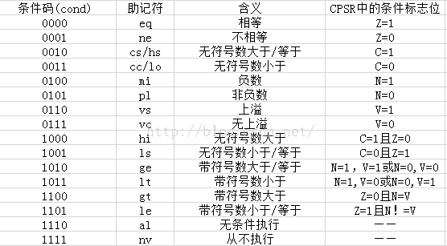
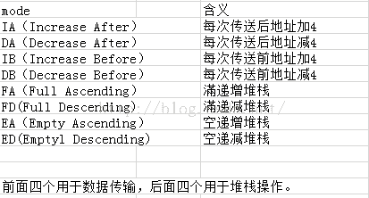

# ARM 汇编指令简介
ARM处理器是精简指令集计算 Reduced Instruction Set Computing (RISC)的一个实例。  
ARM指令集是基于精简指令集计算机(RISC)设计的，其指令集的译码机制相对比较简单，ARMv7-A具有32bit的ARM指令集和16/32bit的Thumb/Thumb-2指令集，ARM指令集的优点是执行效率高但不足之处也很明显，就是代码密度相对低一些。而作为ARM指令集子集的Thumb指令集，代码密度相对比ARM指令高，而且坚持了ARM一贯的性能优但也有一个致命的缺点就是效率低；正所谓鱼和熊掌不可兼得，这也是数字逻辑电路设计所谓的时间和空间的问题；而Thumb-2指令集多为32bit的指令，对于上述的ARM指令和Thumb指令做了一个折中，代码执行效率和密度都相对比较适中。几乎所有的ARM指令都可以条件执行，而另外两者仅有部分才具备此功能，三种指令均可相互调用，而且指令之间状态切换开销很小，几乎可以忽略。  
## 一、ARM指令集格式
基本格式： `<opcode> {<cond>} {S} <Rd>, <Rn>, {<opcode2>}`  
< > 尖括号里面的指令助记符是必须的，而{}花括号里面的是可选的。  
.opcode：比如MOV，LDR  
.cond：即Condition，执行条件，与CPSR的条件标志位对应。  
  

.S：决定是否影响CPSR的值  
.Rd：目标寄存器  
.Rn：第一个操作数的寄存器  
.opcode2：第二个操作数，可选，可以是立即数、寄存器、寄存器移位等  

## 二、ARM 寻址方式

1. 立即寻址  
`mov r0, #1234`  
相当于：r0=#1234。#开头，表示16进制时，以0x开头，如#0x1f。  

2. 寄存器寻址  
`mov r0, r1`  
执行后，r0 = r1。  
NOP 操作通常为 `mov r0, r0`，对应的HEX为00 00 a0 e1

3. 寄存器移位寻址  

寄存器移位寻址支持以下5种移位操作：
```
LSL：逻辑左移，移位后寄存器空出的低位补0；  
LSR：逻辑右移，移位后寄存器空出的高位补0；  
ASR：算数右移，移位过程中，符号位保存不变，如果源操作数为正数，则移位后空出的高位补0，否则补1。  
ROR：循环右移，移位后，移出的低位，填入移位空出的高位。  
RRX：带扩展的循环右移，操作数右移一位，移位空出的高位，用C标志的值填充。  
```
`mov r0, r1, lsl #2`  
相当于：r0 = r1<<2 = r1*4。  

4. 寄存器间接寻址
`ldr r0, [r1]` // 取值  
相当于：r0 = *r1。  

5. 基址寻址
`ldr r0, [r1, #-4]`  
相当于：r0 = *(r1 - 4)。  

6. 多寄存器寻址
`lmdia r0, {r1, r2, r3, r4}`  
LDM 是数据加载指令，指令的后缀IA表示，每次执行完成加载操作后，R0寄存器的值自增1个字。   
R1=[R0], R2=[R0+#4], R3=[R0+#8], R4=[R0+#12]  
字表示一个32位的数值。  

7. 堆栈寻址
它需要特定的指令完成： 
LMDFA/STMFA, LDMEA/STMEA, LDMFD/SDMFD, LDMED/STMED。  
LMD/STM 表示多寄存器寻址，一次可以传送多个寄存器值。   
FA/EA/FD/ED ..参考指令集。  
`stmfd sp!, {r1-r7, lr}   @将 r1~r7，lr 压栈` 多用于保存子程序现场。  
`ldmfd sp!, {r1~r7, lr}   @将 r1~r7, lr 出栈，放入 r1~r7, lr` 多用于恢复子程序现场。  

8. 块拷贝寻址  
可实现连续地址数据从存储器的某一位置拷贝至另一位置。   
LDMIA/STMIA, LDMDA/STMDA, LDMIB/STMIB, LDMDB/STMDB。  
LDM/SDM 表示多寄存器寻址，一次可以传送多个寄存器值。   
IA, DA, IB, DB ..参考指令集。  
`ldmia r0!, {r1-r3}  @ 从r0指向的区域的值取出来，放到r1-r3中`  
`stmia r0!, {r1-r3}  @ 将r1-r3的值取出来，放入r0指向的区域`  

9. 相对寻址
相对寻址以PC的当前值为基址，与偏移值相加，得到最终的地址。
``` asm
bl .lc0
    ...
.lc0:
    ...
```
bl 直接跳到 .lc0 处。  

## 三、ARM汇编指令分类
包括存储加载类指令集，数据处理类指令集，分支跳转类指令集，程序状态寄存器访问指令以及协处理器类指令集

1. 存储加载类  
由于ARM处理器采用了统一编址技术，因而对外围I/O，程序数据的访问都要通过加载/存储(Load/Store)指令来进行。ARM的加载/存储指令(LDR，STR)是可以实现字，半字，无符号，有符号字节操作；  
批量加载/存储(LDM，STM)可以实现一条指令加载存储多个存储器的内容，加载效率大为提高，一般用来传递参数和复制数据，可以说是一般加载/存储的加强版。  
LDR：用于从内存中读取数据加载到内存中；比如 LDR R0, [R1] 表示将R1所指向的存储单元的内容加到R0寄存器中。  
STR：将寄存器中的数据保存到内存单元；STR R0, [R1] 将R0寄存器里面的数据保存到R1所指向的内存中。  
LDM：实现一块连续的内存单元的数据加载多个寄存器中。  
STM：实现在多个寄存器的数据保存到一块连续的内存单元之中。  
格式：`LDM/STM  {cond} <mode> Rn{!} {reglist} {^}`  
.cond：同上  
.mode：地址变化模式共8种，常用IA，FD分别表示每次传送数据后地址加4，滿递减堆栈。  
  
.Rn：基址寄存器，不允许是R15。
.!：感叹号表示是否将最后的地址存入Rn。  
.Reglist：寄存器列表，按从小到大的顺序排列，当标号连续时可用'-'连接，{R0-R3}，不连续时用逗号连接。  
."^"：(假如寄存器列表含有PC寄存器R15)表示指令执行后SPSR的值自动复制给CPSR，常用于从中断处理函数中返回。  
反之，默认操作的是用户模式下的寄存器，并非当前特殊模式的寄存器。  

2. 数据处理类指令集  
包括数据传送指令MOV，算术逻辑运算符ADD，SUB，BIC，ORR，比较指令CMP，TST等  
算术  
``` asm
ADD op1+op2
ADC op1+op2+carry
SUB op1-op2+carry-1
ADR：ADR指令被编译器用一条ADD或者SUB进行替换，在ARM状态下，字对齐时加载范围是-1020~1020，字节或者半字对齐时是-255~255。
ADRL：被编译器用两条条ADD或者SUB进行替换，在ARM状态下，字对齐时加载范围是-256K~256K，字节或者半字对齐时是-64K~264K。
syntax : <operation> {<cond>}{S} Rd,Rn,operand
examples :
ADD r0,r1,r2
SUB R1,R2,#1
例：通过LDR伪指令，完成GPIO的配置功能,将0xE0200280赋给R1
LDR R1, =0xE0200280
LDR R0, =0x00001111
STR R0, [R1]
```  
比较  
``` asm
CMP op1-op2
TST op1 & op2
TEQ op1 ^ op2
SWP {cond} {B} Rd, Rm, [Rn]：将Rn指向的内容加载到目标寄存器Rd，Rm为源寄存器，将该寄存器的数据存储到Rn指向的地址单元。
Syntax : <operation> {<cond>} Rn,Op
examples :
CMP R0,R1
CMP R0,#2
```
逻辑运算  
``` asm
AND op1,op2
EOR op1,op2
ORR op1,op2
BIC R0, R2， #0xF@将R2的后4位置清零
```
移动  
``` asm
MOV op1,op2
syntax : <Operation>{<cond>}{S} Rn, Op2
Examples:
MOV r0, r1
```
3. 分支跳转指令

当程序需要一些循环、过程（procedures）和函数的时候，会用到分支指令。   
实现程序跳转的方法，还可以直接给PC寄存器直接赋值实现跳转。  

B   
Branch, 分支。   
该指令不会影响LR寄存器。这意味着一旦我们跳转到子程序（subroutine），不能回溯（traceback）我们曾经在哪儿。这个类似于x86汇编中的JMP指令。  

`BNE LABEL`  
表示不为0时，则跳转到LABEL处执行。  

BL   
BL Branch with Link，带链接的分支。   
该指令可以让子程序调用，通过LR保存的PC-4的地址，从子程序返回，只需简单的从LR还原PC的值：`mov pc, lr`。  

BX 和 BLX   
BX Branch with Exchange，带交换的分支。   
BLX Branch with Link and Exchange，带链接和交换的分支。   
BX和BLX指令用于THUMB模式中，暂时不关注。  

4. 程序状态寄存器访问指令  
通过MSR和MRS配合使用实现对PSR寄存器的访问，通过读-修改-写操作来实现开关中断，切换处理器模式。  
.MRS：读程序状态寄存器指令，将PSR中的内容读入到寄存器中 `MRS {cond} Rd, PSR` 。 
.MSR：写程序状态寄存器指令 `MSR {cond} psr_fields #immed_8MSR {cond} psr_fields, Rm`。field指位域，只有在特权模式下才能对PSR进行修改，例如切换到管理模式：`MSR CPSR_c #0xD3`,将0xD3写入CPSR的低8位，此时M[4:0]=0b10011，进入管理模式。  
用读-修改-写操作切换到管理模式  
``` asm
MRS R0, CPSR @读出CPSR的值
BIC R0, R0, #0x1F@清0
ORR R0, R0, #0xD3@修改模式
MSR CPSR_cxsf, R0@将修改后的值保存到CPSR
```
5. 协处理器访问指令  
协处理器CP15包含了16个32bit的寄存器，主要用于存储管理。  
.MCR：ARM寄存器到协处理器的数据传送指令 `MCR {cond} P15, 0, Rd, CRn, CRm, {opcode2}`
Rd：源寄存器  
CRn：协处理器中的寄存器，目标寄存器，存放第一个操作数其编号为C0,C1....C15  
.MRC：协处理器到ARM寄存器的数据传送指令  
Rd：目标寄存器  
CRn：协处理器中的寄存器，源寄存器，存放第一个操作数其编号为C0,C1....C15  
CRm：附加的源寄存器，不需要其他信息时CRm为C0
opcode2：提供附加信息，若为空时，指定为0即可  


