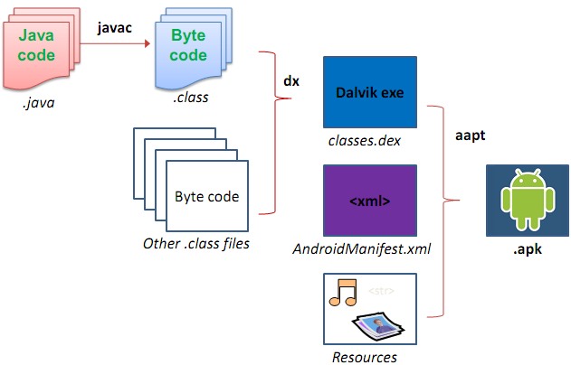
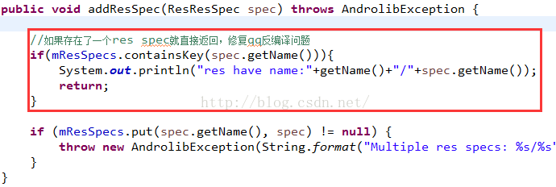
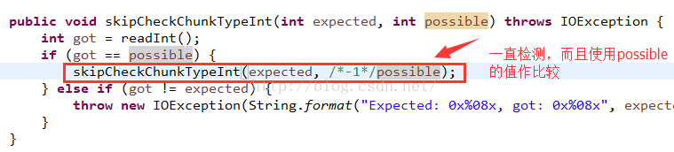

原文 by mustime  

## APK、Dalvik字节码和smali文件   
### APK文件
  
大家都应该知道APK文件其实就是一个MIME为ZIP的压缩包，我们修改ZIP后缀名方式可以看到内部的文件结构，例如修改后缀后用RAR打开鳄鱼小顽皮APK能看到的是（Google Play下载的完整版版本）：  
```
Where's My Water.zip\
* asset\                        <资源目录1：asset和res都是资源目录但有所区别，见下面说明>
* lib\                             <so库存放位置，一般由NDK编译得到，常见于使用游戏引擎或JNI native调用的工程中>
* |---armeabi\                |---<so库文件分为不同的CPU架构>
* |---armeabi-v7a\
* META-INF\                  <存放工程一些属性文件，例如Manifest.MF>
* |---MANIFEST.MF            |---the Manifest File
* |---CERT.RSA               |---The certificate of the application.
* |---CERT.SF              |---The list of resources and SHA-1 digest of the corresponding lines in the MANIFEST.MF file.
* res\                           <资源目录2：asset和res都是资源目录但有所区别，见下面说明> 
* |---drawable\               |---<图片和对应的xml资源>
* |---layout\                   |---<定义布局的xml资源>
* |---menu\					   |--- 存放应用里定义菜单项的文件。
* |---values\  				  |---存放其他xml资源文件，如string，color定义。strings.xml定义了运行应用时显示的文本
* |---... 
* AndroidManifest.xml     <Android工程的基础配置属性文件>
* classes.dex                 <Java代码编译得到的Dalvik VM能直接执行的文件，下面有介绍>
* resources.arsc             <对res目录下的资源的一个索引文件，保存了原工程中strings.xml等文件内容>
```
无关紧要地注：asset和res资源目录的不同在于：   
1. res目录下的资源文件在编译时会自动生成索引文件（R.Java），在Java代码中用R.xxx.yyy来引用；而asset目录下的资源文件不需要生成索引，在Java代码中需要用AssetManager来访问；  
2. 一般来说，除了音频和视频资源（需要放在raw或asset下），使用Java开发的Android工程使用到的资源文件都会放在res下；使用C++游戏引擎（或使用Lua binding等）的资源文件均需要放在asset下。    
因为Where's My Water是使用迪斯尼公司自家的DMO游戏引擎开发，所以游戏中用到的所有资源文件都存放在asset下，除了应用图标这些资源仍需要放在res下。  

### Dalvik字节码
Dalvik是google专门为Android操作系统设计的一个虚拟机，经过深度的优化。虽然Android上的程序是使用java来开发的，但是Dalvik和标准的java虚拟机JVM还是两回事。Dalvik VM是基于寄存器的，而JVM是基于栈的；Dalvik有专属的文件执行格式dex（dalvik executable），而JVM则执行的是java字节码。Dalvik VM比JVM速度更快，占用空间更少。  
通过Dalvik的字节码我们不能直接看到原来的逻辑代码，这时需要借助如Apktool或dex2jar+jd-gui工具来帮助查看。但是，注意的是最终我们修改APK需要操作的文件是.smali文件，而不是导出来的Java文件重新编译（况且这基本上不可能）。  

### smali文件      
好了，对Dalvik有一定认识后，下面介绍重点：smali，及其语法。  
简单的说，smali就是Dalvik VM内部执行的核心代码。它有自己的一套语法，下面即将介绍，如果有JNI开发经验的童鞋则能够很快明白。  
#### 一、smali的数据类型
在smali中，数据类型和Android中的一样，只是对应的符号有变化：  
```
* B---byte
* C---char
* D---double
* F---float
* I---int
* J---long
* S---short
* V---void
* Z---boolean
* [XXX---array
* Lxxx/yyy---object
```
这里解析下最后两项，数组的表示方式是：在基本类型前加上前中括号“[”，例如int数组和float数组分别表示为：[I、[F；对象的表示则以L作为开头，格式是LpackageName/objectName;（注意必须有个分号跟在最后），例如String对象在smali中为：Ljava/lang/String;，其中java/lang对应java.lang包，String就是定义在该包中的一个对象。  
或许有人问，既然类是用LpackageName/objectName;来表示，那类里面的内部类又如何在smali中引用呢？答案是：LpackageName/objectName$subObjectName;。也就是在内部类前加“$”符号，关于“$”符号更多的规则将在后面谈到。  
#### 二、函数的定义
 函数的定义一般为：  
 Func-Name (Para-Type1Para-Type2Para-Type3...)Return-Type  
 注意参数与参数之间没有任何分隔符，同样举几个例子就容易明白了：  
 1. foo ()V  
   没错，这就是void foo()。  
 2. foo (III)Z    
   这个则是boolean foo(int, int, int)。  
 3. foo (Z[I[ILjava/lang/String;J)Ljava/lang/String;  
   看出来这是String foo (boolean, int[], int[], String, long) 了吗？  

#### 三、smali文件内容具体介绍

  下面开始进一步分析smali中的具体例子，取鳄鱼小顽皮中的WMWActivity.smali来分析，它的内容大概是这样子的：  
``` smali

1. .class public Lcom/disney/WMW/WMWActivity;   
2. .super Lcom/disney/common/BaseActivity;  
3. .source "WMWActivity.java"  
4.    
5. # interfaces  
6. .implements Lcom/burstly/lib/ui/IBurstlyAdListener;  
7.    
8. # annotations  
9. .annotation system Ldalvik/annotation/MemberClasses;  
10.     value = {  
11.         Lcom/disney/WMW/WMWActivity$MessageHandler;,  
12.         Lcom/disney/WMW/WMWActivity$FinishActivityArgs;  
13.     }  
14. .end annotation  
15.    
16.    
17. # static fields  
18. .field private static final PREFS_INSTALLATION_ID:Ljava/lang/String; = "installationId"  
19. //...  
20.    
21.    
22. # instance fields  
23. .field private _activityPackageName:Ljava/lang/String;  
24. //...  
25.    
26.    
27. # direct methods  
28. .method static constructor <clinit>()V  
29.     .locals 3  
30.    
31.     .prologue  
32.     //...  
33.    
34.     return-void  
35. .end method  
36.    
37. .method public constructor <init>()V  
38.     .locals 3  
39.    
40.     .prologue  
41.     //...  
42.    
43.     return-void  
44. .end method  
45.    
46. .method static synthetic access$100(Lcom/disney/WMW/WMWActivity;)V  
47.     .locals 0  
48.     .parameter "x0"  
49.    
50.     .prologue  
51.     .line 37  
52.     invoke-direct {p0}, Lcom/disney/WMW/WMWActivity;->initIap()V  
53.    
54.     return-void  
55. .end method  
56.    
57. .method static synthetic access$200(Lcom/disney/WMW/WMWActivity;)Lcom/disney/common/WMWView;  
58.     .locals 1  
59.     .parameter "x0"  
60.    
61.     .prologue  
62.     .line 37  
63.     iget-object v0, p0, Lcom/disney/WMW/WMWActivity;->_view:Lcom/disney/common/WMWView;  
64.    
65.     return-object v0  
66. .end method  
67.    
68. //...  
69.    
70. #virtual methods  
71. .method public captureScreen()V  
72.     .locals 4  
73.    
74.     .prologue  
75.     //...  
76.    
77.     goto :goto_0  
78. .end method  
79.    
80. .method public didScreenCaptured()V  
81.     .locals 6  
82.    
83.     .prologue  
84.     //...  
85.    
86.     goto :goto_0  
87. .end method  
```

看得一头雾水的话那是正常的。现在我将逐一解析，理解这些符号的含义令你在后面注入代码的时候事半功倍。  
##### 1、smali中的继承、接口、包信息
  首先看看开头的几行：  
``` smali
1] .class public Lcom/disney/WMW/WMWActivity; 
2] .super Lcom/disney/common/BaseActivity;
3] .source "WMWActivity.java"
4]
5] # interfaces
6] .implements Lcom/burstly/lib/ui/IBurstlyAdListener;
7]
8] # annotations
9] .annotation system Ldalvik/annotation/MemberClasses;
10]     value = {
11]        Lcom/disney/WMW/WMWActivity$MessageHandler;,
12]        Lcom/disney/WMW/WMWActivity$FinishActivityArgs;
13]    }
14] .end annotation
```
1-3行定义的是基本信息：这是一个由WMWActivity.java编译得到的smali文件（第3行），它是com.disney.WMW这个package下的一个类（第1行），继承自com.disney.common.BaseActivity（第2行）。  
 5-6行定义的是接口信息：这个WMWActivity实现了一个com.burstly.lib.ui这个package下（一个广告SDK）的IBurstyAdListener接口。   8-14行定义的则是内部类：它有两个成员内部类——MessageHandler和FinishActivityArgs，内部类将在后面小节中会有提及。  

  分析完smali文件开头的这些信息，我们已经能在大脑中构造出一个大概这样的Java文件：  

``` java

1. class WMWActivity extends BaseActivity implements IBurstlyAdListener{  
2.     //...  
3.     class MessageHandler {  
4.         //...  
5.     }  
6.     class FinishActivityArgs{  
7.         //...  
8.     }  
9. }  
```

没错，这就是本来WMWActivity.java的大概框架了，成员变量和函数信息？别急，下面正要分析。
    
 在继续分析之前，有些东西需要先说明一下。前面说过，Dalvik VM与JVM的最大的区别之一就是Dalvik VM是基于寄存器的。基于寄存器是什么意思呢？也就是说，在smali里的所有操作都必须经过寄存器来进行：本地寄存器用v开头数字结尾的符号来表示，如v0、v1、v2、...参数寄存器则使用p开头数字结尾的符号来表示，如p0、p1、p2、...特别注意的是，p0不一定是函数中的第一个参数，在非static函数中，p0代指“this”，p1表示函数的第一个参数，p2代表函数中的第二个参数…而在static函数中p0才对应第一个参数（因为Java的static方法中没有this方法）。本地寄存器没有限制，理论上是可以任意使用的，下面是例子：        
```

1. const/4 v0, 0x0  
2. iput-boolean v0, p0, Lcom/disney/WMW/WMWActivity;->isRunning:Z  
```
在上面的两句中，使用了v0本地寄存器，并把值0x0存到v0中，然后第二句用iput-boolean这个指令把v0中的值存放到  com.disney.WMW.WMWActivity.isRunning这个成员变量中。即相当于：this.isRunning = false;（上面说过，在非static函数中p0代表的是“this”，在这里就是com.disney.WMW.WMWActivity实例）。关于这两句话的具体指令和含义暂可不用理会，先把Dalvik VM的机制弄明白就可以了，其实语法上和汇编语言非常相似，具体的指令会在后面逐一介绍。  

##### 2、smali中的成员变量
  下面继续介绍有关成员变量的内容：  
```smali
1 ] # static fields
2 ] .field private static final PREFS_INSTALLATION_ID:Ljava/lang/String; = "installationId"
3 ] //...
4 ] 
5 ]
6 ] # instance fields
7 ] .field private _activityPackageName:Ljava/lang/String;
8 ] //...
``` 
上面定义的static fields和instance fields均为成员变量，格式是：.field public/private [static] [final] varName:<类型>。然而static fields和instance fields还是有区别的，当然区别很明显，那就是static fields是static的，而instance则不是。根据这个区别来获取这些不同的成员变量时也有不同的指令。一般来说，获取的指令有：iget、sget、iget-boolean、sget-boolean、iget-object、sget-object等，操作的指令有：iput、sput、iput-boolean、sput-boolean、iput-object、sput-object等。没有“-object”后缀的表示操作的成员变量对象是基本数据类型，带“-object”表示操作的成员变量是对象类型，特别地，boolean类型则使用带“-boolean”的指令操作。   

  （1）、获取static fields的指令类似是：  
`sget-object v0, Lcom/disney/WMW/WMWActivity;->PREFS_INSTALLATION_ID:Ljava/lang/String;`    

  sget-object就是用来获取变量值并保存到紧接着的参数的寄存器中，在这里，把上面出现的PREFS_INSTALLATION_ID这个String成员变量获取并放到v0这个寄存器中，注意：前面需要该变量所属的类的类型，后面需要加一个冒号和该成员变量的类型，中间是“->”表示所属关系。  

  （2）、获取instance fields的指令与static fields的基本一样，只是由于不是static变量，不能仅仅指出该变量所在类的类型，还需要该变量所在类的实例。看例子：  
`iget-object v0, p0, Lcom/disney/WMW/WMWActivity;->_view:Lcom/disney/common/WMWView;`    

  可以看到iget-object指令比sget-object多了一个参数，就是该变量所在类的实例，在这里就是p0即“this”。  

  （3）、获取array的还有aget和aget-object，指令使用和上述类似，不细述。  

  （4）、put指令的使用和get指令是统一的，直接看例子不解释：  
```
1. const/4 v3, 0x0  
2. sput-object v3, Lcom/disney/WMW/WMWActivity;->globalIapHandler:Lcom/disney/config/GlobalPurchaseHandler;    
```
  相当于：this.globalIapHandler = null;（null = 0x0）  

```

1. .local v0, wait:Landroid/os/Message;  
2. const/4 v1, 0x2  
3. iput v1, v0, Landroid/os/Message;->what:I  
```
  相当于：wait.what = 0x2;（wait是Message的实例）  

##### 3、smali中的函数调用      
smali中的函数和成员变量一样也分为两种类型，但是不同于成员变量中的static和instance之分，而是direct和virtual之分。那么direct method和virtual method有什么区别呢？直白地讲，direct method就是private函数，其余的public和protected函数都属于virtual method。所以在调用函数时，有invoke-direct，invoke-virtual，另外还有invoke-static、invoke-super以及invoke-interface等几种不同的指令。当然其实还有invoke-XXX/range 指令的，这是参数多于4个的时候调用的指令，比较少见，了解下即可。  
  （1）、invoke-static：顾名思义就是调用static函数的，因为是static函数，所以比起其他调用少一个参数，例如：  

`invoke-static {}, Lcom/disney/WMW/UnlockHelper;->unlockCrankypack()Z`    

  这里注意到invoke-static后面有一对大括号“{}”，其实是调用该方法的实例+参数列表，由于这个方法既不需参数也是static的，所以{}内为空，再看一个例子：  
```

1. const-string v0, "fmodex"  
2. invoke-static {v0}, Ljava/lang/System;->loadLibrary(Ljava/lang/String;)V
```
  这个是调用static void System.loadLibrary(String)来加载NDK编译的so库用的方法，同样也是这里v0就是参数"fmodex"了。  
  （2）、invoke-super：调用父类方法用的指令，在onCreate、onDestroy等方法都能看到，略。  
  （3）、invoke-direct：调用private函数的，例如：  
`invoke-direct {p0}, Lcom/disney/WMW/WMWActivity;->getGlobalIapHandler()Lcom/disney/config/GlobalPurchaseHandler;`  

这里GlobalPurchaseHandler getGlobalIapHandler()就是定义在WMWActivity中的一个private函数，如果修改smali时错用invoke-virtual或invoke-static将在回编译后程序运行时引发一个常见的VerifyError。  
  （4）、invoke-virtual：用于调用protected或public函数，同样注意修改smali时不要错用invoke-direct或invoke-static，例子：  
```
1. sget-object v0, Lcom/disney/WMW/WMWActivity;->shareHandler:Landroid/os/Handler;  
2. invoke-virtual {v0, v3}, Landroid/os/Handler;->removeCallbacksAndMessages(Ljava/lang/Object;)V  
```
这里相信大家都已经明白了，主要搞清楚v0是shareHandler:Landroid/os/Handler，v3是传递给removeCallbackAndMessage方法的Ljava/lang/Object参数就可以了。    

 （5）、invoke-xxxxx/range：当方法的参数多于5个时（含5个），不能直接使用以上的指令，而是在后面加上“/range”，使用方法也有所不同：   

`invoke-static/range {v0 .. v5}, Lcn/game189/sms/SMS;->checkFee(Ljava/lang/String;Landroid/app/Activity;Lcn/game189/sms/SMSListener;Ljava/lang/String;Ljava/lang/String;Ljava/lang/String;)Z`  

 这个是电信SDK中的付费接口，需要传递6个参数，这时候大括号内的参数需要用省略形式，且需要连续（未求证是否需要从v0开始）。  
  
  有人也许注意到，刚才看到的例子都是“调用函数”这个操作而已，貌似没有取函数返回的结果的操作？  
  在Java代码中调用函数和返回函数结果是一条语句完成的，而在smali里则需要分开来完成，在使用上述指令后，如果调用的函数返回非void，那么还需要用到move-result（返回基本数据类型）和move-result-object（返回对象）指令：  
```
1. const/4 v2, 0x0  
2. invoke-virtual {p0, v2}, Lcom/disney/WMW/WMWActivity;->getPreferences(I)Landroid/content/SharedPreferences;  
3. move-result-object v1  
```
  v1保存的就是调用getPreferences(int)方法返回的SharedPreferences实例。  

```
1. invoke-virtual {v2}, Ljava/lang/String;->length()I  
2. move-result v2  
```
  v2保存的则是调用String.length()返回的整型。  

##### 4、smali中函数实体分析
下面开始介绍函数实体，其实没有什么特别的地方，只是在植入代码时有一点需要特别注意，举例说明：  
``` smali
1. .method protected onDestroy()V  
2.     .locals 0  
3.    
4.     .prologue  
5.     .line 277  
6.     invoke-super {p0}, Lcom/disney/common/BaseActivity;->onDestroy()V  
7.    
8.     .line 279  
9.     return-void  
10. .end method  
```
  这是onDestroy()函数，它的作用大家都知道。首先看到函数内第一句：.locals 0，这句话很重要，标明了你在这个函数中最少要用到的本地寄存器的个数。在这里，由于只需要调用一个父类的onDestroy()处理，所以只需要用到p0，所以使用到的本地寄存器数为0。如果不清楚这个规则，很容易在植入代码后忘记修改.locals 的值，那么回编译后运行时将会得到一个VerifyError错误，而且极难发现问题所在。我正是被这个问题困扰了很多次，最后研究发现.locals的值有这个规律，于是在文档查证了一下果然是这个问题。例如我往onDestroy()增加一句：this.existed = true;那么应该改为（注意修改.locals的值为1——使用到了v0这一个本地寄存器）：  
``` smali

1. .method protected onDestroy()V  
2.     .locals 1  
3.    
4.     .prologue  
5.     .line 277  
6.     const/4 v0, 0x1  
7.    
8.     iput-boolean v0, p0, Lcom/disney/WMW/WMWActivity;->exited:Z  
9.    
10.     invoke-super {p0}, Lcom/disney/common/BaseActivity;->onDestroy()V  
11.    
12.     .line 279  
13.     return-void  
14. .end method  
```

 另外注意到.line这个标识，它是标注了该代码在原Java文件中的行数，它也很有用，想想使用eclipse开发时，遇到错误崩溃时，在catLog不是有提示哪个文件哪一行崩溃的么？Dalvik VM运行到.line XX时就将这个值存起来，如果在这一行运行时出错了，就往catLog输出这个值，这样我们就能看到具体是哪一行的问题了。jd-gui这个工具也是通过分析这些信息将smali代码还原成我们喜闻乐见的Java代码的。当然，它不是必须的，去掉也没有关系，只不过为了方便调试还是保留一下吧。  

### 附录

由于大厂商开始使用混淆防逆向来加固apk，现在使用 apktool 反编译的主要两个错误就是：  

1、Exception in thread "main" brut.androlib.AndrolibException: Multiple res specs: attr/name  
异常原因：通过分析源码知道，这个错误主要是因为apk做了混淆操作，导致在反编译的过程中存入了重复的id值，错误代码：  
ResTypeSpec.java的addResSpec方法78行  
修复：在这个方法存入map数据之前做一个判断操作即可  
  


2、Exception in thread "main" brut.androlib.AndrolibException: Could not decode arsc file  
异常原因：通过分析源码知道，这个错误主要是因为apk了做了resource.arsc头部信息的修改，导致在分析头部数据结构的时候出错，错误代码：ExtDataInput.java的skipCheckChunkTypeInt方法 73行  
修复：修复resource.arsc头部数据，修改skipCheckChunkTypeInt检测方法逻辑    
  
 
### Reference  
[APK反编译之一：基础知识](http://blog.csdn.net/lpohvbe/article/details/7981386)  
