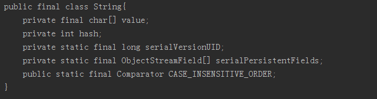

原文 by efany
## Java 的反射机制
JAVA反射机制是在运行状态中，对于任意一个类，都能够知道这个类的所有属性和方法；对于任意一个对象，都能够调用它的任意一个方法；这种动态获取信息以及动态调用对象的方法的功能称为java语言的反射机制。  
用处：  
1) 在运行时判断任意一个对象所属的类；  
2) 在运行时构造任意一个类的对象；  
3) 在运行时判断任意一个类所具有的成员变量和方法；  
4) 在运行时调用任意一个对象的方法；  
5) 生成动态代理。  

比如像下面代码：
``` java
//获取类
Class c = Class.forName("java.lang.String");
// 获取所有的属性
Field[] fields = c.getDeclaredFields();
StringBuffer sb = new StringBuffer();
sb.append(Modifier.toString(c.getModifiers()) + " class " + c.getSimpleName() + "{\n");
// 遍历每一个属性
for (Field field : fields) {
    sb.append("\t");// 空格
    sb.append(Modifier.toString(field.getModifiers()) + " ");// 获得属性的修饰符，例如public，static等等
    sb.append(field.getType().getSimpleName() + " ");// 属性的类型的名字
    sb.append(field.getName() + ";\n");// 属性的名字+回车
}
sb.append("}\n");
System.out.println(sb);
```
就可以获得 String ，这个我们常用类的所有属性：  
  
`Field[] fields = object.getClass().getDeclaredFields();`  
这句代码的意思就是getClass获得类，然后getDeclaredFields获得类中的所有属性。   
类似的方法有 ：  
```
getName()：获得类的完整名字。  
getFields()：获得类的public类型的属性。  
getDeclaredFields()：获得类的所有属性。  
getMethods()：获得类的public类型的方法。  
getDeclaredMethods()：获得类的所有方法。  
getMethod(String name, Class[] parameterTypes)：获得类的特定方法，name参数指定方法的名字，parameterTypes参数指定方法的参数类型。  
getConstructors()：获得类的public类型的构造方法。  
getConstructor(Class[] parameterTypes)：获得类的特定构造方法，parameterTypes参数指定构造方法的参数类型。  
newInstance()：通过类的不带参数的构造方法创建这个类的一个对象。  
```
``` java
Method method = activityClass.getMethod("setContentView", int.class);
method.invoke(activity, layoutId);
```
getMethod中的第一个参数是methodname，第二个参数是参数类型集合，通过这两个参数得到要执行的Method。  
method.invoke中的第一个参数是执行这个方法的对象，第二个参数是方法参数。执行该Method.invoke方法的参数是执行这个方法的对象owner，和参数数组args。可以这么理解：owner对象中带有参数args的method方法，返回值是Object，也即是该方法的返回值。在此基础上还有  

``` java
public Object invokeMethod(Object owner, String methodName, Object[] args) throws Exception {  
   
     Class ownerClass = owner.getClass();  
   
     Class[] argsClass = new Class[args.length];  
   
     for (int i = 0, j = args.length; i < j; i++) {  
         argsClass[i] = args[i].getClass();  
     }  
  
      Method method = ownerClass.getMethod(methodName,argsClass);  
   
     return method.invoke(owner, args);  
}  

public Object invokeStaticMethod(String className, String methodName,  
             Object[] args) throws Exception {  
     Class ownerClass = Class.forName(className);  
   
     Class[] argsClass = new Class[args.length];  
   
     for (int i = 0, j = args.length; i < j; i++) {  
         argsClass[i] = args[i].getClass();  
     }  
   
    Method method = ownerClass.getMethod(methodName,argsClass);  
   
     return method.invoke(null, args);  
 }
```
原理就是调用getMethod和method.invoke。    
Java中有关反射的类有以下这几个：  
```
java.lang.Class	编译后的class文件的对象
java.lang.reflect.Constructor	构造方法
java.lang.reflect.Field	类的成员变量（属性）
java.lang.reflect.Method	类的成员方法
java.lang.reflect.Modifier	判断方法类型
java.lang.annotation.Annotation	类的注解
```
## Java 注解
Annotation（注解）就是Java提供了一种源程序中的元素关联任何信息或者任何元数据（metadata）的途径和方法。  
Annotation是被动的元数据，永远不会有主动行为，所以我们需要通过使用反射，才能让我们的注解产生意义，即使用反射获取注解信息。   
相信大家对于这行代码很熟悉了  
`@Override`  
但是肯定很多人都只是知道这行代码是重写父类方法的时候会用到，但并不知道它是什么。  
其实这就是一种注解，可以理解成它标识了变量或者方法的某种属性。  
那么看看它的具体实现  
``` java
@Target(ElementType.METHOD)
@Retention(RetentionPolicy.SOURCE)
public @interface Override {
}
```
根据上面这些信息我们得出这几个问题  

1) 关键字@interface : @interface是Java中表示声明一个注解类的关键字。使用@interface 表示我们已经继承了java.lang.annotation.Annotation类，这是一个注解的基类接口。
2) 注解再次被注解 : 注解的注解叫做元注解包括 @Retention: 定义注解的保留策略；@Target：定义注解的作用目标； @Document：说明该注解将被包含在javadoc中； @Inherited：说明子类可以继承父类中的该注解四种。  
3) 注解的注解里面的参数  
``` java
@Retention(RetentionPolicy.SOURCE)//注解仅存在于源码中，在class字节码文件中不包含
@Retention(RetentionPolicy.CLASS)// 默认的保留策略，注解会在class字节码文件中存在，但运行时无法得到
@Retention(RetentionPolicy.RUNTIME)// 注解会在class字节码文件中存在，在运行时可以通过反射获取到
```
``` java
@Target(ElementType.TYPE)   //接口、类、枚举、注解
@Target(ElementType.FIELD) //字段、枚举的常量
@Target(ElementType.METHOD) //方法
@Target(ElementType.PARAMETER) //方法参数
@Target(ElementType.CONSTRUCTOR)  //构造函数
@Target(ElementType.LOCAL_VARIABLE)//局部变量
@Target(ElementType.ANNOTATION_TYPE)//注解
@Target(ElementType.PACKAGE) ///包 
``` 

## Android 中的注解
之前我们获取控件使用的是这样的代码  
`TextView text = (TextView) findViewById(R.id.text);`  
当我们的布局比较复杂的时候，获取控件的代码就得写好长，而且都是重复的。这时候注解式绑定就应运而生了，比如XUtils框架等就实现了这些功能。   
通过注解实现setContentView、findViewById、setOnClickListener  

代码实现：  
MainActivity.java  
``` java
@ContentView(id = R.layout.activity_main)
public class MainActivity extends AppCompatActivity implements View.OnClickListener{
    @ViewInject(id = R.id.button1,clickable = true)
    private Button button1;
    @ViewInject(id = R.id.button2)
    private Button button2;
    @Override
    protected void onCreate(Bundle savedInstanceState) {
        super.onCreate(savedInstanceState);
        AnnotateUtils.inJect(this);
        button1.setText("button1");
        button2.setText("button2");
    }

    @Override
    public void onClick(View v) {
        switch (v.getId()){
            case R.id.button1:
                Toast.makeText(MainActivity.this, "button1", Toast.LENGTH_SHORT).show();
                break;
        }
    }
}
```
逻辑实现   
1) 编写两个类Override的Annotation:ContentView、ViewInject  
2) 编写一个AnnoteUtils类用来检测添加了注解的类、变量、方法，并且根据值执行对应的操作。  

代码实现  
ContentView.java  
``` java
@Target(ElementType.TYPE)
@Retention(RetentionPolicy.RUNTIME)
public @interface ContentView {
    int id();//layout资源值
}
```
ElementType.TYPE表示着这个注解作用于类；RetentionPolicy.RUNTIME表示这个注解在运行时可以通过反射获取到  

ViewInject.java  
``` java
@Target(ElementType.FIELD)
@Retention(RetentionPolicy.RUNTIME)
public @interface ViewInject {
    int id();//控件id
    boolean clickable() default false;
}
```
ElementType.TYPE表示着这个注解作用于字段；  

AnnotateUtils.java  
``` java
public class AnnotateUtils {

    private static void injectViews(Object object, View sourceView){
        Field[] fields = object.getClass().getDeclaredFields();
        for (Field field : fields){
            ViewInject viewInject = field.getAnnotation(ViewInject.class);
            if(viewInject != null){
                int viewId = viewInject.id();
                boolean clickable = viewInject.clickable();
                if(viewId != -1){
                    try {
                        field.setAccessible(true);
                        field.set(object, sourceView.findViewById(viewId)); 
                        if(clickable == true){
                            sourceView.findViewById(viewId).setOnClickListener((View.OnClickListener) (object));
							// 直接使用Activity作为事件监听器
                        }
                    } catch (Exception e) {
                        e.printStackTrace();
                    }
                }
            }
        }
    }

    private static void inJectContentView(Activity activity){
        Class<? extends Activity> activityClass =  activity.getClass();
        ContentView contentView = activityClass.getAnnotation(ContentView.class);
        if(contentView != null){
            int layoutId = contentView.id();
            try {
                Method method = activityClass.getMethod("setContentView", int.class);
                method.invoke(activity, layoutId); 
            } catch (Exception e) {
                e.printStackTrace();
            }
        }
    }

    public static void inJect(Activity activity){
        inJectContentView(activity);
        injectViews(activity, activity.getWindow().getDecorView());
    }
}
```
原理就是在AnnotateUtils通过传入的Object对象获得在类中注解了的字段，方法以及类本身，执行对应的操作。

## Reference
[Android注解与反射机制](http://efany.github.io/2016/04/02/Android%E6%B3%A8%E8%A7%A3%E4%B8%8E%E5%8F%8D%E5%B0%84%E6%9C%BA%E5%88%B6/)  